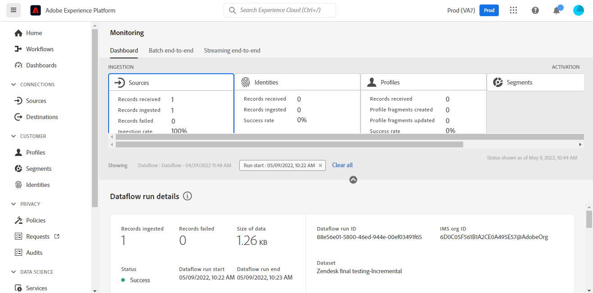

# Créer une connexion source [!DNL Zendesk] dans l’interface utilisateur

Ce tutoriel décrit les étapes à suivre pour créer une connexion source [!DNL Zendesk] à l’aide de l’interface utilisateur de Adobe Experience Platform.

## Prise en main

Ce tutoriel nécessite une compréhension du fonctionnement des composants suivants d’Adobe Experience Platform :

* [[!DNL Experience Data Model (XDM)] Système](../../../../../xdm/home.md) : le cadre normalisé en fonction duquel [!DNL Experience Platform] organise les données d’expérience client.
   * [Principes de base de la composition des schémas](../../../../../xdm/schema/composition.md) : découvrez les blocs de création de base des schémas XDM, y compris les principes clés et les bonnes pratiques en matière de composition de schémas.
   * [Tutoriel sur l’éditeur de schémas](../../../../../xdm/tutorials/create-schema-ui.md) : découvrez comment créer des schémas personnalisés à l’aide de l’interface utilisateur de l’éditeur de schémas.
* [[!DNL Real-Time Customer Profile]](../../../../../profile/home.md) : fournit un profil de consommateur unifié en temps réel, basé sur des données agrégées provenant de plusieurs sources.

### Collecter les informations d’identification requises

Pour accéder au compte [!DNL Zendesk] sur Experience Platform, vous devez fournir des valeurs pour les informations d’identification suivantes :

| Informations d’identification | Description | Exemple |
| --- | --- | --- |
| Sous-domaine | Domaine unique spécifique à votre compte créé lors du processus d’enregistrement. | `yoursubdomain` |
| Jeton d’accès | Jeton API Zendesk. | `0lZnClEvkJSTQ7olGLl7PMhVq99gu26GTbJtf` |

Pour plus d’informations sur l’authentification de votre source [!DNL Zendesk], consultez la [[!DNL Zendesk] présentation de la source](../../../../connectors/customer-success/zendesk.md).

### Création d’un schéma Experience Platform pour [!DNL Zendesk]

Avant de créer une connexion source [!DNL Zendesk], vous devez également vous assurer de créer d’abord un schéma Experience Platform à utiliser pour votre source. Pour obtenir des instructions complètes sur la création d’un schéma[&#128279;](../../../../../xdm/schema/composition.md) consultez le tutoriel sur la création d’un schéma Experience Platform).

Pour plus d’informations sur le schéma de [!DNL Zendesk] requis pour le [!DNL Zendesk Search API], reportez-vous à la section [limites](#limits) ci-dessous.

## Connecter votre compte [!DNL Zendesk]

Dans l’interface utilisateur d’Experience Platform, sélectionnez **[!UICONTROL Sources]** dans la barre de navigation de gauche pour accéder à l’espace de travail [!UICONTROL Sources]. L’écran [!UICONTROL Catalogue] affiche diverses sources avec lesquelles vous pouvez créer un compte.

Vous pouvez sélectionner la catégorie appropriée dans le catalogue sur le côté gauche de votre écran. Vous pouvez également trouver la source spécifique à utiliser à l’aide de l’option de recherche.

Dans la catégorie *Succès client*, sélectionnez **[!UICONTROL Zendesk]**, puis sélectionnez **[!UICONTROL Ajouter des données]**.

La page **[!UICONTROL Connecter le compte Zendesk]** s’affiche. Sur cette page, vous pouvez utiliser de nouvelles informations d’identification ou des informations d’identification existantes.

### Compte existant

Pour utiliser un compte existant, sélectionnez le compte *Zendesk* avec lequel vous souhaitez créer un flux de données, puis sélectionnez **[!UICONTROL Suivant]** pour continuer.

### Nouveau compte

Si vous créez un compte, sélectionnez **[!UICONTROL Nouveau compte]**, puis fournissez un nom, une description facultative et vos informations d’identification. Lorsque vous avez terminé, sélectionnez **[!UICONTROL Connexion à la source]**, puis patientez quelques instants le temps que la nouvelle connexion sʼétablisse.

### Sélectionner les données

Une fois votre source authentifiée, la page se met à jour dans une arborescence de schéma interactif qui vous permet d’explorer et d’inspecter la hiérarchie de vos données. Sélectionnez **[!UICONTROL Suivant]** pour continuer.

## Étapes suivantes

En suivant ce tutoriel, vous avez authentifié et avez créé une connexion source entre votre compte [!DNL Zendesk] et Experience Platform. Vous pouvez maintenant passer au tutoriel suivant et [créer un flux de données pour importer des données de succès client dans Experience Platform](../../dataflow/customer-success.md).

## Ressources supplémentaires

Les sections ci-dessous fournissent des ressources supplémentaires auxquelles vous pouvez vous référer lors de l’utilisation de la source [!DNL Zendesk].

### Validation {#validation}

Vous trouverez ci-dessous un aperçu des étapes que vous pouvez suivre pour vérifier que vous avez correctement connecté votre source [!DNL Zendesk] et que [!DNL Zendesk] profils sont ingérés dans Experience Platform.

Dans l’interface utilisateur d’Experience Platform, sélectionnez **[!UICONTROL Jeux de données]** dans le volet de navigation de gauche pour accéder à l’espace de travail [!UICONTROL Jeux de données]. L’écran [!UICONTROL Activité du jeu de données] affiche les détails des exécutions.

Sélectionnez ensuite l’identifiant d’exécution du flux de données du flux de données que vous souhaitez afficher pour afficher des détails spécifiques sur cette exécution.

Enfin, sélectionnez **[!UICONTROL Prévisualiser le jeu de données]** pour afficher les données ingérées.

Vous pouvez également comparer vos données Experience Platform aux données de votre page [!DNL Zendesk] > [!DNL Customers] .

### Schéma Zendesk

Le tableau ci-dessous répertorie les mappages pris en charge qui doivent être configurés pour Zendesk.

>[!TIP]
>
>Consultez [API de recherche Zendesk > Exporter les résultats de la recherche](https://developer.zendesk.com/api-reference/ticketing/ticket-management/search/#export-search-results) pour plus d’informations sur l’API.

| Source | Type |
|---|---|
| `results.active` | Booléen |
| `results.alias` | Chaîne |
| `results.created_at` | Chaîne |
| `results.custom_role_id` | Nombre entier |
| `results.default_group_id` | Nombre entier |
| `results.details` | Chaîne |
| `results.email` | Chaîne |
| `results.external_id` | Entier |
| `results.iana_time_zone` | Chaîne |
| `results.id` | Entier |
| `results.last_login_at` | Chaîne |
| `results.locale` | Chaîne |
| `results.locale_id` | Entier |
| `results.moderator` | Booléen |
| `results.name` | Chaîne |
| `results.notes` | Chaîne |
| `results.only_private_comments` | Booléen |
| `results.organization_id` | Nombre entier |
| `results.phone` | Chaîne |
| `results.photo` | Chaîne |
| `results.report_csv` | Booléen |
| `results.restricted_agent` | Booléen |
| `results.result_type` | Chaîne |
| `results.role` | Chaîne |
| `results.role_type` | Entier |
| `results.shared` | Booléen |
| `results.shared_agent` | Booléen |
| `results.shared_phone_number` | Booléen |
| `results.signature` | Chaîne |
| `results.suspended` | Booléen |
| `results.ticket_restriction` | Chaîne |
| `results.time_zone` | Chaîne |
| `results.two_factor_auth_enabled` | Booléen |
| `results.updated_at` | Chaîne |
| `results.url` | Chaîne |
| `results.verified` | Booléen |

{style="table-layout:auto"}

### Limites {#limits}

* Le [API de recherche Zendesk > Exporter les résultats de la recherche](https://developer.zendesk.com/api-reference/ticketing/ticket-management/search/#export-search-results) renvoie un maximum de 1 000 enregistrements par page.
   * La valeur du paramètre ``filter[type]`` est définie sur ``user`` et, par conséquent, la connexion Zendesk renvoie uniquement des utilisateurs.
   * Le nombre de résultats par page est géré par le paramètre ``page[size]`` . La valeur est définie sur ``100``. Cela permet de réduire l’impact des contraintes de réduction de vitesse définies par Zendesk.
   * Voir [Limites](https://developer.zendesk.com/api-reference/ticketing/ticket-management/search/#limits) et [Pagination](https://developer.zendesk.com/api-reference/ticketing/ticket-management/search/#pagination-1).
   * Vous pouvez également vous reporter à la section [Pagination dans les listes à l’aide de la pagination du curseur](https://developer.zendesk.com/documentation/developer-tools/pagination/paginating-through-lists-using-cursor-pagination/).
