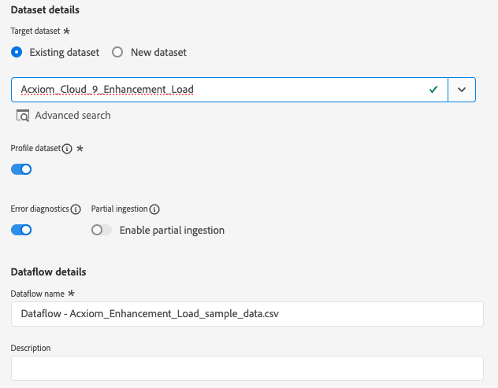

# Créer une connexion source et un flux de données [!DNL Acxiom Data Ingestion] dans l’interface utilisateur

>[!NOTE]
>
>La source [!DNL Acxiom Data Ingestion] est en version Beta. Lisez les [termes et conditions](../../../../home.md#terms-and-conditions) dans la présentation des sources pour plus d’informations sur l’utilisation de sources étiquetées bêta.

Utilisez la source [!DNL Acxiom Data Ingestion] pour ingérer des données [!DNL Acxiom] dans Real-Time Customer Data Platform et enrichir les profils propriétaires. Vous pouvez ensuite utiliser vos profils propriétaires enrichis de [!DNL Acxiom] pour améliorer les audiences et les activer sur l’ensemble des canaux marketing.

Lisez ce tutoriel pour apprendre à créer une connexion source et un flux de données [!DNL Acxiom Data Ingestion] à l’aide de l’interface utilisateur de Adobe Experience Platform. La source [!DNL Acxiom Data Ingestion] est utilisée pour récupérer et mapper la réponse du service d’amélioration [!DNL Acxiom] en utilisant Amazon S3 comme point de dépôt.

## Conditions préalables {#prerequisites}

Ce tutoriel nécessite une compréhension du fonctionnement des composants suivants d’Adobe Experience Platform : 

* [[!DNL Experience Data Model (XDM)] Système](../../../../../xdm/home.md) : Cadre normalisé selon lequel Experience Platform organise les données d’expérience client. 
   * [Principes de base de la composition des schémas](../../../../../xdm/schema/composition.md) : découvrez les blocs de création de base des schémas XDM, y compris les principes clés et les bonnes pratiques en matière de composition de schémas.
   * [Tutoriel sur l’éditeur de schémas](../../../../../xdm/tutorials/create-schema-ui.md) : découvrez comment créer des schémas personnalisés à l’aide de l’interface utilisateur de l’éditeur de schémas.
* [[!DNL Real-Time Customer Profile]](../../../../../profile/home.md) : fournit un profil de consommateur unifié en temps réel, basé sur des données agrégées provenant de plusieurs sources.

### Collecter les informations d’identification requises

Pour accéder à votre compartiment sur Experience Platform, vous devez fournir des valeurs valides pour les informations d’identification suivantes :

| Informations d’identification | Description |
| --- | --- |
| [!DNL Acxiom] clé d’authentification | Clé d’authentification. Vous pouvez récupérer cette valeur de l’équipe [!DNL Acxiom]. |
| [!DNL Amazon S3] clé d’accès | Identifiant de la clé d’accès pour votre compartiment. Vous pouvez récupérer cette valeur de l’équipe [!DNL Acxiom]. |
| Clé secrète [!DNL Amazon S3] | Identifiant de clé secrète pour votre compartiment. Vous pouvez récupérer cette valeur de l’équipe [!DNL Acxiom]. |
| Nom du compartiment | Il s’agit de votre compartiment où les fichiers seront partagés. Vous pouvez récupérer cette valeur de l’équipe [!DNL Acxiom]. |

>[!IMPORTANT]
>
>Les autorisations **[!UICONTROL Afficher les sources]** et **[!UICONTROL Gérer les sources]** doivent être activées pour votre compte pour connecter votre compte [!DNL Acxiom] à un Experience Platform. Contactez votre administrateur de produit pour obtenir les autorisations nécessaires. Pour plus d’informations, consultez le [guide de l’interface utilisateur du contrôle d’accès](../../../../../access-control/ui/overview.md).

## Connecter votre compte [!DNL Acxiom]

Dans l’interface utilisateur de Platform, sélectionnez **[!UICONTROL Sources]** à partir de la barre de navigation de gauche pour accéder à l’espace de travail [!UICONTROL Sources]. L’écran [!UICONTROL Catalogue] affiche diverses sources pour lesquelles vous pouvez créer un compte.

Vous pouvez sélectionner la catégorie appropriée dans le catalogue sur le côté gauche de votre écran. Vous pouvez également trouver la source spécifique à utiliser à l’aide de l’option de recherche.

Dans la catégorie **[!UICONTROL Partenaires de données et d’identité]**, sélectionnez **[!UICONTROL Ingestion de données interactive]**, puis **[!UICONTROL Configurer]**.

>[!TIP]
>
>Une carte source qui affiche **[!UICONTROL Ajouter des données]** signifie que la source possède déjà un compte authentifié. D’un autre côté, une carte source qui affiche **[!UICONTROL Configurer]** signifie que vous devez fournir des informations d’identification et créer un compte pour utiliser cette source.

### Création d’un compte

Si vous utilisez de nouvelles informations d’identification, sélectionnez **[!UICONTROL Nouveau compte]**.  Dans le formulaire de saisie qui s’affiche, indiquez un nom, une description facultative et vos informations d’identification [!DNL Acxiom]. Lorsque vous avez terminé, sélectionnez **[!UICONTROL Se connecter à la source]** puis attendez que la nouvelle connexion s’établisse.

| Informations d’identification | Description |
| --- | --- |
| Nom de compte | Nom du compte. |
| Description | (Facultatif) Une brève explication de l’objectif du compte. |
| [!DNL Acxiom] clé d’authentification | La clé fournie par [!DNL Acxiom] requise pour l’approbation du compte. Cette valeur doit correspondre à la valeur correcte pour qu’une connexion à la base de données puisse être établie.  Cette clé doit comporter 24 caractères et ne peut contenir que : A-Z, a-z et 0-9. |
| Clé d’accès S3 | La clé d’accès S3 référence l’emplacement Amazon S3. Cela est fourni par votre administrateur lorsque les autorisations de rôle S3 sont définies. |
| Clé secrète S3 | La clé secrète S3 référence l’emplacement Amazon S3. Cela est fourni par votre administrateur lorsque les autorisations de rôle S3 sont définies. |
| s3SessionToken | (Facultatif) La valeur du jeton d’authentification lors de la connexion à S3. |
| serviceUrl | (Facultatif) L’emplacement URL à utiliser lors de la connexion à S3 dans un emplacement non standard. |
| Nom du compartiment | (Facultatif) Le nom du compartiment S3 configuré sur S3 qui sert de chemin de départ dans la sélection des données. |
| Chemin du dossier | Si des sous-répertoires d’un compartiment sont utilisés, vous pouvez également spécifier un chemin d’accès comme chemin de départ dans la sélection des données. |

### Utiliser un compte existant

Pour utiliser un compte existant, sélectionnez **[!UICONTROL Compte existant]**.

Sélectionnez un compte dans la liste pour afficher les détails sur ce compte. Une fois que vous avez sélectionné un compte, sélectionnez **[!UICONTROL Suivant]** pour continuer.

## Sélectionner les données

Sélectionnez le fichier à ingérer dans le compartiment et le sous-répertoire souhaités. Un aperçu des données peut être fourni une fois que le délimiteur et le type de compression sont définis. Une fois que vous avez sélectionné votre fichier, sélectionnez **[!UICONTROL Suivant]** pour continuer.

>[!NOTE]
>
>Bien que les types de fichiers JSON et Parquet soient répertoriés, vous n’êtes pas tenu ou prévu de les utiliser pendant le workflow source [!DNL Acxiom].

## Fournir des détails sur les jeux de données et les flux de données

Ensuite, vous devez fournir des informations concernant votre jeu de données et votre flux de données.

### Détails du jeu de données

>[!BEGINTABS]

>[!TAB Utiliser un nouveau jeu de données]

Un jeu de données est une structure de stockage et de gestion pour une collection de données, généralement sous la forme d’un tableau, qui contient un schéma (des colonnes) et des champs (des lignes). Les données correctement ingérées dans Experience Platform sont conservées en tant que jeux de données dans le lac de données. Pour utiliser un nouveau jeu de données, sélectionnez **[!UICONTROL Nouveau jeu de données]**.

| Détails du nouveau jeu de données | Description |
| --- | --- |
| Nom du jeu de données de sortie | Nom du nouveau jeu de données. |
| Description | (Facultatif) Une brève explication de l’objectif du jeu de données. |
| Schéma | Liste déroulante des schémas qui existent dans votre organisation. Vous pouvez également créer votre propre schéma avant le processus de configuration de la source. Pour plus d’informations, consultez le guide sur la [création de schéma dans l’interface utilisateur](../../../../../xdm/tutorials/create-schema-ui.md). |

>[!TAB Utiliser un jeu de données existant]

Pour utiliser un jeu de données existant, sélectionnez **[!UICONTROL Jeu de données existant]**.

Vous pouvez sélectionner **[!UICONTROL Recherche avancée]** pour afficher une fenêtre de tous les jeux de données de votre entreprise, y compris leurs détails respectifs, comme s’ils sont activés pour l’ingestion dans Real-time Customer Profile.

>[!ENDTABS]

+++Sélectionnez les étapes à suivre pour activer l’ingestion du profil, les diagnostics d’erreur et l’ingestion partielle.

Si votre jeu de données est activé pour Real-time Customer Profile, vous pouvez, au cours de cette étape, activer le **[!UICONTROL jeu de données Profile]** pour activer vos données pour l’ingestion par profil. Vous pouvez également utiliser cette étape pour activer les **[!UICONTROL {diagnostics d’erreur]** et l’ **[!UICONTROL ingestion partielle]**.

* **[!UICONTROL Diagnostic d’erreur]** : sélectionnez **[!UICONTROL Diagnostic d’erreur]** pour demander à la source de produire des diagnostics d’erreur que vous pourrez ensuite référencer lors de la surveillance de l’activité de votre jeu de données et de l’état du flux de données.
* **[!UICONTROL Ingestion partielle]** : l’ingestion par lots partielle permet d’ingérer des données contenant des erreurs, jusqu’à un certain seuil configurable. Cette fonctionnalité vous permet d’ingérer toutes vos données précises dans Experience Platform, tandis que toutes vos données incorrectes sont traitées par lots séparément avec des informations sur les raisons de leur non-validité.

+++

### Détails du flux de données

Une fois votre jeu de données configuré, vous devez fournir des détails sur votre flux de données, y compris un nom, une description facultative et des configurations d’alerte.

| Configurations de flux de données | Description |
| --- | --- |
| Nom du flux de données | Nom du flux de données.  Par défaut, le nom du fichier importé sera utilisé. |
| Description | (Facultatif) Une brève description de votre flux de données. |
| Alertes | Experience Platform peut produire des alertes basées sur des événements auxquelles les utilisateurs peuvent s’abonner. Ces options sont toutes des flux de données en cours d’exécution pour les déclencher.  Pour plus d’informations, consultez la [présentation des alertes](../../alerts.md) <ul><li>**Démarrage de l’exécution du flux de données des sources** : sélectionnez cette alerte pour recevoir une notification lorsque l’exécution du flux de données démarre.</li><li>**L’exécution du flux de données Sources réussit** : sélectionnez cette alerte pour recevoir une notification si votre flux de données se termine sans erreur.</li><li>**Sources Échec de l’exécution du flux de données** : sélectionnez cette alerte pour recevoir une notification si l’exécution du flux de données se termine par des erreurs.</li></ul> |

## Mappage

Utilisez l’interface de mappage pour mapper vos données source aux champs de schéma appropriés avant d’ingérer des données vers Experience Platform.  Pour plus d’informations, consultez le [guide de mappage dans l’interface utilisateur](../../../../../data-prep/ui/mapping.md)

## Planification de l’ingestion de vos flux de données

Utilisez ensuite l’interface de planification pour définir le planning d’ingestion de votre flux de données.

| Configuration de la planification | Description |
| --- | --- |
| Fréquence | Configurez la fréquence pour indiquer la fréquence d’exécution du flux de données. Vous pouvez définir votre fréquence sur : <ul><li>**Une fois** : définissez votre fréquence sur `once` pour créer une ingestion unique. Les configurations de l’intervalle et du renvoi ne sont pas disponibles lors de la création d’un flux de données d’ingestion unique. Par défaut, la fréquence de planification est définie sur une seule fois.</li><li>**Minute** : définissez votre fréquence sur `minute` pour planifier votre flux de données de sorte qu’il ingère des données par minute.</li><li>**Heure** : définissez votre fréquence sur `hour` pour planifier votre flux de données pour ingérer des données par heure.</li><li>**Jour** : définissez votre fréquence sur `day` pour planifier votre flux de données de sorte qu’il ingère des données quotidiennement.</li><li>**Semaine** : définissez votre fréquence sur `week` pour planifier votre flux de données de sorte qu’il ingère des données sur une base hebdomadaire.</li></ul> |
| Intervalle | Une fois que vous avez sélectionné une fréquence, vous pouvez configurer le paramètre d’intervalle afin de définir la période entre chaque ingestion. Par exemple, si vous définissez votre fréquence sur &quot;jour&quot; et configurez l’intervalle sur 15, votre flux de données s’exécute tous les 15 jours. Vous ne pouvez pas définir l’intervalle sur zéro. La valeur minimale de l’intervalle accepté pour chaque fréquence est la suivante :<ul><li>**Une fois** : n/a</li><li>**Minute** : 15</li><li>**Heure** : 1</li><li>**Jour** : 1</li><li>**Semaine** : 1</li></ul> |
| Heure de début | Horodatage de l’exécution projetée, présenté dans le fuseau horaire UTC. |
| Renvoyer | Le renvoi détermine les données ingérées initialement. Si le renvoi est activé, tous les fichiers actuels du chemin spécifié seront ingérés lors de la première ingestion planifiée. Si le renvoi est désactivé, seuls les fichiers chargés entre la première exécution de l’ingestion et l’heure de début seront ingérés. Les fichiers chargés avant l’heure de début ne seront pas ingérés. |

## Vérifier le flux de données

Utilisez la page de révision pour obtenir un résumé de votre flux de données avant l’ingestion. Les détails sont regroupés dans les catégories suivantes :

* **Connexion** - Affiche le type de source, le chemin d’accès approprié du fichier source choisi et le nombre de colonnes dans ce fichier source.
* **Attribuer des champs de jeu de données et de mappage** - Affiche le jeu de données dans lequel les données source sont ingérées, y compris le schéma auquel le jeu de données adhère.
* **Planification** - Indique la période, la fréquence et l’intervalle actifs du planning d’ingestion.
Une fois que vous avez examiné votre flux de données, cliquez sur Terminer et laissez un certain temps au flux de données pour qu’il soit créé.

## Étapes suivantes

En suivant ce tutoriel, vous avez créé un flux de données pour importer des données par lots de votre source [!DNL Acxiom] vers l’Experience Platform. Pour obtenir des ressources supplémentaires, consultez la documentation décrite ci-dessous.

### Surveiller votre flux de données

Une fois votre flux de données créé, vous pouvez surveiller les données qui sont ingérées par celui-ci pour afficher des informations sur les taux d’ingestion, la réussite et les erreurs. Pour plus d’informations sur la façon de surveiller les flux de données, consultez le tutoriel sur la [surveillance des comptes et des flux de données dans l’interface utilisateur](../../../../../dataflows/ui/monitor-sources.md).

### Mettre à jour votre flux de données

Pour mettre à jour les configurations de la planification, du mappage et des informations générales de vos flux de données, consultez le tutoriel sur la [mise à jour des flux de données de sources dans l’interface utilisateur](../../update-dataflows.md).

### Supprimer le flux de données

Vous pouvez supprimer les flux de données qui ne sont plus nécessaires ou qui ont été créés de manière incorrecte à l’aide de la fonction **[!UICONTROL Supprimer]**, disponible dans l’espace de travail **[!UICONTROL Flux de données]**. Pour plus d’informations sur la suppression des flux de données, consultez le tutoriel sur la [suppression des flux de données dans l’interface utilisateur](../../delete.md).

## Ressources supplémentaires {#additional-resources}

Pour plus d’informations, consultez la [[!DNL Acxiom] InfoBase](https://www.acxiom.com/wp-content/uploads/2022/02/fs-acxiom-infobase_AC-0268-22.pdf).
