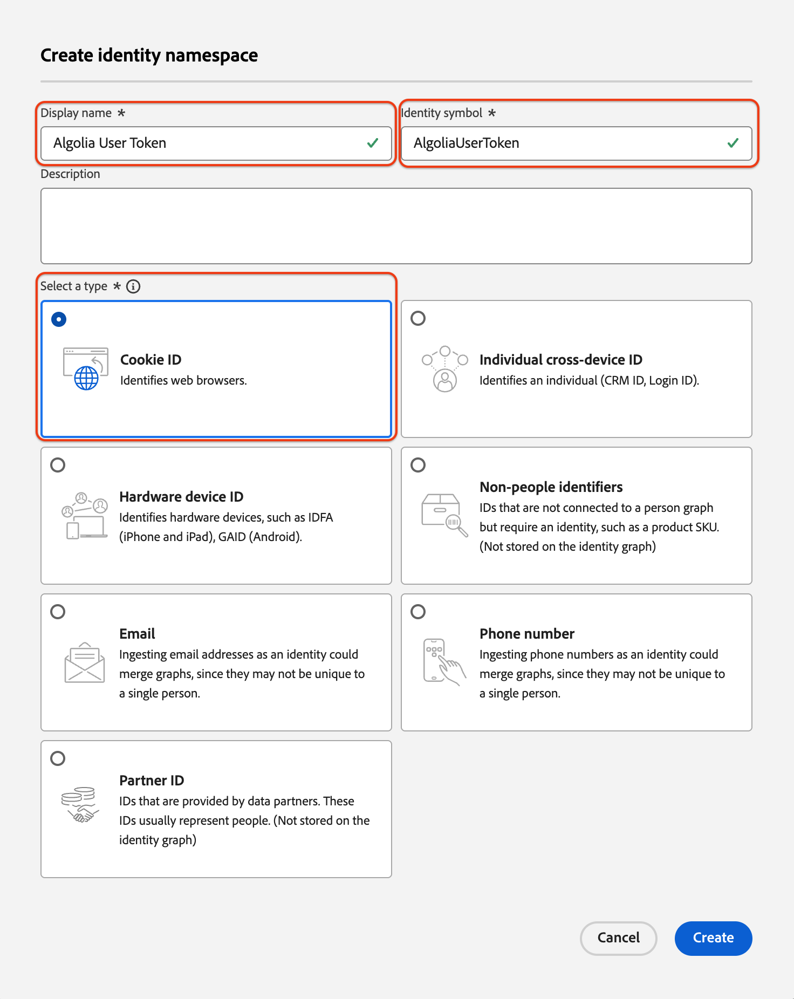

# Ingestion de données [!DNL Algolia User Profiles] dans Experience Platform à l’aide de l’interface utilisateur

Ce tutoriel vous guide tout au long de l’ingestion de données à partir de votre compte [!DNL Algolia User Profiles] dans Adobe Experience Platform à l’aide de l’interface utilisateur.

## Commencer

>[!IMPORTANT]
>
>Avant de commencer, vérifiez que vous avez rempli les conditions préalables décrites dans la [[!DNL Algolia User Profiles] présentation](../../../../connectors/data-partners/algolia-user-profiles.md#prerequisites).

Ce tutoriel suppose que vous connaissez les composants Experience Platform suivants :

* [[!DNL Experience Data Model (XDM)] Système](../../../../../xdm/home.md) : cadre normalisé utilisé par Experience Platform pour organiser les données d’expérience client.

   * [Principes de base de la composition des schémas](../../../../../xdm/schema/composition.md) : découvrez la composition des schémas, y compris les principes clés et les bonnes pratiques.
   * [Tutoriel sur l’éditeur de schémas](../../../../../xdm/tutorials/create-schema-ui.md) : découvrez comment créer des schémas personnalisés à l’aide de l’interface utilisateur de l’éditeur de schémas.
* [[!DNL Real-Time Customer Profile]](../../../../../profile/home.md) : profil client en temps réel unifié basé sur des données agrégées issues de plusieurs sources.
* [Sources](../../../../home.md) : ingérez des données provenant de diverses sources et utilisez les services Experience Platform pour structurer, étiqueter et améliorer les données.

### Collecter les informations d’identification requises

Pour connecter [!DNL Algolia] à Adobe Experience Platform, fournissez les informations d’identification suivantes :

| Informations d’identification | Description |
| -------------- | ----------------------------------------------------------------------------------------- |
| ID de l’application | Identifiant unique attribué à votre compte [!DNL Algolia]. |
| Clé API | Informations d’identification permettant d’authentifier et d’autoriser les requêtes API aux services d’[!DNL Algolia]. |

Pour plus d’informations, consultez la [!DNL Algolia] [documentation sur l’authentification](https://www.algolia.com/doc/tools/cli/get-started/authentication/).

## Connecter votre compte [!DNL Algolia]

Dans l’interface utilisateur d’Experience Platform, sélectionnez **[!UICONTROL Sources]** dans le volet de navigation de gauche pour ouvrir l’espace de travail *[!UICONTROL Sources]*. Utilisez le panneau *[!UICONTROL Catégories]* ou la barre de recherche pour trouver la source de votre choix.

Pour vous connecter [!DNL Algolia], sélectionnez la carte source **[!UICONTROL Algolia]** sous *[!UICONTROL Partenaires de données et d’identité]* et sélectionnez **[!UICONTROL Configurer]**.

>[!TIP]
>
> Si une source ne dispose pas encore d’un compte authentifié, l’option **[!UICONTROL Configurer]** s’affiche. Une fois authentifié, cela devient **[!UICONTROL Ajouter des données]**.

## Authentification

### Utiliser un compte existant

Pour utiliser un compte existant, choisissez **[!UICONTROL Compte existant]** et sélectionnez le compte [!DNL Algolia User Profiles] à utiliser. Sélectionnez ensuite **[!UICONTROL Suivant]**.

 

### Créer un nouveau compte

Pour créer un compte, sélectionnez **[!UICONTROL Nouveau compte]**, puis entrez un nom, une description facultative et vos informations d’identification [!DNL Algolia]. Sélectionnez **[!UICONTROL Se connecter à la source]** et attendez que la connexion soit établie.

## Ajouter des données

Une fois votre compte [!DNL Algolia User Profiles] créé, l’étape **[!UICONTROL Ajouter des données]** s’affiche. Utilisez-le pour sélectionner et prévisualiser les données de profil utilisateur pour l’ingestion.

* Sur la gauche, saisissez les **[!UICONTROL Indices]** et **[!UICONTROL Affinité(s)]** facultatifs.
* Sur la droite, prévisualisez jusqu’à 100 lignes de profils utilisateur.

Une fois que vous avez terminé, sélectionnez **[!UICONTROL Suivant]**.

## Fournir des détails sur le flux de données

Si vous utilisez un jeu de données existant, choisissez-en un associé à un schéma qui inclut le groupe de champs [!DNL Algolia Profile]. Assurez-vous que le champ [!DNL Algolia User Token] utilise l’espace de noms d’identité [!DNL Algolia User Token].  Si le [!DNL Algolia User Token] n’est pas créé ou affecté actuellement, suivez les instructions ci-dessous.

Si vous créez un jeu de données, sélectionnez un schéma à l’aide du groupe de champs [!DNL Algolia Profile] .

### Créer [!DNL Algolia User Token] espace de noms d’identité

Vous devrez créer l’espace de noms d’identité [!DNL Algolia User Token] s’il n’existe pas déjà dans votre organisation.

Utilisez le volet de navigation de gauche et sélectionnez **[!UICONTROL Identités]** pour accéder à l’espace de travail de l’interface utilisateur du [Service d’identités](../../../../../identity-service/home.md), puis sélectionnez **[!UICONTROL Créer un espace de noms d’identité]**.

Ensuite, fournissez un **[!UICONTROL Nom d’affichage]** et un **[!UICONTROL Symbole d’identité]** pour votre espace de noms personnalisé. Au cours de cette étape, vous devez également configurer le type de votre espace de noms. Lorsque vous avez terminé, cliquez sur **[!UICONTROL Créer]**.

| Configuration d’un espace de noms personnalisé | Valeur |
| --- | --- |
| **[!UICONTROL Nom d’affichage]** | [!DNL Algolia User Token] |
| **[!UICONTROL Symbole d’identité]** | [!DNL AlgoliaUserToken] |
| **[!UICONTROL Sélectionner un type]** | [!DNL Cookie ID] |

Une fois ajouté, l’espace de noms apparaît dans la liste. Vous pouvez maintenant l’appliquer dans votre schéma.

### Application de votre espace de noms à votre schéma

Utilisez le volet de navigation de gauche et sélectionnez **[!UICONTROL Schémas]** pour accéder à l’espace de travail de l’interface utilisateur [Schémas](../../../../../xdm/ui/overview.md). Utilisez l’espace de travail des schémas pour créer ou mettre à jour un schéma avec le groupe de champs [!DNL Algolia Profile Details]. Ensuite, accédez au champ **[!UICONTROL Jeton utilisateur]** et utilisez le rail de droite pour sélectionner la zone **[!UICONTROL Identité]**. En outre, utilisez la zone de saisie pour définir l’espace de noms d’identité [!DNL Algolia User Token]. Lorsque vous avez terminé, sélectionnez **[!UICONTROL Enregistrer]**.

Une fois que l’espace de noms d’identité [!DNL Algolia User Token] est attribué au champ **[!UICONTROL Jeton utilisateur]**, l’identité apparaît dans le profil utilisateur pour n’importe quel profil.

## Mappage des champs de données à un schéma XDM

Utilisez l’interface de mappage pour mapper vos données source aux champs de schéma. Pour plus d’informations, consultez le [guide de mappage](../../../../../data-prep/ui/mapping.md).

## Planifier des exécutions d’ingestion

Ensuite, utilisez l’interface de planification pour définir le planning de l’ingestion de votre flux de données.

| Configuration de la planification | Description |
| --- | --- |
| Fréquence | Configurez la fréquence pour indiquer la fréquence d’exécution du flux de données. Vous pouvez définir la fréquence sur : <ul><li>**Une fois** : définissez votre fréquence sur `once` pour créer une ingestion unique. Les configurations d’intervalle et de renvoi ne sont pas disponibles lors de la création d’un flux de données d’ingestion unique. Par défaut, la fréquence de planification est définie sur une seule fois.</li><li>**Minute** : définissez la fréquence sur `minute` pour planifier le flux de données afin d’ingérer les données par minute.</li><li>**Heure** : définissez la fréquence sur `hour` pour planifier l’ingestion des données par flux et par heure.</li><li>**Jour** : définissez la fréquence sur `day` pour planifier l’ingestion de données par jour dans le flux de données.</li><li>**Semaine** : définissez la fréquence sur `week` pour planifier l’ingestion de données par semaine dans le flux de données.</li></ul> |
| Intervalle | Une fois que vous avez sélectionné une fréquence, vous pouvez configurer le paramètre d’intervalle afin d’établir la période entre chaque ingestion. Par exemple, si vous définissez la fréquence sur jour et configurez l’intervalle sur 15, votre flux de données s’exécutera tous les 15 jours. Vous ne pouvez pas définir l’intervalle sur zéro. La valeur d’intervalle minimale acceptée pour chaque fréquence est la suivante :<ul><li>**Une fois** : s.o.</li><li>**Minute** : 15</li><li>**Heure** : 1</li><li>**Jour** : 1</li><li>**Semaine** : 1</li></ul> |
| Heure de début | Date et heure de l’exécution projetée, présentées dans le fuseau horaire UTC. |
| Renvoyer | Le renvoi détermine les données initialement ingérées. Si le renvoi est activé, tous les fichiers actuels du chemin spécifié seront ingérés lors de la première ingestion planifiée. Si le renvoi est désactivé, seuls les fichiers chargés entre la première exécution de l’ingestion et l’heure de début sont ingérés. Les fichiers chargés avant l’heure de début ne seront pas ingérés. |

## Vérifier le flux de données

Utilisez la page de révision pour obtenir un résumé de votre flux de données avant l’ingestion. Les détails sont regroupés dans les catégories suivantes :

* **Connexion** - Affiche le type de source, le chemin d’accès correspondant au fichier source choisi et le nombre de colonnes au sein de ce fichier source.
* **Attribuer des champs de jeu de données et de mappage** - Affiche le jeu de données dans lequel les données sources sont ingérées, y compris le schéma auquel le jeu de données se conforme.
* **Planification** - Affiche la période active, la fréquence et l’intervalle du planning d’ingestion.

Une fois que vous avez vérifié votre flux de données, sélectionnez **[!UICONTROL Terminer]** et patientez quelques instants le temps que le flux de données soit créé.

## Étapes suivantes

Ce tutoriel vous a permis de créer un flux de données pour importer les données d’intention de votre source de [!DNL Algolia] vers Experience Platform. Pour obtenir des ressources supplémentaires, consultez la documentation décrite ci-dessous.

### Surveiller votre flux de données

Une fois votre flux de données créé, vous pouvez surveiller les données ingérées et afficher les informations relatives au taux d’ingestion, aux succès et aux erreurs. Pour plus d’informations sur la surveillance des flux de données, consultez le tutoriel sur la [surveillance des comptes et des flux de données dans l’interface utilisateur](../../../../../dataflows/ui/monitor-sources.md).

### Mettre à jour votre flux de données

Pour mettre à jour les configurations pour la planification, le mappage et les informations générales de vos flux de données, consultez le tutoriel sur la [mise à jour des flux de données sources dans l’interface utilisateur](../../update-dataflows.md).

### Supprimer le flux de données

Vous pouvez supprimer les flux de données qui ne sont plus nécessaires ou qui ont été créés de manière incorrecte à l’aide de la fonction **[!UICONTROL Supprimer]**, disponible dans l’espace de travail **[!UICONTROL Flux de données]**. Pour plus d’informations sur la suppression des flux de données, consultez le tutoriel sur la [suppression de flux de données dans l’interface utilisateur](../../delete.md).
