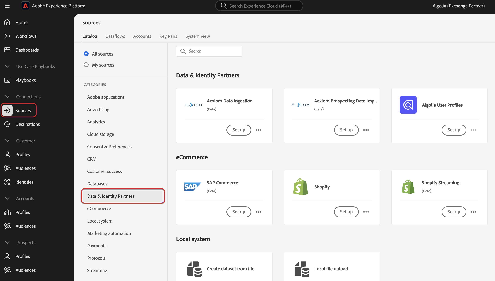

# Ingérer des données [!DNL Algolia User Profiles] vers Experience Platform à l’aide de l’interface utilisateur

Lisez ce tutoriel pour savoir comment ingérer des données de paiements à partir de votre compte [!DNL Algolia User Profiles] vers Adobe Experience Platform à l’aide de l’interface utilisateur.

## Commencer

>[!IMPORTANT]
>
>Avant de commencer, veillez à suivre les étapes préalables décrites dans la [[!DNL Algolia User Profiles] présentation](../../../../connectors/data-partners/algolia-user-profiles.md#prerequisites).

Ce tutoriel nécessite une compréhension du fonctionnement des composants suivants d’Adobe Experience Platform : 

* [[!DNL Experience Data Model (XDM)] Système](../../../../../xdm/home.md) : Cadre normalisé selon lequel Experience Platform organise les données d’expérience client. 
   * [Principes de base de la composition des schémas](../../../../../xdm/schema/composition.md) : découvrez les blocs de création de base des schémas XDM, y compris les principes clés et les bonnes pratiques en matière de composition de schémas.
   * [Tutoriel sur l’éditeur de schémas](../../../../../xdm/tutorials/create-schema-ui.md) : découvrez comment créer des schémas personnalisés à l’aide de l’interface utilisateur de l’éditeur de schémas.
* [[!DNL Real-Time Customer Profile]](../../../../../profile/home.md) : fournit un profil de consommateur unifié en temps réel, basé sur des données agrégées provenant de plusieurs sources.
* [Sources](../../../../home.md) : Experience Platform permet d’ingérer des données provenant de diverses sources tout en vous offrant la possibilité de structurer, d’étiqueter et d’améliorer les données entrantes à l’aide des services d’Experience Platform.

### Collecter les informations d’identification requises

Pour connecter [!DNL Algolia] à Experience Platform, vous devez fournir des valeurs pour les informations d’identification suivantes :

| Informations d’identification | Description |
| --- | --- |
| ID de l’application | L’ID de l’application [!DNL Algolia] est un identifiant unique attribué à votre compte [!DNL Algolia]. |
| Clé API | La clé API [!DNL Algolia] est une information d’identification utilisée pour authentifier et autoriser les requêtes API aux services de recherche et d’indexation d’[!DNL Algolia]. |

Pour plus d’informations sur ces informations d’identification, consultez la [!DNL Algolia] [documentation d’authentification](https://www.algolia.com/doc/tools/cli/get-started/authentication/).

## Connecter votre compte [!DNL Algolia]

Dans l’interface utilisateur d’Experience Platform, sélectionnez **[!UICONTROL Sources]** dans le volet de navigation de gauche pour accéder à l’espace de travail *[!UICONTROL Sources]*. Vous pouvez sélectionner la catégorie appropriée dans le panneau *[!UICONTROL Catégories]*. Vous pouvez également utiliser la barre de recherche pour accéder à la source spécifique que vous souhaitez utiliser.

Pour utiliser [!DNL Algolia], sélectionnez la carte source **[!UICONTROL Algolia]** sous *[!UICONTROL Partenaires de données et d’identité]*, puis sélectionnez **[!UICONTROL Configurer]**.

>[!TIP]
>
>Les sources du catalogue affichent l’option **[!UICONTROL Configurer]** lorsqu’une source donnée ne dispose pas encore d’un compte authentifié. Une fois qu’un compte authentifié existe, cette option devient **[!UICONTROL Ajouter des données]**.

## Authentification

### Utiliser un compte existant

Pour utiliser un compte existant, sélectionnez **[!UICONTROL Compte existant]** puis sélectionnez le compte [!DNL Algolia User Profiles] à utiliser. Pour continuer, sélectionnez **[!UICONTROL Suivant]**.

 

### Créer un nouveau compte

Si vous créez un compte, sélectionnez **[!UICONTROL Nouveau compte]**, puis fournissez un nom, une description facultative et des informations d’identification [!DNL Algolia]. Lorsque vous avez terminé, sélectionnez **[!UICONTROL Se connecter à la source]** puis attendez que la nouvelle connexion s’établisse.

## Ajouter des données

Une fois votre compte [!DNL Algolia User Profiles] créé, l’étape **[!UICONTROL Ajouter des données]** s’affiche, vous permettant d’explorer les [!DNL Algolia] profils utilisateur que vous souhaitez importer dans Experience Platform.

* La partie gauche de l’interface vous permet de saisir des champs facultatifs **[!UICONTROL Indices]** et **[!UICONTROL Affinité(s)]**.
* La partie droite de l’interface vous permet de prévisualiser jusqu’à 100 lignes de profils utilisateur.

Une fois la sélection et la prévisualisation des données pour l’ingestion terminées, sélectionnez **[!UICONTROL Suivant]**.

## Fournir des détails sur le flux de données

Si vous utilisez un jeu de données existant, sélectionnez un jeu de données associé à un schéma qui utilise le groupe de champs [!DNL Algolia Profile].

Si vous créez un jeu de données, sélectionnez un schéma qui utilise le groupe de champs [!DNL Algolia Profile] requis à l’étape de mappage.

## Mappage des champs de données à un schéma XDM

Utilisez l’interface de mappage pour mapper vos données source aux champs de schéma appropriés avant d’ingérer des données vers Experience Platform.  Pour plus d’informations, consultez le guide de mappage [ dans l’interface utilisateur](../../../../../data-prep/ui/mapping.md).

## Planifier des exécutions d’ingestion

Ensuite, utilisez l’interface de planification pour définir le planning de l’ingestion de votre flux de données.

<!-- The Scheduling step allows for configuration of the data/time to execute the [!DNL Algolia Uer Profiles] Source connector. There is configuration to backfill the data from [!DNL Algolia] which will pull all the profiles from the source system.  If the source is scheduled, then it will retrieve modified profiles from the [!DNL Algolia] based on the configured time interval. -->

| Configuration de la planification | Description |
| --- | --- |
| Fréquence | Configurez la fréquence pour indiquer la fréquence d’exécution du flux de données. Vous pouvez définir la fréquence sur : <ul><li>**Une fois** : définissez votre fréquence sur `once` pour créer une ingestion unique. Les configurations d’intervalle et de renvoi ne sont pas disponibles lors de la création d’un flux de données d’ingestion unique. Par défaut, la fréquence de planification est définie sur une seule fois.</li><li>**Minute** : définissez la fréquence sur `minute` pour planifier le flux de données afin d’ingérer les données par minute.</li><li>**Heure** : définissez la fréquence sur `hour` pour planifier l’ingestion des données par flux et par heure.</li><li>**Jour** : définissez la fréquence sur `day` pour planifier l’ingestion de données par jour dans le flux de données.</li><li>**Semaine** : définissez la fréquence sur `week` pour planifier l’ingestion de données par semaine dans le flux de données.</li></ul> |
| Intervalle | Une fois que vous avez sélectionné une fréquence, vous pouvez configurer le paramètre d’intervalle afin d’établir la période entre chaque ingestion. Par exemple, si vous définissez la fréquence sur jour et configurez l’intervalle sur 15, votre flux de données s’exécutera tous les 15 jours. Vous ne pouvez pas définir l’intervalle sur zéro. La valeur d’intervalle minimale acceptée pour chaque fréquence est la suivante :<ul><li>**Une fois** : s.o.</li><li>**Minute** : 15</li><li>**Heure** : 1</li><li>**Jour** : 1</li><li>**Semaine** : 1</li></ul> |
| Heure de début | Date et heure de l’exécution projetée, présentées dans le fuseau horaire UTC. |
| Renvoyer | Le renvoi détermine les données initialement ingérées. Si le renvoi est activé, tous les fichiers actuels du chemin spécifié seront ingérés lors de la première ingestion planifiée. Si le renvoi est désactivé, seuls les fichiers chargés entre la première exécution de l’ingestion et l’heure de début sont ingérés. Les fichiers chargés avant l’heure de début ne seront pas ingérés. |

## Vérifier le flux de données

Utilisez la page de révision pour obtenir un résumé de votre flux de données avant l’ingestion. Les détails sont regroupés dans les catégories suivantes :

* **Connexion** - Affiche le type de source, le chemin d’accès correspondant au fichier source choisi et le nombre de colonnes au sein de ce fichier source.
* **Attribuer des champs de jeu de données et de mappage** - Affiche le jeu de données dans lequel les données sources sont ingérées, y compris le schéma auquel le jeu de données se conforme.
* **Planification** - Affiche la période active, la fréquence et l’intervalle du planning d’ingestion.

Une fois que vous avez vérifié votre flux de données, sélectionnez **[!UICONTROL Terminer]** et patientez quelques instants le temps que le flux de données soit créé.

## Étapes suivantes

Ce tutoriel vous a permis de créer un flux de données pour importer les données d’intention de votre source de [!DNL Algolia] vers Experience Platform. Pour obtenir des ressources supplémentaires, consultez la documentation décrite ci-dessous.

### Surveiller votre flux de données

Une fois votre flux de données créé, vous pouvez surveiller les données ingérées et afficher les informations relatives au taux d’ingestion, aux succès et aux erreurs. Pour plus d’informations sur la surveillance des flux de données, consultez le tutoriel sur la [surveillance des comptes et des flux de données dans l’interface utilisateur](../../../../../dataflows/ui/monitor-sources.md).

### Mettre à jour votre flux de données

Pour mettre à jour les configurations pour la planification, le mappage et les informations générales de vos flux de données, consultez le tutoriel sur la [mise à jour des flux de données sources dans l’interface utilisateur](../../update-dataflows.md).

### Supprimer le flux de données

Vous pouvez supprimer les flux de données qui ne sont plus nécessaires ou qui ont été créés de manière incorrecte à l’aide de la fonction **[!UICONTROL Supprimer]**, disponible dans l’espace de travail **[!UICONTROL Flux de données]**. Pour plus d’informations sur la suppression des flux de données, consultez le tutoriel sur la [suppression de flux de données dans l’interface utilisateur](../../delete.md).
