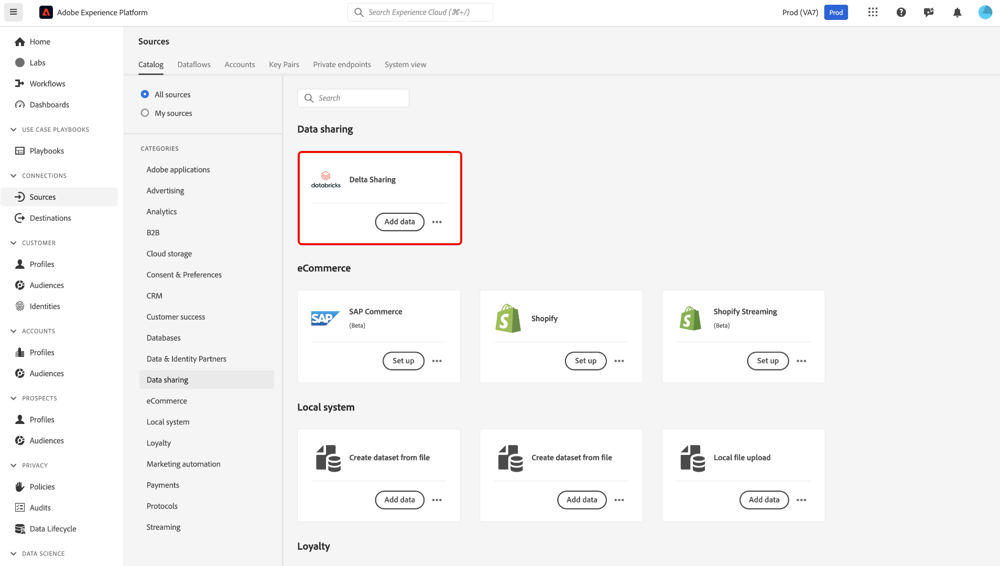
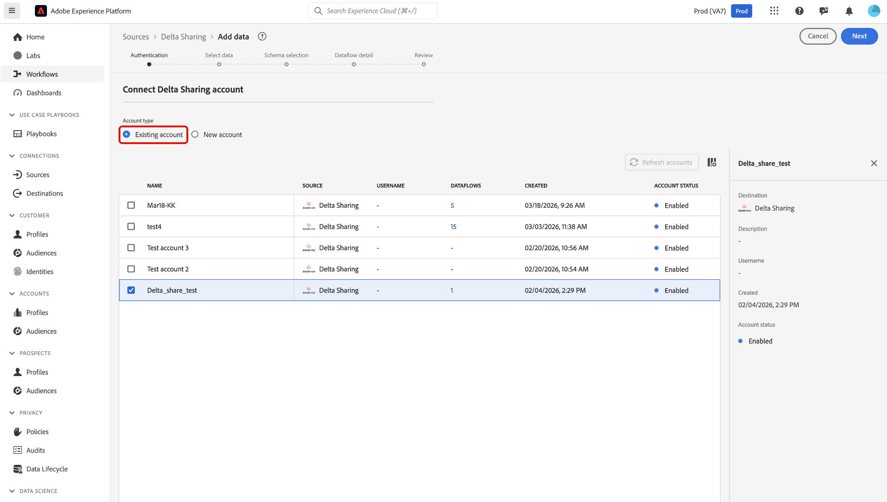
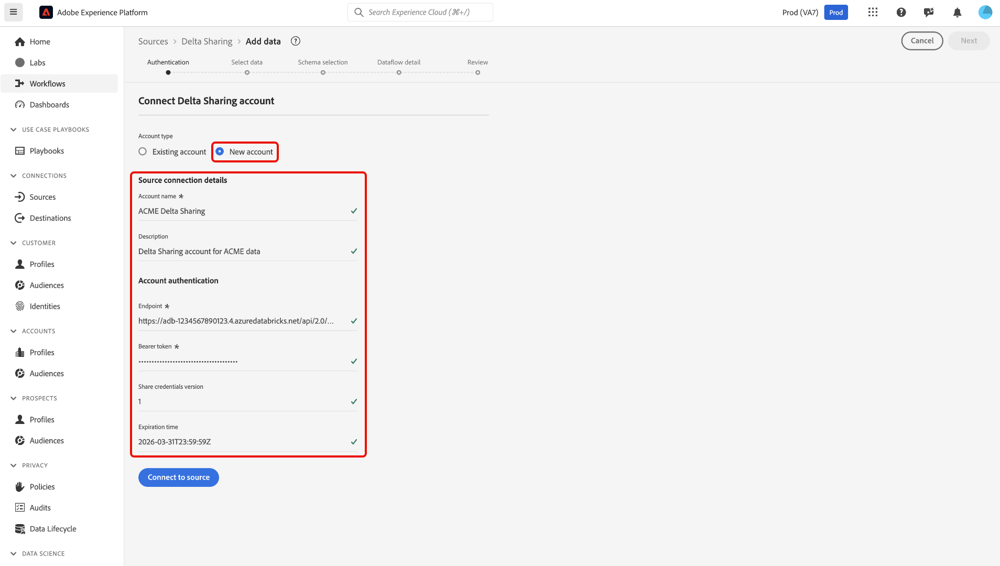
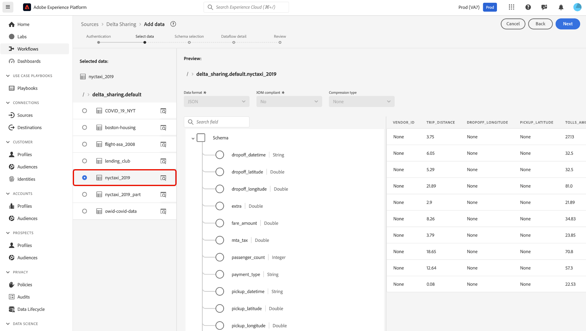
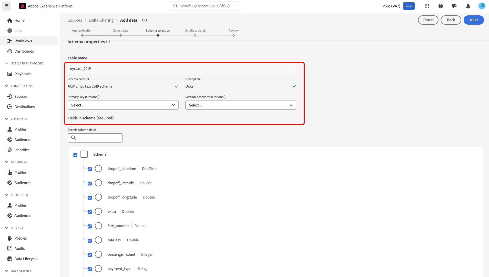
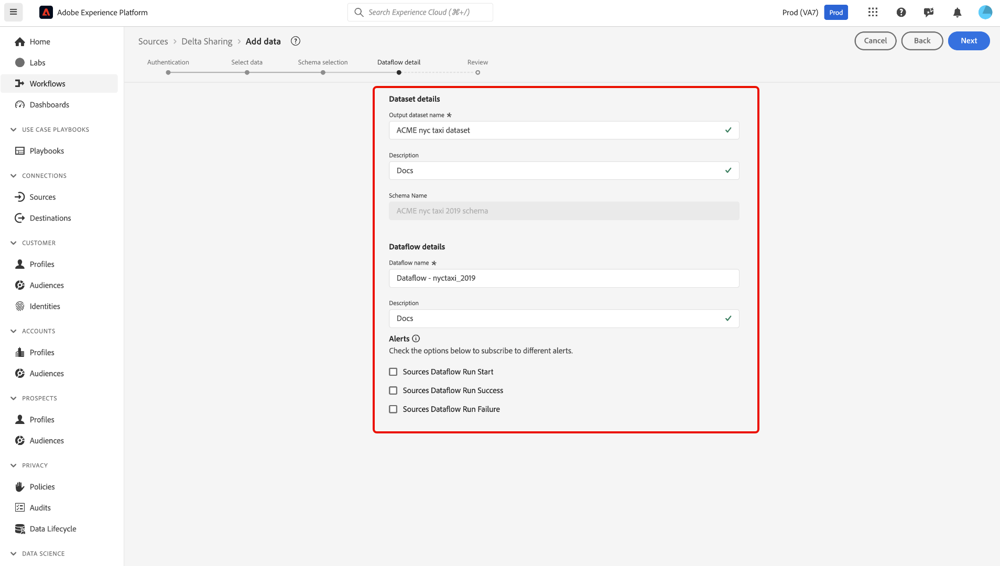
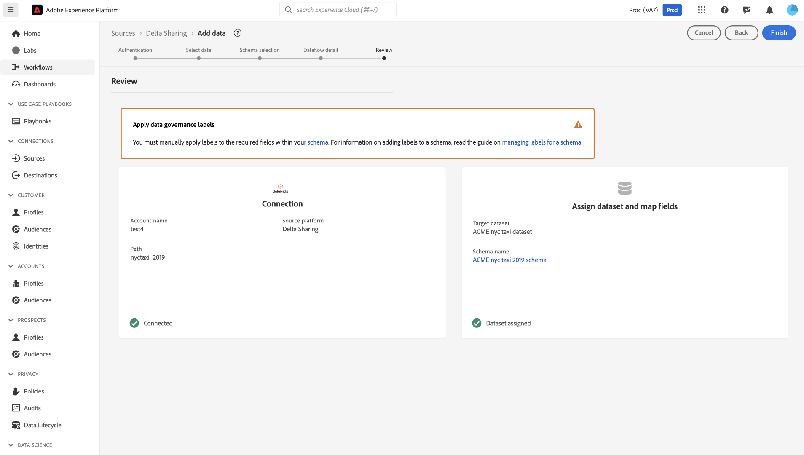

# Utiliser le connecteur source [!DNL Delta Sharing] dans l’interface d’utilisation {#use-deltashare-in-the-ui}

>[!CONTEXTUALHELP]
>id="platform_sources_deltashare_schema"
>title="Structure d&#39;un schéma"
>abstract="Veillez à passer en revue la structure de votre schéma, car une fois que vous aurez commencé, vous ne pourrez plus y apporter de modifications."

Lisez ce guide pour savoir comment utiliser le connecteur source [!DNL Delta Sharing] dans l’interface utilisateur de Adobe Experience Platform.

## Commencer

Ce tutoriel nécessite une compréhension du fonctionnement des composants suivants d’Adobe Experience Platform :

- [[!DNL Experience Data Model (XDM)] Système](../../../../../xdm/home.md) : Cadre normalisé selon lequel Experience Platform organise les données d’expérience client.
   - [Principes de base de la composition des schémas](../../../../../xdm/schema/composition.md) : découvrez les blocs de création de base des schémas XDM, y compris les principes clés et les bonnes pratiques en matière de composition de schémas.
   - [Tutoriel sur l’éditeur de schémas](../../../../../xdm/tutorials/create-schema-ui.md) : découvrez comment créer des schémas personnalisés à l’aide de l’interface utilisateur de l’éditeur de schémas.
- [[!DNL Real-Time Customer Profile]](../../../../../profile/home.md) : fournit un profil de consommateur unifié en temps réel, basé sur des données agrégées provenant de plusieurs sources.

>[!IMPORTANT]
>
>Lisez la [[!DNL Delta Sharing] présentation](../../../../connectors/data-sharing/delta-sharing.md) pour découvrir les étapes préalables à suivre avant de connecter votre compte à Experience Platform.

## Parcourir le catalogue des sources

Dans l’interface utilisateur d’Experience Platform, sélectionnez **[!UICONTROL Sources]** dans le volet de navigation de gauche pour accéder à l’espace de travail *[!UICONTROL Sources]*. Sélectionnez la catégorie appropriée dans le panneau *[!UICONTROL Catégories]*. Vous pouvez également utiliser la barre de recherche pour accéder à la source spécifique que vous souhaitez utiliser.

Pour utiliser [!DNL Delta Sharing], sélectionnez la carte source **[!UICONTROL Partage Delta]** sous le *[!UICONTROL Partage de données]*, puis sélectionnez **[!UICONTROL Ajouter des données]**.

>[!TIP]
>
>Les sources du catalogue affichent l’option **[!UICONTROL Configurer]** lorsqu’une source donnée ne dispose pas encore d’un compte authentifié. Une fois un compte authentifié créé, cette option devient **[!UICONTROL Ajouter des données]**.

### Utiliser un compte existant

Pour utiliser un compte existant, sélectionnez **[!UICONTROL Compte existant]** et sélectionnez le compte [!DNL Delta Sharing] à utiliser dans l’interface Comptes.

### Créer un nouveau compte

Pour créer un compte, sélectionnez **[!UICONTROL Nouveau compte]** et indiquez un nom et une description facultative pour votre compte. Saisissez des valeurs pour les informations d’authentification suivantes :

- Point d’entrée
- Jeton porteur
- Partager la version des informations d’identification
- Délai d’expiration

>[!TIP]
>
>Lisez le [[!DNL Delta Sharing] guide d’authentification](../../../../connectors/data-sharing/delta-sharing.md) pour plus d’informations sur ces informations d’identification.

Lorsque vous avez terminé, sélectionnez **[!UICONTROL Se connecter à la source]** et patientez quelques instants le temps que votre connexion s’établisse.

## Sélectionner vos données

Sélectionnez ensuite les données à ingérer dans Experience Platform. Utilisez le répertoire du tableau pour accéder aux données à ingérer et utilisez l’interface de prévisualisation pour afficher le contenu et la structure de vos données. Lorsque vous avez terminé, sélectionnez **[!UICONTROL Suivant]**.

## Sélection du schéma

>[!IMPORTANT]
>
>Une fois que vous avez sélectionné **[!UICONTROL Suivant]**, vous ne pourrez plus modifier la structure de schéma sélectionnée. Si vous avez déjà sélectionné **[!UICONTROL Suivant]** et dépassé l’étape de sélection du schéma, vous ne pouvez plus mettre à jour votre schéma sélectionné si vous revenez à une étape précédente. Pour modifier votre schéma, vous devez redémarrer le processus de configuration du flux de données et commencer à l’étape initiale.

Après avoir sélectionné une table dans votre source de [!DNL Delta Sharing], Experience Platform déduit automatiquement le schéma relationnel. À ce stade, vous devez fournir un nom de schéma avant de continuer. Vous pouvez également spécifier une **clé primaire** et un **descripteur de version** pour définir plus en détail votre schéma.

**Clé de Principal** : définissez une clé primaire si votre table en a une. Tenez compte des facteurs suivants lors de la sélection d’une clé primaire :

- Sélectionnez une clé unique par ligne pour l’entité logique qui vous intéresse (par exemple, une ligne par commande, par client, par transaction).
- Sélectionnez une clé stable dans le temps (qui ne change pas une fois écrite).
- Sélectionnez une clé qui n’est pas un substitut non commercial à cardinalité élevée et qui n’a aucun sens pour la gouvernance (par exemple, un « row_id » aléatoire que le code en amont régénère).

**Descripteur de version** : le descripteur de version marque une colonne qui vous indique quelle ligne est l’enregistrement « le plus récent » pour une clé donnée. Utilisez ceci comme référence au cas où votre tableau conserve plusieurs versions de la même entité et où vous souhaitez une méthode bien définie pour choisir la version actuelle ou la dernière. Tenez compte des facteurs suivants lors de la sélection d’un descripteur de version :

- Horodatage tel que `last_updated_at` ou `modified_ts`.
- Une version numérique croissante telle que `version_num` ou `sequence_number`.

Vous pouvez laisser le descripteur de version vide si vous effectuez l’une des opérations suivantes :

- Le tableau est purement transactionnel/au niveau de l’événement (cela signifie que chaque ligne est un événement unique et ne représente pas une « entité » modifiable avec versions).
- Il n’existe aucune colonne d’indicateur fiable « dernier ».
- Vous n’avez pas validé la signification réelle de la colonne date et heure/version.

>[!TIP]
>
>Si vous n’êtes pas sûr, vous pouvez choisir de laisser le descripteur de version vide. Vous pouvez toujours interroger le jeu de données virtuel et implémenter la logique « la plus récente » directement dans SQL.

## Fournir des détails sur le jeu de données et le flux de données

Un jeu de données est une structure de stockage et de gestion pour une collection de données, généralement sous la forme d’un tableau, qui contient un schéma (colonnes/champs) et des enregistrements (lignes). Les données correctement ingérées par Experience Platform sont conservées sous forme de jeux de données dans le lac de données.

Une fois votre jeu de données configuré, vous devez fournir des détails sur votre flux de données, y compris un nom, une description facultative et des configurations d’alerte.

| Configurations du flux de données | Description |
| --- | --- |
| Nom du flux de données | Nom du flux de données. Par défaut, le nom du fichier importé est utilisé. |
| Description | (Facultatif) Brève description de votre flux de données. |
| Alertes | Experience Platform peut générer des alertes basées sur des événements auxquelles les utilisateurs et utilisatrices peuvent s’abonner. Ces options permettent à un flux de données en cours d’exécution de les déclencher.  Pour plus d’informations, reportez-vous à la présentation des alertes [&#128279;](../../alerts.md) <ul><li>**Début d’exécution du flux de données des sources** : sélectionnez cette alerte pour recevoir une notification lorsque l’exécution du flux de données commence.</li><li>**Succès de l’exécution du flux de données des sources** : sélectionnez cette alerte pour recevoir une notification si votre flux de données se termine sans erreur.</li><li>**Échec de l’exécution du flux de données des sources** : sélectionnez cette alerte pour recevoir une notification si l’exécution de votre flux de données se termine par des erreurs.</li></ul> |

{style="table-layout:auto"}

## Vérifier le flux de données

L’étape *[!UICONTROL Révision]* s’affiche et vous permet de consulter les détails de votre flux de données avant sa création. Les détails sont regroupés dans les catégories suivantes :

- **[!UICONTROL Connexion]** : affiche le nom du compte, la plateforme source et le nom de la source.
- **[!UICONTROL Attribuer des champs de jeu de données et de mappage]** : affiche le jeu de données cible et le schéma auquel le jeu de données se conforme.

Après avoir confirmé que les détails sont corrects, sélectionnez **[!UICONTROL Terminer]**.

## Surveiller votre flux de données

Une fois votre flux de données créé, vous pouvez surveiller les données ingérées et afficher les informations relatives au taux d’ingestion, aux succès et aux erreurs. Pour plus d’informations sur la surveillance des flux de données, consultez le tutoriel sur la [surveillance des comptes et des flux de données dans l’interface utilisateur](../../../../../dataflows/ui/monitor-sources.md).