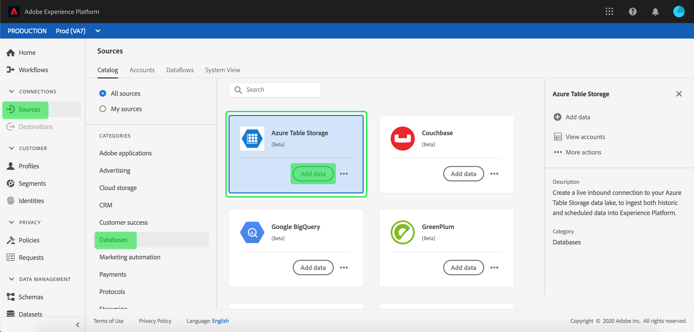

# Création d&#39;un tableau Azure   connecteur source dans l&#39;interface utilisateur

Les connecteurs source d’Adobe Experience Platform permettent d’assimiler des données externes sur une base planifiée. Ce didacticiel décrit les étapes de création d&#39;un connecteur source Azure Table  (ci-après dénommé &quot;ATS&quot;) à l&#39;aide de l&#39;interface utilisateur de la plateforme.

## Prise en main

Ce didacticiel nécessite une compréhension pratique des composants suivants d’Adobe Experience Platform :

* [Système](../../../../../xdm/home.md)de modèle de données d’expérience (XDM) : Cadre normalisé selon lequel la plateforme d’expérience organise les données d’expérience client.
   * [Principes de base de la composition](../../../../../xdm/schema/composition.md)de  : Découvrez les éléments de base des  XDM, y compris les principes clés et les bonnes pratiques en matière de composition de .
   * [Didacticiel](../../../../../xdm/tutorials/create-schema-ui.md)de l’éditeur de  : Découvrez comment créer des  personnalisées à l’aide de l’interface utilisateur de l’éditeur de  de.
* du client en temps réel : Fournit un client en temps réel unifié basé sur des données agrégées provenant de plusieurs sources.

Si vous disposez déjà d’une connexion ATS valide, vous pouvez ignorer le reste de ce et passer au didacticiel sur la [configuration d’un flux de données](../../dataflow/databases.md).

### Collecte des informations d’identification requises

Pour accéder à votre compte ATS sur la plateforme, vous devez fournir les valeurs suivantes :

| Informations d’identification | Description |
| ---------- | ----------- |
| `connectionString` | Chaîne de connexion permettant de se connecter à votre instance d&#39;Azure Table . |

Pour plus d&#39;informations sur la prise en main, reportez-vous à [cette table Azure ](https://docs.microsoft.com/en-us/azure/storage/common/storage-introduction).

## Connectez votre compte Azure Table  

Une fois que vous avez rassemblé les informations d’identification requises, vous pouvez suivre les étapes ci-dessous pour créer un compte ATS afin de vous connecter à la plateforme.

Connectez-vous à <a href="https://platform.adobe.com" target="_blank">Adobe Experience Platform</a> , puis sélectionnez **Sources** dans la barre de navigation de gauche pour accéder à l’espace de travail *Sources* . L’écran *Catalogue* affiche diverses sources pour lesquelles vous pouvez créer un compte entrant et chaque source indique le nombre de comptes et de flux de jeux de données existants qui lui sont associés.

Vous pouvez sélectionner le  approprié dans le catalogue sur le côté gauche de l’écran. Vous pouvez également trouver la source spécifique avec laquelle vous souhaitez travailler à l’aide de l’option de recherche.

Sous le  *Bases de données* , sélectionnez **Azure Table** pour afficher une barre d&#39;informations sur le côté droit de votre écran. La barre d’informations fournit une brève description de la source sélectionnée ainsi que des options permettant de se connecter à la source ou au  sa documentation. Pour créer une connexion entrante, sélectionnez **Connexion source**.

La page *Se connecter à la table Azure* s&#39;affiche. Sur cette page, vous pouvez utiliser de nouvelles informations d’identification ou des informations d’identification existantes.

### Nouveau compte

Si vous utilisez de nouvelles informations d’identification, sélectionnez **Nouveau compte**. Dans le formulaire d’entrée qui s’affiche, indiquez le nom, une description facultative et vos informations d’identification ATS pour la connexion. Lorsque vous avez terminé, sélectionnez **Se connecter** , puis accordez du temps au nouveau compte pour l’établir.

### Compte existant

Pour connecter un compte existant, sélectionnez le compte ATS avec lequel vous souhaitez vous connecter, puis sélectionnez **Suivant** pour continuer.

## Étapes suivantes

En suivant ce didacticiel, vous avez établi une connexion à votre compte ATS. Vous pouvez maintenant passer au didacticiel suivant et [configurer un flux de données pour importer des données dans Platform](../../dataflow/databases.md).