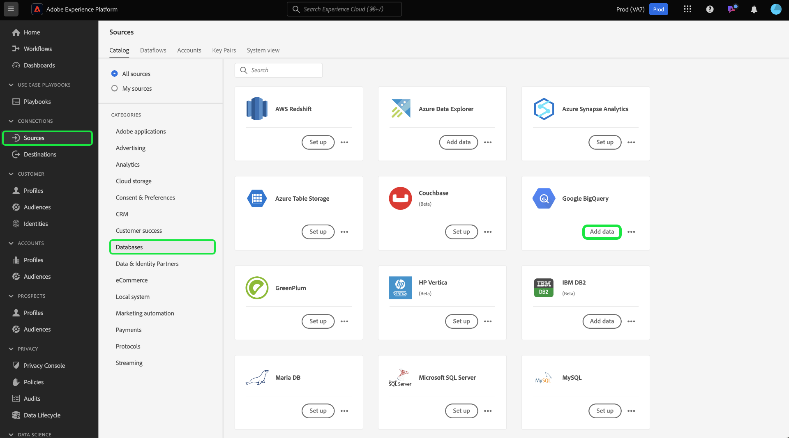
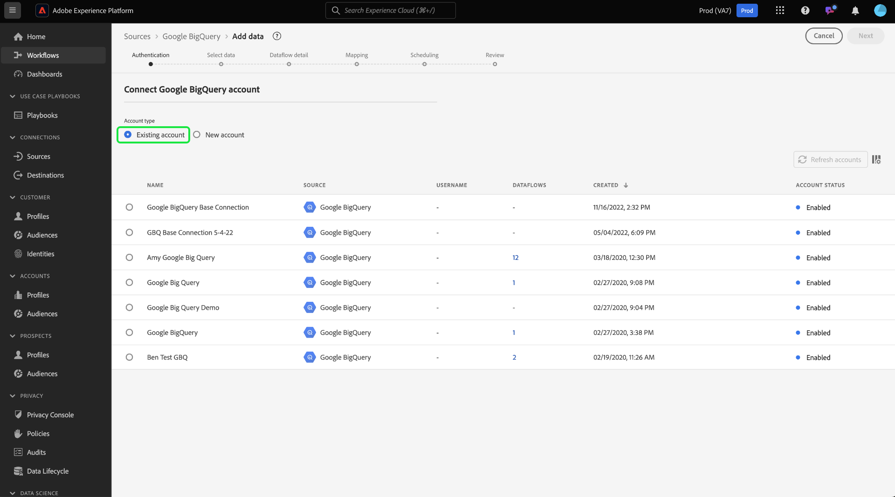
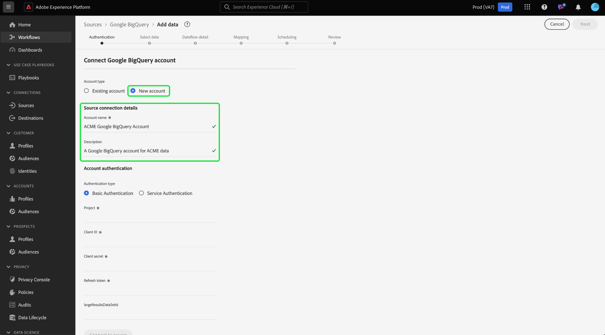
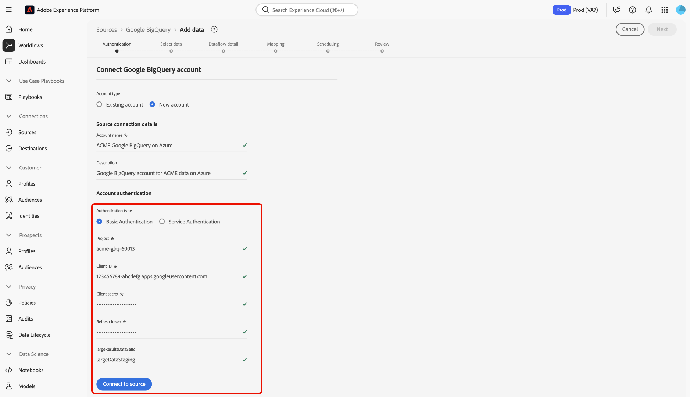
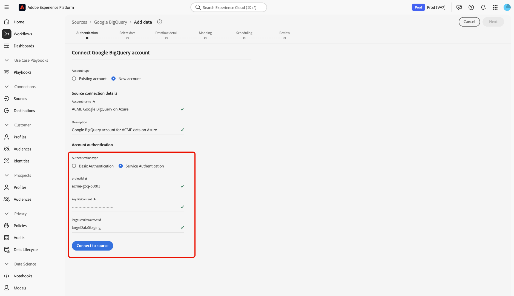
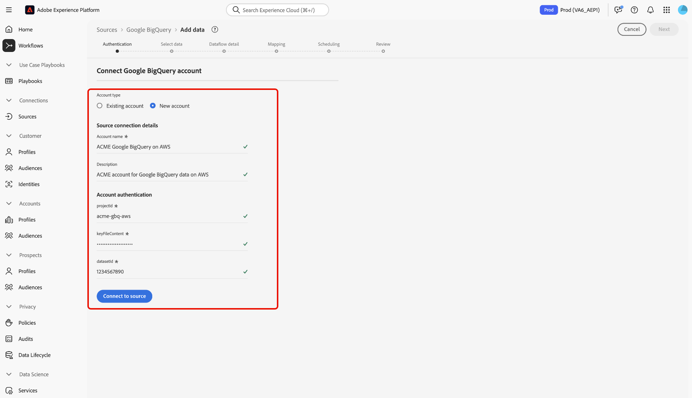

# Connexion d’[!DNL Google BigQuery] à Experience Platform à l’aide de l’interface utilisateur

>[!IMPORTANT]
>
>La source [!DNL Google BigQuery] est disponible dans le catalogue des sources pour les utilisateurs qui ont acheté Real-Time Customer Data Platform Ultimate.

Lisez ce tutoriel pour savoir comment connecter votre compte [!DNL Google BigQuery] à Adobe Experience Platform à l’aide de l’interface utilisateur.

## Commencer

Ce tutoriel nécessite une compréhension du fonctionnement des composants suivants d’Adobe Experience Platform :

* [[!DNL Experience Data Model (XDM)] Système](../../../../../xdm/home.md) : Cadre normalisé selon lequel Experience Platform organise les données d’expérience client.
   * [Principes de base de la composition des schémas](../../../../../xdm/schema/composition.md) : découvrez les blocs de création de base des schémas XDM, y compris les principes clés et les bonnes pratiques en matière de composition de schémas.
   * [Tutoriel sur l’éditeur de schémas](../../../../../xdm/tutorials/create-schema-ui.md) : découvrez comment créer des schémas personnalisés à l’aide de l’interface utilisateur de l’éditeur de schémas.
* [[!DNL Real-Time Customer Profile]](../../../../../profile/home.md) : fournit un profil de consommateur unifié en temps réel, basé sur des données agrégées provenant de plusieurs sources.

Si vous disposez déjà d’une connexion [!DNL Google BigQuery] valide, vous pouvez ignorer le reste de ce document et passer au tutoriel sur la [configuration d’un flux de données](../../dataflow/databases.md).

### Collecter les informations d’identification requises

Lisez le [[!DNL Google BigQuery] guide d’authentification](../../../../connectors/databases/bigquery.md#prerequisites) pour obtenir des instructions détaillées sur la collecte des informations d’identification requises.

## Parcourir le catalogue des sources {#navigate}

Dans l’interface utilisateur d’Experience Platform, sélectionnez **[!UICONTROL Sources]** dans le volet de navigation de gauche pour accéder à l’espace de travail *[!UICONTROL Sources]*. Vous pouvez sélectionner la catégorie appropriée dans le panneau *[!UICONTROL Categories]*. Vous pouvez également utiliser la barre de recherche pour accéder à la source spécifique que vous souhaitez utiliser.

Pour utiliser [!DNL Google BigQuery], sélectionnez la carte source **[!UICONTROL Google BigQuery]** sous *[!UICONTROL Databases]*, puis sélectionnez **[!UICONTROL Add data]**.

>[!TIP]
>
>Les sources du catalogue affichent l’option **[!UICONTROL Set up]** lorsqu’une source donnée ne dispose pas encore d’un compte authentifié. Une fois un compte authentifié créé, cette option devient **[!UICONTROL Add data]**.

## Utiliser un compte existant {#existing}

Pour utiliser un compte existant, sélectionnez le compte [!DNL Google BigQuery] auquel vous souhaitez vous connecter, puis sélectionnez **[!UICONTROL Next]** pour continuer.

## Créer un nouveau compte {#create}

Si vous ne disposez pas d’un compte existant, vous devez créer un compte en fournissant les informations d’authentification nécessaires qui correspondent à votre source.

Pour créer un compte, sélectionnez **[!UICONTROL New account]**, puis fournissez un nom et éventuellement une description pour votre compte.

### Connexion à Experience Platform sur Azure {#azure}

Vous pouvez connecter votre compte [!DNL Google BigQuery] à Experience Platform sur Azure à l’aide de l’authentification de base ou de service.

>[!BEGINTABS]

>[!TAB Utiliser l’authentification de base]

Pour utiliser l’authentification de base, sélectionnez **[!UICONTROL Basic Authentication]** et indiquez les valeurs de votre [projet, ID client, secret client, jeton d’actualisation et ID de jeu de données de résultats volumineux (facultatif)](../../../../connectors/databases/bigquery.md#generate-your-google-bigquery-credentials). Lorsque vous avez terminé, sélectionnez **[!UICONTROL Connect to source]** et patientez quelques instants le temps que la connexion s’établisse.

>[!TAB Utiliser l’authentification de service]

Pour utiliser l’authentification de service, sélectionnez **[!UICONTROL Service Authentication]** et indiquez les valeurs de votre [ID de projet, contenu du fichier clé et (facultatif) ID de jeu de données de résultats volumineux](../../../../connectors/databases/bigquery.md#generate-your-google-bigquery-credentials). Lorsque vous avez terminé, sélectionnez **[!UICONTROL Connect to source]** et patientez quelques instants le temps que la connexion s’établisse.

>[!ENDTABS]

### Connexion à Experience Platform sur Amazon Web Services (AWS) {#aws}

>[!AVAILABILITY]
>
>Cette section s’applique aux implémentations d’Experience Platform s’exécutant sur Amazon Web Services (AWS). Experience Platform s’exécutant sur AWS est actuellement disponible pour un nombre limité de clients. Pour en savoir plus sur l’infrastructure Experience Platform prise en charge, consultez la [présentation multi-cloud d’Experience Platform](../../../../../landing/multi-cloud.md).

Pour créer un compte [!DNL Google BigQuery] et vous connecter à Experience Platform sur AWS, vérifiez que vous vous trouvez dans un sandbox VA6, puis fournissez les informations d’identification nécessaires pour l’authentification.

* **Identifiant de projet** : l’identifiant de projet qui correspond à votre compte [!DNL Google BigQuery].
* **Contenu du fichier de clé** : fichier de clé utilisé pour authentifier le compte de service. Vous pouvez récupérer cette valeur à partir du [[!DNL Google Cloud service accounts] tableau de bord](https://console.cloud.google.com). Le contenu du fichier de clé est au format JSON. Vous devez l’encoder en [!DNL Base64] lors de l’authentification à Experience Platform.
* **Identifiant du jeu de données** : identifiant du jeu de données [!DNL Google BigQuery]. Cet identifiant représente l’emplacement de vos tableaux de données et doit être précréé pour permettre la prise en charge de jeux de résultats volumineux.

## Ignorer la prévisualisation des exemples de données {#skip-preview-of-sample-data}

Lors de l’étape de sélection des données, vous pouvez rencontrer un délai d’expiration lors de l’ingestion de tables ou de fichiers de données volumineux. Vous pouvez ignorer la prévisualisation des données pour contourner le délai d’expiration et continuer à afficher votre schéma, même s’il ne contient pas de données d’exemple. Pour ignorer l’aperçu des données, activez le bouton (bascule) **[!UICONTROL Skip previewing sample data]**.

Le reste du workflow reste le même. Seul bémol : l’omission de l’aperçu des données peut empêcher la validation automatique des champs calculés et obligatoires lors de l’étape de mappage. Vous devrez ensuite valider manuellement ces champs pendant le mappage.

## Étapes suivantes

En suivant ce tutoriel, vous avez établi une connexion à votre compte [!DNL Google BigQuery]. Vous pouvez maintenant passer au tutoriel suivant et [configurer un flux de données pour importer des données dans Experience Platform](../../dataflow/databases.md).
