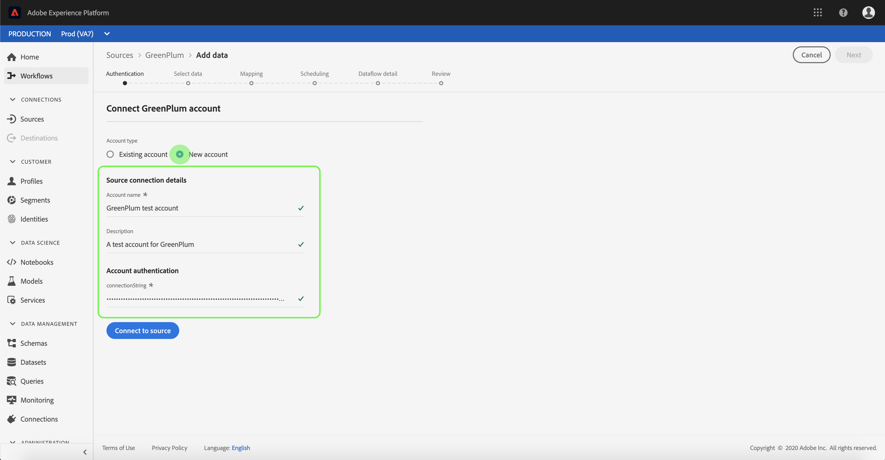

# Créer une connexion source [!DNL GreenPlum] dans l’interface utilisateur

Les connecteurs Source de Adobe Experience Platform permettent d’ingérer des données provenant de l’extérieur selon un calendrier précis. Ce tutoriel décrit les étapes à suivre pour créer un connecteur source [!DNL GreenPlum] à l’aide de l’interface utilisateur [!DNL Experience Platform].

## Prise en main

Ce tutoriel nécessite une compréhension du fonctionnement des composants suivants d’Adobe Experience Platform :

* [[!DNL Experience Data Model (XDM)] Système](../../../../../xdm/home.md) : le cadre normalisé en fonction duquel [!DNL Experience Platform] organise les données d’expérience client.
   * [Principes de base de la composition des schémas](../../../../../xdm/schema/composition.md) : découvrez les blocs de création de base des schémas XDM, y compris les principes clés et les bonnes pratiques en matière de composition de schémas.
   * [Tutoriel sur l’éditeur de schémas](../../../../../xdm/tutorials/create-schema-ui.md) : découvrez comment créer des schémas personnalisés à l’aide de l’interface utilisateur de l’éditeur de schémas.
* [[!DNL Real-Time Customer Profile]](../../../../../profile/home.md) : fournit un profil de consommateur unifié en temps réel, basé sur des données agrégées provenant de plusieurs sources.

Si vous disposez déjà d’une connexion [!DNL GreenPlum] valide, vous pouvez ignorer le reste de ce document et passer au tutoriel sur la [configuration d’un flux de données](../../dataflow/databases.md).

### Collecter les informations d’identification requises

Les sections suivantes contiennent des informations supplémentaires que vous devez connaître pour réussir à vous connecter à [!DNL GreenPlum] à l’aide de l’API [!DNL Flow Service].

| Informations d’identification | Description |
| ---------- | ----------- |
| `connectionString` | Chaîne de connexion utilisée pour la connexion à votre instance [!DNL GreenPlum]. Le modèle de chaîne de connexion pour [!DNL GreenPlum] est `Server={SERVER};Port={PORT};Database={DATABASE};UID={USERNAME};PWD={PASSWORD}` |

Pour plus d’informations sur la prise en main, reportez-vous à [ce document GreenPlum](https://docs.greenplum.org/6-7/security-guide/topics/Authenticate.html).

## Connecter votre compte [!DNL GreenPlum]

Une fois les informations d’identification requises collectées, vous pouvez suivre les étapes ci-dessous pour lier votre compte [!DNL GreenPlum] à [!DNL Experience Platform].

Connectez-vous à [Adobe Experience Platform](https://platform.adobe.com) puis sélectionnez **[!UICONTROL Sources]** dans la barre de navigation de gauche pour accéder à l’espace de travail **[!UICONTROL Sources]**. L’écran **[!UICONTROL Catalogue]** affiche diverses sources pour lesquelles vous pouvez créer un compte.

Vous pouvez sélectionner la catégorie appropriée dans le catalogue sur le côté gauche de votre écran. Vous pouvez également trouver la source spécifique à utiliser à l’aide de l’option de recherche.

Dans la catégorie **[!UICONTROL Bases de données]**, sélectionnez **[!UICONTROL GreenPlum]**. Si vous utilisez ce connecteur pour la première fois, sélectionnez **[!UICONTROL Configurer]**. Sinon, sélectionnez **[!UICONTROL Ajouter des données]** pour créer un connecteur [!DNL GreenPlum].

La page **[!UICONTROL Se connecter à GreenPlum]** s’affiche. Sur cette page, vous pouvez utiliser de nouvelles informations d’identification ou des informations d’identification existantes.

### Nouveau compte

Si vous utilisez de nouvelles informations d’identification, sélectionnez **[!UICONTROL Nouveau compte]**.  Dans le formulaire de saisie qui s’affiche, indiquez un nom, une description facultative et vos informations d’identification [!DNL GreenPlum]. Lorsque vous avez terminé, sélectionnez **[!UICONTROL Connexion]** puis patientez quelques instants le temps d’établir la nouvelle connexion.

### Compte existant

Pour connecter un compte existant, sélectionnez le compte [!DNL GreenPlum] auquel vous souhaitez vous connecter, puis sélectionnez **[!UICONTROL Suivant]** dans le coin supérieur droit pour continuer.

## Étapes suivantes

En suivant ce tutoriel, vous avez établi une connexion à votre compte [!DNL GreenPlum]. Vous pouvez maintenant passer au tutoriel suivant et [configurer un flux de données pour importer des données dans [!DNL Experience Platform]](../../dataflow/databases.md).
