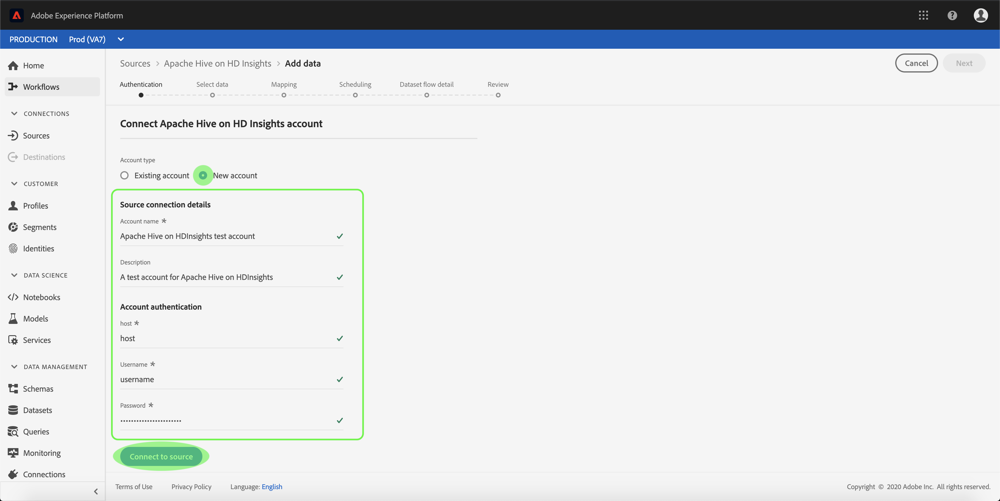

# Créez un [!DNL Apache Hive] on [!DNL Azure HDInsights] connexion source dans l’interface utilisateur

>[!NOTE]
>
> La variable [!DNL Apache Hive] on [!DNL Azure HDInsights] Le connecteur est en version bêta. Voir [Présentation des sources](../../../../home.md#terms-and-conditions) pour plus d’informations sur l’utilisation de connecteurs libellés en version bêta.

Les connecteurs source d’Adobe Experience Platform permettent d’ingérer des données externes selon un calendrier précis. Ce tutoriel décrit les étapes à suivre pour créer une [!DNL Apache Hive] on [!DNL Azure HDInsights] connecteur source à l’aide de [!DNL Platform] de l’interface utilisateur.

## Prise en main

Ce tutoriel nécessite une compréhension du fonctionnement des composants suivants d’Adobe Experience Platform :

* [[!DNL Experience Data Model (XDM)] Système](../../../../../xdm/home.md) : le cadre normalisé en fonction duquel [!DNL Experience Platform] organise les données d’expérience client.
   * [Principes de base de la composition des schémas](../../../../../xdm/schema/composition.md) : découvrez les blocs de création de base des schémas XDM, y compris les principes clés et les bonnes pratiques en matière de composition de schémas.
   * [Tutoriel sur l’éditeur de schémas](../../../../../xdm/tutorials/create-schema-ui.md) : découvrez comment créer des schémas personnalisés à l’aide de l’interface utilisateur de l’éditeur de schémas.
* [[!DNL Real-Time Customer Profile]](../../../../../profile/home.md) : fournit un profil de consommateur unifié en temps réel, basé sur des données agrégées provenant de plusieurs sources.

Si vous disposez déjà d’une connexion [!DNL Hive] valide, vous pouvez ignorer le reste de ce document et passer au tutoriel sur la [configuration d’un flux de données](../../dataflow/databases.md)

### Collecter les informations d’identification requises

Pour accéder au compte [!DNL Hive] sur , vous devez fournir les valeurs suivantes :[!DNL Platform]

| Informations d’identification | Description |
| ---------- | ----------- |
| `host` | L’adresse IP ou le nom d’hôte de la variable [!DNL Hive] serveur. |
| `username` | Le nom d’utilisateur que vous utilisez pour accéder à la variable [!DNL Hive] serveur. |
| `password` | Mot de passe qui correspond à l’utilisateur. |

Pour plus d’informations sur la prise en main, voir [this [!DNL Hive] document](https://cwiki.apache.org/confluence/display/Hive/Tutorial#Tutorial-GettingStarted).

## Connecter votre compte [!DNL Hive]

Une fois les informations d’identification requises collectées, vous pouvez suivre les étapes ci-dessous pour lier votre compte [!DNL Hive] à [!DNL Platform].

Connexion à [Adobe Experience Platform](https://platform.adobe.com) puis sélectionnez **[!UICONTROL Sources]** à partir de la barre de navigation de gauche pour accéder au **[!UICONTROL Sources]** workspace. L’écran **[!UICONTROL Catalogue]** affiche diverses sources pour lesquelles vous pouvez créer un compte.

Vous pouvez sélectionner la catégorie appropriée dans le catalogue sur le côté gauche de votre écran. Vous pouvez également trouver la source spécifique à utiliser à l’aide de l’option de recherche.

Sous , **[!UICONTROL Bases de données]** catégorie, sélectionnez **[!UICONTROL Hive]**. Si c’est la première fois que vous utilisez ce connecteur, sélectionnez **[!UICONTROL Configurer]**. Sinon, sélectionnez **[!UICONTROL Ajouter des données]** pour créer [!DNL Hive] connecteur.

La variable **[!UICONTROL Connexion à Hive]** s’affiche. Sur cette page, vous pouvez utiliser de nouvelles informations d’identification ou des informations d’identification existantes.

### Nouveau compte

Si vous utilisez de nouvelles informations d’identification, sélectionnez **[!UICONTROL Nouveau compte]**.  Dans le formulaire de saisie qui s’affiche, indiquez un nom, une description facultative et votre [!DNL Hive] informations d’identification. Lorsque vous avez terminé, sélectionnez **[!UICONTROL Connexion]** puis accorder un certain temps pour établir la nouvelle connexion.

### Compte existant

Pour connecter un compte existant, sélectionnez le [!DNL Hive] compte auquel vous souhaitez vous connecter, puis sélectionnez **[!UICONTROL Suivant]** pour continuer.

## Étapes suivantes

En suivant ce tutoriel, vous avez établi une connexion à votre compte [!DNL Hive]. Vous pouvez maintenant passer au tutoriel suivant et [configurer un flux de données pour importer des données dans [!DNL Platform]](../../dataflow/databases.md).
