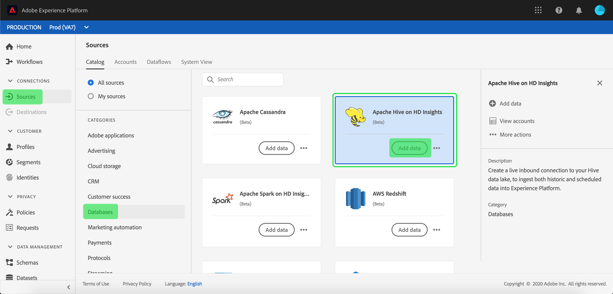

# Création d’une connexion source [!DNL Apache Hive] sur [!DNL Azure HDInsights] dans l’interface utilisateur

>[!NOTE]
>
> Le connecteur [!DNL Apache Hive] sur [!DNL Azure HDInsights] est en version bêta. Pour plus d’informations sur l’utilisation de connecteurs bêta, consultez la [Présentation des sources](../../../../home.md#terms-and-conditions) .

Les connecteurs Source dans Adobe Experience Platform permettent d’ingérer des données provenant de l’extérieur de manière planifiée. Ce tutoriel décrit les étapes de création d’un connecteur source [!DNL Apache Hive] sur [!DNL Azure HDInsights] à l’aide de l’interface utilisateur [!DNL Platform].

## Prise en main

Ce tutoriel nécessite une compréhension du fonctionnement des composants suivants d’Adobe Experience Platform :

* [[!DNL Experience Data Model (XDM)] Système](../../../../../xdm/home.md) : le cadre normalisé en fonction duquel [!DNL Experience Platform] organise les données d’expérience client.
   * [Principes de base de la composition des schémas](../../../../../xdm/schema/composition.md) : découvrez les blocs de création de base des schémas XDM, y compris les principes clés et les bonnes pratiques en matière de composition de schémas.
   * [Tutoriel sur l’éditeur de schémas](../../../../../xdm/tutorials/create-schema-ui.md) : découvrez comment créer des schémas personnalisés à l’aide de l’interface utilisateur de l’éditeur de schémas.
* [[!DNL Real-Time Customer Profile]](../../../../../profile/home.md) : fournit un profil de consommateur unifié en temps réel, basé sur des données agrégées provenant de plusieurs sources.

Si vous disposez déjà d’une connexion [!DNL Hive] valide, vous pouvez ignorer le reste de ce document et passer au tutoriel sur la [configuration d’un flux de données](../../dataflow/databases.md)

### Collecter les informations d’identification requises

Pour accéder à votre compte [!DNL Hive] sur [!DNL Platform], vous devez fournir les valeurs suivantes :

| Informations d’identification | Description |
| ---------- | ----------- |
| `host` | Adresse IP ou nom d’hôte du serveur [!DNL Hive]. |
| `username` | Nom d’utilisateur que vous utilisez pour accéder au serveur [!DNL Hive]. |
| `password` | Mot de passe qui correspond à l’utilisateur. |

Pour plus d&#39;informations sur la prise en main, consultez [ce [!DNL Hive] document](https://cwiki.apache.org/confluence/display/Hive/Tutorial#Tutorial-GettingStarted).

## Connecter votre compte [!DNL Hive]

Une fois les informations d’identification requises collectées, vous pouvez suivre les étapes ci-dessous pour lier votre compte [!DNL Hive] à [!DNL Platform].

Connectez-vous à [Adobe Experience Platform](https://platform.adobe.com), puis sélectionnez **[!UICONTROL Sources]** dans la barre de navigation de gauche pour accéder à l’espace de travail **[!UICONTROL Sources]**. L’écran **[!UICONTROL Catalogue]** affiche diverses sources pour lesquelles vous pouvez créer un compte.

Vous pouvez sélectionner la catégorie appropriée dans le catalogue sur le côté gauche de votre écran. Vous pouvez également trouver la source spécifique à utiliser à l’aide de l’option de recherche.

Sous la catégorie **[!UICONTROL Bases de données]**, sélectionnez **[!UICONTROL Hive]**. Si c&#39;est la première fois que vous utilisez ce connecteur, sélectionnez **[!UICONTROL Configurer]**. Sinon, sélectionnez **[!UICONTROL Ajouter des données]** pour créer un nouveau connecteur [!DNL Hive].

La page **[!UICONTROL Se connecter à Hive]** s’affiche. Sur cette page, vous pouvez utiliser de nouvelles informations d’identification ou des informations d’identification existantes.

### Nouveau compte

Si vous utilisez de nouvelles informations d’identification, sélectionnez **[!UICONTROL Nouveau compte]**.  Dans le formulaire de saisie qui s’affiche, indiquez un nom, une description facultative et vos informations d’identification [!DNL Hive]. Une fois que vous avez terminé, sélectionnez **[!UICONTROL Se connecter]** et laissez un certain temps à la nouvelle connexion pour établir.

### Compte existant

Pour connecter un compte existant, sélectionnez le compte [!DNL Hive] auquel vous souhaitez vous connecter, puis cliquez sur **[!UICONTROL Suivant]** pour continuer.

## Étapes suivantes

En suivant ce tutoriel, vous avez établi une connexion à votre compte [!DNL Hive]. Vous pouvez maintenant passer au tutoriel suivant et [configurer un flux de données pour importer des données dans [!DNL Platform]](../../dataflow/databases.md).
