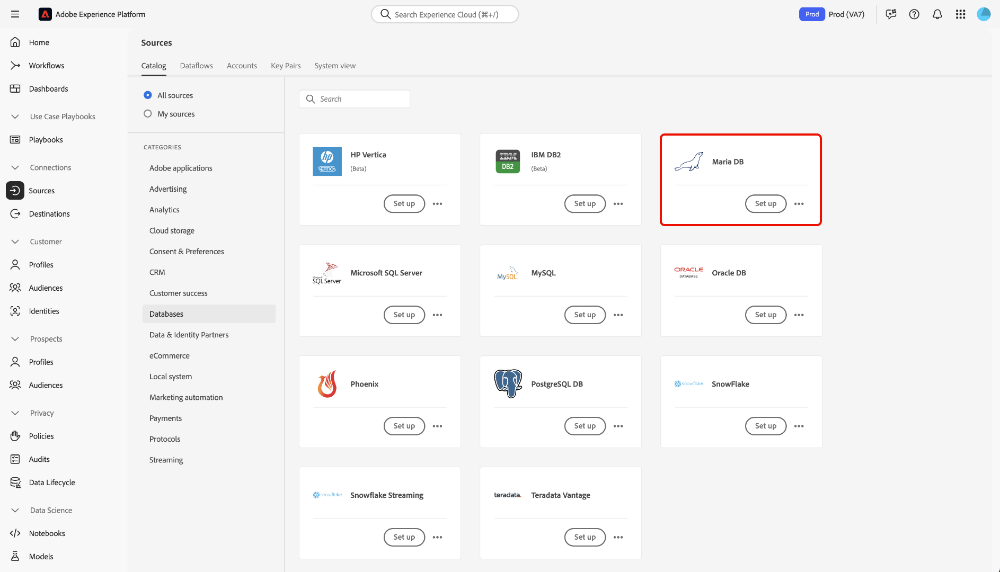

# Connexion d’[!DNL MariaDB] à Experience Platform à l’aide de l’interface utilisateur

Lisez ce guide pour savoir comment connecter votre compte [!DNL MariaDB] à Adobe Experience Platform à l’aide de l’espace de travail des sources dans l’interface utilisateur d’Experience Platform.

## Prise en main

Ce tutoriel nécessite une compréhension du fonctionnement des composants suivants d’Adobe Experience Platform : 

* [[!DNL Experience Data Model (XDM)] Système](../../../../../xdm/home.md) : Cadre normalisé selon lequel Experience Platform organise les données d’expérience client. 
   * [Principes de base de la composition des schémas](../../../../../xdm/schema/composition.md) : découvrez les blocs de création de base des schémas XDM, y compris les principes clés et les bonnes pratiques en matière de composition de schémas.
   * [Tutoriel sur l’éditeur de schémas](../../../../../xdm/tutorials/create-schema-ui.md) : découvrez comment créer des schémas personnalisés à l’aide de l’interface utilisateur de l’éditeur de schémas.
* [Profil client en temps réel](../../../../../profile/home.md) : fournit un profil client en temps réel unifié basé sur des données agrégées issues de plusieurs sources.

Si vous disposez déjà d’une connexion [!DNL MariaDB], vous pouvez ignorer le reste de ce document et passer au tutoriel sur la [configuration d’un flux de données](../../dataflow/databases.md).

### Collecter les informations d’identification requises

Lisez la [[!DNL MariaDB] présentation](../../../../connectors/databases/mariadb.md#prerequisites) pour plus d’informations sur l’authentification.

## Parcourir le catalogue des sources

Dans l’interface utilisateur d’Experience Platform, sélectionnez **[!UICONTROL Sources]** dans le volet de navigation de gauche pour accéder à l’espace de travail *[!UICONTROL Sources]*. Sélectionnez la catégorie appropriée dans le panneau *[!UICONTROL Catégories]*. Vous pouvez également utiliser la barre de recherche pour accéder à la source spécifique que vous souhaitez utiliser.

Pour utiliser [!DNL MariaDB], sélectionnez la carte source **[!UICONTROL MariaDB]** sous *[!UICONTROL Bases de données]*, puis sélectionnez **[!UICONTROL Configurer]**.

>[!TIP]
>
>Les sources du catalogue affichent l’option **[!UICONTROL Configurer]** lorsqu’une source donnée ne dispose pas encore d’un compte authentifié. Une fois un compte authentifié créé, cette option devient **[!UICONTROL Ajouter des données]**.

## Utiliser un compte existant {#existing}

Pour utiliser un compte existant, sélectionnez **[!UICONTROL Compte existant]** puis sélectionnez le compte [!DNL MariaDB] à utiliser.

## Créer un nouveau compte {#create}

Si vous ne disposez pas d’un compte existant, vous devez créer un compte en fournissant les informations d’authentification nécessaires qui correspondent à votre source.

Pour créer un compte, sélectionnez **[!UICONTROL Nouveau compte]** puis indiquez un nom et éventuellement ajoutez une description pour votre compte.

### Se connecter à Experience Platform sur Azure {#azure}

Vous pouvez connecter votre compte [!DNL MariaDB] à Experience Platform sur Azure à l’aide de la clé de compte ou de l’authentification de base.

>[!BEGINTABS]

>[!TAB Authentification de la clé de compte]

Pour utiliser l’authentification par clé de compte, sélectionnez **[!UICONTROL Authentification par clé de compte]**, fournissez votre [chaîne de connexion](../../../../connectors/databases/mariadb.md#azure), puis sélectionnez **[!UICONTROL Se connecter à la source]**.

>[!TAB  Authentification de base ]

Pour utiliser l’authentification de base, sélectionnez **[!UICONTROL Authentification de base]**, indiquez les valeurs de vos [informations d’authentification](../../../../connectors/databases/mariadb.md#azure), puis sélectionnez **[!UICONTROL Se connecter à la source]**.

>[!ENDTABS]

### Connexion à Experience Platform sur Amazon Web Services (AWS) {#aws}

>[!AVAILABILITY]
>
>Cette section s’applique aux implémentations d’Experience Platform s’exécutant sur Amazon Web Services (AWS). Experience Platform s’exécutant sur AWS est actuellement disponible pour un nombre limité de clients. Pour en savoir plus sur l’infrastructure Experience Platform prise en charge, consultez la [présentation multi-cloud d’Experience Platform](../../../../../landing/multi-cloud.md).

Pour créer un compte [!DNL MariaDB] et vous connecter à Experience Platform sur AWS, vérifiez que vous vous trouvez dans un sandbox VA6, puis fournissez les informations d’identification [nécessaires pour l’authentification](../../../../connectors/databases/mariadb.md#aws).

## Étapes suivantes

En suivant ce tutoriel, vous avez établi une connexion à votre compte [!DNL MariaDB]. Vous pouvez maintenant passer au tutoriel suivant et [configurer un flux de données pour importer des données dans Experience Platform](../../dataflow/databases.md).
