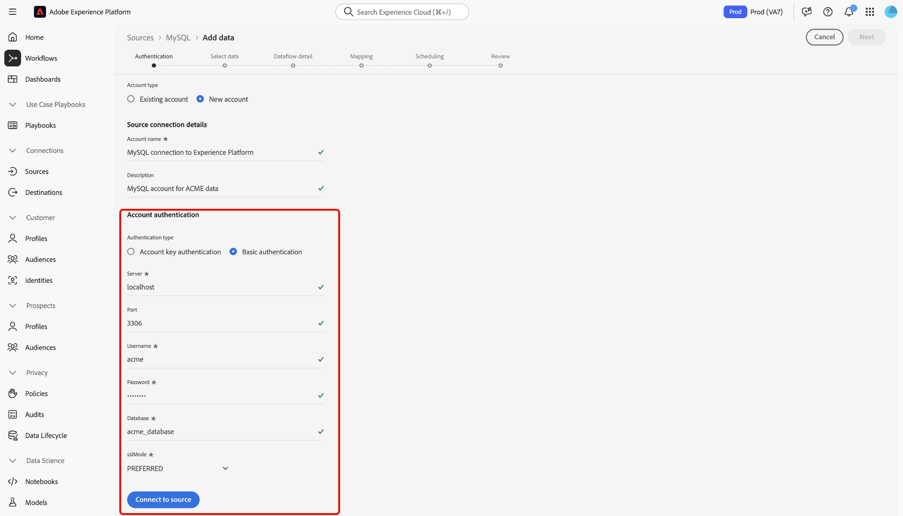

# Créer une connexion source [!DNL MySQL] dans l’interface utilisateur

Lisez ce guide pour savoir comment connecter votre base de données [!DNL MySQL] à Adobe Experience Platform à l’aide de l’espace de travail des sources dans l’interface utilisateur d’Experience Platform.

## Prise en main

Ce tutoriel nécessite une compréhension du fonctionnement des composants suivants d’Adobe Experience Platform :

* [[!DNL Experience Data Model (XDM)] Système](../../../../../xdm/home.md) : Cadre normalisé selon lequel Experience Platform organise les données d’expérience client. 
   * [Principes de base de la composition des schémas](../../../../../xdm/schema/composition.md) : découvrez les blocs de création de base des schémas XDM, y compris les principes clés et les bonnes pratiques en matière de composition de schémas.
   * [Tutoriel sur l’éditeur de schémas](../../../../../xdm/tutorials/create-schema-ui.md) : découvrez comment créer des schémas personnalisés à l’aide de l’interface utilisateur de l’éditeur de schémas.
* [[!DNL Real-Time Customer Profile]](../../../../../profile/home.md) : fournit un profil de consommateur unifié en temps réel, basé sur des données agrégées provenant de plusieurs sources.

Si vous disposez déjà d’une connexion [!DNL MySQL], vous pouvez ignorer le reste de ce document et passer au tutoriel sur la [configuration d’un flux de données](../../dataflow/databases.md).

### Collecter les informations d’identification requises

Lisez la [[!DNL MySQL] présentation](../../../../connectors/databases/mysql.md#prerequisites) pour plus d’informations sur l’authentification.

## Parcourir le catalogue des sources

Dans l’interface utilisateur d’Experience Platform, sélectionnez **[!UICONTROL Sources]** dans le volet de navigation de gauche pour accéder à l’espace de travail *[!UICONTROL Sources]*. Choisissez une catégorie ou utilisez la barre de recherche pour trouver votre source.

Pour vous connecter à [!DNL MySQL], accédez à la catégorie *[!UICONTROL Bases de données]*, sélectionnez la vignette source **[!UICONTROL MySQL]**, puis sélectionnez **[!UICONTROL Configurer]**.

>[!TIP]
>
>Les sources du catalogue affichent l’option **[!UICONTROL Configurer]** lorsqu’une source donnée ne dispose pas encore d’un compte authentifié. Une fois un compte authentifié créé, cette option devient **[!UICONTROL Ajouter des données]**.

## Utiliser un compte existant {#existing}

Pour utiliser un compte existant, sélectionnez **[!UICONTROL Compte existant]** puis sélectionnez le compte [!DNL MySQL] à utiliser.

## Créer un nouveau compte {#new}

Pour créer un compte, sélectionnez **[!UICONTROL Nouveau compte]** puis indiquez un nom et éventuellement ajoutez une description pour votre compte.

### Se connecter à Experience Platform sur Azure {#azure}

Vous pouvez connecter votre base de données [!DNL MySQL] à Experience Platform sur Azure à l’aide de la clé de compte ou de l’authentification de base.

>[!BEGINTABS]

>[!TAB Authentification de la clé de compte]

Pour utiliser l’authentification par clé de compte, sélectionnez **[!UICONTROL Authentification par clé de compte]**, fournissez votre [chaîne de connexion](../../../../connectors/databases/mysql.md#azure), puis sélectionnez **[!UICONTROL Se connecter à la source]**.

>[!TAB  Authentification de base ]

Pour utiliser l’authentification de base, sélectionnez **[!UICONTROL Authentification de base]**, indiquez les valeurs de vos [informations d’authentification](../../../../connectors/databases/mysql.md#azure), puis sélectionnez **[!UICONTROL Se connecter à la source]**.

>[!ENDTABS]

### Connexion à Experience Platform sur Amazon Web Services (AWS) {#aws}

>[!AVAILABILITY]
>
>Cette section s’applique aux implémentations d’Experience Platform s’exécutant sur Amazon Web Services (AWS). Experience Platform s’exécutant sur AWS est actuellement disponible pour un nombre limité de clients. Pour en savoir plus sur l’infrastructure Experience Platform prise en charge, consultez la [présentation multi-cloud d’Experience Platform](../../../../../landing/multi-cloud.md).

Pour créer un compte [!DNL MySQL] et vous connecter à Experience Platform sur AWS, vérifiez que vous vous trouvez dans un sandbox VA6, puis fournissez les informations d’identification [nécessaires pour l’authentification](../../../../connectors/databases/mysql.md#aws).

## Créer un flux de données pour les données [!DNL MySQL]

Maintenant que vous avez correctement connecté votre base de données [!DNL MySQL], vous pouvez [créer un flux de données et ingérer les données de votre base de données dans Experience Platform](../../dataflow/databases.md).
