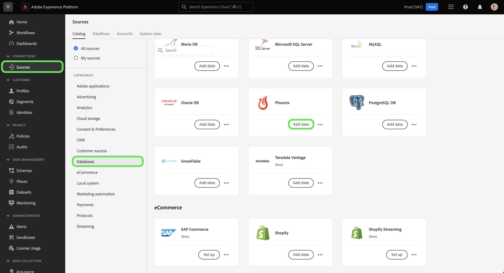

# Création d’un connecteur source Phoenix dans l’interface utilisateur

> [!NOTE]
> Le connecteur Phoenix est en version bêta. Les fonctionnalités et la documentation peuvent être modifiées.

Les connecteurs source d’Adobe Experience Platform permettent d’importer des données provenant de l’extérieur sur une base planifiée. Ce didacticiel décrit les étapes à suivre pour créer un connecteur source Phoenix à l’aide de l’interface utilisateur de la plate-forme.

## Prise en main

Ce didacticiel nécessite une compréhension pratique des composants suivants d’Adobe Experience Platform :

* [Système](../../../../../xdm/home.md)de modèle de données d’expérience (XDM) : Cadre normalisé selon lequel la plate-forme d’expérience organise les données d’expérience client.
   * [Principes de base de la composition](../../../../../xdm/schema/composition.md)des schémas : Découvrez les éléments de base des schémas XDM, y compris les principes clés et les meilleures pratiques en matière de composition des schémas.
   * [Didacticiel](../../../../../xdm/tutorials/create-schema-ui.md)sur l’éditeur de Schéma : Découvrez comment créer des schémas personnalisés à l’aide de l’interface utilisateur de l’éditeur de Schémas.
* [Profil](../../../../../profile/home.md)client en temps réel : Fournit un profil de consommation unifié en temps réel basé sur des données agrégées provenant de plusieurs sources.

Si vous disposez déjà d&#39;une connexion Phoenix valide, vous pouvez ignorer le reste de ce document et passer au didacticiel sur la [configuration d&#39;un flux de données](../../dataflow/databases.md)

### Collecte des informations d’identification requises

Pour accéder à votre compte Phoenix sur Platform, vous devez fournir les valeurs suivantes :

| Informations d’identification | Description |
| ---------- | ----------- |
| `host` | Adresse IP ou nom d’hôte du serveur Phoenix. |
| `port` | port TCP utilisé par le serveur Phoenix pour écouter les connexions client. Si vous vous connectez à Azure HDInsights, spécifiez le port 443. |
| `httpPath` | URL partielle correspondant au serveur Phoenix. Spécifiez /hbasephoenix0 si vous utilisez la grappe Azure HDInsights. |
| `username` | Nom d’utilisateur utilisé pour accéder au serveur Phoenix. |
| `password` | Mot de passe correspondant à l’utilisateur. |
| `enableSsl` | Bascule qui spécifie si les connexions au serveur sont chiffrées à l’aide de SSL. |

Pour plus d&#39;informations sur la prise en main, consultez [ce document](https://python-phoenixdb.readthedocs.io/en/latest/api.html)Phoenix.

## Connecter votre compte Phoenix

Une fois que vous avez rassemblé les informations d’identification requises, vous pouvez suivre les étapes ci-dessous pour créer un nouveau compte Phoenix afin de vous connecter à Platform.

Connectez-vous à <a href="https://platform.adobe.com" target="_blank">Adobe Experience Platform</a> , puis sélectionnez **Sources** dans la barre de navigation de gauche pour accéder à l’espace de travail *Sources* . L’écran *Catalogue* affiche diverses sources pour lesquelles vous pouvez créer un compte entrant et chaque source affiche le nombre de comptes et de flux de jeux de données existants qui lui sont associés.

Vous pouvez sélectionner la catégorie appropriée dans le catalogue sur le côté gauche de l’écran. Vous pouvez également trouver la source spécifique avec laquelle vous souhaitez travailler à l’aide de l’option de recherche.

Sous la catégorie *Bases de données* , sélectionnez **Phoenix** pour afficher une barre d&#39;informations sur la droite de votre écran. La barre d’informations fournit une brève description de la source sélectionnée ainsi que des options permettant de se connecter à la source ou à la vue de sa documentation. Pour créer une connexion entrante, sélectionnez **Connexion source**.

La page *Se connecter à Phoenix* s&#39;affiche. Sur cette page, vous pouvez utiliser de nouvelles informations d’identification ou des informations d’identification existantes.

### Nouveau compte

Si vous utilisez de nouvelles informations d’identification, sélectionnez **Nouveau compte**. Dans le formulaire d’entrée qui s’affiche, indiquez le nom de la connexion, une description facultative et vos informations d’identification Phoenix. Lorsque vous avez terminé, sélectionnez **Se connecter** , puis accordez un certain temps à l’établissement du nouveau compte.

### Compte existant

Pour connecter un compte existant, sélectionnez le compte Phoenix avec lequel vous souhaitez vous connecter, puis sélectionnez **Suivant** pour continuer.

## Étapes suivantes

En suivant ce tutoriel, vous avez établi une connexion à votre compte Phoenix. Vous pouvez maintenant passer au didacticiel suivant et [configurer un flux de données pour importer des données dans la plate-forme](../../dataflow/databases.md).