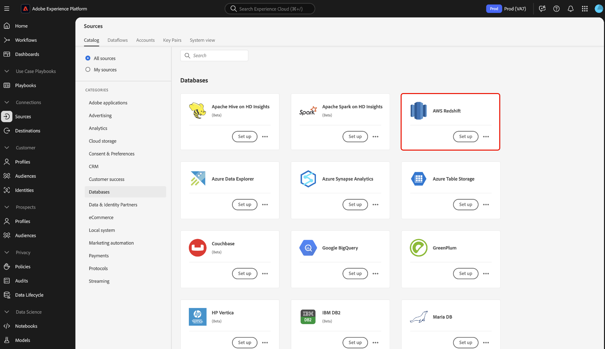
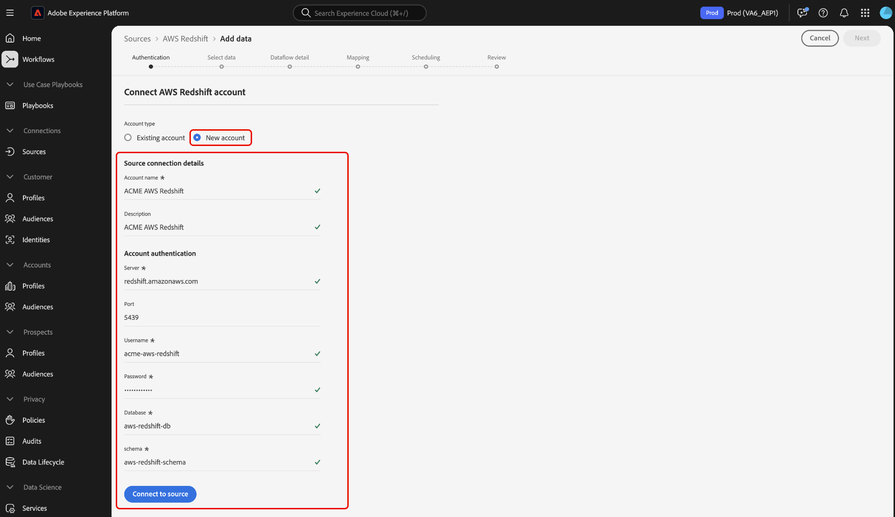

# Connexion d’[!DNL AWS Redshift] à Experience Platform à l’aide de l’interface utilisateur

>[!IMPORTANT]
>
>La source [!DNL AWS Redshift] est disponible dans le catalogue des sources pour les utilisateurs qui ont acheté Real-Time Customer Data Platform Ultimate.

Lisez ce guide pour savoir comment connecter votre compte [!DNL AWS Redshift] à Adobe Experience Platform à l’aide de l’interface utilisateur.

## Prise en main

Ce tutoriel nécessite une compréhension du fonctionnement des composants suivants d’Adobe Experience Platform : 

- [[!DNL Experience Data Model (XDM)] Système](../../../../../xdm/home.md) : Cadre normalisé selon lequel Experience Platform organise les données d’expérience client. 
   - [Principes de base de la composition des schémas](../../../../../xdm/schema/composition.md) : découvrez les blocs de création de base des schémas XDM, y compris les principes clés et les bonnes pratiques en matière de composition de schémas.
   - [Tutoriel sur l’éditeur de schémas](../../../../../xdm/tutorials/create-schema-ui.md) : découvrez comment créer des schémas personnalisés à l’aide de l’interface utilisateur de l’éditeur de schémas.
- [[!DNL Real-Time Customer Profile]](../../../../../profile/home.md) : fournit un profil de consommateur unifié en temps réel, basé sur des données agrégées provenant de plusieurs sources.

Si vous disposez déjà d’une connexion [!DNL AWS Redshift] valide, vous pouvez ignorer le reste de ce document et passer au tutoriel sur la [configuration d’un flux de données](../../dataflow/databases.md).

## Parcourir le catalogue des sources

Dans l’interface utilisateur de Platform, sélectionnez **[!UICONTROL Sources]** dans le volet de navigation de gauche pour accéder à l’espace de travail [!UICONTROL Sources]. Vous pouvez sélectionner la catégorie appropriée dans le catalogue sur le côté gauche de votre écran. Vous pouvez également trouver la source spécifique à utiliser à l’aide de l’option de recherche.

Sélectionnez **[!DNL AWS Redshift]** sous la catégorie *[!UICONTROL Bases de données]*, puis sélectionnez **[!UICONTROL Configurer]**.

>[!TIP]
>
>Les sources du catalogue affichent l’option **[!UICONTROL Configurer]** lorsqu’une source donnée ne dispose pas encore d’un compte authentifié. Une fois qu’un compte authentifié existe, cette option devient **[!UICONTROL Ajouter des données]**.

## Utiliser un compte existant {#existing}

Ensuite, vous passez à l’étape d’authentification du workflow des sources. Ici, vous pouvez utiliser un compte existant ou en créer un nouveau.

Pour utiliser un compte existant, sélectionnez le compte [!DNL AWS Redshift] dans le répertoire des comptes, puis sélectionnez **[!UICONTROL Suivant]** pour continuer.

## Créer un nouveau compte {#create}

Si vous ne disposez pas d’un compte existant, vous devez créer un compte en fournissant les informations d’authentification nécessaires qui correspondent à votre source.

Pour créer un compte, sélectionnez **[!UICONTROL Nouveau compte]** puis indiquez un nom et éventuellement ajoutez une description pour votre compte.

### Se connecter à Experience Platform sur Azure {#azure}

Pour connecter votre compte [!DNL AWS Redshift] à Experience Platform sur Azure, fournissez vos informations d’authentification dans le formulaire de saisie, puis sélectionnez **([!UICONTROL Se connecter à la source])**.

| Informations d’identification | Description |
| --- | --- |
| Serveur | Nom du serveur de votre instance [!DNL AWS Redshift]. |
| Port | Port TCP utilisé par un serveur [!DNL AWS Redshift] pour écouter les connexions client. |
| Nom d’utilisateur | Nom d’utilisateur du compte auquel vous souhaitez donner accès. |
| Mot de passe | Mot de passe correspondant au compte utilisateur. |
| Base de données | Base de données [!DNL AWS Redshift] à partir de laquelle les données doivent être récupérées. |

Pour plus d’informations sur la prise en main, consultez [ce [!DNL AWS Redshift] document](https://docs.aws.amazon.com/redshift/latest/gsg/new-user-serverless.html).

### Connexion à Experience Platform sur AWS {#aws}

>[!AVAILABILITY]
>
>Cette section s’applique aux implémentations d’Experience Platform s’exécutant sur AWS Web Services (AWS). Experience Platform s’exécutant sur AWS est actuellement disponible pour un nombre limité de clients. Pour en savoir plus sur l’infrastructure Experience Platform prise en charge, consultez la [présentation multi-cloud d’Experience Platform](../../../../../landing/multi-cloud.md).

Pour créer un compte [!DNL AWS Redshift] et vous connecter à Experience Platform sur AWS, vérifiez que vous êtes dans un sandbox VA6, fournissez les informations d’identification nécessaires pour l’authentification, puis sélectionnez **[!UICONTROL Se connecter à la source]**.

| Informations d’identification | Description |
| --- | --- |
| Serveur | Nom du serveur de votre instance [!DNL AWS Redshift]. |
| Port | Port TCP utilisé par un serveur [!DNL AWS Redshift] pour écouter les connexions client. |
| Nom d’utilisateur | Nom d’utilisateur du compte auquel vous souhaitez donner accès. |
| Mot de passe | Mot de passe correspondant au compte utilisateur. |
| Base de données | Base de données [!DNL AWS Redshift] à partir de laquelle les données doivent être récupérées. |
| Schéma | Nom du schéma associé à votre base de données [!DNL AWS Redshift]. Vous devez vous assurer que l’utilisateur auquel vous souhaitez accorder l’accès à la base de données a également accès à ce schéma. |

Pour plus d’informations sur la prise en main, consultez [ce [!DNL AWS Redshift] document](https://docs.aws.amazon.com/redshift/latest/gsg/new-user-serverless.html).

## Étapes suivantes

Ce tutoriel vous a permis d’établir une connexion entre votre base de données [!DNL AWS Redshift] et Experience Platform. Vous pouvez maintenant passer au tutoriel suivant et [créer un flux de données pour ingérer des données de votre base de données vers Experience Platform](../../dataflow/databases.md).