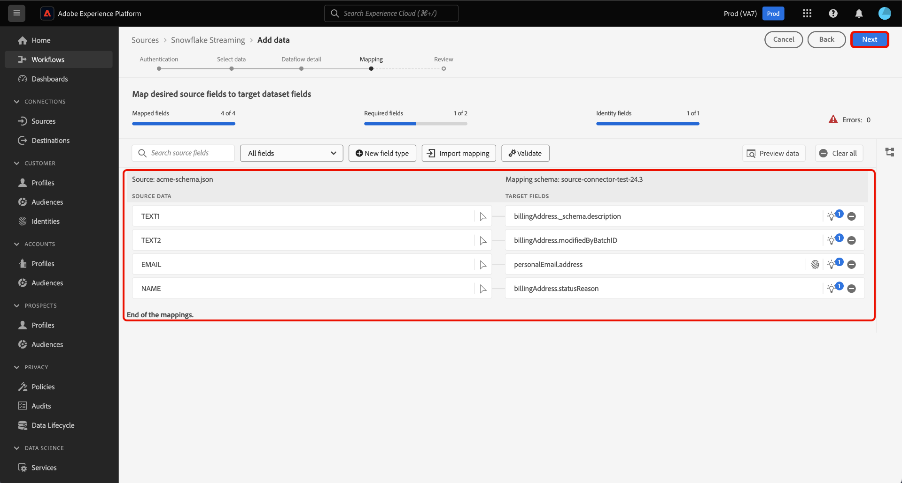

# Diffusez des données depuis votre [!DNL Snowflake] base de données à Experience Platform à l’aide de l’interface utilisateur

Découvrez comment utiliser l’interface utilisateur pour diffuser des données depuis votre [!DNL Snowflake] vers Adobe Experience Platform en suivant ce guide.

## Commencer

Ce tutoriel nécessite une compréhension du fonctionnement des composants suivants d’Adobe Experience Platform : 

* [[!DNL Experience Data Model (XDM)] Système](../../../../../xdm/home.md) : le cadre normalisé en fonction duquel [!DNL Experience Platform] organise les données d’expérience client.
   * [Principes de base de la composition des schémas](../../../../../xdm/schema/composition.md) : découvrez les blocs de création de base des schémas XDM, y compris les principes clés et les bonnes pratiques en matière de composition de schémas.
   * [Tutoriel sur l’éditeur de schémas](../../../../../xdm/tutorials/create-schema-ui.md) : découvrez comment créer des schémas personnalisés à l’aide de l’interface utilisateur de l’éditeur de schémas.
* [[!DNL Real-Time Customer Profile]](../../../../../profile/home.md) : fournit un profil de consommateur unifié en temps réel, basé sur des données agrégées provenant de plusieurs sources.

### Authentification

Lisez le guide sur [configuration requise [!DNL Snowflake] données en flux continu](../../../../connectors/databases/snowflake-streaming.md) pour plus d’informations sur les étapes à suivre avant d’ingérer des données en continu à partir de [!DNL Snowflake] à Experience Platform.

## Utilisez la variable [!DNL Snowflake Streaming] source à diffuser [!DNL Snowflake] données à l’Experience Platform

Dans l’interface utilisateur de Platform, sélectionnez **[!UICONTROL Sources]** dans le volet de navigation de gauche pour accéder à l’espace de travail [!UICONTROL Sources]. Vous pouvez sélectionner la catégorie appropriée dans le catalogue sur le côté gauche de votre écran. Vous pouvez également trouver la source spécifique à utiliser à l’aide de l’option de recherche.

Sous , *Bases de données* catégorie, sélectionnez **[!DNL Snowflake Streaming]**, puis sélectionnez **[!UICONTROL Ajouter des données]**.

>[!TIP]
>
>Les sources qui n’ont pas de compte authentifié dans le catalogue de sources affichent le **[!UICONTROL Configuration]** . Une fois qu’un compte authentifié existe, cette option devient **[!UICONTROL Ajouter des données]**.

La variable **[!UICONTROL Connexion au compte de diffusion en continu de Snowflake]** s’affiche. Sur cette page, vous pouvez utiliser des informations d’identification nouvelles ou existantes.

>[!BEGINTABS]

>[!TAB Création d’un compte]

Pour créer un compte, sélectionnez **[!UICONTROL Nouveau compte]** et indiquez un nom, une description facultative et vos informations d’identification.

Lorsque vous avez terminé, sélectionnez **[!UICONTROL Se connecter à la source]** puis attendez que la nouvelle connexion s’établisse.

| Informations d’identification | Description |
| --- | --- |
| Compte | Le nom de votre [!DNL Snowflake] compte . |
| Entrepôt | Le nom de votre [!DNL Snowflake] entrepôt. Les entrepôts gèrent l’exécution des requêtes dans [!DNL Snowflake]. Chaque [!DNL Snowflake] l’entrepôt est indépendant l’un de l’autre et doit être accessible individuellement pour importer des données dans Experience Platform. |
| Base de données | Le nom de votre [!DNL Snowflake] base de données. La base de données contient les données que vous souhaitez importer dans Experience Platform. |
| Schéma | (Facultatif) Le schéma de base de données associé à votre [!DNL Snowflake] compte . |
| Nom d’utilisateur | Le nom d’utilisateur de votre [!DNL Snowflake] compte . |
| Mot de passe | Le mot de passe de votre [!DNL Snowflake] compte . |
| Rôle | (Facultatif) Rôle personnalisé pouvant être fourni à un utilisateur pour une connexion donnée. Si elle n’est pas fournie, cette valeur est définie par défaut sur `public`. |

Pour plus d’informations sur la création de compte, consultez la section sur [configuration des paramètres des rôles](../../../../connectors/databases/snowflake-streaming.md#configure-role-settings) dans le [!DNL Snowflake Streaming] aperçu.

>[!TAB Utiliser un compte existant]

Pour utiliser un compte existant, sélectionnez **[!UICONTROL Compte existant]** puis sélectionnez le compte de votre choix dans le catalogue de comptes existant.

Cliquez sur **[!UICONTROL Suivant]** pour continuer.

>[!ENDTABS]

## Sélectionner les données {#select-data}

>[!IMPORTANT]
>
>Une colonne d’horodatage doit exister dans votre table source pour qu’un flux de données en continu soit créé. L’horodatage est requis pour que l’Experience Platform sache quand les données seront ingérées et quand les données incrémentielles seront diffusées. Vous pouvez ajouter rétroactivement une colonne d’horodatage pour une connexion existante et créer un nouveau flux de données.

L’étape [!UICONTROL Sélectionner des données] apparaît. Au cours de cette étape, vous devez sélectionner les données à importer dans Experience Platform, configurer les horodatages et les fuseaux horaires, puis fournir un exemple de fichier de données source pour l’ingestion de données brutes.

Utilisez le répertoire de la base de données situé à gauche de l&#39;écran et sélectionnez la table à importer dans Experience Platform.

Sélectionnez ensuite le type de colonne d’horodatage de votre tableau. Vous pouvez choisir entre deux types de colonnes d’horodatage : `TIMESTAMP_NTZ` ou  `TIMESTAMP_LTZ`. Si vous sélectionnez un type de colonne : `TIMESTAMP_NTZ`, vous devez également fournir un fuseau horaire. Vos colonnes doivent avoir une contrainte non nulle. Pour plus d’informations, consultez la section sur [limites et questions fréquentes]

Vous pouvez également configurer les paramètres de renvoi au cours de cette étape. Le renvoi détermine les données ingérées initialement. Si le renvoi est activé, tous les fichiers actuels du chemin spécifié seront ingérés lors de la première ingestion planifiée. Dans le cas contraire, seuls les fichiers chargés entre la première exécution de l’ingestion et l’heure de début seront ingérés. Les fichiers chargés avant l’heure de début ne seront pas ingérés.

Sélectionnez la variable **[!UICONTROL Renvoi]** bascule pour activer le renvoi.

Enfin, sélectionnez **[!UICONTROL Choisir le fichier]** pour charger un exemple de données source afin de créer le jeu de mappages, qui sera utilisé ultérieurement pour mapper vos données d’origine au modèle de données d’expérience (XDM).

Lorsque vous avez terminé, sélectionnez **[!UICONTROL Suivant]** pour continuer.

## Fournir des détails sur les jeux de données et les flux de données {#provide-dataset-and-dataflow-details}

Ensuite, vous devez fournir des informations sur votre jeu de données et votre flux de données.

### Informations sur le jeu de données {#dataset-details}

Un jeu de données est une structure de stockage et de gestion pour une collection de données, généralement sous la forme d’un tableau, qui contient un schéma (des colonnes) et des champs (des lignes). Les données correctement ingérées dans Experience Platform sont conservées en tant que jeux de données dans le lac de données. Au cours de cette étape, vous pouvez créer un nouveau jeu de données ou utiliser un jeu de données existant.

>[!BEGINTABS]

>[!TAB Utiliser un nouveau jeu de données]

Pour utiliser un nouveau jeu de données, sélectionnez **[!UICONTROL Nouveau jeu de données]**, puis fournissez un nom et une description facultative de votre jeu de données. Vous devez également sélectionner un schéma de modèle de données d’expérience (XDM) auquel votre jeu de données adhère.

| Détails du nouveau jeu de données | Description |
| --- | --- |
| Nom du jeu de données de sortie | Nom de votre nouveau jeu de données. |
| Description | (Facultatif) Aperçu rapide du nouveau jeu de données. |
| Schéma | Liste déroulante des schémas qui existent dans votre organisation. Vous pouvez également créer votre propre schéma avant le processus de configuration de la source. Pour plus d’informations, consultez le guide sur [création d’un schéma XDM dans l’interface utilisateur](../../../../../xdm/tutorials/create-schema-ui.md). |

>[!TAB Utiliser un jeu de données existant]

Si vous disposez déjà d’un jeu de données, sélectionnez **[!UICONTROL Jeu de données existant]** puis utilisez la fonction **[!UICONTROL Recherche avancée]** pour afficher une fenêtre de tous les jeux de données de votre organisation, y compris leurs détails respectifs, comme s’ils sont activés pour l’ingestion dans Real-time Customer Profile.

>[!ENDTABS]

+++Sélectionnez les étapes à suivre pour activer l’ingestion du profil, les diagnostics d’erreur et l’ingestion partielle.

Si votre jeu de données est activé pour Real-time Customer Profile, vous pouvez basculer au cours de cette étape. **[!UICONTROL Jeu de données de profil]** pour activer vos données pour l’ingestion par profils. Vous pouvez également utiliser cette étape pour activer **[!UICONTROL Diagnostics d’erreur]** et **[!UICONTROL Ingestion partielle]**.

* **[!UICONTROL Diagnostics d’erreur]**: sélectionnez **[!UICONTROL Diagnostics d’erreur]** pour demander à la source de produire des diagnostics d’erreur que vous pourrez ensuite référencer lors de la surveillance de l’activité et de l’état de votre jeu de données.
* **[!UICONTROL Ingestion partielle]**: l’ingestion par lots partielle permet d’ingérer des données contenant des erreurs, jusqu’à un certain seuil configurable. Cette fonctionnalité vous permet d’ingérer toutes vos données précises dans Experience Platform, tandis que toutes vos données incorrectes sont traitées par lots séparément avec des informations sur les raisons de leur non-validité.

+++

### Détails du flux de données {#dataflow-details}

Une fois votre jeu de données configuré, vous devez fournir des détails sur votre flux de données, y compris un nom, une description facultative et des configurations d’alerte.

| Configurations de flux de données | Description |
| --- | --- |
| Nom du flux de données | Nom du flux de données.  Par défaut, le nom du fichier importé sera utilisé. |
| Description | (Facultatif) Une brève description de votre flux de données. |
| Alertes | Experience Platform peut produire des alertes basées sur des événements auxquelles les utilisateurs peuvent s’abonner. Ces options nécessitent un flux de données en cours d’exécution pour les déclencher. Pour plus d’informations, consultez la section [aperçu des alertes](../../alerts.md) <ul><li>**Démarrage de l’exécution du flux de données sources**: sélectionnez cette alerte pour recevoir une notification au début de l’exécution du flux de données.</li><li>**Réussite de l’exécution du flux de données sources**: sélectionnez cette alerte pour recevoir une notification si votre flux de données se termine sans erreur.</li><li>**Échec de l’exécution des flux de données sources**: sélectionnez cette alerte pour recevoir une notification si l’exécution de votre flux de données se termine en erreur.</li></ul> |

Lorsque vous avez terminé, sélectionnez **[!UICONTROL Suivant]** pour continuer.

## Mappage de champs à un schéma XDM {#mapping}

L’étape [!UICONTROL Mappage] apparaît. Utilisez l’interface de mappage pour mapper vos données source aux champs de schéma appropriés avant d’ingérer ces données dans Experience Platform, puis sélectionnez **[!UICONTROL Suivant]**. Pour obtenir un guide complet sur l’utilisation de l’interface de mappage, consultez la rubrique [Guide de l’interface utilisateur de la préparation de données](../../../../../data-prep/ui/mapping.md) pour plus d’informations.

## Vérifier le flux de données {#review}

La dernière étape du processus de création de flux de données consiste à passer en revue votre flux de données avant de l’exécuter. Utilisez la variable **[!UICONTROL Réviser]** pour consulter les détails de votre nouveau flux de données avant son exécution. Les détails sont regroupés dans les catégories suivantes :

* **Connexion**: indique le type de source, le chemin d’accès approprié du fichier source choisi et le nombre de colonnes dans ce fichier source.
* **Attribuer des champs de jeu de données et de mappage** : affiche le jeu de données dans lequel les données sources sont ingérées, y compris le schéma auquel le jeu de données se conforme.

Une fois que vous avez vérifié votre flux de données, sélectionnez **[!UICONTROL Terminer]** et patientez quelques instants le temps que le flux de données soit créé.

## Étapes suivantes

En suivant ce tutoriel, vous avez créé un flux de données en continu pour [!DNL Snowflake] data. Pour obtenir des ressources supplémentaires, consultez la documentation ci-dessous.

### Surveiller votre flux de données

Une fois votre flux de données créé, vous pouvez surveiller les données qui sont ingérées par celui-ci pour afficher des informations sur les taux d’ingestion, la réussite et les erreurs. Pour plus d’informations sur la surveillance des flux de données en continu, consultez le tutoriel sur [surveillance des flux de données en continu dans l’interface utilisateur](../../monitor-streaming.md).

### Mettre à jour votre flux de données

Pour mettre à jour les configurations de la planification, du mappage et des informations générales de vos flux de données, consultez le tutoriel sur [mise à jour des flux de données de sources dans l’interface utilisateur](../../update-dataflows.md).

### Supprimer le flux de données

Vous pouvez supprimer les flux de données qui ne sont plus nécessaires ou qui ont été créés de manière incorrecte à l’aide de la fonction **[!UICONTROL Supprimer]**, disponible dans l’espace de travail **[!UICONTROL Flux de données]**. Pour plus d’informations sur la suppression des flux de données, consultez le tutoriel sur [suppression de flux de données dans l’interface utilisateur](../../delete.md).