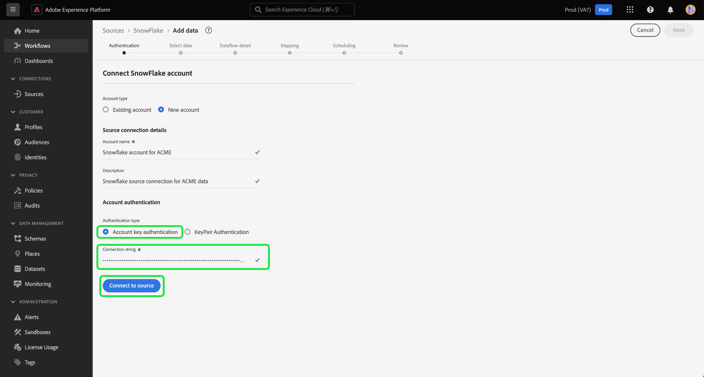

# Créer une connexion source [!DNL Snowflake] dans l’interface utilisateur

>[!IMPORTANT]
>
>La source [!DNL Snowflake] est disponible dans le catalogue des sources pour les utilisateurs qui ont acheté Real-Time Customer Data Platform Ultimate.

Ce tutoriel décrit les étapes de création d’un connecteur source [!DNL Snowflake] à l’aide de l’interface utilisateur de Adobe Experience Platform.

## Prise en main

Ce tutoriel nécessite une compréhension du fonctionnement des composants suivants d’Adobe Experience Platform : 

* [Sources ](../../../../home.md): [!DNL Experience Platform]permet d’ingérer des données provenant de diverses sources tout en vous offrant la possibilité de structurer, d’étiqueter et d’améliorer les données entrantes à l’aide des services [!DNL Platform].
* [Sandbox](../../../../../sandboxes/home.md) : [!DNL Experience Platform] fournit des sandbox virtuels qui divisent une instance [!DNL Platform] unique en environnements virtuels distincts pour favoriser le développement et l’évolution d’applications d’expérience digitale.

### Collecter les informations d’identification requises

Vous devez fournir des valeurs pour les propriétés d’identification suivantes pour authentifier votre source [!DNL Snowflake].

>[!BEGINTABS]

>[!TAB  Authentification par clé de compte ]

| Informations d’identification | Description |
| ---------- | ----------- |
| Compte | Un nom de compte identifie de manière unique un compte au sein de votre organisation. Dans ce cas, vous devez identifier de manière unique un compte parmi différentes organisations [!DNL Snowflake]. Pour ce faire, vous devez ajouter le nom de votre organisation en préfixe sur le nom du compte. Par exemple : `orgname-account_name`. Lisez le guide sur la [récupération de votre  [!DNL Snowflake] identifiant de compte](../../../../connectors/databases/snowflake.md#retrieve-your-account-identifier) pour plus d’informations. Pour plus d’informations, consultez la [[!DNL Snowflake] documentation](https://docs.snowflake.com/en/user-guide/admin-account-identifier#format-1-preferred-account-name-in-your-organization). |
| Entrepôt | L’entrepôt [!DNL Snowflake] gère le processus d’exécution de requête pour l’application. Chaque entrepôt [!DNL Snowflake] est indépendant l’un de l’autre et doit être accessible individuellement lors de la transmission de données à Platform. |
| Base de données | La base de données [!DNL Snowflake] contient les données que vous souhaitez importer dans Platform. |
| Nom d’utilisateur | Nom d’utilisateur du compte [!DNL Snowflake]. |
| Mot de passe | Mot de passe du compte utilisateur [!DNL Snowflake]. |
| Rôle | Rôle de contrôle d’accès par défaut à utiliser dans la session [!DNL Snowflake]. Le rôle doit être un rôle existant qui a déjà été attribué à l’utilisateur spécifié. Le rôle par défaut est `PUBLIC`. |
| Chaîne de connexion | Chaîne de connexion utilisée pour se connecter à votre instance [!DNL Snowflake]. Le modèle de chaîne de connexion pour [!DNL Snowflake] est `jdbc:snowflake://{ACCOUNT_NAME}.snowflakecomputing.com/?user={USERNAME}&password={PASSWORD}&db={DATABASE}&warehouse={WAREHOUSE}` |

>[!TAB Authentification par paire de clés]

Pour utiliser l’authentification par paire de clés, vous devez générer une paire de clés RSA 2 048 bits, puis fournir les valeurs suivantes lors de la création d’un compte pour votre source [!DNL Snowflake].

| Informations d’identification | Description |
| --- | --- |
| Compte | Un nom de compte identifie de manière unique un compte au sein de votre organisation. Dans ce cas, vous devez identifier de manière unique un compte parmi différentes organisations [!DNL Snowflake]. Pour ce faire, vous devez ajouter le nom de votre organisation en préfixe sur le nom du compte. Par exemple : `orgname-account_name`. Lisez le guide sur la [récupération de votre  [!DNL Snowflake] identifiant de compte](../../../../connectors/databases/snowflake.md#retrieve-your-account-identifier) pour plus d’informations. Pour plus d’informations, consultez la [[!DNL Snowflake] documentation](https://docs.snowflake.com/en/user-guide/admin-account-identifier#format-1-preferred-account-name-in-your-organization). |
| Nom d’utilisateur | Nom d’utilisateur de votre compte [!DNL Snowflake]. |
| Clé privée | La clé privée [!DNL Base64-] codée de votre compte [!DNL Snowflake]. Vous pouvez générer des clés privées chiffrées ou non chiffrées. Si vous utilisez une clé privée chiffrée, vous devez également fournir un mot de passe de clé privée lors de l’authentification par rapport à un Experience Platform. Pour plus d’informations, consultez le guide sur la [récupération de votre  [!DNL Snowflake] clé privée](../../../../connectors/databases/snowflake.md) . |
| Passphrase de clé privée | La phrase secrète de clé privée est une couche supplémentaire de sécurité que vous devez utiliser lors de l’authentification avec une clé privée chiffrée. Vous n’êtes pas tenu de fournir la phrase secrète si vous utilisez une clé privée non chiffrée. |
| Base de données | La base de données [!DNL Snowflake] qui contient les données que vous souhaitez ingérer à l’Experience Platform. |
| Entrepôt | L’entrepôt [!DNL Snowflake] gère le processus d’exécution de requête pour l’application. Chaque entrepôt [!DNL Snowflake] est indépendant l’un de l’autre et doit être accessible individuellement lors de la transmission de données à Platform. |

Pour plus d&#39;informations sur ces valeurs, consultez [ce document de Snowflake](https://docs.snowflake.com/en/user-guide/key-pair-auth.html).

>[!ENDTABS]

>[!NOTE]
>
>Vous devez définir l’indicateur `PREVENT_UNLOAD_TO_INLINE_URL` sur `FALSE` pour autoriser le déchargement des données de votre base de données [!DNL Snowflake] vers l’Experience Platform.

## Connexion à votre compte Snowflake

Dans l’interface utilisateur de Platform, sélectionnez **[!UICONTROL Sources]** dans le volet de navigation de gauche pour accéder à l’espace de travail [!UICONTROL Sources].

Vous pouvez sélectionner la catégorie appropriée dans le catalogue sur le côté gauche de votre écran. Vous pouvez également sélectionner la source de votre choix à l’aide de la barre de recherche.

Sous la catégorie [!UICONTROL Bases de données], sélectionnez **[!UICONTROL Snowflake]**, puis sélectionnez **[!UICONTROL Ajouter des données]**.

![Catalogue des sources avec [!DNL Snowflake] surligné.](../../../../images/tutorials/create/snowflake/catalog.png)

La page **[!UICONTROL Se connecter à Snowflake]** s’affiche. Sur cette page, vous pouvez utiliser de nouvelles informations d’identification ou des informations d’identification existantes.

### Compte existant

Pour utiliser un compte existant, sélectionnez le compte [!DNL Snowflake] auquel vous souhaitez vous connecter, puis sélectionnez **[!UICONTROL Suivant]** pour continuer.

### Nouveau compte

Pour créer un nouveau compte, sélectionnez **[!UICONTROL Nouveau compte]**, puis fournissez un nom et une description facultative de votre nouveau compte [!DNL Snowflake].

>[!BEGINTABS]

>[!TAB  Authentification par clé de compte ]

Pour utiliser l&#39;authentification par clé de compte, indiquez votre chaîne de connexion dans le formulaire de saisie, puis sélectionnez **[!UICONTROL Se connecter à la source]**.

>[!TAB Authentification par paire de clés]

Pour utiliser l’authentification par paire de clés, indiquez les valeurs de votre compte, nom d’utilisateur, clé privée, mot de passe de clé privée, base de données et entrepôt, puis sélectionnez **[!UICONTROL Se connecter à la source]**.

>[!ENDTABS]

### Ignorer l’aperçu des données d’exemple {#skip-preview-of-sample-data}

Au cours de l’étape de sélection des données, vous pouvez rencontrer un délai d’expiration lors de l’ingestion de tables volumineuses ou de fichiers de données. Vous pouvez ignorer l’aperçu des données pour contourner le délai d’expiration et tout en affichant votre schéma, bien que sans exemple de données. Pour ignorer l’aperçu des données, activez la bascule **[!UICONTROL Ignorer l’aperçu des données d’exemple]** .

Le reste du workflow restera le même. Le seul avertissement à retenir est que l’absence de prévisualisation des données peut empêcher la validation automatique des champs calculés et obligatoires lors de l’étape de mappage. Vous devrez ensuite valider manuellement ces champs lors du mappage.

## Étapes suivantes

En suivant ce tutoriel, vous avez établi une connexion à votre compte de Snowflake. Vous pouvez maintenant passer au tutoriel suivant et [configurer un flux de données pour importer des données dans [!DNL Platform]](../../dataflow/databases.md).
