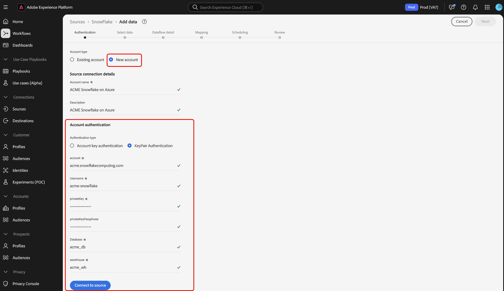

# Connexion d’[!DNL Snowflake] à Experience Platform à l’aide de l’interface utilisateur

>[!IMPORTANT]
>
>La source [!DNL Snowflake] est disponible dans le catalogue des sources pour les utilisateurs qui ont acheté Real-Time Customer Data Platform Ultimate.

Lisez ce guide pour savoir comment connecter votre compte [!DNL Snowflake] à Adobe Experience Platform à l’aide de l’interface utilisateur.

## Commencer

>[!WARNING]
>
>L’authentification de base (ou authentification par clé de compte) de la source [!DNL Snowflake] sera abandonnée en novembre 2025. Vous devez passer à l’authentification par paire de clés pour continuer à utiliser la source et à ingérer des données de votre base de données vers Experience Platform. Pour plus d’informations sur l’obsolescence, consultez le [[!DNL Snowflake] guide des bonnes pratiques sur la réduction des risques liés à la compromission des informations d’identification](https://www.snowflake.com/en/resources/white-paper/best-practices-to-mitigate-the-risk-of-credential-compromise/).

Ce tutoriel nécessite une compréhension du fonctionnement des composants suivants d’Adobe Experience Platform : 

* [Sources](../../../../home.md) : Experience Platform permet d’ingérer des données provenant de diverses sources tout en vous offrant la possibilité de structurer, d’étiqueter et d’améliorer les données entrantes à l’aide des services [!DNL Experience Platform].
* [Sandbox](../../../../../sandboxes/home.md) : Experience Platform fournit des sandbox virtuels qui divisent une instance Experience Platform unique en environnements virtuels distincts pour favoriser le développement et l’évolution d’applications d’expérience digitale.

>[!NOTE]
>
>Vous devez définir l’indicateur de `PREVENT_UNLOAD_TO_INLINE_URL` sur `FALSE` pour permettre le déchargement des données de votre base de données [!DNL Snowflake] vers Experience Platform.

## Parcourir le catalogue des sources {#navigate}

Dans l’interface utilisateur d’Experience Platform, sélectionnez **[!UICONTROL Sources]** dans le volet de navigation de gauche pour accéder à l’espace de travail [!UICONTROL Sources]. Vous pouvez sélectionner la catégorie appropriée dans le catalogue sur le côté gauche de votre écran. Vous pouvez également trouver la source spécifique à utiliser à l’aide de l’option de recherche.

Sélectionnez **[!DNL Snowflake]** sous la catégorie *[!UICONTROL Bases de données]*, puis sélectionnez **[!UICONTROL Configurer]**.

>[!TIP]
>
>Les sources du catalogue affichent l’option **[!UICONTROL Configurer]** lorsqu’une source donnée ne dispose pas encore d’un compte authentifié. Une fois qu’un compte authentifié existe, cette option devient **[!UICONTROL Ajouter des données]**.

## Utiliser un compte existant {#existing}

Ensuite, vous passez à l’étape d’authentification du workflow des sources. Ici, vous pouvez utiliser un compte existant ou en créer un nouveau.

Pour utiliser un compte existant, sélectionnez le compte [!DNL Snowflake] auquel vous souhaitez vous connecter, puis sélectionnez **[!UICONTROL Suivant]** pour continuer.

## Créer un nouveau compte {#create}

Si vous ne disposez pas d’un compte existant, vous devez créer un compte en fournissant les informations d’authentification nécessaires qui correspondent à votre source.

Pour créer un compte, sélectionnez **[!UICONTROL Nouveau compte]** puis indiquez un nom et éventuellement ajoutez une description pour votre compte.

### Se connecter à Experience Platform sur Azure {#azure}

Vous pouvez connecter votre compte [!DNL Snowflake] à Experience Platform sur Azure à l’aide de l’authentification par clé de compte ou de l’authentification par paire de clés.

>[!BEGINTABS]

>[!TAB Authentification de la clé de compte]

Pour utiliser l’authentification par clé de compte, sélectionnez **[!UICONTROL Authentification par clé de compte]**, fournissez votre chaîne de connexion dans le formulaire de saisie, puis sélectionnez **[!UICONTROL Se connecter à la source]**.

| Informations d’identification | Description |
| --- | --- |
| Compte | Un nom de compte identifie de manière unique un compte de votre organisation. Dans ce cas, vous devez identifier de manière unique un compte dans différentes organisations [!DNL Snowflake]. Pour ce faire, vous devez ajouter le nom de votre organisation au nom du compte. Par exemple : `orgname-account_name`. Lisez le guide sur la [récupération de l’identifiant  [!DNL Snowflake]  compte](../../../../connectors/databases/snowflake.md#retrieve-your-account-identifier) pour obtenir des conseils supplémentaires. Pour plus d’informations, consultez la [[!DNL Snowflake] documentation](https://docs.snowflake.com/en/user-guide/admin-account-identifier#format-1-preferred-account-name-in-your-organization). |
| Entrepôt de données | L’entrepôt de [!DNL Snowflake] gère le processus d’exécution de la requête pour l’application. Chaque entrepôt de [!DNL Snowflake] est indépendant les uns des autres et doit être accessible individuellement lors de l’importation de données dans Experience Platform. |
| Base de données | La base de données [!DNL Snowflake] contient les données que vous souhaitez importer dans Experience Platform. |
| Nom d’utilisateur | Nom d’utilisateur du compte [!DNL Snowflake]. |
| Mot de passe | Mot de passe du compte utilisateur [!DNL Snowflake]. |
| Rôle | Rôle de contrôle d’accès par défaut à utiliser dans la session [!DNL Snowflake]. Le rôle doit être un rôle existant qui a déjà été attribué à l’utilisateur spécifié. Le rôle par défaut est `PUBLIC`. |
| Chaîne de connexion | Chaîne de connexion utilisée pour la connexion à votre instance [!DNL Snowflake]. Le modèle de chaîne de connexion pour [!DNL Snowflake] est `jdbc:snowflake://{ACCOUNT_NAME}.snowflakecomputing.com/?user={USERNAME}&password={PASSWORD}&db={DATABASE}&warehouse={WAREHOUSE}` |

>[!TAB Authentification par paire de clés]

Pour utiliser l’authentification par paire de clés, sélectionnez **[!UICONTROL Authentification par paire de clés]**, indiquez les valeurs de votre compte, nom d’utilisateur, clé privée, phrase secrète de clé privée, base de données et entrepôt de données, puis sélectionnez **[!UICONTROL Se connecter à la source]**.

Avec l’authentification par paire de clés, vous devez générer une paire de clés RSA 2 048 bits, puis fournir les valeurs suivantes lors de la création d’un compte pour votre source [!DNL Snowflake].

| Informations d’identification | Description |
| --- | --- |
| Compte | Un nom de compte identifie de manière unique un compte de votre organisation. Dans ce cas, vous devez identifier de manière unique un compte dans différentes organisations [!DNL Snowflake]. Pour ce faire, vous devez ajouter le nom de votre organisation au nom du compte. Par exemple : `orgname-account_name`. Lisez le guide sur la [récupération de l’identifiant  [!DNL Snowflake]  compte](../../../../connectors/databases/snowflake.md#retrieve-your-account-identifier) pour obtenir des conseils supplémentaires. Pour plus d’informations, consultez la [[!DNL Snowflake] documentation](https://docs.snowflake.com/en/user-guide/admin-account-identifier#format-1-preferred-account-name-in-your-organization). |
| Nom d’utilisateur | Nom d’utilisateur de votre compte [!DNL Snowflake]. |
| Clé privée | Clé privée [!DNL Base64-]encodée) de votre compte [!DNL Snowflake]. Vous pouvez générer des clés privées chiffrées ou non chiffrées. Si vous utilisez une clé privée chiffrée, vous devez également fournir une phrase secrète de clé privée lors de l’authentification auprès d’Experience Platform. Pour plus d’informations, consultez le guide sur la [récupération  [!DNL Snowflake]  votre clé privée](../../../../connectors/databases/snowflake.md). |
| Phrase secrète de la clé privée | La phrase secrète de la clé privée est une couche de sécurité supplémentaire que vous devez utiliser lors de l’authentification avec une clé privée chiffrée. Vous n’êtes pas tenu de fournir la phrase secrète si vous utilisez une clé privée non chiffrée. |
| Base de données | Base de données [!DNL Snowflake] contenant les données à ingérer dans Experience Platform. |
| Entrepôt de données | L’entrepôt de [!DNL Snowflake] gère le processus d’exécution de la requête pour l’application. Chaque entrepôt de [!DNL Snowflake] est indépendant les uns des autres et doit être accessible individuellement lors de l’importation de données dans Experience Platform. |

Pour plus d’informations sur ces valeurs, consultez [ce document Snowflake](https://docs.snowflake.com/en/user-guide/key-pair-auth.html).

>[!ENDTABS]

### Connexion à Experience Platform sur AWS {#aws}

>[!AVAILABILITY]
>
>Cette section s’applique aux implémentations d’Experience Platform s’exécutant sur Amazon Web Services (AWS). Experience Platform s’exécutant sur AWS est actuellement disponible pour un nombre limité de clients. Pour en savoir plus sur l’infrastructure Experience Platform prise en charge, consultez la [présentation multi-cloud d’Experience Platform](../../../../../landing/multi-cloud.md).

Pour créer un compte [!DNL Snowflake] et vous connecter à Experience Platform sur AWS, vérifiez que vous vous trouvez dans un sandbox VA6, puis fournissez les informations d’identification nécessaires pour l’authentification.

>[!BEGINTABS]

>[!TAB Authentification par paire de clés]

Pour vous connecter à l’aide de paires de clés, sélectionnez **[!UICONTROL Authentification par paire de clés]**, fournissez vos informations d’authentification, puis sélectionnez **[!UICONTROL Se connecter à la source]**. Pour plus d’informations sur ces informations d’identification, consultez la [[!DNL Snowflake] présentation des lots](../../../../connectors/databases/snowflake.md#gather-required-credentials).

>[!TAB  Authentification de base ]

>[!WARNING]
>
>L’authentification de base (ou authentification par clé de compte) de la source [!DNL Snowflake] sera abandonnée en novembre 2025. Vous devez passer à l’authentification par paire de clés pour continuer à utiliser la source et à ingérer des données de votre base de données vers Experience Platform. Pour plus d’informations sur l’obsolescence, consultez le [[!DNL Snowflake] guide des bonnes pratiques sur la réduction des risques liés à la compromission des informations d’identification](https://www.snowflake.com/en/resources/white-paper/best-practices-to-mitigate-the-risk-of-credential-compromise/).

Pour vous connecter à l’aide d’une combinaison de nom d’utilisateur et de mot de passe, sélectionnez **[!UICONTROL Authentification de base]**, indiquez vos informations d’authentification, puis sélectionnez **[!UICONTROL Se connecter à la source]**. Pour plus d’informations sur ces informations d’identification, consultez la [[!DNL Snowflake] présentation des lots](../../../../connectors/databases/snowflake.md#gather-required-credentials).

>[!ENDTABS]

### Ignorer la prévisualisation des exemples de données {#skip-preview-of-sample-data}

Lors de l’étape de sélection des données, vous pouvez rencontrer un délai d’expiration lors de l’ingestion de tables ou de fichiers de données volumineux. Vous pouvez ignorer la prévisualisation des données pour contourner le délai d’expiration et continuer à afficher votre schéma, même s’il ne contient pas de données d’exemple. Pour ignorer la prévisualisation des données, activez le bouton (bascule) **[!UICONTROL Ignorer la prévisualisation des données d’exemple]**.

Le reste du workflow reste le même. Seul bémol : l’omission de l’aperçu des données peut empêcher la validation automatique des champs calculés et obligatoires lors de l’étape de mappage. Vous devrez ensuite valider manuellement ces champs pendant le mappage.

## Étapes suivantes

En suivant ce tutoriel, vous avez établi une connexion à votre compte Snowflake. Vous pouvez maintenant passer au tutoriel suivant et [configurer un flux de données pour importer des données dans [!DNL Experience Platform]](../../dataflow/databases.md).
