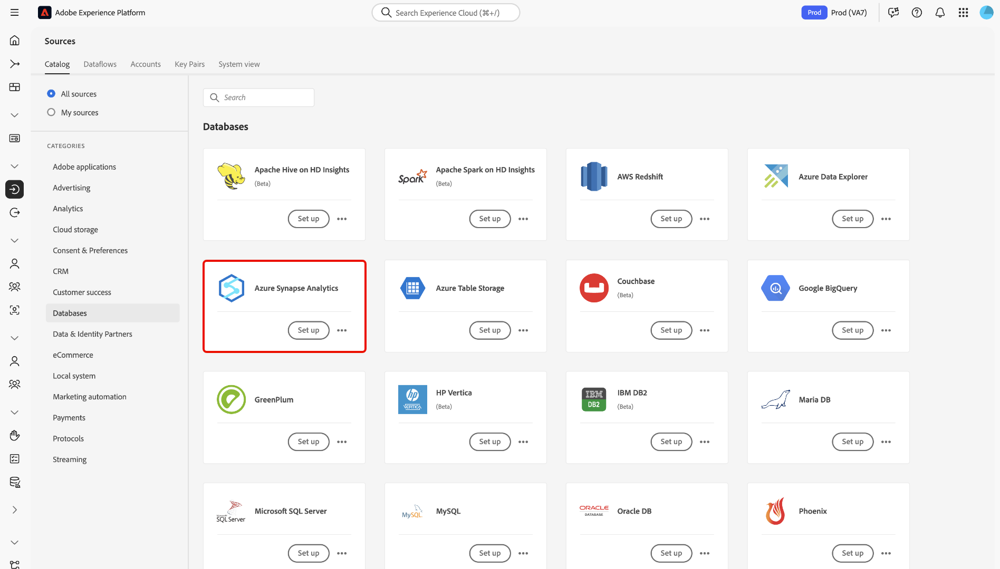
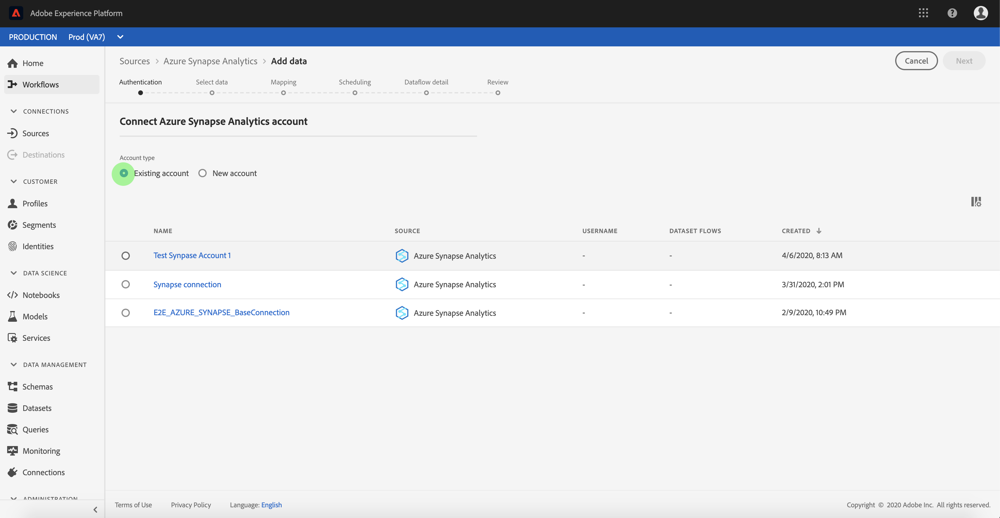
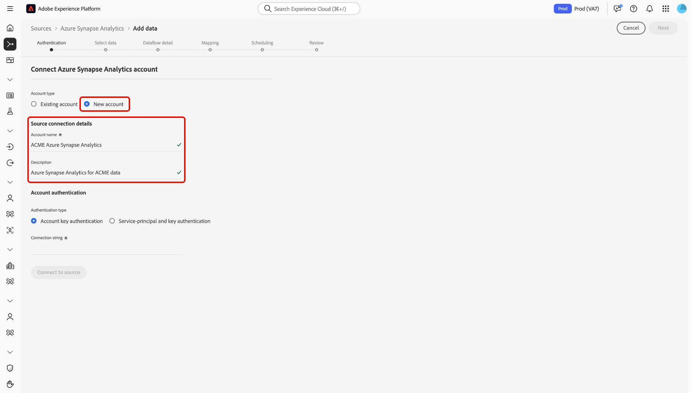
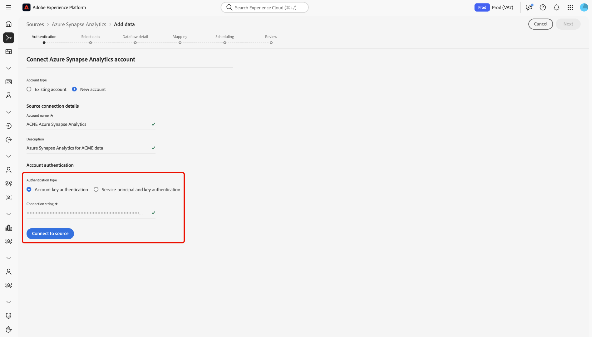
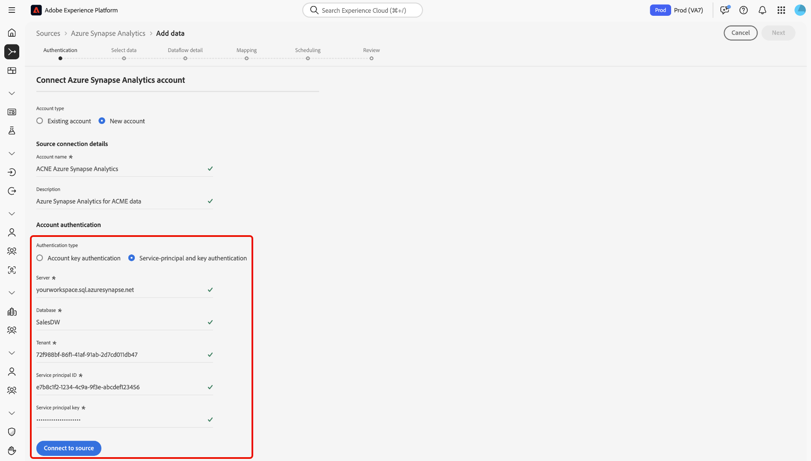

# Créer une connexion source [!DNL Azure Synapse Analytics] dans l’interface utilisateur

>[!IMPORTANT]
>
>La source [!DNL Azure Synapse Analytics] est disponible dans le catalogue des sources pour les utilisateurs qui ont acheté Real-Time Customer Data Platform Ultimate.

Lisez ce guide pour savoir comment connecter votre compte [!DNL Azure Synapse Analytics] à Adobe Experience Platform à l’aide de l’espace de travail des sources dans l’interface utilisateur.

## Commencer

Ce tutoriel nécessite une compréhension du fonctionnement des composants suivants d’Adobe Experience Platform :

* [[!DNL Experience Data Model (XDM)] Système](../../../../../xdm/home.md) : le cadre normalisé en fonction duquel [!DNL Experience Platform] organise les données d’expérience client.
   * [Principes de base de la composition des schémas](../../../../../xdm/schema/composition.md) : découvrez les blocs de création de base des schémas XDM, y compris les principes clés et les bonnes pratiques en matière de composition de schémas.
   * [Tutoriel sur l’éditeur de schémas](../../../../../xdm/tutorials/create-schema-ui.md) : découvrez comment créer des schémas personnalisés à l’aide de l’interface utilisateur de l’éditeur de schémas.
* [[!DNL Real-Time Customer Profile]](../../../../../profile/home.md) : fournit un profil de consommateur unifié en temps réel, basé sur des données agrégées provenant de plusieurs sources.

Si vous disposez déjà d’une connexion [!DNL Azure Synapse Analytics] valide, vous pouvez ignorer le reste de ce document et passer au tutoriel sur la [configuration d’un flux de données](../../dataflow/databases.md).

### Collecter les informations d’identification requises

Lisez la [[!DNL Azure Synapse Analytics] présentation](../../../../connectors/databases/synapse-analytics.md#prerequisites) pour plus d’informations sur l’authentification.

## Parcourir le catalogue des sources

Dans l’interface utilisateur d’Experience Platform, sélectionnez **[!UICONTROL Sources]** dans le volet de navigation de gauche pour accéder à l’espace de travail *[!UICONTROL Sources]*. Choisissez une catégorie ou utilisez la barre de recherche pour trouver votre source.

Pour vous connecter à [!DNL Azure Synapse Analytics], accédez à la catégorie *[!UICONTROL Databases]* , sélectionnez la carte source **[!UICONTROL Azure Synapse analytics]**, puis sélectionnez **[!UICONTROL Set up]**.

>[!TIP]
>
>Les sources du catalogue affichent l’option **[!UICONTROL Set up]** lorsqu’une source donnée ne dispose pas encore d’un compte authentifié. Une fois un compte authentifié créé, cette option devient **[!UICONTROL Add data]**.

## Utiliser un compte existant {#existing}

Pour utiliser un compte existant, sélectionnez **[!UICONTROL Existing account]**, puis sélectionnez le compte [!DNL Azure Synapse Analytics] à utiliser.

## Créer un nouveau compte {#new}

Pour créer un compte, sélectionnez **[!UICONTROL New account]**, puis fournissez un nom et éventuellement une description pour votre compte.

### Connexion à Experience Platform

Vous pouvez connecter votre compte [!DNL Azure Synapse Analytics] à Experience Platform à l’aide de l’authentification par clé de compte ou de l’authentification par principal de service et clé.

>[!BEGINTABS]

>[!TAB Authentification de la clé de compte]

Pour utiliser l’authentification par clé de compte, sélectionnez **[!UICONTROL Account key authentication]**, fournissez votre [chaîne de connexion](../../../../connectors/databases/synapse-analytics.md#prerequisites), puis sélectionnez **[!UICONTROL Connect to source]**.

.

>[!TAB Authentification principale et clé du service]

Vous pouvez également sélectionner **[!UICONTROL Service principal and key authentication]**, fournir des valeurs pour vos [&#x200B; informations d’authentification &#x200B;](../../../../connectors/databases/synapse-analytics.md#prerequisites), puis sélectionner **[!UICONTROL Connect to source]**.

>[!ENDTABS]

## Créer un flux de données pour les données [!DNL Azure Synapse Analytics]

Maintenant que vous avez correctement connecté votre base de données [!DNL Azure Synapse Analytics], vous pouvez [créer un flux de données et ingérer les données de votre base de données dans Experience Platform](../../dataflow/databases.md).
