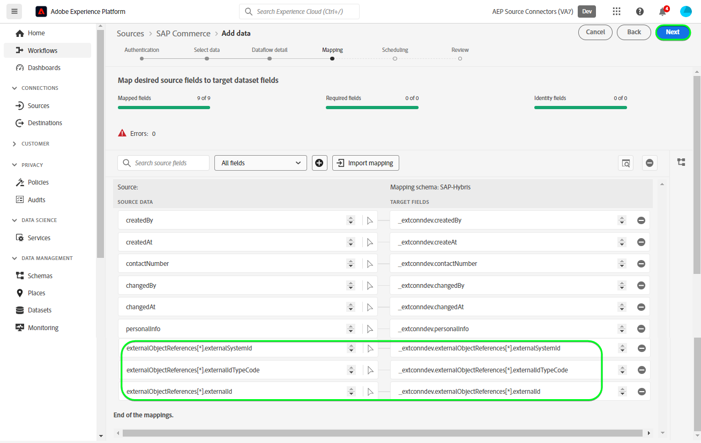

# Créer une connexion source [!DNL SAP Commerce] dans l’interface utilisateur

>[!NOTE]
>
>La source [!DNL SAP Commerce] est en version Beta. Voir la [présentation des sources](../../../../home.md#terms-and-conditions) pour plus d’informations sur l’utilisation de sources étiquetées bêta.

Le tutoriel suivant vous guide tout au long des étapes de création d’une connexion source [!DNL SAP Commerce] pour importer les contacts [[!DNL SAP] Facturation des abonnements](https://www.sap.com/products/financial-management/subscription-billing.html) et les données client à l’aide de l’interface utilisateur de Adobe Experience Platform.

## Prise en main {#getting-started}

Ce tutoriel nécessite une compréhension du fonctionnement des composants suivants d’Adobe Experience Platform : 

* [[!DNL Experience Data Model (XDM)] Système](../../../../../xdm/home.md) : le cadre normalisé en fonction duquel [!DNL Experience Platform] organise les données d’expérience client.
   * [Principes de base de la composition des schémas](../../../../../xdm/schema/composition.md) : découvrez les blocs de création de base des schémas XDM, y compris les principes clés et les bonnes pratiques en matière de composition de schémas.
   * [Tutoriel sur l’éditeur de schémas](../../../../../xdm/tutorials/create-schema-ui.md) : découvrez comment créer des schémas personnalisés à l’aide de l’interface utilisateur de l’éditeur de schémas.
* [[!DNL Real-Time Customer Profile]](../../../../../profile/home.md) : fournit un profil de consommateur unifié en temps réel, basé sur des données agrégées provenant de plusieurs sources.

Si vous disposez déjà d’un compte [!DNL SAP Commerce], vous pouvez ignorer le reste de ce document et passer au tutoriel expliquant comment [Configurer un flux de données](../../dataflow/ecommerce.md).

### Collecter les informations d’identification requises {#gather-credentials}

Pour connecter [!DNL SAP Commerce] à Experience Platform, vous devez fournir des valeurs pour les propriétés de connexion suivantes :

| Informations d’identification | Description |
| --- | --- |
| Identifiant client | Valeur de `clientId` à partir de la clé de service. |
| Secret client | Valeur de `clientSecret` à partir de la clé de service. |
| Point d’entrée du jeton | La valeur de `url` de la clé de service sera similaire à `https://subscriptionbilling.authentication.eu10.hana.ondemand.com`. |
| Région | L’emplacement de votre centre de données. La région est présente dans le `url` et a une valeur similaire à `eu10` ou `us10`. Par exemple, si le `url` est `https://eu10.revenue.cloud.sap/api`, vous aurez besoin de `eu10`. |

Pour plus d’informations, reportez-vous à la [[!DNL SAP Commerce] documentation](https://help.sap.com/docs/CLOUD_TO_CASH_OD/987aec876092428f88162e438acf80d6/c5fcaf96daff4c7a8520188e4d8a1843.html).

### Création d’un schéma Experience Platform {#create-platform-schema}

Avant de créer une connexion source [!DNL SAP Commerce], vous devez également vous assurer de créer d’abord un schéma Experience Platform à utiliser pour votre source. Pour obtenir des instructions complètes sur la création d’un schéma](../../../../../xdm/schema/composition.md) consultez le tutoriel sur la [création d’un schéma Experience Platform).

Développez la section suivante pour afficher un exemple de schéma.

+++ Afficher l’exemple de schéma

```
{
  "_extconndev": {
    "addresses": [
      {
        "addressUUID": "{ADDRESS_UUID}",
        "city": "Burnaby",
        "country": "Canada",
        "email": "chandni@acme.com",
        "houseNumber": "27",
        "isDefault": false,
        "phone": "123-456-7890",
        "postalCode": "V3J 1X9",
        "state": "British Columbia",
        "street": "Beresford"
      }
    ],
    "changedAt": "1687204041",
    "changedBy": "vero@acme.com",
    "contactNumber": "123-456-7980",
    "corporateInfo": {
      "company": "acme"
    },
    "createAt": "1687204041",
    "createdBy": "vero@acme.com",
    "customReferences": [
      {
        "id": "Sample value",
        "typeCode": "Sample value"
      }
    ],
    "customerNumber": "Sample value",
    "customerType": "Sample value",
    "defaultAddress": {
      "addressUUID": "Sample value",
      "city": "North Vancouver",
      "country": "Canada",
      "email": "chandni@acme.come",
      "houseNumber": "34",
      "isDefault": false,
      "phone": "123-456-7890",
      "postalCode": "V7H 2P1",
      "state": "British Columbia",
      "street": "Maple"
    },
    "externalObjectReferences": [
      {
        "externalId": "{EXTERNAL_ID}",
        "externalIdTypeCode": "{EXTERNAL_ID_TYPE_CODE}",
        "externalSystemId": "{EXTERNAL_SYSTEM_ID}"
      }
    ],
    "markets": [
      {
        "active": false,
        "country": "USA",
        "currency": "USD",
        "marketId": "Sample value",
        "priceinfo": {
          "incoterms": "{INCO_TERMS}",
          "incotermsLocation": "{INCO_TERMS_LOCATION}",
          "priceGroup": "{PRICE_GROUP}",
          "priceListType": "{PRICE_LIST_TYPE}"
        },
        "salesArea": {
          "distributionChannel": "{DISTRIBUTION_CHANNEL}",
          "division": "{DIVISION}",
          "salesOrganization": "{SALES_ORGANIZATION}"
        }
      }
    ],
    "personalInfo": {
      "firstName": "Chandni",
      "lastName": "Kaur"
    }
  },
  "_id": "/uri-reference",
  "_repo": {
    "createDate": "2004-10-23T12:00:00-06:00",
    "modifyDate": "2004-10-23T12:00:00-06:00"
  },
  "createdByBatchID": "/uri-reference",
  "modifiedByBatchID": "/uri-reference",
  "personID": "{PERSON_ID}",
  "repositoryCreatedBy": "kevin@acme.com",
  "repositoryLastModifiedBy": "kevin@acme.com"
}
```

+++

## Connecter votre compte [!DNL SAP Commerce] {#connect-account}

Dans l’interface utilisateur d’Experience Platform, sélectionnez **[!UICONTROL Sources]** dans la barre de navigation de gauche pour accéder à l’espace de travail [!UICONTROL Sources]. L’écran [!UICONTROL Catalogue] affiche diverses sources avec lesquelles vous pouvez créer un compte.

Vous pouvez sélectionner la catégorie appropriée dans le catalogue sur le côté gauche de votre écran. Vous pouvez également trouver la source spécifique à utiliser à l’aide de l’option de recherche.

Dans la catégorie *eCommerce*, sélectionnez **[!UICONTROL SAP Commerce]**, puis **[!UICONTROL Ajouter des données]**.


La page **[!UICONTROL Connecter le compte SAP Commerce]** s’affiche. Sur cette page, vous pouvez utiliser de nouvelles informations d’identification ou des informations d’identification existantes.

### Compte existant {#existing-account}

Pour utiliser un compte existant, sélectionnez le compte [!DNL SAP Commerce] avec lequel vous souhaitez créer un flux de données, puis sélectionnez **[!UICONTROL Suivant]** pour continuer.


### Nouveau compte {#new-account}

Si vous créez un compte, sélectionnez **[!UICONTROL Nouveau compte]**, puis fournissez un nom, une description facultative et vos informations d’identification. Lorsque vous avez terminé, sélectionnez **[!UICONTROL Se connecter à la source]** puis attendez que la nouvelle connexion s’établisse.


### Sélectionner les données {#select-data}

Enfin, vous devez sélectionner le type d’objet à ingérer dans Experience Platform.

| Type d’objet | Description |
| --- | --- |
| `Customers` | Entités disposant d’abonnements. |
| `Contacts` | Coordonnées des clients. |

>[!BEGINTABS]

>[!TAB Clients]

Pour ingérer des données client, sélectionnez **[!UICONTROL Clients]** comme type d’objet, puis sélectionnez **[!UICONTROL Suivant]**.


>[!TAB Contacts]

Pour ingérer des données de contact, sélectionnez **[!UICONTROL Contacts]** comme type d’objet, puis sélectionnez **[!UICONTROL Suivant]**.


>[!ENDTABS]

## Étapes suivantes {#next-steps}

En suivant ce tutoriel, vous avez établi une connexion à votre compte [!DNL SAP Commerce]. Vous pouvez maintenant passer au tutoriel suivant et [configurer un flux de données pour importer des données dans Experience Platform](../../dataflow/ecommerce.md).

## Ressources supplémentaires {#additional-resources}

Les sections ci-dessous fournissent des ressources supplémentaires auxquelles vous pouvez vous référer lors de l’utilisation de la source [!DNL SAP Commerce].

### Mappage {#mapping}

Experience Platform fournit des recommandations intelligentes pour les champs mappés automatiquement en fonction du schéma ou du jeu de données cible que vous avez sélectionné. Vous pouvez ajuster manuellement les règles de mappage en fonction de vos cas d’utilisation. Selon vos besoins, vous pouvez choisir de mapper directement des champs ou d’utiliser des fonctions de préparation de données pour transformer les données sources afin d’obtenir des valeurs informatisées ou calculées. Pour obtenir des instructions complètes sur l’utilisation de l’interface du mappeur et des champs calculés, consultez le [ Guide de l’interface utilisateur de la préparation des données ](../../../../../data-prep/ui/mapping.md).

Les configurations de mappage de votre flux de données varient en fonction de votre schéma et du type d’objet que vous choisissez d’ingérer.

>[!BEGINTABS]

>[!TAB Clients]

Pour les données client, [!DNL SAP Commerce] utilise les points d’entrée [clients](https://api.sap.com/api/BusinessPartner_APIs/path/GET_customers) et [relations client-contact](https://api.sap.com/api/BusinessPartner_APIs/path/GET_relationships-customer-contacts) de l’API [!DNL SAP Business Partners] pour récupérer les données

Voici un exemple de configuration de mappage pour [!DNL SAP Commerce] flux de données des données client :

| Champ cible | Description |
| --- | --- |
| `customerNumber` | Numéro du client. |
| `corporateInfo` | Numéro du client. |
| `customerType` | Type de client. |
| `createdAt` | Horodatage indiquant la date et l’heure de création du client. |
| `changedAt` | Date et heure de la dernière mise à jour du client. |
| `markets[*].country` | Les marchés clients, récupérés sous la forme d’un objet de tableau . |
| `addresses[*].email` | E-mails associés aux différentes adresses du client, récupérés sous la forme d’un objet de tableau. |
| `addresses[*].city` | Villes associées aux adresses multiples du client, récupérées en tant qu’objet tableau . |
| `addresses[*].addressUUID` | ID associés aux adresses multiples du client, récupérés sous la forme d’un objet de tableau . |
| `externalObjectReferences[*].externalSystemId` | Données supplémentaires, récupérées en tant qu’objet de tableau. |
| `externalObjectReferences[*].externalId` | Données supplémentaires, récupérées en tant qu’objet de tableau. |
| `customReferences[*].id` | Données supplémentaires, récupérées en tant qu’objet de tableau. |
| `customReferences[*].typeCode` | Données supplémentaires, récupérées en tant qu’objet de tableau. |


>[!TAB Contacts]

Pour les données de contact, [!DNL SAP Commerce] utilise le point d’entrée [contacts](https://api.sap.com/api/BusinessPartner_APIs/path/GET_contacts) de l’API [!DNL SAP Business Partners] pour récupérer les données.

Voici un exemple de configuration de mappage pour [!DNL SAP Commerce] flux de données des données de contact :

| Champ cible | Description |
| --- | --- |
| `contactNumber` | Numéro du contact. |
| `createdAt` | Date et heure de création du contact. |
| `changedAt` | Date et heure de la dernière mise à jour du contact. |
| `personalInfo.lastName` | Nom du contact. |
| `personalInfo.firstName` | Prénom du contact. |
| `externalObjectReferences[*].externalSystemId` | Données supplémentaires, récupérées en tant qu’objet de tableau. |
| `externalObjectReferences[*].externalId` | Données supplémentaires, récupérées en tant qu’objet de tableau. |
| `externalObjectReferences[*].externalIdTypeCode` | Données supplémentaires, récupérées en tant qu’objet de tableau. |



>[!ENDTABS]
