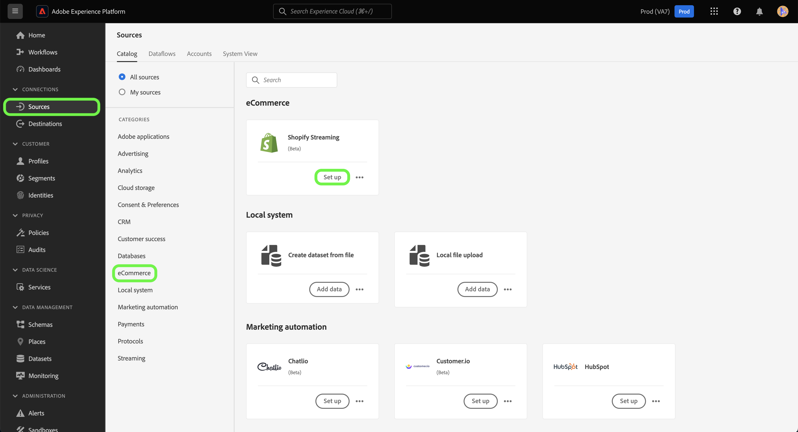
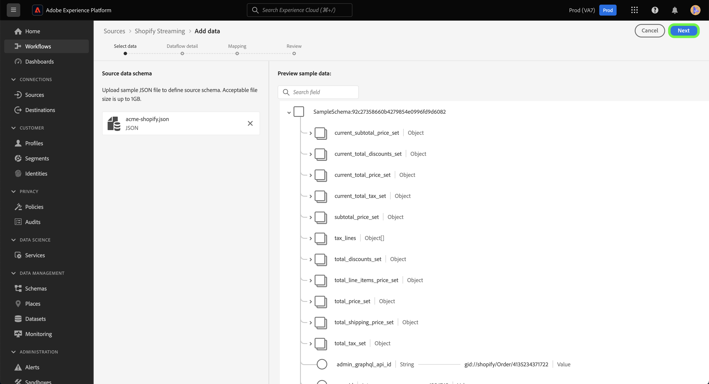

# Créez une connexion source et un flux de données pour les données [!DNL Shopify Streaming] à l’aide de l’interface utilisateur

Ce tutoriel décrit les étapes à suivre pour créer une connexion source et un flux de données [!DNL Shopify Streaming] à l’aide de l’interface utilisateur de Platform.

## Prise en main {#getting-started}

Ce tutoriel nécessite une compréhension du fonctionnement des composants suivants d’Adobe Experience Platform : 

* [[!DNL Experience Data Model (XDM)] Système](../../../../../xdm/home.md) : le cadre normalisé en fonction duquel [!DNL Experience Platform] organise les données d’expérience client.
   * [Principes de base de la composition des schémas](../../../../../xdm/schema/composition.md) : découvrez les blocs de création de base des schémas XDM, y compris les principes clés et les bonnes pratiques en matière de composition de schémas.
   * [Tutoriel sur l’éditeur de schémas](../../../../../xdm/tutorials/create-schema-ui.md) : découvrez comment créer des schémas personnalisés à l’aide de l’interface utilisateur de l’éditeur de schémas.
* [[!DNL Real-Time Customer Profile]](../../../../../profile/home.md) : fournit un profil de consommateur unifié en temps réel, basé sur des données agrégées provenant de plusieurs sources.

>[!IMPORTANT]
>
>Pour suivre ce tutoriel, vous devez avoir terminé la configuration requise pour votre compte [!DNL Shopify Streaming]. Pour connaître les étapes de configuration de votre compte, consultez la [[!DNL Shopify Streaming] présentation](../../../../connectors/ecommerce/shopify-streaming.md).

## Connecter votre compte [!DNL Shopify Streaming]

Dans l’interface utilisateur de Platform, sélectionnez **[!UICONTROL Sources]** à partir de la barre de navigation de gauche pour accéder à l’espace de travail [!UICONTROL Sources]. L’écran [!UICONTROL Catalogue] affiche diverses sources avec lesquelles vous pouvez créer un compte.

Vous pouvez sélectionner la catégorie appropriée dans le catalogue sur le côté gauche de votre écran. Vous pouvez également trouver la source spécifique à utiliser à l’aide de l’option de recherche.

Sous la catégorie **eCommerce**, sélectionnez [!DNL Shopify Streaming], puis **[!UICONTROL Ajouter des données]**.

## Sélectionner les données

L’étape **[!UICONTROL Sélectionner les données]** s’affiche, vous permettant ainsi de sélectionner les données que vous apportez à Platform.

* La partie gauche de l’interface est un navigateur qui vous permet d’afficher les flux de données disponibles dans votre compte ;
* La partie droite de l’interface vous permet de prévisualiser jusqu’à 100 lignes de données à partir d’un fichier JSON.

Sélectionnez **[!UICONTROL Télécharger des fichiers]** pour charger un fichier JSON à partir de votre système local. Vous pouvez également faire glisser et déposer le fichier JSON que vous souhaitez charger dans le panneau [!UICONTROL Glisser-déposer des fichiers].

Une fois le fichier chargé, l’interface de prévisualisation se met à jour pour afficher un aperçu du schéma que vous avez chargé. L’interface d’aperçu vous permet d’examiner le contenu et la structure d’un fichier. Vous pouvez également utiliser l’utilitaire [!UICONTROL Search field] pour accéder à des éléments spécifiques à partir de votre schéma.

Lorsque vous avez terminé, sélectionnez **[!UICONTROL Suivant]**.

## Détails du flux de données

L’étape **Détails du flux de données** s’affiche, vous fournissant des options permettant d’utiliser un jeu de données existant ou d’établir un nouveau jeu de données pour votre flux de données, ainsi qu’une opportunité de fournir un nom et une description pour votre flux de données. Au cours de cette étape, vous pouvez également configurer des paramètres pour l’ingestion de profils, les diagnostics d’erreur, l’ingestion partielle et les alertes.

Lorsque vous avez terminé, sélectionnez **[!UICONTROL Suivant]**.

## Mappage

L’interface de [!UICONTROL mappage] fournit un outil complet pour mapper les champs sources de votre schéma source aux champs XDM cibles correspondants dans le schéma cible.

Platform fournit des recommandations intelligentes pour les champs mappés automatiquement en fonction du schéma ou du jeu de données cible que vous sélectionnez. Vous pouvez ajuster manuellement les règles de mappage en fonction de vos cas d’utilisation. Selon vos besoins, vous pouvez choisir de mapper directement des champs ou d’utiliser des fonctions de préparation de données pour transformer les données sources afin d’obtenir des valeurs informatisées ou calculées. Pour obtenir des instructions complètes sur l’utilisation de l’interface du mappeur et des champs calculés, consultez le [guide de l’interface utilisateur de la préparation des données](https://experienceleague.adobe.com/docs/experience-platform/data-prep/ui/mapping.html).

Une fois le mappage de vos données source réussi, sélectionnez **[!UICONTROL Suivant]**.

## Révision

L’écran de **[!UICONTROL Révision]** s’affiche, vous permettant dʼexaminer votre nouveau flux de données avant sa création. Les détails sont regroupés dans les catégories suivantes :

* **[!UICONTROL Connexion]** : indique le type de source, le chemin d’accès approprié du fichier source sélectionné et le nombre de colonnes dans ce fichier source.
* **[!UICONTROL Attribuer des champs de jeu de données et de mappage]** : affiche le jeu de données dans lequel les données sources sont ingérées, y compris le schéma auquel le jeu de données se conforme.

Une fois que vous avez vérifié votre flux de données, sélectionnez **[!UICONTROL Terminer]** et patientez quelques instants le temps que le flux de données soit créé.

## Obtention de l’URL de votre point de terminaison de diffusion

Une fois votre flux de données de diffusion en continu créé, vous pouvez désormais récupérer l’URL de votre point de terminaison de diffusion en continu. Ce point de terminaison sera utilisé pour s’abonner à votre webhook, ce qui permet à votre source de diffusion en continu de communiquer avec l’Experience Platform.

Pour récupérer votre point de terminaison de diffusion en continu, accédez à la page [!UICONTROL Activité Flux de données] du flux de données que vous venez de créer et copiez le point de terminaison depuis le bas du panneau [!UICONTROL Propriétés].

## Étapes suivantes

En suivant ce tutoriel, vous avez établi une connexion source et un flux de données à votre compte [!DNL Shopify Streaming]. Pour plus d’informations sur la connexion de votre compte [!DNL Shopify Streaming] à l’aide de l’API, consultez le tutoriel sur la [création d’une connexion source et d’un flux de données pour diffuser des [!DNL Shopify] données à l’aide de l’API Flow Service](../../../api/create/ecommerce/shopify-streaming.md).
