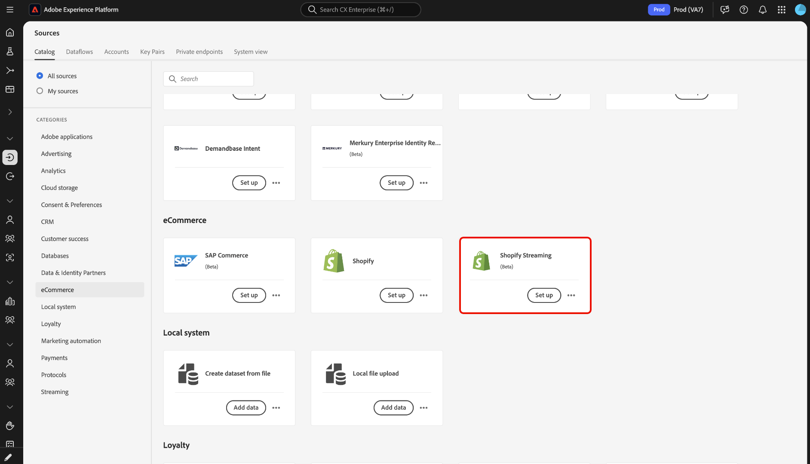
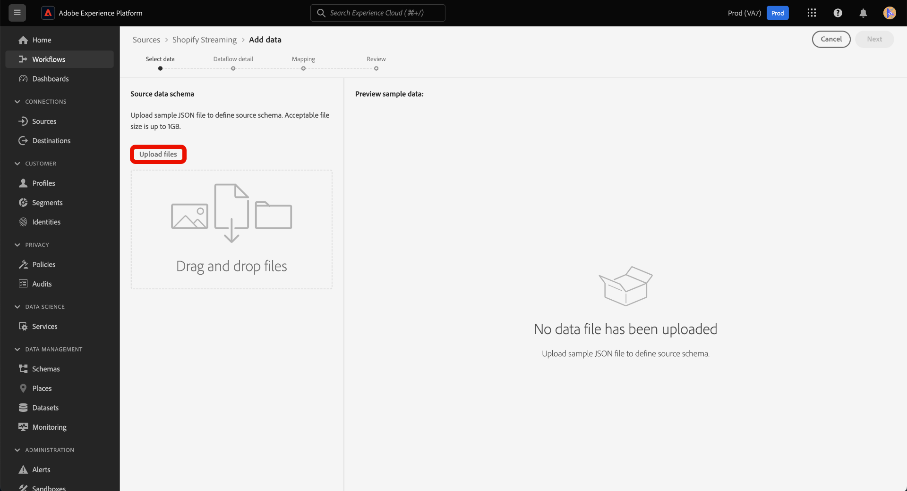
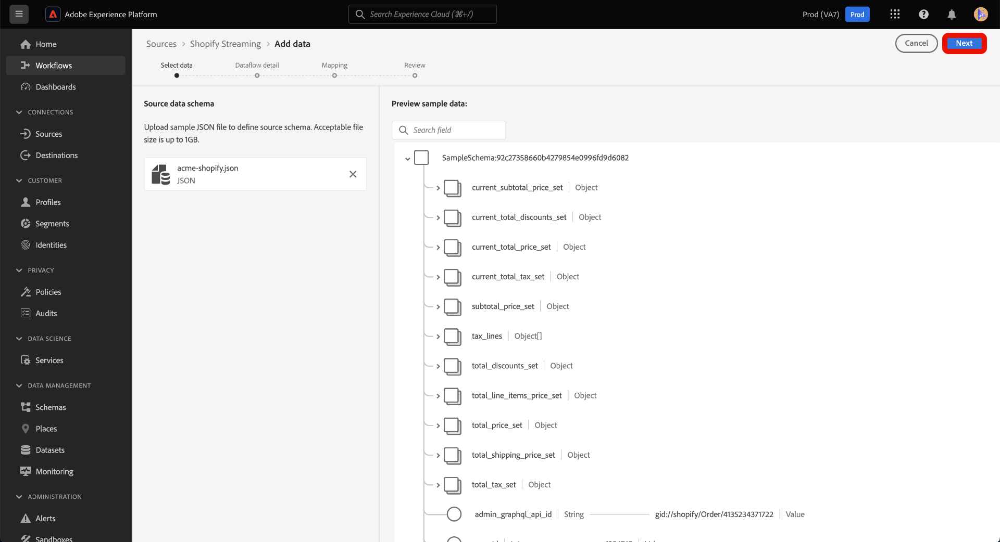
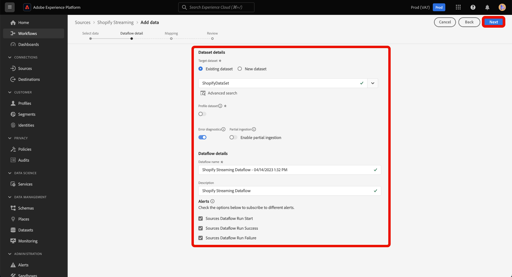
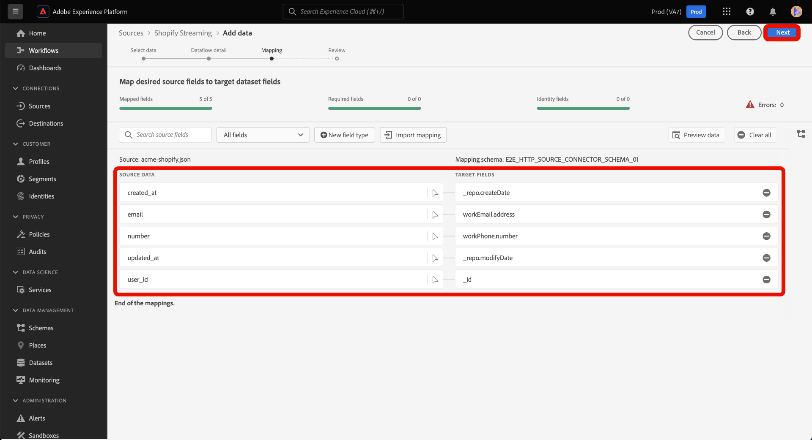
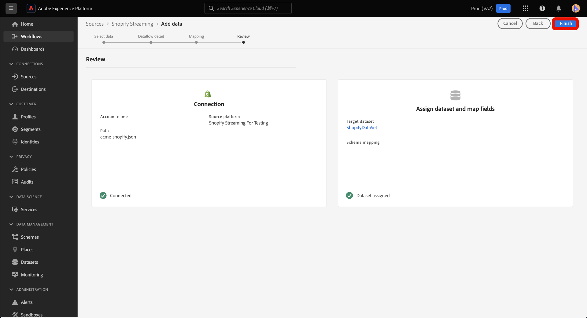
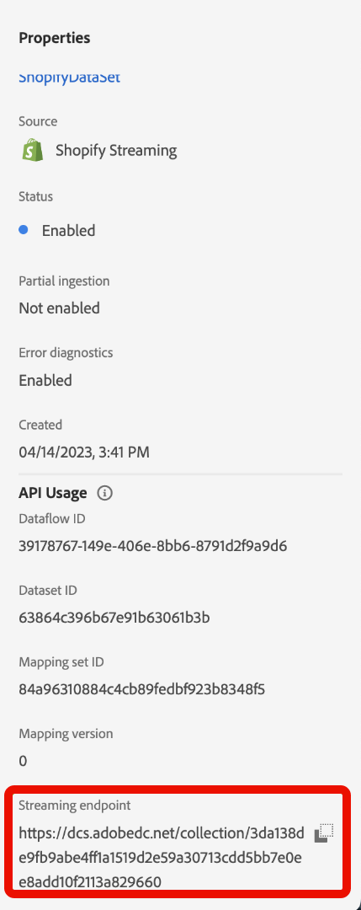

# Créer une connexion source et un flux de données pour les données [!DNL Shopify Streaming] à l’aide de l’interface utilisateur

Ce tutoriel décrit les étapes à suivre pour créer une connexion source [!DNL Shopify Streaming] et un flux de données à l’aide de l’interface utilisateur d’Experience Platform.

## Prise en main {#getting-started}

Ce tutoriel nécessite une compréhension du fonctionnement des composants suivants d’Adobe Experience Platform :

* [[!DNL Experience Data Model (XDM)] Système](../../../../../xdm/home.md) : le cadre normalisé en fonction duquel [!DNL Experience Platform] organise les données d’expérience client.
   * [Principes de base de la composition des schémas](../../../../../xdm/schema/composition.md) : découvrez les blocs de création de base des schémas XDM, y compris les principes clés et les bonnes pratiques en matière de composition de schémas.
   * [Tutoriel sur l’éditeur de schémas](../../../../../xdm/tutorials/create-schema-ui.md) : découvrez comment créer des schémas personnalisés à l’aide de l’interface utilisateur de l’éditeur de schémas.
* [[!DNL Real-Time Customer Profile]](../../../../../profile/home.md) : fournit un profil de consommateur unifié en temps réel, basé sur des données agrégées provenant de plusieurs sources.

>[!IMPORTANT]
>
>Pour suivre ce tutoriel, vous devez avoir terminé la configuration requise pour votre compte [!DNL Shopify Streaming]. Pour obtenir des instructions sur la configuration de votre compte, lisez la [[!DNL Shopify Streaming] présentation](../../../../connectors/ecommerce/shopify-streaming.md).

## Connecter votre compte [!DNL Shopify Streaming]

Dans l’interface utilisateur d’Experience Platform, sélectionnez **[!UICONTROL Sources]** dans la barre de navigation de gauche pour accéder à l’espace de travail [!UICONTROL Sources]. L’écran [!UICONTROL Catalog] affiche diverses sources avec lesquelles vous pouvez créer un compte.

Vous pouvez sélectionner la catégorie appropriée dans le catalogue sur le côté gauche de votre écran. Vous pouvez également trouver la source spécifique à utiliser à l’aide de l’option de recherche.

Dans la catégorie **eCommerce**, sélectionnez [!DNL Shopify Streaming], puis **[!UICONTROL Add data]**.

## Sélectionner les données

L’étape **[!UICONTROL Select data]** s’affiche, fournissant une interface vous permettant de sélectionner les données que vous apportez à Experience Platform.

* La partie gauche de l’interface est un navigateur qui vous permet d’afficher les flux de données disponibles dans votre compte ;
* La partie droite de l’interface vous permet de prévisualiser jusqu’à 100 lignes de données à partir d’un fichier JSON.

Sélectionnez **[!UICONTROL Upload files]** pour charger un fichier JSON à partir de votre système local. Vous pouvez également faire glisser et déposer le fichier JSON que vous souhaitez charger dans le panneau [!UICONTROL Drag and drop files].

Une fois votre fichier chargé, l’interface de prévisualisation se met à jour pour afficher un aperçu du schéma que vous avez chargé. L’interface de prévisualisation vous permet d’examiner le contenu et la structure d’un fichier. Vous pouvez également utiliser l’utilitaire [!UICONTROL Search field] pour accéder à des éléments spécifiques depuis votre schéma.

Lorsque vous avez terminé, sélectionnez **[!UICONTROL Next]**.

## Détails du flux de données

L’étape **Détails du flux de données** s’affiche, vous offrant des options pour utiliser un jeu de données existant ou établir un nouveau jeu de données pour votre flux de données, ainsi que la possibilité de fournir un nom et une description pour votre flux de données. Au cours de cette étape, vous pouvez également configurer les paramètres d’ingestion de profil, de diagnostics d’erreur, d’ingestion partielle et d’alertes.

Lorsque vous avez terminé, sélectionnez **[!UICONTROL Next]**.

## Mappage

L’étape [!UICONTROL Mapping] s’affiche, vous fournissant une interface pour mapper les champs source de votre schéma source à leurs champs XDM cibles appropriés dans le schéma cible.

Experience Platform fournit des recommandations intelligentes pour les champs mappés automatiquement en fonction du schéma ou du jeu de données cible que vous sélectionnez. Vous pouvez ajuster manuellement les règles de mappage en fonction de vos cas d’utilisation. Selon vos besoins, vous pouvez choisir de mapper directement des champs ou d’utiliser des fonctions de préparation de données pour transformer les données sources afin d’obtenir des valeurs informatisées ou calculées. Pour obtenir des instructions complètes sur l’utilisation de l’interface du mappeur et des champs calculés, consultez le [&#x200B; Guide de l’interface utilisateur de la préparation des données &#x200B;](https://experienceleague.adobe.com/docs/experience-platform/data-prep/ui/mapping.html?lang=fr).

Une fois les données sources mappées, sélectionnez **[!UICONTROL Next]**.

## Réviser

L’étape **[!UICONTROL Review]** s’affiche, vous permettant de vérifier votre nouveau flux de données avant sa création. Les détails sont regroupés dans les catégories suivantes :

* **[!UICONTROL Connection]** : affiche le type de source, le chemin d’accès correspondant au fichier source choisi et le nombre de colonnes au sein de ce fichier source.
* **[!UICONTROL Assign dataset & map fields]** : affiche le jeu de données dans lequel les données sources sont ingérées, y compris le schéma auquel le jeu de données se conforme.

Une fois que vous avez révisé votre flux de données, sélectionnez **[!UICONTROL Finish]** et patientez quelques instants le temps que le flux de données soit créé.

## Obtention de l’URL du point d’entrée de diffusion en continu

Une fois votre flux de données en continu créé, vous pouvez récupérer votre URL de point d’entrée en continu. Ce point d’entrée sera utilisé pour vous abonner à votre webhook, ce qui permettra à votre source de diffusion en continu de communiquer avec Experience Platform.

Pour récupérer votre point d’entrée de diffusion en continu, accédez à la page [!UICONTROL Dataflow activity] du flux de données que vous venez de créer et copiez le point d’entrée à partir du bas du panneau de [!UICONTROL Properties].

## Étapes suivantes

En suivant ce tutoriel, vous avez établi une connexion source et un flux de données vers votre compte [!DNL Shopify Streaming]. Pour obtenir des instructions sur la connexion de votre compte [!DNL Shopify Streaming] à l’aide de l’API , consultez le tutoriel sur [la création d’une connexion source et d’un flux de données pour diffuser  [!DNL Shopify]  données à l’aide de l’API Flow Service](../../../api/create/ecommerce/shopify-streaming.md).
