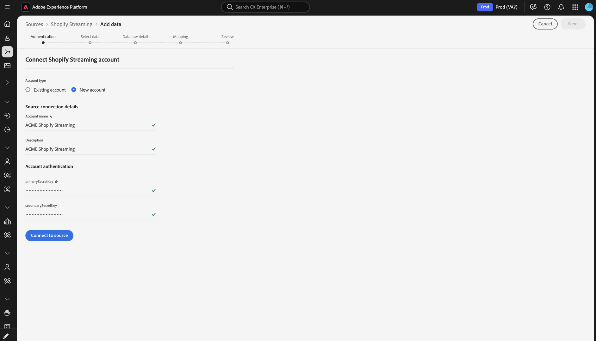

# Créer une connexion source et un flux de données pour les données [!DNL Shopify Streaming] à l’aide de l’interface utilisateur

Lisez ce guide pour savoir comment diffuser des données d’une source [!DNL Shopify Streaming] vers Adobe Experience Platform via l’interface utilisateur.

## Prise en main {#getting-started}

Avant de commencer, familiarisez-vous avec les parties suivantes d’Experience Platform :

* [Système de modèle de données d’expérience (XDM)](../../../../../xdm/home.md) : cadre normalisé conçu pour vous aider à organiser et à gérer vos données d’expérience client de manière cohérente dans Adobe Experience Platform.
   * [Principes de base de la composition des schémas](../../../../../xdm/schema/composition.md) : une introduction à la création de vos propres schémas de données, y compris les bonnes pratiques simples et la manière de structurer vos données efficacement en fonction de vos besoins spécifiques.
   * [Tutoriel de l’éditeur de schémas](../../../../../xdm/tutorials/create-schema-ui.md) : instructions détaillées pour vous guider tout au long de la création de schémas de données personnalisés directement dans l’interface utilisateur de Platform, afin que vous puissiez adapter votre modèle de données aux besoins de votre entreprise.
* [Real-Time Customer Profile](../../../../../profile/home.md) : permet de créer des profils clients en temps réel complets qui agrègent des données issues de plusieurs sources, offrant ainsi une vue unifiée de chaque client individuel.

>[!IMPORTANT]
>
>Pour suivre ce tutoriel, vous devez avoir terminé la configuration requise pour votre compte [!DNL Shopify Streaming]. Pour obtenir des instructions sur la configuration de votre compte, lisez la [[!DNL Shopify Streaming] présentation](../../../../connectors/ecommerce/shopify-streaming.md).

## Connecter votre compte [!DNL Shopify Streaming]

Dans l’interface utilisateur d’Experience Platform, sélectionnez **[!UICONTROL Sources]** dans le volet de navigation de gauche pour accéder à l’espace de travail *[!UICONTROL Sources]*. Sélectionnez la catégorie appropriée dans le panneau *[!UICONTROL Catégories]*. Vous pouvez également utiliser la barre de recherche pour accéder à la source spécifique que vous souhaitez utiliser.

Pour diffuser des données à partir de [!DNL Shopify], sélectionnez la carte source **[!UICONTROL Diffusion en continu Shopify]** sous *[!UICONTROL ecommerce]*, puis sélectionnez **[!UICONTROL Configurer]**.

>[!TIP]
>
>Les sources du catalogue affichent l’option **[!UICONTROL Configurer]** lorsqu’une source donnée ne dispose pas encore d’un compte authentifié. Une fois un compte authentifié créé, cette option devient **[!UICONTROL Ajouter des données]**.

### Créer un nouveau compte

Pour créer un compte pour votre source de [!DNL Shopify Streaming], sélectionnez **[!UICONTROL Nouveau compte]** et indiquez un nom et une description facultative pour votre compte. Ensuite, indiquez les valeurs de vos **[!UICONTROL primarySecretKey]** et **[!UICONTROL secondarySecretKey]**, puis sélectionnez **[!UICONTROL Se connecter à la source]**. Patientez quelques instants le temps que la connexion s’établisse, puis sélectionnez **[!UICONTROL Suivant]** pour continuer.

Pour plus d’informations sur l’authentification par clé HMAC, consultez la [[!DNL Shopify Streaming] présentation de l’authentification](../../../../connectors/ecommerce/shopify-streaming.md).

## Sélectionner les données

L’étape **[!UICONTROL Sélectionner les données]** s’affiche, fournissant une interface vous permettant de sélectionner les données que vous apportez à Experience Platform.

* La partie gauche de l’interface est un navigateur qui vous permet d’afficher les flux de données disponibles dans votre compte ;
* La partie droite de l’interface vous permet de prévisualiser jusqu’à 100 lignes de données à partir d’un fichier JSON.

Sélectionnez **[!UICONTROL Télécharger des fichiers]** pour télécharger un fichier JSON à partir de votre système local. Vous pouvez également faire glisser et déposer le fichier JSON que vous souhaitez charger dans le panneau [!UICONTROL Glisser-déposer des fichiers].

Une fois votre fichier chargé, l’interface de prévisualisation se met à jour pour afficher un aperçu du schéma que vous avez chargé. L’interface de prévisualisation vous permet d’examiner le contenu et la structure d’un fichier. Vous pouvez également utiliser l’utilitaire [!UICONTROL Champ de recherche] pour accéder à des éléments spécifiques à partir de votre schéma.

Lorsque vous avez terminé, sélectionnez **[!UICONTROL Suivant]**.

## Détails du flux de données

L’étape **Détails du flux de données** s’affiche, vous offrant des options pour utiliser un jeu de données existant ou établir un nouveau jeu de données pour votre flux de données, ainsi que la possibilité de fournir un nom et une description pour votre flux de données. Au cours de cette étape, vous pouvez également configurer les paramètres d’ingestion de profil, de diagnostics d’erreur, d’ingestion partielle et d’alertes.

Lorsque vous avez terminé, sélectionnez **[!UICONTROL Suivant]**.

## Mappage

L’étape [!UICONTROL Mappage] s’affiche, vous fournissant une interface pour mapper les champs source de votre schéma source à leurs champs XDM cibles appropriés dans le schéma cible.

Experience Platform fournit des recommandations intelligentes pour les champs mappés automatiquement en fonction du schéma ou du jeu de données cible que vous sélectionnez. Vous pouvez ajuster manuellement les règles de mappage en fonction de vos cas d’utilisation. Selon vos besoins, vous pouvez choisir de mapper directement des champs ou d’utiliser des fonctions de préparation de données pour transformer les données sources afin d’obtenir des valeurs informatisées ou calculées. Pour obtenir des instructions complètes sur l’utilisation de l’interface du mappeur et des champs calculés, consultez le [ Guide de l’interface utilisateur de la préparation des données ](https://experienceleague.adobe.com/docs/experience-platform/data-prep/ui/mapping.html).

Une fois vos données source mappées, sélectionnez **[!UICONTROL Suivant]**.

## Réviser

L’écran de **[!UICONTROL Révision]** s’affiche, vous permettant dʼexaminer votre nouveau flux de données avant sa création. Les détails sont regroupés dans les catégories suivantes :

* **[!UICONTROL Connexion]** : affiche le type de source, le chemin d’accès correspondant au fichier source choisi et le nombre de colonnes au sein de ce fichier source.
* **[!UICONTROL Attribuer des champs de jeu de données et de mappage]** : affiche le jeu de données dans lequel les données sources sont ingérées, y compris le schéma auquel le jeu de données se conforme.

Une fois que vous avez vérifié votre flux de données, sélectionnez **[!UICONTROL Terminer]** et patientez quelques instants le temps que le flux de données soit créé.

## Obtention de l’URL du point d’entrée de diffusion en continu

Une fois votre flux de données en continu créé, vous pouvez récupérer votre URL de point d’entrée en continu. Ce point d’entrée sera utilisé pour vous abonner à votre webhook, ce qui permettra à votre source de diffusion en continu de communiquer avec Experience Platform.

Pour récupérer votre point d’entrée de flux continu, accédez à la page [!UICONTROL Activité du flux de données] du flux de données que vous venez de créer, puis copiez le point d’entrée au bas du panneau [!UICONTROL Propriétés].

## Étapes suivantes

En suivant ce tutoriel, vous avez établi une connexion source et un flux de données vers votre compte [!DNL Shopify Streaming]. Pour obtenir des instructions sur la connexion de votre compte [!DNL Shopify Streaming] à l’aide de l’API , consultez le tutoriel sur [la création d’une connexion source et d’un flux de données pour diffuser  [!DNL Shopify]  données à l’aide de l’API Flow Service](../../../api/create/ecommerce/shopify-streaming.md).
