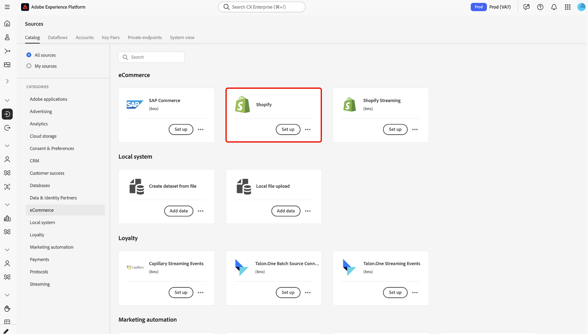
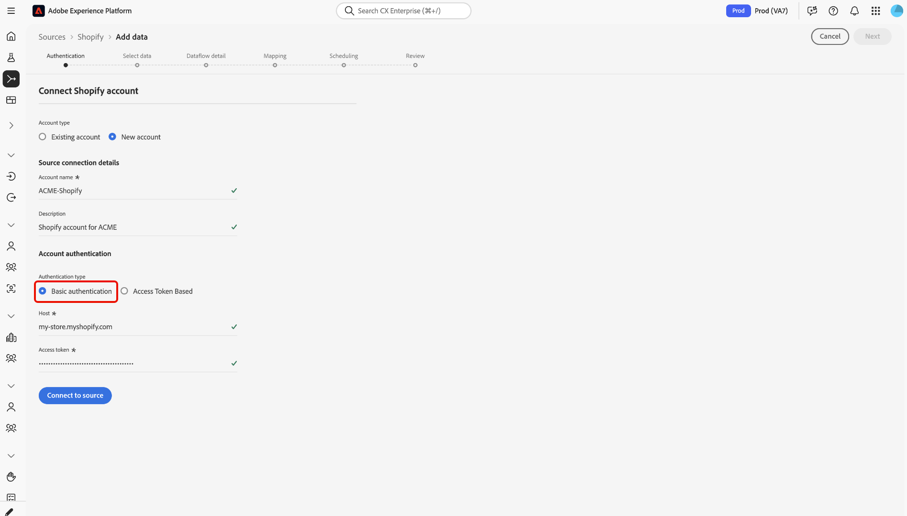
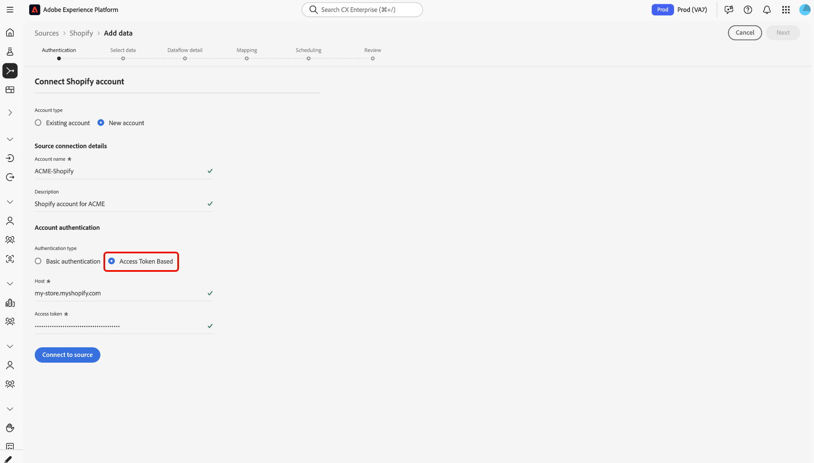

# Créer une connexion source [!DNL Shopify] dans l’interface utilisateur

Utilisez ce guide pour connecter votre compte [!DNL Shopify] à Adobe Experience Platform via l’espace de travail Sources dans l’interface utilisateur.

## Prise en main

Ce tutoriel nécessite une compréhension du fonctionnement des composants suivants d’Adobe Experience Platform :

* [Système de modèle de données d’expérience (XDM)](../../../../../xdm/home.md) : cadre normalisé selon lequel Experience Platform organise les données d’expérience client.
   * [Principes de base de la composition des schémas](../../../../../xdm/schema/composition.md) : découvrez les blocs de création de base des schémas XDM, y compris les principes clés et les bonnes pratiques en matière de composition de schémas.
   * [Tutoriel sur l’éditeur de schémas](../../../../../xdm/tutorials/create-schema-ui.md) : découvrez comment créer des schémas personnalisés à l’aide de l’interface utilisateur de l’éditeur de schémas.
* [[!DNL Real-Time Customer Profile]](../../../../../profile/home.md) : fournit un profil de consommateur unifié en temps réel, basé sur des données agrégées provenant de plusieurs sources.

Si vous disposez déjà d’une connexion [!DNL Shopify], vous pouvez ignorer le reste de ce document et passer au tutoriel sur [la configuration d’un flux de données pour un connecteur eCommerce](../../dataflow/ecommerce.md).

### Collecter les informations d’identification requises

Vous devez disposer d’informations d’authentification [!DNL Shopify] valides pour créer une connexion de base. Pour plus d’informations sur les informations d’identification requises et sur la manière de les obtenir, reportez-vous à la [[!DNL Shopify] présentation du connecteur source](../../../../connectors/ecommerce/shopify.md#prerequisites).

## Parcourir le catalogue des sources

Dans l’interface utilisateur d’Experience Platform, sélectionnez **[!UICONTROL Sources]** dans le volet de navigation de gauche pour accéder à l’espace de travail *[!UICONTROL Sources]*. Sélectionnez la catégorie appropriée dans le panneau *[!UICONTROL Categories]*. Vous pouvez également utiliser la barre de recherche pour accéder à la source spécifique que vous souhaitez utiliser.

Pour ingérer des données à partir de [!DNL Shopify], sélectionnez la carte source **[!UICONTROL Shopify]** sous *[!UICONTROL eCommerce]*, puis sélectionnez **[!UICONTROL Set up]**.

>[!TIP]
>
>Les sources du catalogue affichent l’option **[!UICONTROL Set up]** lorsqu’une source donnée ne dispose pas encore d’un compte authentifié. Une fois un compte authentifié créé, cette option devient **[!UICONTROL Add data]**.

### Compte existant

Si vous avez déjà configuré un compte [!DNL Shopify], sélectionnez-le dans la liste, puis sélectionnez **[!UICONTROL Next]** pour continuer.

### Nouveau compte

Si vous ajoutez un nouveau compte, sélectionnez **[!UICONTROL New account]**. Dans le formulaire de saisie, saisissez un nom, une description facultative et vos informations d’identification [!DNL Shopify]. [!DNL Shopify] prend en charge deux méthodes d’authentification :

**Authentification de base** : saisissez l’hôte et le jeton d’accès de votre magasin dans la section Authentification de base.

**Authentification basée sur les jetons d’accès** : saisissez l’hôte et le jeton d’accès de votre magasin dans la section Jeton d’accès .

Après avoir saisi vos informations d’identification pour la méthode d’authentification appropriée, sélectionnez **[!UICONTROL Connect]** et patientez quelques instants le temps que la nouvelle connexion soit établie.

## Étapes suivantes

En suivant ce tutoriel, vous avez établi une connexion à votre compte [!DNL Shopify]. Vous pouvez maintenant passer au tutoriel suivant et [configurer un flux de données pour importer des données e-commerce dans Experience Platform](../../dataflow/ecommerce.md).
