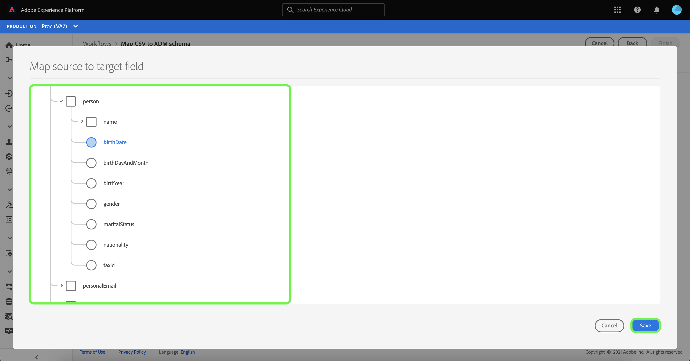

# Création d’un connecteur source de transfert de fichiers local dans l’interface utilisateur

Ce tutoriel décrit les étapes de création d’un connecteur source de chargement de fichier local pour ingérer des fichiers locaux vers Platform à l’aide de l’interface utilisateur.

## Prise en main

Ce tutoriel nécessite une compréhension pratique des composants suivants de Platform :

* [[!DNL Experience Data Model (XDM)] Système](../../../../../xdm/home.md) : Cadre normalisé selon lequel Platform organise les données d’expérience client.
   * [Principes de base de la composition des schémas](../../../../../xdm/schema/composition.md) : découvrez les blocs de création de base des schémas XDM, y compris les principes clés et les bonnes pratiques en matière de composition de schémas.
   * [Tutoriel](../../../../../xdm/tutorials/create-schema-ui.md) de l’éditeur de schémas : Découvrez comment créer des schémas personnalisés à l’aide de l’interface utilisateur de l’éditeur de schémas.
* [[!DNL Real-time Customer Profile]](../../../../../profile/home.md) : fournit un profil client en temps réel unifié basé sur des données agrégées issues de plusieurs sources.

## Chargement de fichiers locaux dans Platform

Dans l’interface utilisateur de Platform, sélectionnez **[!UICONTROL Sources]** dans la barre de navigation de gauche pour accéder à l’espace de travail [!UICONTROL Sources]. L’écran [!UICONTROL Catalogue] affiche diverses sources pour lesquelles vous pouvez créer un compte.

Vous pouvez sélectionner la catégorie appropriée dans le catalogue sur le côté gauche de votre écran. Vous pouvez également trouver la source spécifique à utiliser à l’aide de l’option de recherche.

Dans la catégorie [!UICONTROL Système local], sélectionnez **[!UICONTROL Chargement de fichier local]**, puis sélectionnez **[!UICONTROL Configurer]**.

### Utilisation d’un jeu de données existant

La page [!UICONTROL Détails du flux de données] vous permet de choisir si vous souhaitez ingérer vos données CSV dans un jeu de données existant ou un nouveau jeu de données.

Pour ingérer vos données CSV dans un jeu de données existant, sélectionnez **[!UICONTROL Jeu de données existant]**. Vous pouvez récupérer un jeu de données existant à l’aide de l’option [!UICONTROL Recherche avancée] ou en faisant défiler la liste des jeux de données existants dans le menu déroulant.

Une fois qu’un jeu de données est sélectionné, attribuez un nom à votre flux de données et une description facultative.

Au cours de ce processus, vous pouvez également activer les [!UICONTROL diagnostics d’erreur] et [!UICONTROL Ingestion partielle]. [!UICONTROL La génération de messages d’erreur détaillés du ] diagnostic d’erreur est disponible pour tous les enregistrements erronés qui se produisent dans votre flux de données, tandis que l’ [!UICONTROL ingestion ] partielle vous permet d’ingérer des données contenant des erreurs, jusqu’à un certain seuil que vous définissez manuellement. Pour plus d’informations, consultez la [présentation de l’ingestion par lots partielle](../../../../../ingestion/batch-ingestion/partial.md) .

### Utilisation d’un nouveau jeu de données

Pour ingérer vos données CSV dans un nouveau jeu de données, sélectionnez **[!UICONTROL Nouveau jeu de données]**, puis fournissez un nom de jeu de données de sortie et une description facultative. Sélectionnez ensuite un schéma à mapper à l’aide de l’option [!UICONTROL Recherche avancée] ou en faisant défiler la liste des schémas existants dans le menu déroulant.

Une fois le schéma sélectionné, attribuez-lui un nom et une description facultative, puis appliquez les paramètres [!UICONTROL Diagnostics d’erreur] et [!UICONTROL Ingestion partielle] souhaités pour votre flux de données. Lorsque vous avez terminé, sélectionnez **[!UICONTROL Suivant]**.

### Sélectionner des données

L’étape [!UICONTROL Sélectionner les données] s’affiche, vous fournissant une interface pour charger vos fichiers locaux et prévisualiser leur structure et leur contenu. Sélectionnez **[!UICONTROL Choisir les fichiers]** pour charger un fichier CSV à partir de votre système local. Vous pouvez également faire glisser et déposer le fichier CSV que vous souhaitez charger dans le panneau [!UICONTROL Faire glisser et déposer les fichiers].

>[!TIP]
>
>Seuls les fichiers CSV sont actuellement pris en charge par le téléchargement de fichiers local. La taille de fichier maximale pour chaque fichier est de 1 Go.

Une fois le fichier téléchargé, l’interface de prévisualisation se met à jour pour afficher le contenu et la structure du fichier.

Selon votre fichier, vous pouvez sélectionner un délimiteur de colonne (tabulations, virgules, barres verticales, ou un délimiteur de colonne personnalisé) pour vos données source. Sélectionnez la flèche de liste déroulante **[!UICONTROL Délimiteur]** , puis sélectionnez le délimiteur approprié dans le menu.

Lorsque vous avez terminé, sélectionnez **[!UICONTROL Suivant]**.

### Mappage

L’étape [!UICONTROL Mappage] s’affiche, vous fournissant une interface pour mapper les champs source de votre schéma source à leurs champs XDM cibles appropriés dans le schéma cible.

#### Aperçu des données

Sélectionnez **[!UICONTROL Aperçu des données]** pour afficher les résultats de mappage de 100 lignes maximum de données d’exemple du jeu de données sélectionné.

Lors de la prévisualisation, la colonne d’identité est considérée comme le premier champ, car il s’agit des informations clés nécessaires à la validation des résultats du mapping. Lorsque vous avez terminé, sélectionnez **[!UICONTROL Fermer]**.

#### Ajouter un champ calculé

Les champs calculés permettent de créer des valeurs en fonction des attributs du schéma d’entrée. Ces valeurs peuvent ensuite être affectées à des attributs dans le schéma cible. Vous pouvez également leur fournir un nom et une description pour en faciliter la référence.

Sélectionnez le bouton **[!UICONTROL Ajouter un champ calculé]** pour continuer.

Le panneau [!UICONTROL Créer un champ calculé] sʼaffiche. La boîte de dialogue de gauche contient les champs, fonctions et opérateurs pris en charge dans les champs calculés. Sélectionnez lʼun des onglets pour commencer à ajouter des fonctions, des champs ou des opérateurs à lʼéditeur dʼexpression.

| Tabulation | Description |
| --------- | ----------- |
| Fonction | Lʼonglet Fonctions répertorie les fonctions disponibles pour transformer les données. Pour en savoir plus sur les fonctions que vous pouvez utiliser dans les champs calculés, consultez le guide dʼ [utilisation des fonctions Data Prep (Mapper)](../../../../../data-prep/functions.md). |
| Champ | Lʼonglet Champs répertorie les champs et attributs disponibles dans le schéma source. |
| Opérateur | Lʼonglet Opérateurs répertorie les opérateurs disponibles pour la transformation des données. |

Sélectionnez l’éditeur d’expression pour ajouter manuellement des champs, des fonctions et des opérateurs. Une fois que vous avez créé un champ calculé, sélectionnez **[!UICONTROL Enregistrer]** pour continuer.

#### Filtrer l’arborescence de mappage des schémas sources

Pour filtrer votre schéma source, sélectionnez **[!UICONTROL Tous les champs source]**, puis sélectionnez le champ spécifique à mapper dans le menu déroulant.

Le tableau suivant affiche les options de tri de votre arborescence de schéma source :

| Champs source | Description |
| --- | --- |
| [!UICONTROL Tous les champs sources] | Cette option affiche tous les champs source de votre schéma source. Cette option est affichée par défaut. |
| [!UICONTROL Champs obligatoires] | Cette option filtre le schéma source pour n’afficher que les champs nécessaires à la réalisation du mapping. |
| [!UICONTROL Champs d&#39;identité] | Cette option filtre le schéma source pour n’afficher que les champs marqués pour l’identité. |
| [!UICONTROL Champs mappés] | Cette option filtre le schéma source pour n’afficher que les champs déjà mappés. |
| [!UICONTROL Champs non mappés] | Cette option filtre le schéma source pour n’afficher que les champs qui doivent encore être mappés. |
| [!UICONTROL Champs avec recommandation] | Cette option filtre le schéma source pour n’afficher que les champs contenant les recommandations de mappage. |

#### Recommandations intelligentes

Platform fournit automatiquement des recommandations intelligentes pour les champs mappés automatiquement en fonction du schéma ou du jeu de données cible que vous avez sélectionné. Vous pouvez ajuster manuellement les règles de mappage en fonction de vos cas d’utilisation.

Pour accepter toutes les valeurs de mapping qui se génèrent automatiquement, sélectionnez **[!UICONTROL Accepter tous les champs cibles]**.

Parfois, plusieurs recommandations sont disponibles pour le schéma source. Dans ce cas, la carte de mappage affiche la recommandation la plus en évidence, suivie d’un cercle bleu contenant le nombre de recommandations supplémentaires disponibles. Si vous sélectionnez l’icône d’ampoule, une liste des recommandations supplémentaires s’affiche. Vous pouvez choisir l’une des autres recommandations en cochant la case en regard de la recommandation à laquelle vous souhaitez mapper la page à la place.

Vous pouvez également choisir de mapper manuellement votre schéma source à votre schéma cible. Pour ce faire, passez la souris sur le schéma source à mapper, puis sélectionnez l’icône plus (`+`).

La fenêtre contextuelle **[!UICONTROL Mapper la source au champ cible]** s’affiche. À partir de là, vous pouvez sélectionner le champ à mapper, suivi de **[!UICONTROL Enregistrer]** pour ajouter votre nouveau mappage.

Lorsque vous avez terminé, sélectionnez **[!UICONTROL Terminé]**.

## Surveillance de l’ingestion des données

Une fois votre fichier CSV mappé et créé, vous pouvez surveiller les données ingérées à l’aide du tableau de bord de surveillance. Pour plus d’informations, consultez le tutoriel sur [la surveillance des flux de données des sources dans l’interface utilisateur](../../../../../dataflows/ui/monitor-sources.md).

## Étapes suivantes

En suivant ce tutoriel, vous avez mappé un fichier CSV plat à un schéma XDM et l’avez ingéré dans Platform. Ces données peuvent désormais être utilisées par des services [!DNL Platform] en aval tels que [!DNL Real-time Customer Profile]. Pour plus d’informations, consultez la présentation de [[!DNL Real-time Customer Profile]](../../../../../profile/home.md) .
