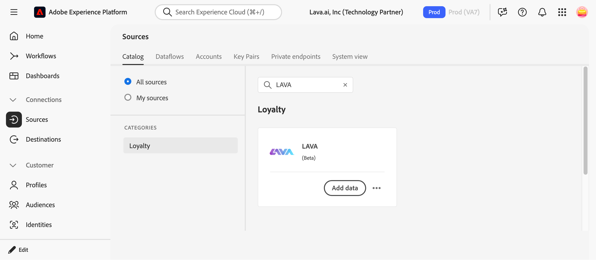
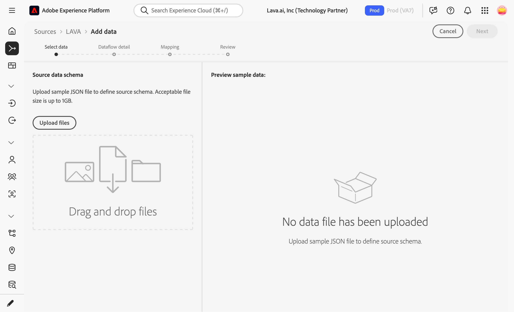
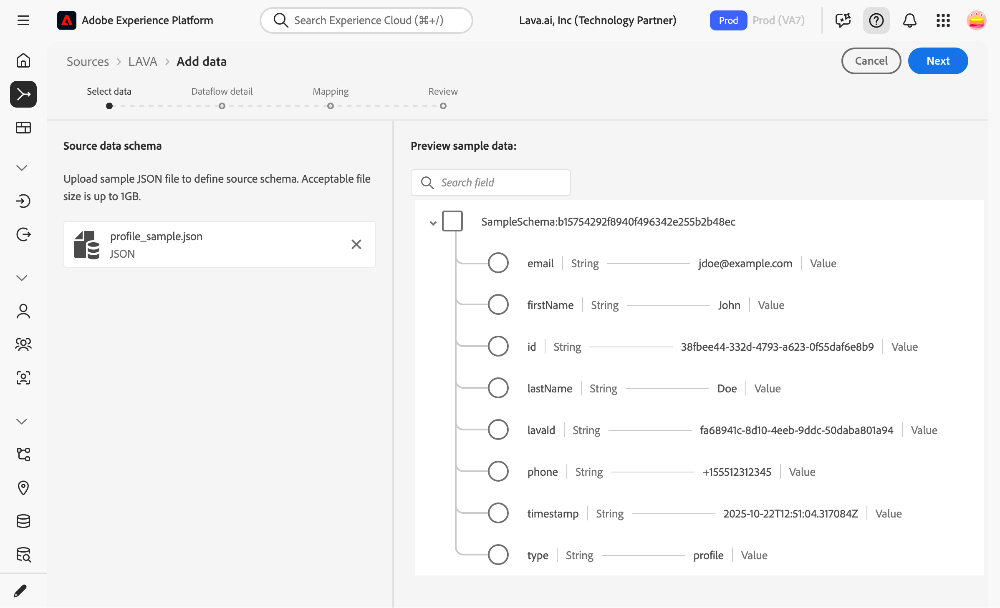
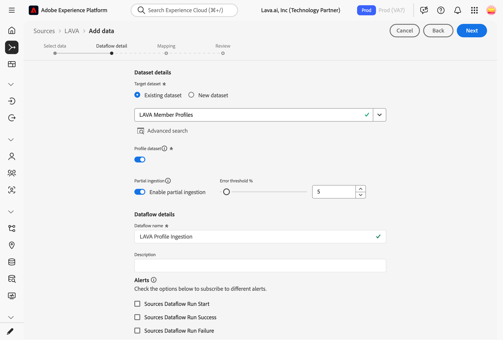
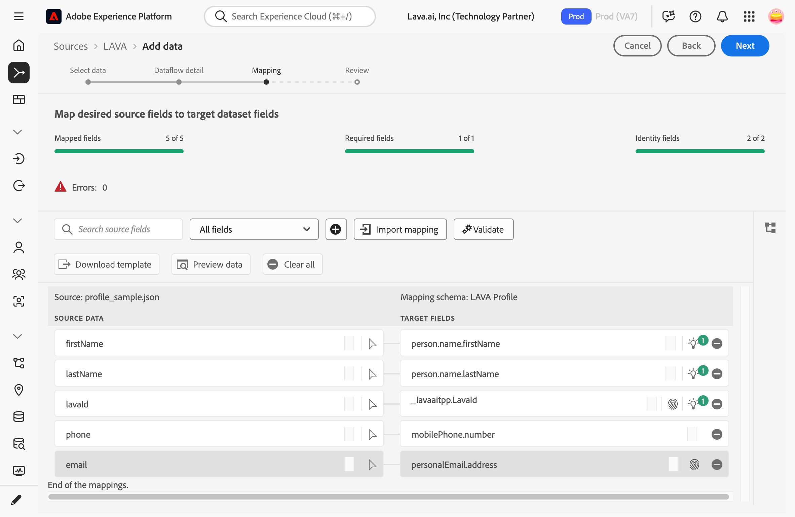
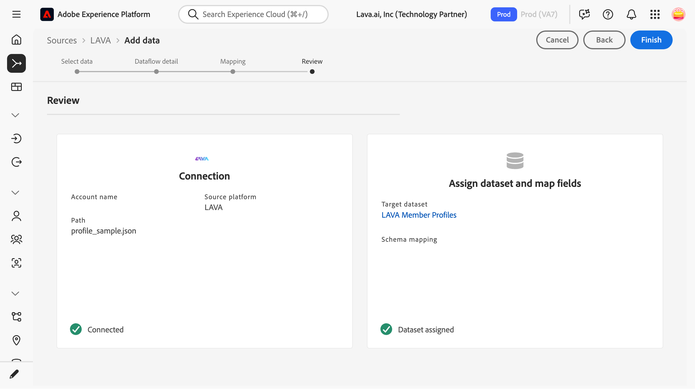
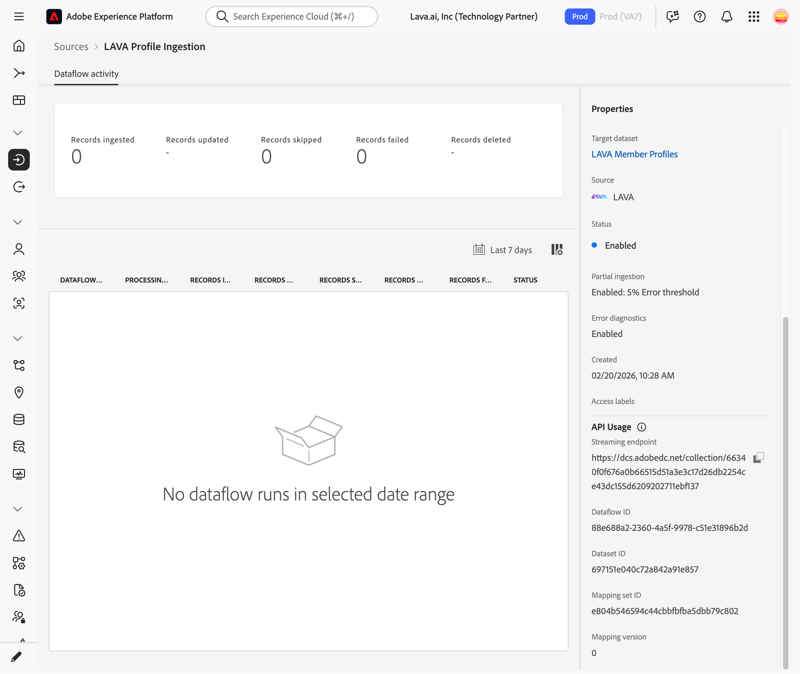

# Créer une connexion source et un flux de données pour diffuser des données [!DNL LAVA] à l’aide de l’interface utilisateur

Suivez ce guide détaillé pour configurer votre propre connecteur source [!DNL LAVA] dans l’interface utilisateur d’Experience Platform.

>[!IMPORTANT]
>
>Cette page de documentation a été créée par l’équipe [!DNL LAVA]. Pour toute question ou demande de mise à jour, contactez-les directement à l’adresse .

## Prise en main

Ce tutoriel nécessite une compréhension du fonctionnement des composants suivants d’Adobe Experience Platform :

* [[!DNL Experience Data Model (XDM)] Système](../../../../../xdm/home.md) : Cadre normalisé selon lequel Experience Platform organise les données d’expérience client.
   * [Principes de base de la composition des schémas](../../../../../xdm/schema/composition.md) : découvrez les blocs de création de base des schémas XDM, y compris les principes clés et les bonnes pratiques en matière de composition de schémas.
   * [Tutoriel sur l’éditeur de schémas](../../../../../xdm/tutorials/create-schema-ui.md) : découvrez comment créer des schémas personnalisés à l’aide de l’interface utilisateur de l’éditeur de schémas.
* [[!DNL Real-Time Customer Profile]](../../../../../profile/home.md) : fournit un profil de consommateur unifié en temps réel, basé sur des données agrégées provenant de plusieurs sources.

>[!TIP]
>
>Avant de commencer ce tutoriel, consultez la [[!DNL LAVA]  présentation du connecteur source ](../../../../connectors/loyalty/lava.md) pour vous assurer que vous remplissez toutes les conditions préalables.

## Connecter votre compte [!DNL LAVA]

Dans l’interface utilisateur d’Experience Platform, sélectionnez **[!UICONTROL Sources]** dans la barre de navigation de gauche pour accéder à l’espace de travail [!UICONTROL Sources]. L’écran [!UICONTROL Catalogue] affiche diverses sources avec lesquelles vous pouvez créer un compte.

Vous pouvez sélectionner la catégorie appropriée dans le catalogue sur le côté gauche de votre écran. Vous pouvez également trouver la source spécifique à utiliser à l’aide de l’option de recherche.

Dans la catégorie **Streaming**, sélectionnez [!DNL LAVA], puis sélectionnez **[!UICONTROL Ajouter des données]**.

## Sélectionner les données

L’étape **[!UICONTROL Sélectionner les données]** s’affiche, fournissant une interface vous permettant de sélectionner les données que vous apportez à Platform.

* La partie gauche de l’interface est un navigateur qui vous permet d’afficher les flux de données disponibles dans votre compte ;
* La partie droite de l’interface vous permet de prévisualiser jusqu’à 100 lignes de données à partir d’un fichier JSON.

Sélectionnez **[!UICONTROL Charger des fichiers]** pour charger un fichier JSON à partir de votre système local ou chargez l’exemple de fichier depuis la section Présentation correspondant au jeu de données que vous configurez. Vous pouvez également faire glisser et déposer le fichier JSON que vous souhaitez charger dans le panneau [!UICONTROL Glisser-déposer des fichiers].

Une fois votre fichier chargé, l’interface de prévisualisation se met à jour pour afficher un aperçu du schéma que vous avez chargé. L’interface de prévisualisation vous permet d’examiner le contenu et la structure d’un fichier. Vous pouvez également utiliser l’utilitaire [!UICONTROL Champ de recherche] pour accéder à des éléments spécifiques à partir de votre schéma.

Lorsque vous avez terminé, sélectionnez **[!UICONTROL Suivant]**.

## Détails du flux de données

L’étape **Détails du flux de données** s’affiche, vous offrant des options pour utiliser un jeu de données existant ou établir un nouveau jeu de données pour votre flux de données, ainsi que la possibilité de fournir un nom et une description pour votre flux de données. Au cours de cette étape, vous pouvez également configurer les paramètres d’ingestion de profil, de diagnostics d’erreur, d’ingestion partielle et d’alertes.

Lorsque vous avez terminé, sélectionnez **[!UICONTROL Suivant]**.

## Mappage

L’étape [!UICONTROL Mappage] s’affiche, vous fournissant une interface pour mapper les champs de votre schéma source à leurs champs XDM cibles appropriés dans le schéma cible.

Lors de l’utilisation du schéma fourni par [!DNL LAVA], utilisez le mappage recommandé suivant :

>[!BEGINTABS]

>[!TAB Profils de membres]

| Champ [!DNL LAVA] connecteur Source | Champ de schéma de profil [!DNL LAVA] |
| --- | --- |
| `lavaId` | `_tenant.lavaId` |
| `firstName` | `person.name.firstName` |
| `lastName` | `person.name.lastName` |
| `email` | `personalEmail.address` |
| `phone` | `mobilePhone.number` |

{style="table-layout:auto"}

>[!TAB Soldes des membres]

| Champ [!DNL LAVA] connecteur Source | Champ de schéma de profil [!DNL LAVA] |
| --- | --- |
| `lavaId` | `_tenant.lavaId` |
| `balances[]` | `_tenant.balances[]` |

{style="table-layout:auto"}

>[!TAB Événements combinés]

| Champ [!DNL LAVA] connecteur Source | Champ de schéma d’événement [!DNL LAVA] |
| --- | --- |
| `to_map("LavaId",to_array(false,to_object("id",lavaId,"primary",true)))` de champ calculé | `identityMap` |
| `type` | `eventType` |
| `timestamp` | `timestamp` |
| `eventId` | `_tenant.ticketScan.eventId` |
| `eventName` | `_tenant.ticketScan.eventName` |
| `eventLabel` | `_tenant.ticketScan.eventLabel` |
| `venue` | `_tenant.ticketScan.venue` |
| `venueLabel` | `_tenant.ticketScan.venueLabel` |
| `section` | `_tenant.ticketScan.section` |
| `sectionLabel` | `_tenant.ticketScan.sectionLabel` |
| `row` | `_tenant.ticketScan.row` |
| `seat` | `_tenant.ticketScan.seat` |
| `gate` | `_tenant.ticketScan.gate` |
| `gateLabel` | `_tenant.ticketScan.gateLabel` |
| `transactionId` | `_tenant.transaction.transactionId` |
| `referenceId` | `_tenant.transaction.referenceId` |
| `subtotal` | `_tenant.transaction.subtotal` |
| `total` | `_tenant.transaction.total` |
| `location` | `_tenant.transaction.location` |
| `items[]` | `_tenant.transaction.items[]` |
| `redeemedAmount` | `_tenant.transaction.redeemedAmount` |
| `rewardsApplied[]` | `_tenant.transaction.rewardsApplied[]` |
| `amount` | `_tenant.ledger.amount` |
| `expiresAt` | `_tenant.ledger.expiresAt` |
| `rewardId` | `_tenant.ledger.rewardId` |
| `rewardName` | `_tenant.ledger.rewardName` |
| `rewardSlug` | `_tenant.ledger.rewardSlug` |
| `rewardType` | `_tenant.ledger.rewardType` |

{style="table-layout:auto"}

>[!TAB Événements d’analyse des tickets]

| Champ [!DNL LAVA] connecteur Source | Champ de schéma d’événement [!DNL LAVA] |
| --- | --- |
| `to_map("LavaId",to_array(false,to_object("id",lavaId,"primary",true)))` de champ calculé | `identityMap` |
| `eventId` | `_tenant.ticketScan.eventId` |
| `eventName` | `_tenant.ticketScan.eventName` |
| `eventLabel` | `_tenant.ticketScan.eventLabel` |
| `venue` | `_tenant.ticketScan.venue` |
| `venueLabel` | `_tenant.ticketScan.venueLabel` |
| `section` | `_tenant.ticketScan.section` |
| `sectionLabel` | `_tenant.ticketScan.sectionLabel` |
| `row` | `_tenant.ticketScan.row` |
| `seat` | `_tenant.ticketScan.seat` |
| `gate` | `_tenant.ticketScan.gate` |
| `gateLabel` | `_tenant.ticketScan.gateLabel` |
| `type` | `eventType` |
| `timestamp` | `timestamp` |

{style="table-layout:auto"}

>[!TAB Événements de transaction]

| Champ [!DNL LAVA] connecteur Source | Champ de schéma d’événement [!DNL LAVA] |
| --- | --- |
| `to_map("LavaId",to_array(false,to_object("id",lavaId,"primary",true)))` de champ calculé | `identityMap` |
| `transactionId` | `_tenant.transaction.transactionId` |
| `referenceId` | `_tenant.transaction.referenceId` |
| `subtotal` | `_tenant.transaction.subtotal` |
| `total` | `_tenant.transaction.total` |
| `location` | `_tenant.transaction.location` |
| `items[]` | `_tenant.transaction.items[]` |
| `redeemedAmount` | `_tenant.transaction.redeemedAmount` |
| `rewardsApplied[]` | `_tenant.transaction.rewardsApplied[]` |
| `type` | `eventType` |
| `timestamp` | `timestamp` |

{style="table-layout:auto"}

>[!TAB Événements comptables]

| Champ [!DNL LAVA] connecteur Source | Champ de schéma d’événement [!DNL LAVA] |
| --- | --- |
| `to_map("LavaId",to_array(false,to_object("id",lavaId,"primary",true)))` de champ calculé | `identityMap` |
| `amount` | `_tenant.ledger.amount` |
| `expiresAt` | `_tenant.ledger.expiresAt` |
| `rewardId` | `_tenant.ledger.rewardId` |
| `rewardName` | `_tenant.ledger.rewardName` |
| `rewardSlug` | `_tenant.ledger.rewardSlug` |
| `rewardType` | `_tenant.ledger.rewardType` |
| `type` | `eventType` |
| `timestamp` | `timestamp` |

{style="table-layout:auto"}

>[!ENDTABS]

Vous pouvez également ajuster manuellement les règles de mappage en fonction de vos cas d’utilisation. Selon vos besoins, vous pouvez choisir de mapper directement des champs ou d’utiliser des fonctions de préparation de données pour transformer les données sources afin d’obtenir des valeurs informatisées ou calculées. Pour obtenir des instructions complètes sur l’utilisation de l’interface du mappeur et des champs calculés, consultez le [ Guide de l’interface utilisateur de la préparation des données ](../../../../../data-prep/ui/mapping.md).

Une fois vos données source mappées, sélectionnez **[!UICONTROL Suivant]**.

## Réviser

L’écran de **[!UICONTROL Révision]** s’affiche, vous permettant dʼexaminer votre nouveau flux de données avant sa création. Les détails sont regroupés dans les catégories suivantes :

* **[!UICONTROL Connexion]** : affiche le type de source, le chemin d’accès correspondant au fichier source choisi et le nombre de colonnes au sein de ce fichier source.
* **[!UICONTROL Attribuer des champs de jeu de données et de mappage]** : affiche le jeu de données dans lequel les données sources sont ingérées, y compris le schéma auquel le jeu de données se conforme.

Une fois que vous avez vérifié votre flux de données, sélectionnez **[!UICONTROL Terminer]** et patientez quelques instants le temps que le flux de données soit créé.

## Obtention de l’URL du point d’entrée de diffusion en continu et de l’identifiant du flux de données

Une fois votre flux de données en continu créé, vous pouvez récupérer l’URL du point d’entrée en continu et l’identifiant du flux de données. Ils seront utilisés pour configurer [!DNL LAVA], ce qui permettra à votre source de diffusion en continu de communiquer avec Experience Platform.

Pour récupérer votre point d’entrée de flux continu, accédez à la page [!UICONTROL Activité du flux de données] du flux de données que vous venez de créer, puis copiez le point d’entrée au bas du panneau [!UICONTROL Propriétés].

### Intégration de [!DNL LAVA] à votre webhook

Dans la console [LAVA](https://app.lava.ai/), accédez à **[!DNL Resources > Data Export]**.

Sélectionnez **[!DNL Create New Export]**, puis choisissez **[!DNL Adobe Source Connector]** comme type de destination. Sélectionnez ensuite les données source à envoyer et saisissez l’URL du point d’entrée de diffusion en continu avec l’identifiant du flux de données.

