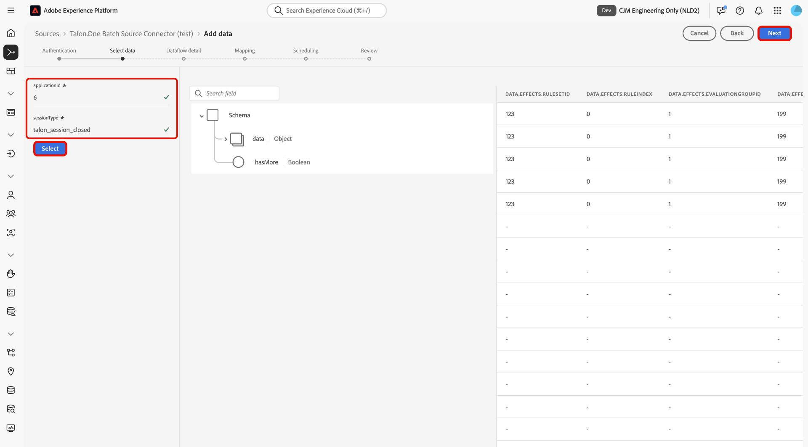

# Ingestion de données par lots de [!DNL Talon.One] dans Experience Platform à l’aide de l’interface utilisateur

>[!AVAILABILITY]
>
>La source [!DNL Talon.One] est en version Beta. Lisez les [termes et conditions](../../../../home.md#terms-and-conditions) dans la présentation des sources pour plus d’informations sur l’utilisation de sources étiquetées bêta.

Lisez ce tutoriel pour savoir comment ingérer des données par lots de votre compte [!DNL Talon.One] dans Adobe Experience Platform à l’aide de l’espace de travail des sources dans l’interface utilisateur.

## Prise en main

Ce tutoriel nécessite une compréhension du fonctionnement des composants suivants d’Adobe Experience Platform : 

* [[!DNL Experience Data Model (XDM)] Système](../../../../../xdm/home.md) : Cadre normalisé selon lequel Experience Platform organise les données d’expérience client. 
   * [Principes de base de la composition des schémas](../../../../../xdm/schema/composition.md) : découvrez les blocs de création de base des schémas XDM, y compris les principes clés et les bonnes pratiques en matière de composition de schémas.
   * [Tutoriel sur l’éditeur de schémas](../../../../../xdm/tutorials/create-schema-ui.md) : découvrez comment créer des schémas personnalisés à l’aide de l’interface utilisateur de l’éditeur de schémas.
* [[!DNL Real-Time Customer Profile]](../../../../../profile/home.md) : fournit un profil de consommateur unifié en temps réel, basé sur des données agrégées provenant de plusieurs sources.

>[!IMPORTANT]
>
>Lisez la [[!DNL Talon.One] présentation](../../../../connectors/loyalty/talon-one.md) pour découvrir les étapes préalables à suivre avant de connecter votre compte à Experience Platform.

## Parcourir le catalogue des sources

Dans l’interface utilisateur d’Experience Platform, sélectionnez **[!UICONTROL Sources]** dans le volet de navigation de gauche pour accéder à l’espace de travail *[!UICONTROL Sources]*. Sélectionnez la catégorie appropriée dans le panneau *[!UICONTROL Categories]*. Vous pouvez également utiliser la barre de recherche pour accéder à la source spécifique que vous souhaitez utiliser.

Pour ingérer des données à partir de [!DNL Talon.One], sélectionnez la carte source **[!UICONTROL Talon.One Batch Source Connector]** sous *[!UICONTROL Loyalty]*, puis sélectionnez **[!UICONTROL Add data]**.

>[!TIP]
>
>Les sources du catalogue affichent l’option **[!UICONTROL Set up]** lorsqu’une source donnée ne dispose pas encore d’un compte authentifié. Une fois un compte authentifié créé, cette option devient **[!UICONTROL Add data]**.

### Créer un nouveau compte

Pour créer un compte pour votre source de [!DNL Talon.One], sélectionnez **[!UICONTROL New account]** et indiquez un nom et une description facultative pour votre compte. Indiquez ensuite votre domaine [!DNL Talon.One] et votre [!UICONTROL Talon.One Management API Key]. Lorsque vous avez terminé, sélectionnez **[!UICONTROL Connect to source]** et patientez quelques instants le temps d’établir la connexion.

### Utiliser un compte existant

Pour utiliser un compte existant, sélectionnez **[!UICONTROL Existing account]** et sélectionnez le compte [!DNL Talon.One] à utiliser dans l’interface Comptes .

## Sélectionner les données

Une fois l’authentification effectuée, saisissez les valeurs pour vos **applicationId** et **sessionType**. Au cours de cette étape, vous pouvez utiliser les fonctionnalités de prévisualisation pour inspecter la structure de vos données. Lorsque vous avez terminé, sélectionnez **[!UICONTROL Next]** pour continuer.

## Configurer les détails du jeu de données et du flux de données

Ensuite, vous devez fournir des informations concernant votre jeu de données et votre flux de données.

### Détails du jeu de données

Un jeu de données est une structure de stockage et de gestion pour une collection de données, généralement sous la forme d’un tableau, qui contient un schéma (colonnes/champs) et des enregistrements (lignes). Les données correctement ingérées par Experience Platform sont conservées sous forme de jeux de données dans le lac de données.

Au cours de cette étape, vous pouvez utiliser un jeu de données existant ou en créer un nouveau.

>[!NOTE]
>
>Que vous utilisiez un jeu de données existant ou en créiez un nouveau, vous devez vous assurer que votre jeu de données est **activé pour l’ingestion de profils**.

+++Sélectionnez pour connaître les étapes d’activation de l’ingestion de profil, des diagnostics d’erreur et de l’ingestion partielle.

Si votre jeu de données est activé pour le profil client en temps réel, au cours de cette étape, vous pouvez activer **[!UICONTROL Profile dataset]** données pour l’ingestion de profils. Vous pouvez également utiliser cette étape pour activer **[!UICONTROL Error diagnostics]** et **[!UICONTROL Partial ingestion]**.

* **[!UICONTROL Error diagnostics]** : sélectionnez **[!UICONTROL Error diagnostics]** pour demander à la source de générer des diagnostics d’erreur que vous pourrez référencer ultérieurement lors de la surveillance de l’activité du jeu de données et du statut du flux de données.
* **[!UICONTROL Partial ingestion]** : l’ingestion par lots partielle est la possibilité d’ingérer des données contenant des erreurs, jusqu’à un certain seuil configurable. Cette fonctionnalité vous permet d’ingérer toutes vos données exactes dans Experience Platform, tandis que toutes vos données incorrectes sont traitées par lots séparément avec des informations sur les raisons de leur non-validité.

+++

## Détails du flux de données

Une fois votre jeu de données configuré, vous devez fournir des détails sur votre flux de données, y compris un nom, une description facultative et des configurations d’alerte.

| Configurations du flux de données | Description |
| --- | --- |
| Nom du flux de données | Nom du flux de données. Par défaut, le nom du fichier importé est utilisé. |
| Description | (Facultatif) Brève description de votre flux de données. |
| Alertes | Experience Platform peut générer des alertes basées sur des événements auxquelles les utilisateurs et utilisatrices peuvent s’abonner. Ces options permettent à un flux de données en cours d’exécution de les déclencher.  Pour plus d’informations, reportez-vous à la présentation des alertes [&#128279;](../../alerts.md) <ul><li>**Début d’exécution du flux de données des sources** : sélectionnez cette alerte pour recevoir une notification lorsque l’exécution du flux de données commence.</li><li>**Succès de l’exécution du flux de données des sources** : sélectionnez cette alerte pour recevoir une notification si votre flux de données se termine sans erreur.</li><li>**Échec de l’exécution du flux de données des sources** : sélectionnez cette alerte pour recevoir une notification si l’exécution de votre flux de données se termine par des erreurs.</li></ul> |

{style="table-layout:auto"}

## Mappage

Une fois les détails de votre jeu de données et de votre flux de données configurés, vous pouvez procéder au mappage de vos champs de données sources à leurs champs XDM cibles appropriés. Utilisez l’interface de mappage pour mapper vos données source aux champs de schéma appropriés avant d’ingérer des données vers Experience Platform. Pour plus d’informations, consultez le guide de mappage [&#x200B; dans l’interface utilisateur](../../../../../data-prep/ui/mapping.md).

>[!IMPORTANT]
>
>Pour plus d’informations sur le mappage de vos données sources [!DNL Talon.One], consultez la [[!DNL Talon.One] présentation](../../../../connectors/loyalty/talon-one.md#mapping).

## Planifier l’ingestion du flux de données

L’étape [!UICONTROL Scheduling] s’affiche. Utilisez l’interface pour configurer un planning d’ingestion afin d’ingérer automatiquement les données source sélectionnées à l’aide des mappages configurés. Par défaut, la planification est définie sur `Once`. Pour ajuster la fréquence d’ingestion, sélectionnez **[!UICONTROL Frequency]** puis une option dans le menu déroulant.

>[!TIP]
>
>L’intervalle et le renvoi ne sont pas visibles lors d’une ingestion unique.

Si vous définissez la fréquence d’ingestion sur `Minute`, `Hour`, `Day` ou `Week`, vous devez définir un intervalle pour établir un intervalle défini entre chaque ingestion. Par exemple, une fréquence d’ingestion définie sur `Day` et un intervalle défini sur `15` signifie que votre flux de données est planifié pour ingérer des données tous les 15 jours.

Au cours de cette étape, vous pouvez également activer le **renvoi** et définir une colonne pour l’ingestion incrémentielle des données. Le renvoi est utilisé pour ingérer des données historiques, tandis que la colonne que vous définissez pour l’ingestion incrémentielle permet de différencier les nouvelles données des données existantes.

Pour plus d’informations sur les configurations de planification, consultez le tableau ci-dessous.

| Configuration de la planification | Description |
| --- | --- |
| Fréquence | Configurez la fréquence pour indiquer la fréquence d’exécution du flux de données. Vous pouvez définir la fréquence sur : <ul><li>**Une fois** : définissez votre fréquence sur `once` pour créer une ingestion unique. Les configurations d’intervalle et de renvoi ne sont pas disponibles lors de la création d’un flux de données d’ingestion unique. Par défaut, la fréquence de planification est définie sur une seule fois.</li><li>**Minute** : définissez la fréquence sur `minute` pour planifier le flux de données afin d’ingérer les données par minute.</li><li>**Heure** : définissez la fréquence sur `hour` pour planifier l’ingestion des données par flux et par heure.</li><li>**Jour** : définissez la fréquence sur `day` pour planifier l’ingestion de données par jour dans le flux de données.</li><li>**Semaine** : définissez la fréquence sur `week` pour planifier l’ingestion de données par semaine dans le flux de données.</li></ul> |
| Intervalle | Une fois que vous avez sélectionné une fréquence, vous pouvez configurer le paramètre d’intervalle afin d’établir la période entre chaque ingestion. Par exemple, si vous définissez la fréquence sur jour et configurez l’intervalle sur 15, votre flux de données s’exécutera tous les 15 jours. Vous ne pouvez pas définir l’intervalle sur zéro. La valeur d’intervalle minimale acceptée pour chaque fréquence est la suivante :<ul><li>**Une fois** : s.o.</li><li>**Minute** : 15</li><li>**Heure** : 1</li><li>**Jour** : 1</li><li>**Semaine** : 1</li></ul> |
| Heure de début | Date et heure de l’exécution projetée, présentées dans le fuseau horaire UTC. |
| Renvoyer | Le renvoi détermine les données initialement ingérées. Si le renvoi est activé, tous les fichiers actuels du chemin spécifié seront ingérés lors de la première ingestion planifiée. Si le renvoi est désactivé, seuls les fichiers chargés entre la première exécution de l’ingestion et l’heure de début sont ingérés. Les fichiers chargés avant l’heure de début ne seront pas ingérés. |

## Réviser

L’étape *[!UICONTROL Review]* s’affiche, vous permettant de consulter les détails de votre flux de données avant sa création. Les détails sont regroupés dans les catégories suivantes :

* **[!UICONTROL Connection]** : affiche le nom du compte, la plateforme source et le nom de la source.
* **[!UICONTROL Assign dataset and map fields]** : affiche le jeu de données cible et le schéma auquel le jeu de données se conforme.

Après avoir confirmé que les détails sont corrects, sélectionnez **[!UICONTROL Finish]**.

## Surveiller votre flux de données

Une fois votre flux de données créé, vous pouvez surveiller les données ingérées et afficher les informations relatives au taux d’ingestion, aux succès et aux erreurs. Pour plus d’informations sur la surveillance des flux de données, consultez le tutoriel sur la [surveillance des comptes et des flux de données dans l’interface utilisateur](../../../../../dataflows/ui/monitor-sources.md).

## Limites connues

Lors du mappage des données du schéma de [!DNL Talon.One] à Adobe Experience Platform, il n’est actuellement pas possible de capturer plusieurs effets du même type dans une seule transaction. Par exemple, si une transaction inclut plusieurs effets de `setDiscount` (tels que des remises provenant de différentes campagnes), un seul de ces effets sera conservé pendant le mappage, et les autres seront remplacés.
