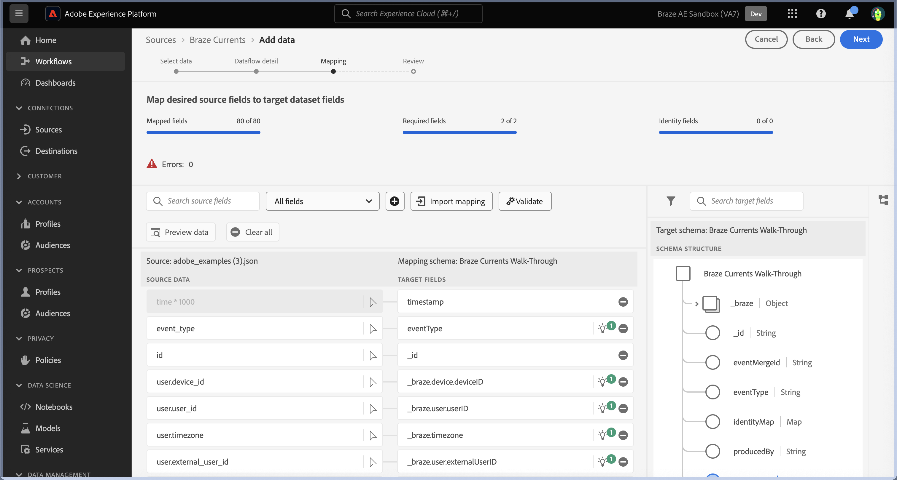

# Créer une connexion source [!DNL Braze Currents] dans l’interface utilisateur

>[!NOTE]
>
>La source [!DNL Braze Currents] est en version Beta. Veuillez lire la [présentation des sources](../../../../home.md#terms-and-conditions) pour plus d’informations sur l’utilisation de sources étiquetées bêta.

[!DNL Braze] alimente en temps réel les interactions centrées sur les clients entre les consommateurs et les marques. [!DNL Braze Currents] est un flux de données en temps réel d’événements d’engagement de la plateforme Braze, qui est l’exportation la plus robuste mais la plus granulaire de la plateforme [!DNL Braze].

Lisez le tutoriel suivant pour savoir comment importer des données d’événements d’engagement de votre compte [!DNL Braze] vers Adobe Experience Platform dans l’interface utilisateur.

## Conditions préalables

Pour suivre les étapes de ce guide, vous aurez besoin des éléments suivants :

* Connexion à [Adobe Experience Platform](https://platform.adobe.com) et autorisation de créer une connexion source en continu.
* Connectez-vous à votre [[!DNL Braze] tableau de bord](https://dashboard.braze.com/sign_in), une [licence Currents Connector](https://www.braze.com/docs/user_guide/data_and_analytics/braze_currents) inutilisée et des autorisations pour créer un connecteur. Pour plus d’informations, consultez les [exigences de configuration [!DNL Currents]](https://www.braze.com/docs/user_guide/data_and_analytics/braze_currents/setting_up_currents/#requirements).

## Prise en main

Ce tutoriel nécessite une compréhension du fonctionnement des composants suivants d’Adobe Experience Platform :

* [[!DNL Experience Data Model (XDM)] Système](../../../../../xdm/home.md) : le cadre normalisé en fonction duquel [!DNL Experience Platform] organise les données d’expérience client.
   * [Principes de base de la composition des schémas](../../../../../xdm/schema/composition.md) : découvrez les blocs de création de base des schémas XDM, y compris les principes clés et les bonnes pratiques en matière de composition de schémas.
   * [Tutoriel sur l’éditeur de schémas](../../../../../xdm/tutorials/create-schema-ui.md) : découvrez comment créer des schémas personnalisés à l’aide de l’interface utilisateur de l’éditeur de schémas.
* [[!DNL Real-Time Customer Profile]](../../../../../profile/home.md) : fournit un profil de consommateur unifié en temps réel, basé sur des données agrégées provenant de plusieurs sources.

Ce tutoriel nécessite également une compréhension pratique des [[!DNL Braze] courants](https://www.braze.com/docs/user_guide/data_and_analytics/braze_currents).

Si vous disposez déjà d’une connexion [!DNL Braze], vous pouvez ignorer le reste de ce document et passer au tutoriel sur la [configuration d’un flux de données](../../dataflow/marketing-automation.md).

## Créer un schéma XDM

>[!TIP]
>
>Vous devez créer un schéma de modèle de données d’expérience (XDM) si c’est la première fois que vous créez une connexion [!DNL Braze Currents]. Si vous avez déjà créé un schéma pour [!DNL Braze Currents], vous pouvez ignorer cette étape et passer à la [connexion de votre compte à l’Experience Platform](#connect).

Dans l’interface utilisateur de Platform, utilisez le volet de navigation de gauche, puis sélectionnez **[!UICONTROL Schémas]** pour accéder à l’espace de travail [!UICONTROL Schémas]. Ensuite, sélectionnez **[!UICONTROL Créer un schéma]**, puis **[!UICONTROL Événement d’expérience]**. Pour continuer, sélectionnez **[!UICONTROL Suivant]**.

Attribuez un nom et une description à votre schéma. Ensuite, utilisez le panneau [!UICONTROL Composition] pour configurer vos attributs de schéma. Sous [!UICONTROL Groupes de champs], sélectionnez **[!UICONTROL Ajouter]** et ajoutez le groupe de champs [!UICONTROL Événement utilisateur de braze courants]. Lorsque vous avez terminé, sélectionnez **[!UICONTROL Enregistrer]**.

Pour plus d’informations sur les schémas, consultez le guide de [création de schémas dans l’interface utilisateur](../../../../../xdm/tutorials/create-schema-ui.md).

## Connectez votre compte [!DNL Braze] à l’Experience Platform {#connect}

Dans l’interface utilisateur de Platform, sélectionnez **[!UICONTROL Sources]** dans le volet de navigation de gauche pour accéder à l’espace de travail [!UICONTROL Sources]. Vous pouvez sélectionner la catégorie appropriée dans le catalogue sur le côté gauche de votre écran. Vous pouvez également trouver la source spécifique à utiliser à l’aide de l’option de recherche.

Sous la catégorie *Automatisation marketing*, sélectionnez **[!UICONTROL Courants de braze]**, puis sélectionnez **[!UICONTROL Ajouter des données]**.

Ensuite, téléchargez le fichier d&#39;exemple [Braze Currents](https://github.com/Appboy/currents-examples/blob/master/sample-data/Adobe/adobe_examples.json) fourni. Ce fichier contient tous les champs que Braze peut envoyer dans le cadre d’un événement.

Une fois votre fichier chargé, vous devez fournir les détails de votre flux de données, y compris des informations sur votre jeu de données et le schéma vers lequel vous mappez.  Si c’est la première fois que vous connectez une source de courant de braze, créez un nouveau jeu de données.  Sinon, vous pouvez utiliser n’importe quel jeu de données existant qui fait référence au schéma de Braze.  Si vous créez un jeu de données, utilisez le schéma que nous avons créé dans la section précédente.

Ensuite, configurez le mappage pour vos données à l’aide de l’interface de mappage.

Le mappage aura les problèmes suivants qui doivent être résolus.

Dans les données source, *id* sera incorrectement mappé à *_braze.appID*. Vous devez remplacer le champ de mappage de la cible par *_id* au niveau racine du schéma. Ensuite, assurez-vous que *properties.is_amp* est mappé sur *_braze.messaging.email.isAMP*.

Supprimez ensuite le mappage *time* vers *timestamp*, puis cliquez sur l’icône d’ajout (`+`) et sélectionnez **[!UICONTROL Ajouter un champ calculé]**. Dans la zone fournie, saisissez *time \* 1000* et sélectionnez **[!UICONTROL Enregistrer]**.

Une fois le nouveau champ calculé ajouté, sélectionnez **[!UICONTROL Mapper le champ cible]** en regard du nouveau champ source et mappez-le à *l’horodatage* au niveau racine du schéma. Vous devez ensuite sélectionner **[!UICONTROL Valider]** pour vous assurer que vous n’avez plus d’erreurs.

>[!IMPORTANT]
>
>Les horodatages de Braze ne sont pas exprimés en millisecondes, mais en secondes. Pour que les horodatages dans Experience Platform soient reflétés avec précision, vous devez créer des champs calculés en millisecondes. Un calcul de &quot;time * 1000&quot; sera correctement converti en millisecondes, approprié pour le mappage à un champ d’horodatage dans Experience Platform.
>
>

Lorsque vous avez terminé, sélectionnez **[!UICONTROL Suivant]**. Utilisez la page de révision pour confirmer les détails de votre flux de données, puis sélectionnez **[!UICONTROL Terminer]**.

### Collecter les informations d’identification requises

Une fois votre connexion créée, vous devez collecter les valeurs d’informations d’identification suivantes, que vous fournissez ensuite dans le tableau de bord Braze pour envoyer des données à Experience Platform. Pour plus d’informations, consultez le [!DNL Braze] [ guide de navigation vers les courants](https://www.braze.com/docs/user_guide/data_and_analytics/braze_currents/setting_up_currents/#step-2-navigate-to-currents).

| Champ | Description |
| --- | --- |
| Identifiant client | ID client associé à la source de votre Experience Platform. |
| Secret client | Le secret client associé à la source de votre Experience Platform. |
| Identifiant du client | Identifiant du tenant associé à la source de votre Experience Platform. |
| Nom du sandbox | Environnement de test associé à la source de votre Experience Platform. |
| ID du flux de données | Identifiant de flux de données associé à la source de votre Experience Platform. |
| Point de terminaison de diffusion en continu | Point de terminaison de diffusion en continu associé à votre source Experience Platform. **Remarque** : [!DNL Braze] la convertit automatiquement en point de terminaison de la diffusion par lots. |

### Configuration de [!DNL Braze Currents] pour diffuser des données vers votre source de données

Dans [!DNL Braze Dashboard], accédez à Intégration de partenaire **->** Exportation de données, puis sélectionnez **[!DNL Create New Current]**. Vous serez invité à attribuer un nom au connecteur, à contacter les notifications concernant le connecteur et aux informations d’identification répertoriées ci-dessus. Sélectionnez les événements que vous souhaitez recevoir, configurez éventuellement les exclusions/transformations de champ souhaitées, puis sélectionnez **[!DNL Launch Current]**.

## Étapes suivantes

En suivant ce tutoriel, vous avez établi une connexion à votre compte [!DNL Braze]. Vous pouvez maintenant passer au tutoriel suivant et [configurer un flux de données pour importer les données du système d’automatisation du marketing dans [!DNL Platform]](../../dataflow/marketing-automation.md).
