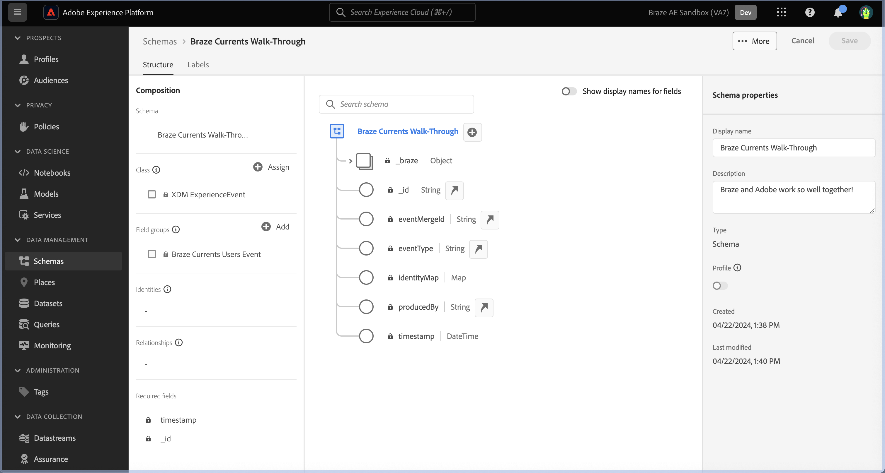
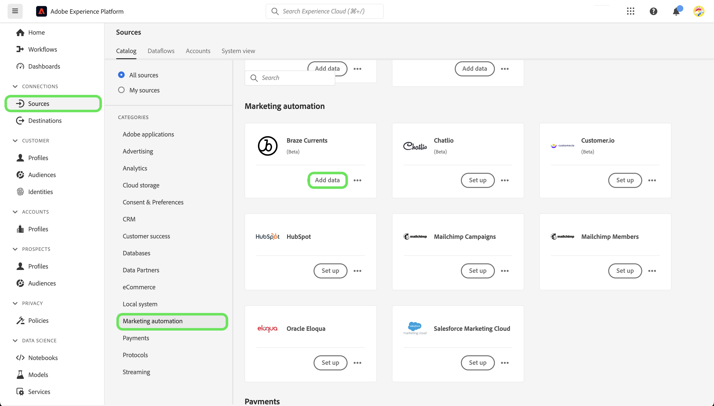

# Créer une connexion source [!DNL Braze Currents] dans l’interface utilisateur

>[!NOTE]
>
>La source [!DNL Braze Currents] est en version Beta. Veuillez lire la [présentation des sources](../../../../home.md#terms-and-conditions) pour plus d’informations sur l’utilisation de sources étiquetées bêta.

[!DNL Braze] alimente en temps réel les interactions axées sur les clients entre les consommateurs et les marques. [!DNL Braze Currents] est un flux de données en temps réel d’événements d’engagement de la plateforme Braze qui est l’exportation la plus robuste, mais granulaire, de la plateforme [!DNL Braze].

Lisez le tutoriel suivant pour savoir comment importer des données d’événements d’engagement de votre compte [!DNL Braze] à Adobe Experience Platform dans l’interface utilisateur.

## Conditions préalables

Pour suivre les étapes de ce guide, vous devez :

* Une connexion à [Adobe Experience Platform](https://platform.adobe.com) et l’autorisation de créer une connexion source en continu.
* Une connexion à votre [[!DNL Braze] tableau de bord](https://dashboard.braze.com/sign_in), une [licence actuelle du connecteur](https://www.braze.com/docs/user_guide/data_and_analytics/braze_currents) inutilisée et des autorisations pour créer un connecteur. Pour plus d’informations, consultez la [configuration requise [!DNL Currents]](https://www.braze.com/docs/user_guide/data_and_analytics/braze_currents/setting_up_currents/#requirements).

## Prise en main

Ce tutoriel nécessite une compréhension du fonctionnement des composants suivants d’Adobe Experience Platform :

* [[!DNL Experience Data Model (XDM)] Système](../../../../../xdm/home.md) : le cadre normalisé en fonction duquel [!DNL Experience Platform] organise les données d’expérience client.
   * [Principes de base de la composition des schémas](../../../../../xdm/schema/composition.md) : découvrez les blocs de création de base des schémas XDM, y compris les principes clés et les bonnes pratiques en matière de composition de schémas.
   * [Tutoriel sur l’éditeur de schémas](../../../../../xdm/tutorials/create-schema-ui.md) : découvrez comment créer des schémas personnalisés à l’aide de l’interface utilisateur de l’éditeur de schémas.
* [[!DNL Real-Time Customer Profile]](../../../../../profile/home.md) : fournit un profil de consommateur unifié en temps réel, basé sur des données agrégées provenant de plusieurs sources.

Ce tutoriel nécessite également une compréhension pratique de [[!DNL Braze] Courants](https://www.braze.com/docs/user_guide/data_and_analytics/braze_currents).

Si vous disposez déjà d’une connexion [!DNL Braze], vous pouvez ignorer le reste de ce document et passer au tutoriel sur la [configuration d’un flux de données](../../dataflow/marketing-automation.md).

## Créer un schéma XDM

>[!TIP]
>
>Vous devez créer un schéma de modèle de données d’expérience (XDM) si c’est la première fois que vous créez une connexion [!DNL Braze Currents]. Si vous avez déjà créé un schéma pour [!DNL Braze Currents], vous pouvez ignorer cette étape et passer à la [connexion de votre compte à Experience Platform](#connect).

Dans l’interface utilisateur d’Experience Platform, utilisez le volet de navigation de gauche, puis sélectionnez **[!UICONTROL Schemas]** pour accéder à l’espace de travail [!UICONTROL Schemas]. Sélectionnez ensuite **[!UICONTROL Create schema]**, puis sélectionnez **[!UICONTROL Experience Event]**. Pour continuer, sélectionnez **[!UICONTROL Next]**.

Attribuez un nom et une description à votre schéma. Utilisez ensuite le panneau [!UICONTROL Composition] pour configurer les attributs de schéma. Sous [!UICONTROL Field groups], sélectionnez **[!UICONTROL Add]** et ajoutez le groupe de champs [!UICONTROL Braze Currents User Event]. Lorsque vous avez terminé, sélectionnez **[!UICONTROL Save]**.

Pour plus d’informations sur les schémas, consultez le guide [création de schémas dans l’interface utilisateur](../../../../../xdm/tutorials/create-schema-ui.md).

## Connexion de votre compte [!DNL Braze] à Experience Platform {#connect}

Dans l’interface utilisateur d’Experience Platform, sélectionnez **[!UICONTROL Sources]** dans le volet de navigation de gauche pour accéder à l’espace de travail [!UICONTROL Sources]. Vous pouvez sélectionner la catégorie appropriée dans le catalogue sur le côté gauche de votre écran. Vous pouvez également trouver la source spécifique à utiliser à l’aide de l’option de recherche.

Dans la catégorie *Automatisation du marketing*, sélectionnez **[!UICONTROL Braze Currents]**, puis **[!UICONTROL Add data]**.

Ensuite, chargez le fichier fourni [exemple Braze Currents](https://github.com/Appboy/currents-examples/blob/master/sample-data/Adobe/adobe_examples.json). Ce fichier contient tous les champs que Braze peut envoyer dans le cadre d&#39;un événement.

Une fois votre fichier chargé, vous devez fournir les détails de votre flux de données, y compris des informations sur votre jeu de données et le schéma auquel vous mappez.  Si c’est la première fois que vous connectez une source Braze Current, créez un jeu de données.  Sinon, vous pouvez utiliser n’importe quel jeu de données existant qui fait référence au schéma Braze.  Si vous créez un jeu de données, utilisez le schéma que nous avons créé dans la section précédente.

Configurez ensuite le mappage pour vos données à l’aide de l’interface de mappage.

Le mappage présente les problèmes suivants qui doivent être résolus.

Dans les données sources, *id* sera incorrectement mappé à *_braze.appID*. Vous devez remplacer le champ de mapping de ciblage par *_id* au niveau racine du schéma. Ensuite, assurez-vous que *properties.is_amp* est mappé à *_braze.messaging.email.isAMP*.

Ensuite, supprimez le mappage *heure* à *horodatage*, puis sélectionnez l’icône d’ajout (`+`) et **[!UICONTROL Add calculated field]**. Dans la zone fournie, saisissez *heure \* 1 000* et sélectionnez **[!UICONTROL Save]**.

Une fois le nouveau champ calculé ajouté, sélectionnez **[!UICONTROL Map target field]** en regard du nouveau champ source et mappez-le à *horodatage* au niveau racine du schéma. Vous devez ensuite sélectionner **[!UICONTROL Validate]** pour vous assurer qu’il n’y a plus d’erreurs.

>[!IMPORTANT]
>
>Les dates et heures de Braze ne sont pas exprimées en millisecondes, mais plutôt en secondes. Pour que les dates et heures dans Experience Platform soient reflétées avec précision, vous devez créer des champs calculés en millisecondes. Un calcul de « temps * 1 000 » sera correctement converti en millisecondes, approprié pour mapper vers un champ d’horodatage dans Experience Platform.
>
>

Lorsque vous avez terminé, sélectionnez **[!UICONTROL Next]**. Utilisez la page de révision pour confirmer les détails de votre flux de données, puis sélectionnez **[!UICONTROL Finish]**.

### Collecter les informations d’identification requises

Une fois votre connexion créée, vous devez collecter les valeurs d’identification suivantes, que vous fournirez ensuite dans le tableau de bord Braze pour envoyer des données à Experience Platform. Pour plus d’informations, consultez le [!DNL Braze] [guide sur la navigation vers les courants](https://www.braze.com/docs/user_guide/data_and_analytics/braze_currents/setting_up_currents/#step-2-navigate-to-currents).

| Champ | Description |
| --- | --- |
| Identifiant client | Identifiant client associé à votre source Experience Platform. |
| Secret client | Secret client associé à votre source Experience Platform. |
| ID de client | Identifiant client associé à votre source Experience Platform. |
| Nom du sandbox | Sandbox associé à votre source Experience Platform. |
| ID du flux de données | Identifiant du flux de données associé à votre source Experience Platform. |
| Point de terminaison de diffusion en continu | Point d’entrée de diffusion en continu associé à votre source Experience Platform. **Remarque** : [!DNL Braze] le convertit automatiquement en point d’entrée de diffusion en continu par lots. |

### Configurer [!DNL Braze Currents] pour diffuser des données vers votre source de données

Dans l’[!DNL Braze Dashboard], accédez à Intégrations de partenaires **->** l’exportation de données, puis sélectionnez **[!DNL Create New Current]**. Vous serez invité à fournir un nom pour le connecteur, des informations de contact pour les notifications sur le connecteur et les informations d’identification répertoriées ci-dessus. Sélectionnez les événements que vous souhaitez recevoir, configurez éventuellement les exclusions/transformations de champ souhaitées, puis sélectionnez **[!DNL Launch Current]**.

## Étapes suivantes

En suivant ce tutoriel, vous avez établi une connexion à votre compte [!DNL Braze]. Vous pouvez maintenant passer au tutoriel suivant et [configurer un flux de données pour importer des données du système d’automatisation marketing dans [!DNL Experience Platform]](../../dataflow/marketing-automation.md).
