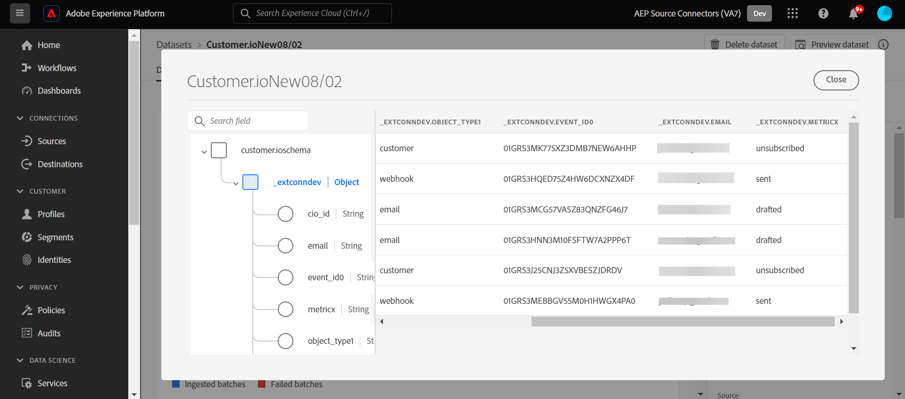

# Créer une connexion source [!DNL Customer.io] et un flux de données dans l’interface utilisateur

>[!NOTE]
>
>La source [!DNL Customer.io] est en version Beta. Veuillez lire la [présentation des sources](../../../../home.md#terms-and-conditions) pour plus d’informations sur l’utilisation de sources étiquetées bêta.

Ce tutoriel décrit les étapes à suivre pour créer une connexion source [!DNL Customer.io] et un flux de données à l’aide de l’interface utilisateur de Adobe Experience Platform.

## Prise en main {#getting-started}

Ce tutoriel nécessite une compréhension du fonctionnement des composants suivants d’Adobe Experience Platform : 

* [[!DNL Experience Data Model (XDM)] Système](../../../../../xdm/home.md) : le cadre normalisé en fonction duquel [!DNL Experience Platform] organise les données d’expérience client.
   * [Principes de base de la composition des schémas](../../../../../xdm/schema/composition.md) : découvrez les blocs de création de base des schémas XDM, y compris les principes clés et les bonnes pratiques en matière de composition de schémas.
   * [Tutoriel sur l’éditeur de schémas](../../../../../xdm/tutorials/create-schema-ui.md) : découvrez comment créer des schémas personnalisés à l’aide de l’interface utilisateur de l’éditeur de schémas.
* [[!DNL Real-Time Customer Profile]](../../../../../profile/home.md) : fournit un profil de consommateur unifié en temps réel, basé sur des données agrégées provenant de plusieurs sources.

## Conditions préalables {#prerequisites}

La section suivante fournit des informations sur les conditions préalables à remplir avant de pouvoir créer une connexion source [!DNL Customer.io].

### Exemple de JSON pour définir le schéma source de [!DNL Customer.io] {#prerequisites-json-schema}

Avant de créer une connexion source [!DNL Customer.io], vous devez disposer d’un schéma source. Vous pouvez utiliser le code JSON ci-dessous.

```
{
  "event_id": "01E4C4CT6YDC7Y5M7FE1GWWPQJ",
  "object_type": "customer",
  "metric": "subscribed",
  "timestamp": 1613063089,
  "data": {
    "customer_id": "42",
    "email_address": "test@example.com",
    "identifiers": {
      "id": "42",
      "email": "test@example.com",
      "cio_id": "d9c106000001"
    }
  }
}
```

### Création d’un schéma Experience Platform pour [!DNL Customer.io] {#create-platform-schema}

Vous devez également vous assurer de créer un schéma Experience Platform à utiliser pour votre source. Pour obtenir des instructions complètes sur la création d’un schéma[&#128279;](../../../../../xdm/schema/composition.md) consultez le tutoriel sur la création d’un schéma Experience Platform).


## Connecter votre compte [!DNL Customer.io] {#connect-account}

Dans l’interface utilisateur d’Experience Platform, sélectionnez **[!UICONTROL Sources]** dans le volet de navigation de gauche pour accéder à l’espace de travail [!UICONTROL Sources] et consulter un catalogue de sources disponibles dans Experience Platform.

Utilisez le menu *[!UICONTROL Catégories]* pour filtrer les sources par catégorie. Vous pouvez également saisir un nom de source dans la barre de recherche pour trouver une source spécifique à partir du catalogue.

Accédez à la catégorie [!UICONTROL Automatisation du marketing] pour afficher la carte source du [!DNL Customer.io]. Pour commencer, sélectionnez **[!UICONTROL Ajouter des données]**.


## Sélectionner les données {#select-data}

L’étape **[!UICONTROL Sélectionner les données]** s’affiche, fournissant une interface vous permettant de sélectionner les données que vous souhaitez importer dans Experience Platform.

* La partie gauche de l’interface est un navigateur qui vous permet d’afficher les flux de données disponibles dans votre compte ;
* La partie droite de l’interface vous permet de prévisualiser jusqu’à 100 lignes de données à partir d’un fichier JSON.

Sélectionnez **[!UICONTROL Télécharger des fichiers]** pour télécharger un fichier JSON à partir de votre système local. Vous pouvez également faire glisser et déposer le fichier JSON que vous souhaitez charger dans le panneau [!UICONTROL Glisser-déposer des fichiers].


Une fois votre fichier chargé, l’interface de prévisualisation se met à jour pour afficher un aperçu du schéma que vous avez chargé. L’interface de prévisualisation vous permet d’examiner le contenu et la structure d’un fichier. Vous pouvez également utiliser l’utilitaire [!UICONTROL Champ de recherche] pour accéder à des éléments spécifiques à partir de votre schéma.

Lorsque vous avez terminé, sélectionnez **[!UICONTROL Suivant]**.


## Détails du flux de données {#dataflow-detail}

L’étape **Détails du flux de données** s’affiche, vous offrant des options pour utiliser un jeu de données existant ou établir un nouveau jeu de données pour votre flux de données, ainsi que la possibilité de fournir un nom et une description pour votre flux de données. Au cours de cette étape, vous pouvez également configurer les paramètres d’ingestion de profil, de diagnostics d’erreur, d’ingestion partielle et d’alertes.

Lorsque vous avez terminé, sélectionnez **[!UICONTROL Suivant]**.


## Mappage {#mapping}

L’interface de [!UICONTROL mappage] fournit un outil complet pour mapper les champs sources de votre schéma source aux champs XDM cibles correspondants dans le schéma cible.

Experience Platform fournit des recommandations intelligentes pour les champs mappés automatiquement en fonction du schéma ou du jeu de données cible que vous avez sélectionné. Vous pouvez ajuster manuellement les règles de mappage en fonction de vos cas d’utilisation. Selon vos besoins, vous pouvez choisir de mapper directement des champs ou d’utiliser des fonctions de préparation de données pour transformer les données sources afin d’obtenir des valeurs informatisées ou calculées. Pour obtenir des instructions complètes sur l’utilisation de l’interface du mappeur et des champs calculés, consultez le [ Guide de l’interface utilisateur de la préparation des données ](../../../../../data-prep/ui/mapping.md).

Tous les mappages répertoriés ci-dessous sont obligatoires et doivent être configurés avant de passer à l’étape [!UICONTROL Révision].

| Champ cible | Description |
| --- | --- |
| `object_type` | Le type d’objet ; consultez la documentation [!DNL Customer.io] [événements](https://customer.io/docs/webhooks/#events) pour connaître les types pris en charge. |
| `id` | Identifiant de l’objet. |
| `email` | Adresse e-mail associée à l’objet. |
| `event_id` | Identifiant unique de l’événement. |
| `cio_id` | Identifiant [!DNL Customer.io] de l’événement. |
| `metric` | Type d’événement. Pour plus d’informations sur les types pris en charge, consultez la documentation [!DNL Customer.io] [événements](https://customer.io/docs/webhooks/#events) . |
| `timestamp` | Date et heure auxquelles l’événement s’est produit. |

>[!IMPORTANT]
>
>Ne mappez pas les `cio_id` lors de l’exécution [!DNL Customer.io] webhook dans le `test mode`, car aucun champ associé ne sera envoyé depuis [!DNL Customer.io].

Une fois vos données source mappées, sélectionnez **[!UICONTROL Suivant]**.


## Révision {#review}

L’écran de **[!UICONTROL Révision]** s’affiche, vous permettant dʼexaminer votre nouveau flux de données avant sa création. Les détails sont regroupés dans les catégories suivantes :

* **[!UICONTROL Connexion]** : affiche le type de source, le chemin d’accès correspondant au fichier source choisi et le nombre de colonnes au sein de ce fichier source.
* **[!UICONTROL Attribuer des champs de jeu de données et de mappage]** : affiche le jeu de données dans lequel les données sources sont ingérées, y compris le schéma auquel le jeu de données se conforme.

Une fois que vous avez vérifié votre flux de données, sélectionnez **[!UICONTROL Terminer]** et patientez quelques instants le temps que le flux de données soit créé.


## Obtention de l’URL du point d’entrée de diffusion en continu {#get-streaming-endpoint}

Une fois votre flux de données en continu créé, vous pouvez récupérer votre URL de point d’entrée en continu. Ce point d’entrée sera utilisé pour vous abonner à votre webhook, ce qui permettra à votre source de diffusion en continu de communiquer avec Experience Platform.

Pour construire l’URL utilisée pour configurer le webhook sur [!DNL Customer.io], vous devez récupérer les éléments suivants :

* **[!UICONTROL Identifiant du flux de données]**
* **[!UICONTROL Point d’entrée de diffusion en continu]**

Pour récupérer vos **[!UICONTROL ID de flux de données]** et **[!UICONTROL Point d’entrée de diffusion en continu]**, accédez à la page [!UICONTROL Activité de flux de données] du flux de données que vous venez de créer et copiez les détails au bas du panneau [!UICONTROL Propriétés].


Une fois que vous avez récupéré votre point d’entrée de diffusion en continu et votre identifiant de flux de données, créez une URL basée sur le modèle suivant : ```{STREAMING_ENDPOINT}?x-adobe-flow-id={DATAFLOW_ID}```. Par exemple, une URL webhook construite peut ressembler à ceci : ``https://dcs.adobedc.net/collection/febc116d22ba0ea2868e9c93b199375302afb8a589617700991bb8f3f0341ad7?x-adobe-flow-id=439b3fc4-3042-4a3a-b5e0-a494898d3fb0``

## Configuration du webhook de création de rapports dans [!DNL Customer.io] {#set-up-webhook}

Une fois votre URL de webhook créée, vous pouvez configurer votre webhook de création de rapports à l’aide de l’interface utilisateur [!DNL Customer.io]. Pour obtenir des instructions sur la configuration des Webhooks de création de rapports, consultez le [[!DNL Customer.io] guide](https://customer.io/docs/webhooks/#setup) sur la configuration des Webhooks.

Dans l’interface utilisateur [!DNL Customer.io], saisissez votre [URL webhook](#get-streaming-endpoint-url) dans le champ [!DNL WEBHOOK ENDPOINT].


>[!TIP]
>
>Vous pouvez vous abonner à différents événements pour votre webhook de création de rapports. Le message de chaque événement sera ingéré dans Experience Platform lorsqu’un critère de déclenchement d’événement d’action [!DNL Customer.io] sera satisfait. Pour plus d’informations sur les différents événements, reportez-vous à la documentation [[!DNL Customer.io] événements](https://customer.io/docs/webhooks/#events).

## Étapes suivantes {#next-steps}

En suivant ce tutoriel, vous avez configuré un flux de données en continu pour importer vos données [!DNL Customer.io] dans Experience Platform. Pour surveiller les données ingérées, reportez-vous au guide sur la [surveillance des flux de données en flux continu à l’aide de l’interface utilisateur d’Experience Platform](../../monitor-streaming.md).

## Ressources supplémentaires {#additional-resources}

Les sections ci-dessous fournissent des ressources supplémentaires auxquelles vous pouvez vous référer lors de l’utilisation de la source [!DNL Customer.io].

### Mécanismes de sécurisation {#guardrails}

Pour plus d’informations sur les mécanismes de sécurisation, reportez-vous à la page [[!DNL Customer.io] Délais d’expiration et échecs](https://customer.io/docs/webhooks/#timeouts-and-failures).

### Validation {#validation}

Pour vérifier que vous avez correctement configuré la source et [!DNL Customer.io] messages sont ingérés, procédez comme suit :

* Vous pouvez vérifier la page [!DNL Customer.io] **[!UICONTROL Journaux d’activité]** pour identifier les événements capturés par [!DNL Customer.io].


* Dans l’interface utilisateur d’Experience Platform, sélectionnez **[!UICONTROL Afficher les flux de données]** à côté du menu de carte [!DNL Customer.io] dans le catalogue de sources. Sélectionnez ensuite **[!UICONTROL Prévisualiser le jeu de données]** pour vérifier les données ingérées pour les événements que vous avez sélectionnés dans [!DNL Customer.io].


