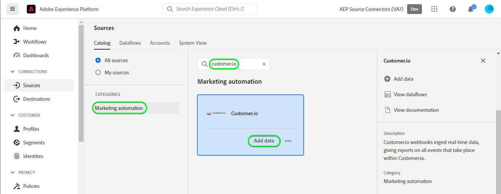

# Créez un [!DNL Customer.io] connexion source et flux de données dans l’interface utilisateur

>[!NOTE]
>
>La source [!DNL Customer.io] est en version Beta. Veuillez lire la [présentation des sources](../../../../home.md#terms-and-conditions) pour plus d’informations sur l’utilisation de sources étiquetées bêta.

Ce tutoriel décrit les étapes à suivre pour créer une [!DNL Customer.io] connexion source et flux de données à l’aide de l’interface utilisateur de Adobe Experience Platform.

## Prise en main {#getting-started}

Ce tutoriel nécessite une compréhension du fonctionnement des composants suivants d’Adobe Experience Platform : 

* [[!DNL Experience Data Model (XDM)] Système](../../../../../xdm/home.md) : le cadre normalisé en fonction duquel [!DNL Experience Platform] organise les données d’expérience client.
   * [Principes de base de la composition des schémas](../../../../../xdm/schema/composition.md) : découvrez les blocs de création de base des schémas XDM, y compris les principes clés et les bonnes pratiques en matière de composition de schémas.
   * [Tutoriel sur l’éditeur de schémas](../../../../../xdm/tutorials/create-schema-ui.md) : découvrez comment créer des schémas personnalisés à l’aide de l’interface utilisateur de l’éditeur de schémas.
* [[!DNL Real-Time Customer Profile]](../../../../../profile/home.md) : fournit un profil de consommateur unifié en temps réel, basé sur des données agrégées provenant de plusieurs sources.

## Conditions préalables {#prerequisites}

La section suivante fournit des informations sur les conditions préalables à la création d’un [!DNL Customer.io] connexion source.

### Exemple de fichier JSON pour définir le schéma source pour [!DNL Customer.io] {#prerequisites-json-schema}

Avant de créer un [!DNL Customer.io] connexion source, un schéma source doit être fourni. Vous pouvez utiliser le fichier JSON ci-dessous.

```
{
  "event_id": "01E4C4CT6YDC7Y5M7FE1GWWPQJ",
  "object_type": "customer",
  "metric": "subscribed",
  "timestamp": 1613063089,
  "data": {
    "customer_id": "42",
    "email_address": "test@example.com",
    "identifiers": {
      "id": "42",
      "email": "test@example.com",
      "cio_id": "d9c106000001"
    }
  }
}
```

### Création d’un schéma Platform pour [!DNL Customer.io] {#create-platform-schema}

Vous devez également vous assurer de créer un schéma Platform à utiliser pour votre source. Voir le tutoriel sur [création d’un schéma Platform](../../../../../xdm/schema/composition.md) pour obtenir des instructions complètes sur la création d’un schéma.


## Connecter votre compte [!DNL Customer.io] {#connect-account}

Dans l’interface utilisateur de Platform, sélectionnez **[!UICONTROL Sources]** dans le volet de navigation de gauche pour accéder à la fonction [!UICONTROL Sources] workspace et afficher un catalogue de sources disponibles dans Experience Platform.

Utilisez la variable *[!UICONTROL Catégories]* pour filtrer les sources par catégorie. Vous pouvez également saisir un nom de source dans la barre de recherche pour trouver une source spécifique dans le catalogue.

Accédez au [!UICONTROL Automatisation du marketing] pour afficher la catégorie [!DNL Customer.io] carte source. Pour commencer, sélectionnez **[!UICONTROL Ajouter des données]**.



## Sélectionner les données {#select-data}

Le **[!UICONTROL Sélectionner des données]** s’affiche, fournissant une interface vous permettant de sélectionner les données à importer dans Platform.

* La partie gauche de l’interface est un navigateur qui vous permet d’afficher les flux de données disponibles dans votre compte ;
* La partie droite de l’interface vous permet de prévisualiser jusqu’à 100 lignes de données à partir d’un fichier JSON.

Sélectionner **[!UICONTROL Chargement de fichiers]** pour charger un fichier JSON à partir de votre système local. Vous pouvez également faire glisser et déposer le fichier JSON que vous souhaitez charger dans le [!UICONTROL Glisser-déposer des fichiers] du panneau.


Une fois le fichier chargé, l’interface de prévisualisation se met à jour pour afficher un aperçu du schéma que vous avez chargé. L’interface d’aperçu vous permet d’examiner le contenu et la structure d’un fichier. Vous pouvez également utiliser la variable [!UICONTROL Champ de recherche] pour accéder à des éléments spécifiques de votre schéma.

Lorsque vous avez terminé, sélectionnez **[!UICONTROL Suivant]**.


## Détails du flux de données {#dataflow-detail}

Le **Détails du flux de données** s’affiche, vous fournissant des options permettant d’utiliser un jeu de données existant ou d’établir un nouveau jeu de données pour votre flux de données, ainsi qu’une opportunité de fournir un nom et une description pour votre flux de données. Au cours de cette étape, vous pouvez également configurer des paramètres pour l’ingestion de profils, les diagnostics d’erreur, l’ingestion partielle et les alertes.

Lorsque vous avez terminé, sélectionnez **[!UICONTROL Suivant]**.


## Mappage {#mapping}

L’interface de [!UICONTROL mappage] fournit un outil complet pour mapper les champs sources de votre schéma source aux champs XDM cibles correspondants dans le schéma cible.

Platform fournit des recommandations intelligentes pour les champs mappés automatiquement en fonction du schéma ou du jeu de données cible que vous avez sélectionné. Vous pouvez ajuster manuellement les règles de mappage en fonction de vos cas d’utilisation. Selon vos besoins, vous pouvez choisir de mapper directement des champs ou d’utiliser des fonctions de préparation de données pour transformer les données sources afin d’obtenir des valeurs informatisées ou calculées. Pour obtenir des instructions complètes sur l’utilisation de l’interface du mappeur et des champs calculés, reportez-vous à la section [Guide de l’interface utilisateur de la préparation de données](../../../../../data-prep/ui/mapping.md).

Tous les mappages répertoriés ci-dessous sont obligatoires et doivent être configurés avant de passer à la [!UICONTROL Réviser] scène.

| Champ cible | Description |
| --- | --- |
| `object_type` | Le type d’objet, voir [!DNL Customer.io] [events](https://customer.io/docs/webhooks/#events) documentation pour les types pris en charge. |
| `id` | Identifiant de l’objet. |
| `email` | Adresse électronique associée à l’objet. |
| `event_id` | Identifiant unique de l’événement. |
| `cio_id` | Le [!DNL Customer.io] identifiant de l’événement. |
| `metric` | Le type d&#39;événement. Pour plus d’informations, reportez-vous à la section [!DNL Customer.io] [events](https://customer.io/docs/webhooks/#events) documentation pour les types pris en charge. |
| `timestamp` | Horodatage au moment où l’événement s’est produit. |

>[!IMPORTANT]
>
>Ne pas mapper `cio_id` lors de l’exécution [!DNL Customer.io] webhook dans `test mode` car aucun champ associé n’est envoyé à partir de [!DNL Customer.io].

Une fois le mappage de vos données source réussi, sélectionnez **[!UICONTROL Suivant]**.


## Révision {#review}

L’écran de **[!UICONTROL Révision]** s’affiche, vous permettant dʼexaminer votre nouveau flux de données avant sa création. Les détails sont regroupés dans les catégories suivantes :

* **[!UICONTROL Connexion]** : affiche le type de source, le chemin d’accès correspondant au fichier source choisi et le nombre de colonnes au sein de ce fichier source.
* **[!UICONTROL Attribuer des champs de jeu de données et de mappage]** : affiche le jeu de données dans lequel les données sources sont ingérées, y compris le schéma auquel le jeu de données se conforme.

Une fois que vous avez vérifié votre flux de données, sélectionnez **[!UICONTROL Terminer]** et patientez quelques instants le temps que le flux de données soit créé.


## Obtention de l’URL de votre point de terminaison de diffusion en continu {#get-streaming-endpoint}

Une fois votre flux de données de diffusion en continu créé, vous pouvez désormais récupérer l’URL de votre point de terminaison de diffusion en continu. Ce point de terminaison sera utilisé pour s’abonner à votre webhook, ce qui permet à votre source de diffusion en continu de communiquer avec l’Experience Platform.

Pour construire l’URL utilisée pour configurer le webhook sur [!DNL Customer.io] vous devez récupérer les éléments suivants :

* **[!UICONTROL Identifiant de flux de données]**
* **[!UICONTROL Point de terminaison de diffusion]**

Pour récupérer votre **[!UICONTROL Identifiant de flux de données]** et **[!UICONTROL Point de terminaison de diffusion]**, accédez au [!UICONTROL Activité Flux de données] de la page du flux de données que vous venez de créer et de copier les détails depuis le bas de la page [!UICONTROL Propriétés] du panneau.


Une fois que vous avez récupéré votre point de terminaison de diffusion en continu et votre identifiant de flux de données, créez une URL basée sur le modèle suivant : ```{STREAMING_ENDPOINT}?x-adobe-flow-id={DATAFLOW_ID}```. Par exemple, une URL webhook construite peut se présenter comme suit : ``https://dcs.adobedc.net/collection/febc116d22ba0ea2868e9c93b199375302afb8a589617700991bb8f3f0341ad7?x-adobe-flow-id=439b3fc4-3042-4a3a-b5e0-a494898d3fb0``

## Configuration du webhook de création de rapports dans [!DNL Customer.io] {#set-up-webhook}

Une fois votre URL webhook créée, vous pouvez désormais configurer votre webhook de création de rapports à l’aide de la variable [!DNL Customer.io] de l’interface utilisateur. Pour obtenir des instructions sur la configuration des webhooks de reporting, veuillez lire le [[!DNL Customer.io] guide](https://customer.io/docs/webhooks/#setup) lors de la configuration des webhooks.

Dans le [!DNL Customer.io] interface utilisateur, saisissez vos [webhook URL](#get-streaming-endpoint-url) dans le [!DNL WEBHOOK ENDPOINT] champ .


>[!TIP]
>
>Vous pouvez vous abonner à divers événements pour votre webhook de reporting. Le message de chaque événement sera ingéré dans Platform lorsqu’une [!DNL Customer.io] les critères de déclenchement d’événement d’action sont satisfaits. Pour plus d’informations sur les différents événements, reportez-vous au [[!DNL Customer.io] documentation sur les événements](https://customer.io/docs/webhooks/#events).

## Étapes suivantes {#next-steps}

En suivant ce tutoriel, vous avez correctement configuré un flux de données en continu pour importer votre [!DNL Customer.io] données à Experience Platform. Pour surveiller les données en cours d’ingestion, reportez-vous au guide sur [surveillance des flux de données en continu à l’aide de l’interface utilisateur de Platform](../../monitor-streaming.md).

## Ressources supplémentaires {#additional-resources}

Les sections ci-dessous contiennent des ressources supplémentaires auxquelles vous pouvez vous référer lors de l’utilisation de la variable [!DNL Customer.io] source.

### Mécanismes de sécurisation {#guardrails}

Pour plus d’informations sur les barrières de sécurité, reportez-vous à la section [[!DNL Customer.io] page délais et échecs](https://customer.io/docs/webhooks/#timeouts-and-failures).

### Validation {#validation}

Pour vérifier que vous avez correctement configuré la source et [!DNL Customer.io] les messages sont en cours d’ingestion. Procédez comme suit :

* Vous pouvez vérifier les [!DNL Customer.io] **[!UICONTROL Journaux d’activité]** pour identifier les événements capturés par [!DNL Customer.io].


* Dans l’interface utilisateur de Platform, sélectionnez **[!UICONTROL Afficher les flux de données]** en regard de la variable [!DNL Customer.io] menu de carte dans le catalogue des sources. Ensuite, sélectionnez **[!UICONTROL Prévisualisation d’un jeu de données]** pour vérifier les données ingérées pour les événements dans lesquels vous avez sélectionné [!DNL Customer.io].


