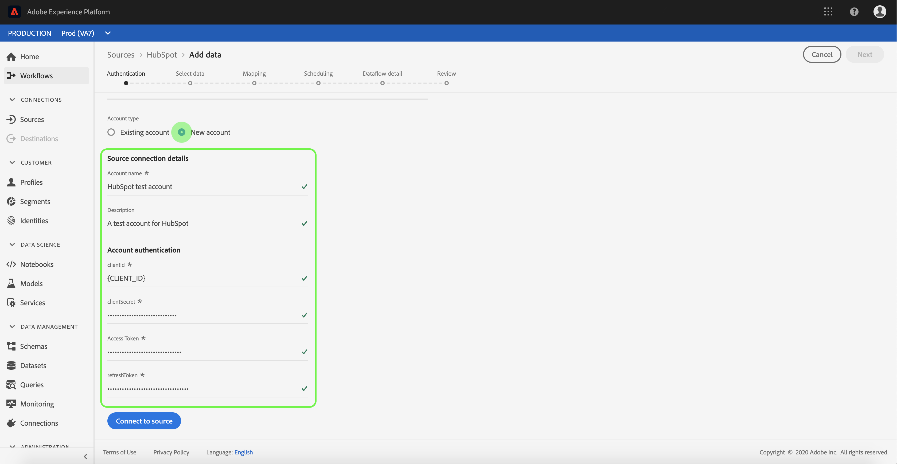

# Création d’un connecteur source HubSpot dans l’interface utilisateur

Les connecteurs source d’Adobe Experience Platform permettent d’assimiler des données externes sur une base planifiée. Ce didacticiel décrit la procédure à suivre pour créer un connecteur source HubSpot à l’aide de l’interface utilisateur de la plate-forme.

## Prise en main

Ce didacticiel nécessite une compréhension pratique des composants suivants d’Adobe Experience Platform :

* [Système](../../../../../xdm/home.md)de modèle de données d’expérience (XDM) : Cadre normalisé selon lequel la plateforme d’expérience organise les données d’expérience client.
   * [Principes de base de la composition](../../../../../xdm/schema/composition.md)de  : Découvrez les éléments de base des  XDM, y compris les principes clés et les bonnes pratiques en matière de composition de .
   * [Didacticiel](../../../../../xdm/tutorials/create-schema-ui.md)de l’éditeur de  : Découvrez comment créer des  personnalisées à l’aide de l’interface utilisateur de l’éditeur de  de.
* du client en temps réel : Fournit un client en temps réel unifié basé sur des données agrégées provenant de plusieurs sources.

Si vous disposez déjà d’une connexion de base HubSpot, vous pouvez ignorer le reste de ce et passer au didacticiel sur la [configuration d’un flux de données](../../dataflow/marketing-automation.md)d’automatisation marketing.

### Collecte des informations d’identification requises

Pour accéder à votre compte HubSpot sur la plateforme, vous devez fournir les valeurs suivantes :

| Informations d’identification | Description |
| ---------- | ----------- |
| `clientId` | ID client associé à votre application HubSpot. |
| `clientSecret` | Le secret client associé à votre application HubSpot. |
| `accessToken` | Le obtenu lors de l’authentification initiale de votre intégration OAuth. |
| `refreshToken` | Jeton d’actualisation obtenu lors de l’authentification initiale de votre intégration OAuth. |

Pour plus d’informations sur la prise en main, reportez-vous à ce [HubSpot](https://developers.hubspot.com/docs/methods/oauth2/oauth2-overview).

## Connectez votre compte HubSpot.

Une fois que vous avez rassemblé les informations d’identification requises, vous pouvez suivre les étapes ci-dessous pour créer une nouvelle connexion de base entrante afin de lier votre compte HubSpot à la plateforme.

Connectez-vous à <a href="https://platform.adobe.com" target="_blank">Adobe Experience Platform</a> , puis sélectionnez **Sources** dans la barre de navigation de gauche pour accéder à l’espace de travail *Sources* . L’écran *Catalogue* affiche diverses sources pour lesquelles vous pouvez créer des connexions de base entrantes, et chaque source indique le nombre de connexions de base existantes qui lui sont associées.

Sous le  d’automatisation *du* marketing, sélectionnez **Emplacement** du concentrateur pour afficher une barre d’informations sur le côté droit de l’écran. La barre d’informations fournit une brève description de la source sélectionnée ainsi que des options permettant de se connecter à la source ou au  sa documentation. Pour créer une connexion de base entrante, sélectionnez **Connexion source**.

La page *Se connecter au concentrateur* s’affiche. Sur cette page, vous pouvez utiliser de nouvelles informations d’identification ou des informations d’identification existantes.

### Nouveau compte

Si vous utilisez de nouvelles informations d’identification, sélectionnez **Nouveau compte**. Dans le formulaire d’entrée qui s’affiche, indiquez le nom de la connexion de base, une description facultative et vos informations d’identification HubSpot. Lorsque vous avez terminé, sélectionnez **Se connecter** , puis accordez un peu de temps pour que la nouvelle connexion de base s’établisse.

### Compte existant

Pour connecter un compte existant, sélectionnez le compte HubSpot avec lequel vous souhaitez vous connecter, puis sélectionnez **Suivant** pour continuer.

## Étapes suivantes

En suivant ce didacticiel, vous avez établi une connexion de base à votre compte HubSpot. Vous pouvez maintenant passer au didacticiel suivant et [configurer un flux de données pour importer les données du système d’automatisation du marketing dans Platform](../../dataflow/marketing-automation.md).