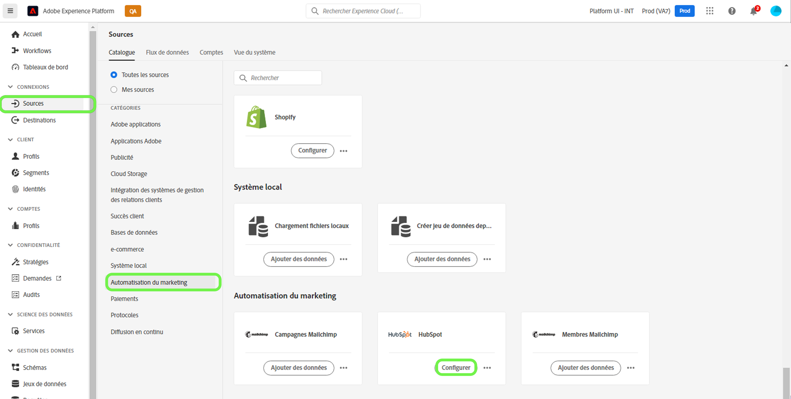
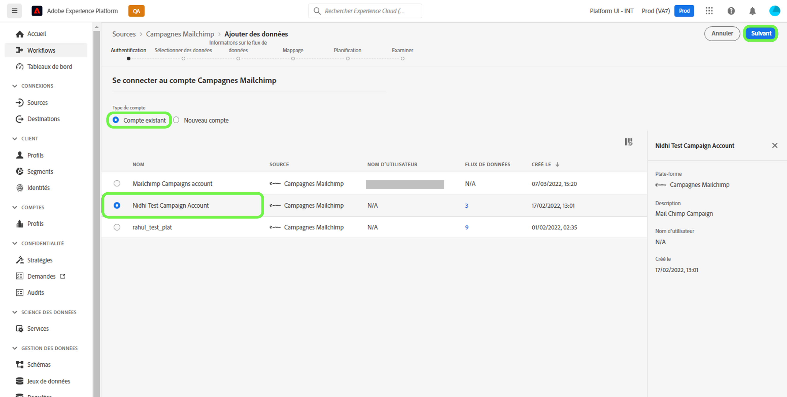
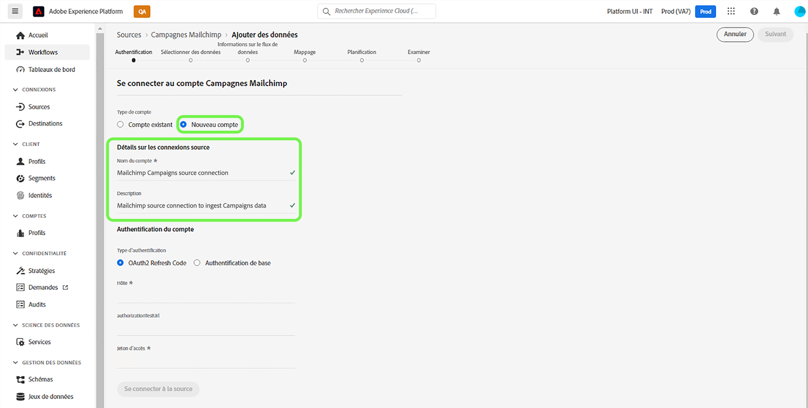
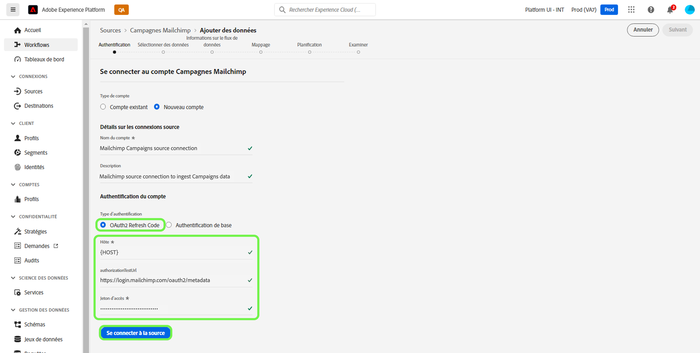
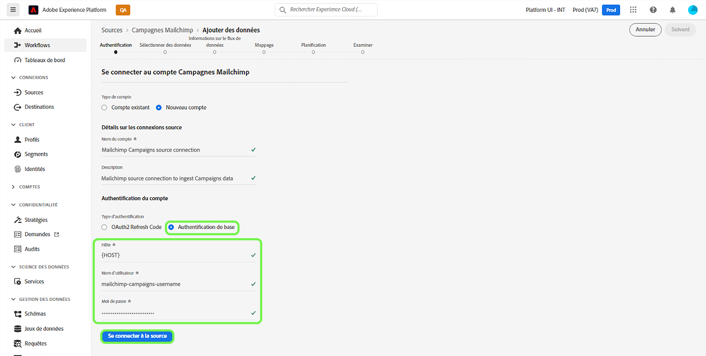
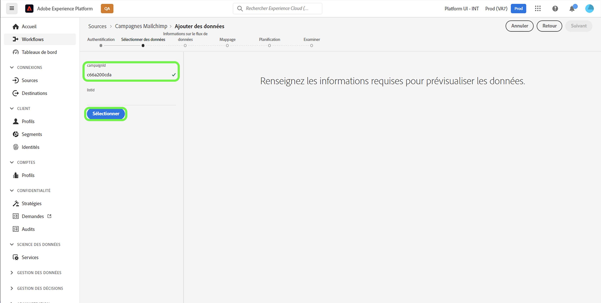
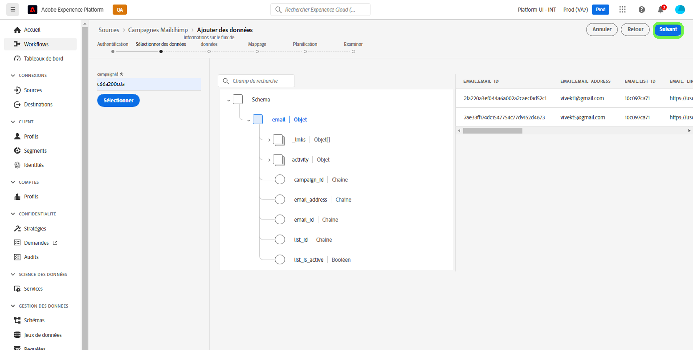

# Créer une connexion source [!DNL Mailchimp Campaigns] à l’aide de l’interface utilisateur d’Experience Platform

Ce tutoriel décrit les étapes à suivre pour créer un connecteur source [!DNL Mailchimp] afin d’ingérer des données de [!DNL Mailchimp Campaigns] vers Adobe Experience Platform à l’aide de l’interface utilisateur.

## Prise en main

Ce guide nécessite une compréhension professionnelle des composants suivants d’Adobe Experience Platform :

* [Sources](../../../../home.md) : Experience Platform permet d’ingérer des données provenant de diverses sources tout en vous offrant la possibilité de structurer, d’étiqueter et d’améliorer les données entrantes à l’aide des services [!DNL Experience Platform].
* [Sandbox](../../../../../sandboxes/home.md) : Experience Platform fournit des sandbox virtuels qui divisent une instance Experience Platform unique en environnements virtuels distincts pour favoriser le développement et l’évolution d’applications d’expérience digitale.

## Collecter les informations d’identification requises

Pour importer vos données [!DNL Mailchimp Campaigns] dans Experience Platform, vous devez d’abord fournir les informations d’authentification appropriées qui correspondent à votre compte [!DNL Mailchimp].

La source [!DNL Mailchimp Campaigns] prend en charge le code d’actualisation OAuth 2 et l’authentification de base. Pour plus d’informations sur ces types d’authentification, reportez-vous aux tableaux ci-dessous.

### Code d’actualisation OAuth 2

| Informations d’identification | Description |
| --- | --- |
| Domaine | URL racine utilisée pour la connexion à l’API Mailchimp. Le format de l’URL racine est `https://{DC}.api.mailchimp.com`, où `{DC}` représente le centre de données qui correspond à votre compte. |
| URL du test d’autorisation | L’URL du test d’autorisation est utilisée pour valider les informations d’identification lors de la connexion de [!DNL Mailchimp] à Experience Platform. Si ce n’est pas le cas, les informations d’identification sont automatiquement vérifiées à l’étape de création de la connexion source. |
| Jeton d’accès | Jeton d’accès correspondant utilisé pour authentifier la source. Ceci est requis pour l’authentification basée sur OAuth. |

Pour plus d’informations sur l’utilisation d’OAuth 2 pour authentifier le compte [!DNL Mailchimp] auprès d’Experience Platform, consultez ce [[!DNL Mailchimp] document sur l’utilisation d’OAuth 2](https://mailchimp.com/developer/marketing/guides/access-user-data-oauth-2/).

### Authentification de base

| Informations d’identification | Description |
| --- | --- |
| Domaine | URL racine utilisée pour la connexion à l’API Mailchimp. Le format de l’URL racine est `https://{DC}.api.mailchimp.com`, où `{DC}` représente le centre de données qui correspond à votre compte. |
| Nom d’utilisateur | Nom d’utilisateur correspondant à votre compte Mailchimp. Ceci est requis pour l’authentification de base. |
| Mot de passe | Mot de passe correspondant à votre compte Mailchimp. Ceci est requis pour l’authentification de base. |

## Connexion de votre compte [!DNL Mailchimp Campaigns] à Experience Platform

Dans l’interface utilisateur d’Experience Platform, sélectionnez **[!UICONTROL Sources]** dans la barre de navigation de gauche pour accéder à l’espace de travail [!UICONTROL Sources]. L’écran [!UICONTROL Catalogue] affiche diverses sources avec lesquelles vous pouvez créer un compte.

Vous pouvez sélectionner la catégorie appropriée dans le catalogue sur le côté gauche de votre écran. Vous pouvez également trouver la source spécifique à utiliser à l’aide de l’option de recherche.

Sous la catégorie [!UICONTROL Automatisation marketing], sélectionnez **[!UICONTROL Campagne Mailchimp]**, puis **[!UICONTROL Ajouter des données]**.

La page **[!UICONTROL Connecter le compte de campagnes Mailchimp]** s’affiche. Sur cette page, vous pouvez indiquer si vous accédez à un compte existant ou si vous choisissez de créer un compte.

### Compte existant

Pour utiliser un compte existant, sélectionnez le compte [!DNL Mailchimp Campaigns] avec lequel vous souhaitez créer un flux de données, puis sélectionnez **[!UICONTROL Suivant]** pour continuer.

### Nouveau compte

Si vous créez un compte, sélectionnez **[!UICONTROL Nouveau compte]**, puis fournissez un nom et une description pour les détails de votre connexion source [!DNL Mailchimp Campaigns].

#### S’authentifier à l’aide d’OAuth 2

Pour utiliser OAuth 2, sélectionnez [!UICONTROL Code d’actualisation OAuth 2], indiquez les valeurs de votre domaine, de l’URL du test d’autorisation et du jeton d’accès, puis sélectionnez **[!UICONTROL Se connecter à la source]**. Patientez quelques instants le temps que vos informations d’identification soient validées, puis cliquez sur **[!UICONTROL Suivant]** pour continuer.

#### S’authentifier à l’aide de l’authentification de base

Pour utiliser l’authentification de base, sélectionnez [!UICONTROL Authentification de base], indiquez les valeurs de votre domaine, de votre nom d’utilisateur et de votre mot de passe, puis sélectionnez **[!UICONTROL Se connecter à la source]**. Patientez quelques instants le temps que vos informations d’identification soient validées, puis cliquez sur **[!UICONTROL Suivant]** pour continuer.

### Sélectionner les données [!DNL Mailchimp Campaigns]

Une fois votre source authentifiée, vous devez fournir la valeur `campaignId` qui correspond à votre compte [!DNL Mailchimp Campaigns].

Sur la page [!UICONTROL Sélectionner des données], saisissez votre `campaignId`, puis cliquez sur **[!UICONTROL Explorer]**.

La page se met à jour dans une arborescence de schéma interactif qui vous permet d’explorer et d’inspecter la hiérarchie de vos données. Sélectionnez **[!UICONTROL Suivant]** pour continuer.

## Étapes suivantes

Une fois votre compte [!DNL Mailchimp] authentifié et vos données [!DNL Mailchimp Campaigns] sélectionnées, vous pouvez commencer à créer un flux de données pour importer vos données dans Experience Platform. Pour obtenir des instructions détaillées sur la création d’un flux de données, consultez la documentation sur la [création d’un flux de données pour importer des données d’automatisation marketing dans Experience Platform](../../dataflow/marketing-automation.md).
