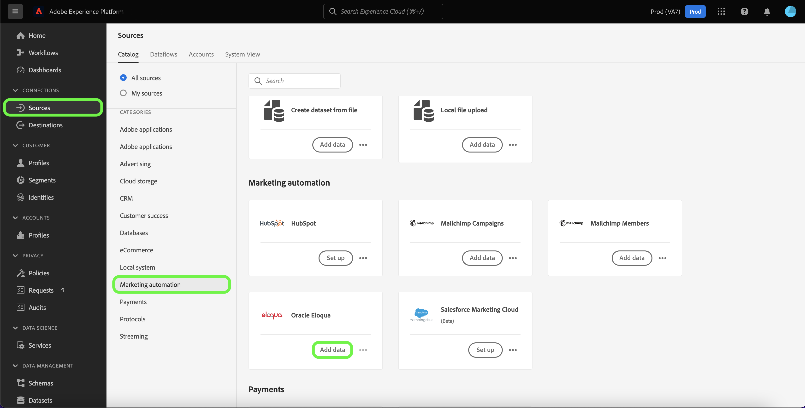
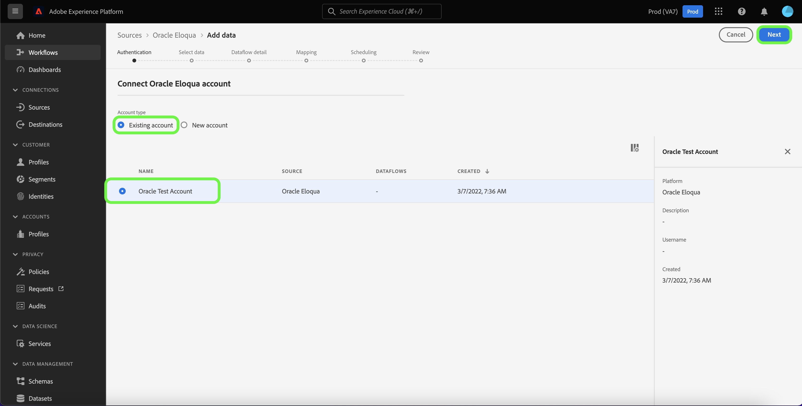

# Créer une connexion source [!DNL Oracle Eloqua] à l’aide de l’interface utilisateur de Platform

>[!IMPORTANT]
>
>La source [!DNL Oracle Eloqua] sera abandonnée fin mai 2025.

Ce tutoriel décrit les étapes à suivre pour créer une connexion source [!DNL Oracle Eloqua] à l’aide de l’interface utilisateur de Adobe Experience Platform.

## Prise en main

Ce guide nécessite une connaissance pratique des composants suivants de Platform :

* [Sources](../../../../home.md) : Platform permet d’ingérer des données provenant de diverses sources tout en vous offrant la possibilité de structurer, d’étiqueter et d’améliorer les données entrantes à l’aide des services de Platform.
* [Sandbox](../../../../../sandboxes/home.md) : Platform fournit des sandbox virtuels qui divisent une instance de plateforme unique en environnements virtuels distincts pour favoriser le développement et l’évolution d’applications d’expérience digitale.

Si vous disposez déjà d’un compte authentifié [!DNL Oracle Eloqua] sur Platform, alors vous pouvez ignorer le reste de ce document et passer au tutoriel sur comment [créer un flux de données pour apporter les données d’automatisation du marketing à Platform](../../dataflow/marketing-automation.md).

### Collecter les informations d’identification requises

Pour connecter [!DNL Oracle Eloqua] à Platform, vous devez fournir des valeurs pour les propriétés d’authentification suivantes :

| Informations d’identification | Description |
| --- | --- |
| Point d’entrée | Point d’entrée de votre serveur [!DNL Oracle Eloqua]. [!DNL Oracle Eloqua] prend en charge plusieurs centres de données. Pour trouver votre point de terminaison, connectez-vous à l’[[!DNL Oracle Eloqua] interface](https://login.eloqua.com) avec vos informations d’identification, puis copiez la partie URL de base à partir de l’URL de redirection. Le format de votre modèle d’URL est `xxx.xx.eloqua.com` et doit être saisi sans `http` ni `https`. |
| Nom d’utilisateur | Nom d’utilisateur de votre serveur [!DNL Oracle Eloqua]. Le nom d’utilisateur doit être formaté sous la forme `siteName + \\ + username`, où `siteName` est le nom de société que vous avez utilisé pour vous connecter à [!DNL Oracle Eloqua] et `username` est votre nom d’utilisateur. Par exemple, votre nom d’utilisateur de connexion peut être : `Eloqua\Andy`. **Remarque** : Vous devez utiliser une seule barre oblique inverse (`\`) lors de l’utilisation de l’interface utilisateur, car l’interface utilisateur Experience Platform ajoute automatiquement une barre oblique inverse supplémentaire (`\`) lors de la saisie d’un nom d’utilisateur. |
| Mot de passe | Mot de passe correspondant à votre nom d’utilisateur [!DNL Oracle Eloqua]. |

Pour plus d’informations sur les informations d’authentification pour [!DNL Oracle Eloqua], consultez le [[!DNL Oracle Eloqua] guide sur l’authentification](https://docs.oracle.com/en/cloud/saas/marketing/eloqua-rest-api/Authentication_Basic.html).

Une fois que vous avez rassemblé les informations d’identification requises, vous pouvez suivre la procédure ci-dessous et lier votre compte [!DNL Oracle Eloqua] à Platform.

## Connecter votre compte [!DNL Oracle Eloqua]

Dans l’interface utilisateur de Platform, sélectionnez **[!UICONTROL Sources]** dans le volet de navigation de gauche pour accéder à l’espace de travail [!UICONTROL Sources]. L’écran [!UICONTROL Catalogue] affiche diverses sources avec lesquelles vous pouvez créer un compte.

Vous pouvez sélectionner la catégorie appropriée dans le catalogue sur le côté gauche de votre écran. Vous pouvez également trouver la source spécifique à utiliser à l’aide de l’option de recherche.

Sous la catégorie [!UICONTROL Automatisation marketing], sélectionnez **[!UICONTROL Oracle Eloqua]**, puis sélectionnez **[!UICONTROL Ajouter des données]**.

La page **[!UICONTROL Connecter un compte Eloqua Oracle]** s’affiche. Sur cette page, vous pouvez utiliser de nouvelles informations d’identification ou des informations d’identification existantes.

### Compte existant

Pour utiliser un compte existant, sélectionnez le compte [!DNL Oracle Eloqua] avec lequel vous souhaitez créer un flux de données, puis sélectionnez **[!UICONTROL Suivant]** pour continuer.

### Nouveau compte

Si vous créez un compte, sélectionnez **[!UICONTROL Nouveau compte]**, puis fournissez un nom, une description facultative et les valeurs appropriées pour vos informations d’identification [!DNL Oracle Eloqua]. Lorsque vous avez terminé, sélectionnez **[!UICONTROL Connexion à la source]**, puis patientez quelques instants le temps que la nouvelle connexion sʼétablisse.

## Étapes suivantes

En suivant ce tutoriel, vous avez authentifié et avez créé une connexion source entre votre compte [!DNL Oracle Eloqua] et Platform. Vous pouvez maintenant passer au tutoriel suivant et [créer un flux de données pour apporter les données d’automatisation du marketing à Platform](../../dataflow/marketing-automation.md).
