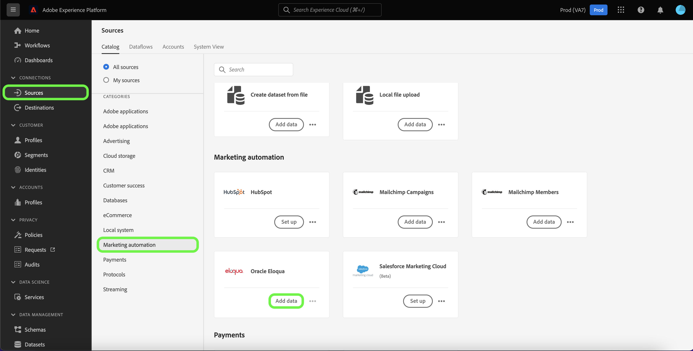
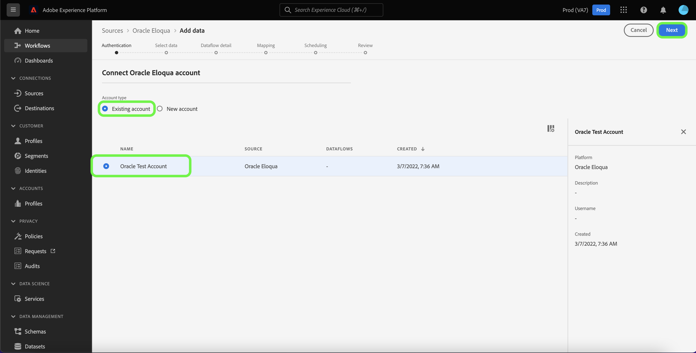
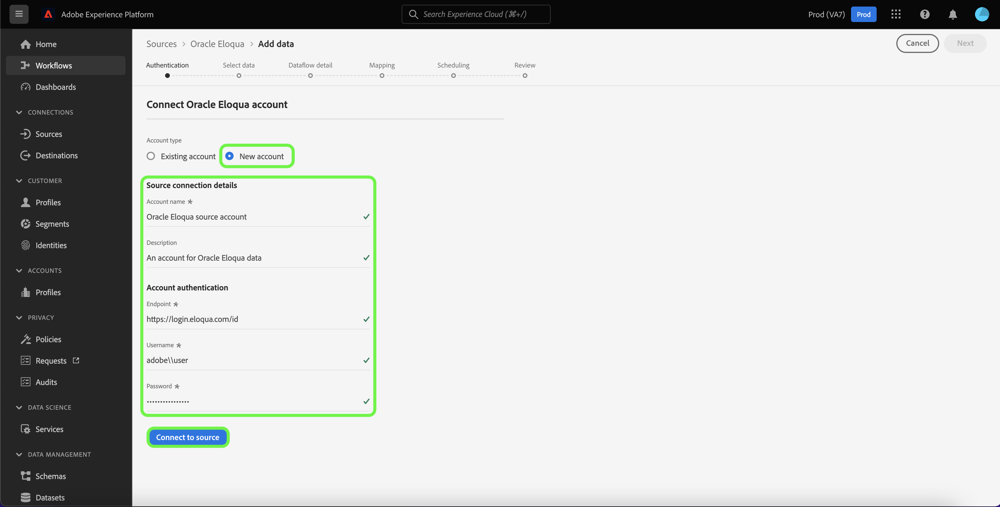

# Créer une connexion source [!DNL Oracle Eloqua] à l’aide de l’interface utilisateur d’Experience Platform

>[!WARNING]
>
>La source [!DNL Oracle Eloqua] sera abandonnée en janvier 2026. Une nouvelle source sera publiée plus tard cette année comme alternative. Une fois la nouvelle source publiée, vous devez planifier la migration vers la nouvelle source en créant de nouvelles connexions de compte et de nouveaux flux de données avant la fin du mois de janvier 2026.

Ce tutoriel décrit les étapes à suivre pour créer une connexion source [!DNL Oracle Eloqua] à l’aide de l’interface utilisateur de Adobe Experience Platform.

## Prise en main

Ce guide nécessite une compréhension professionnelle des composants suivants d’Experience Platform :

* [Sources](../../../../home.md) : Experience Platform permet d’ingérer des données provenant de diverses sources tout en vous offrant la possibilité de structurer, d’étiqueter et d’améliorer les données entrantes à l’aide des services d’Experience Platform.
* [Sandbox](../../../../../sandboxes/home.md) : Experience Platform fournit des sandbox virtuels qui divisent une instance Experience Platform unique en environnements virtuels distincts pour favoriser le développement et l’évolution d’applications d’expérience digitale.

Si vous disposez déjà d’un compte [!DNL Oracle Eloqua] authentifié sur Experience Platform, vous pouvez ignorer le reste de ce document et passer au tutoriel sur la [création d’un flux de données pour apporter les données d’automatisation du marketing à Experience Platform](../../dataflow/marketing-automation.md).

### Collecter les informations d’identification requises

Pour connecter [!DNL Oracle Eloqua] à Experience Platform, vous devez fournir des valeurs pour les propriétés d’authentification suivantes :

| Informations d’identification | Description |
| --- | --- |
| Point d’entrée | Point d’entrée de votre serveur [!DNL Oracle Eloqua]. [!DNL Oracle Eloqua] prend en charge plusieurs centres de données. Pour trouver votre point d’entrée, connectez-vous à l’interface [[!DNL Oracle Eloqua] interface](https://login.eloqua.com) avec vos informations d’identification, puis copiez la partie URL de base à partir de l’URL de redirection. Le format de votre modèle d’URL est `xxx.xx.eloqua.com` et doit être saisi sans `http` ni `https`. |
| Nom d’utilisateur | Nom d’utilisateur de votre serveur [!DNL Oracle Eloqua]. Le nom d’utilisateur doit être au format `siteName + \\ + username`, où `siteName` correspond au nom de la société avec laquelle vous vous êtes connecté à [!DNL Oracle Eloqua] et `username` correspond à votre nom d’utilisateur. Par exemple, votre nom d&#39;utilisateur de connexion peut être : `Eloqua\Andy`. **Remarque** : vous devez utiliser une seule barre oblique inverse (`\`) lors de l’utilisation de l’interface utilisateur, car l’interface utilisateur d’Experience Platform ajoute automatiquement une barre oblique inverse (`\`) supplémentaire lors de la saisie d’un nom d’utilisateur. |
| Mot de passe | Mot de passe correspondant à votre nom d’utilisateur [!DNL Oracle Eloqua]. |

Pour plus d’informations sur les informations d’authentification pour [!DNL Oracle Eloqua], reportez-vous au guide [[!DNL Oracle Eloqua] sur l’authentification](https://docs.oracle.com/en/cloud/saas/marketing/eloqua-rest-api/Authentication_Basic.html).

Une fois les informations d’identification requises collectées, vous pouvez suivre les étapes ci-dessous pour lier votre compte [!DNL Oracle Eloqua] à Experience Platform.

## Connecter votre compte [!DNL Oracle Eloqua]

Dans l’interface utilisateur d’Experience Platform, sélectionnez **[!UICONTROL Sources]** dans le volet de navigation de gauche pour accéder à l’espace de travail [!UICONTROL Sources]. L’écran [!UICONTROL Catalog] affiche diverses sources avec lesquelles vous pouvez créer un compte.

Vous pouvez sélectionner la catégorie appropriée dans le catalogue sur le côté gauche de votre écran. Vous pouvez également trouver la source spécifique à utiliser à l’aide de l’option de recherche.

Sous la catégorie [!UICONTROL Marketing automation] , sélectionnez **[!UICONTROL Oracle Eloqua]**, puis **[!UICONTROL Add data]**.

La page **[!UICONTROL Connect Oracle Eloqua account]** s’affiche. Sur cette page, vous pouvez utiliser de nouvelles informations d’identification ou des informations d’identification existantes.

### Compte existant

Pour utiliser un compte existant, sélectionnez le compte [!DNL Oracle Eloqua] avec lequel vous souhaitez créer un flux de données, puis sélectionnez **[!UICONTROL Next]** pour continuer.

### Nouveau compte

Si vous créez un compte, sélectionnez **[!UICONTROL New account]**, puis fournissez un nom, une description facultative et les valeurs appropriées pour vos informations d’identification [!DNL Oracle Eloqua]. Lorsque vous avez terminé, sélectionnez **[!UICONTROL Connect to source]** puis attendez que la nouvelle connexion s’établisse.

## Étapes suivantes

En suivant ce tutoriel, vous avez authentifié et avez créé une connexion source entre votre compte [!DNL Oracle Eloqua] et Experience Platform. Vous pouvez maintenant passer au tutoriel suivant et [créer un flux de données pour apporter les données d’automatisation du marketing à Experience Platform](../../dataflow/marketing-automation.md).
