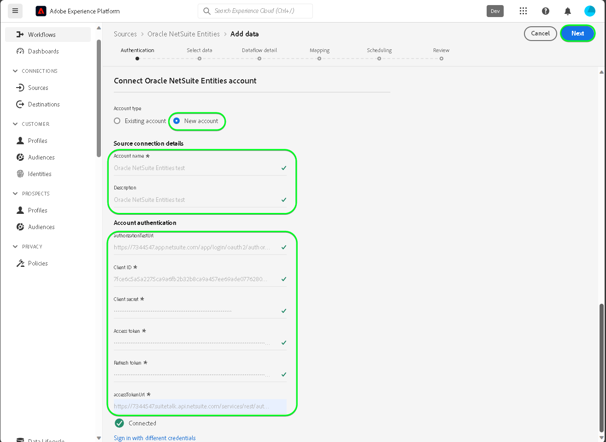
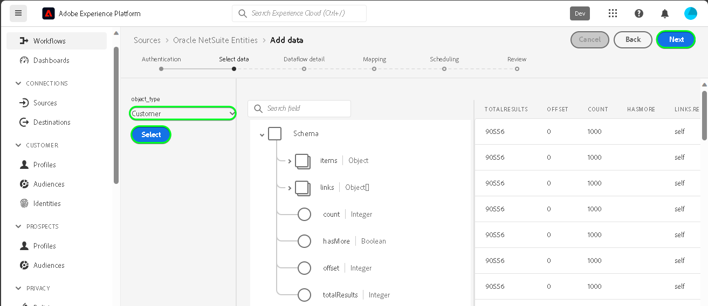

# Créer une connexion source [!DNL Oracle NetSuite Entities] dans l’interface utilisateur

>[!NOTE]
>
>La source [!DNL Oracle NetSuite Entities] est en version Beta. Voir [présentation des sources](../../../../home.md#terms-and-conditions) pour plus d’informations sur l’utilisation de sources étiquetées bêta.

Lisez le tutoriel suivant pour découvrir comment importer des données de contacts et de clients de votre [!DNL Oracle NetSuite Entities] compte vers Adobe Experience Platform dans l’interface utilisateur.

## Prise en main {#getting-started}

Ce tutoriel nécessite une compréhension du fonctionnement des composants suivants d’Adobe Experience Platform : 

* [[!DNL Experience Data Model (XDM)] Système](../../../../../xdm/home.md) : le cadre normalisé en fonction duquel [!DNL Experience Platform] organise les données d’expérience client.
   * [Principes de base de la composition des schémas](../../../../../xdm/schema/composition.md) : découvrez les blocs de création de base des schémas XDM, y compris les principes clés et les bonnes pratiques en matière de composition de schémas.
   * [Tutoriel sur l’éditeur de schémas](../../../../../xdm/tutorials/create-schema-ui.md) : découvrez comment créer des schémas personnalisés à l’aide de l’interface utilisateur de l’éditeur de schémas.
* [[!DNL Real-Time Customer Profile]](../../../../../profile/home.md) : fournit un profil de consommateur unifié en temps réel, basé sur des données agrégées provenant de plusieurs sources.

Si vous disposez déjà d’un compte [!DNL Oracle NetSuite], vous pouvez ignorer le reste de ce document et passer au tutoriel expliquant comment [Configurer un flux de données](../../dataflow/marketing-automation.md).

>[!TIP]
>
>Lisez la section [[!DNL Oracle NetSuite] aperçu](../../../../connectors/marketing-automation/oracle-netsuite.md) pour plus d’informations sur la manière de récupérer vos informations d’authentification.

## Connecter votre compte [!DNL Oracle NetSuite Activities] {#connect-account}

Dans l’interface utilisateur de Platform, sélectionnez **[!UICONTROL Sources]** dans le volet de navigation de gauche pour accéder à l’espace de travail [!UICONTROL Sources]. Vous pouvez sélectionner la catégorie appropriée dans le catalogue sur le côté gauche de votre écran. Vous pouvez également trouver la source spécifique à utiliser à l’aide de l’option de recherche.

Sous , *Automatisation du marketing* catégorie, sélectionnez **[!DNL Oracle NetSuite Entities]**, puis sélectionnez **[!UICONTROL Ajouter des données]**.

La variable **[!UICONTROL Connexion au compte Oracle NetSuite Entities]** s’affiche. Sur cette page, vous pouvez utiliser de nouvelles informations d’identification ou des informations d’identification existantes.

>[!IMPORTANT]
>
>Le jeton d’actualisation expire après sept jours. Une fois votre jeton arrivé à expiration, vous devez créer un compte sur Experience Platform avec votre jeton mis à jour. Si vous ne créez pas de compte avec votre jeton mis à jour, le message d’erreur suivant peut s’afficher : `The request could not be processed. Error from flow provider: The request could not be processed. Rest call failed with client error, status code 401 Unauthorized, please check your activity settings.`

### Compte existant {#existing-account}

Pour utiliser un compte existant, sélectionnez le compte [!DNL Oracle NetSuite Entities] avec lequel vous souhaitez créer un flux de données, puis sélectionnez **[!UICONTROL Suivant]** pour continuer.

### Nouveau compte {#new-account}

Si vous créez un compte, sélectionnez **[!UICONTROL Nouveau compte]**, puis fournissez un nom, une description facultative et vos informations d’identification. Lorsque vous avez terminé, sélectionnez **[!UICONTROL Se connecter à la source]** puis attendez que la nouvelle connexion s’établisse.

### Sélectionner les données

Sélectionnez ensuite le type d’objet à ingérer à Experience Platform.

| Type d’entité | Description |
| --- | --- |
| Contact | Récupérez les noms de contact, les e-mails, les numéros de téléphone et tous les champs personnalisés liés aux contacts associés aux clients. |
| Client | Récupérez des données client spécifiques, notamment des détails tels que les noms de client, les adresses et les identifiants clés. |

>[!BEGINTABS]

>[!TAB Contact]

>[!TAB Client]

>[!ENDTABS]

## Étapes suivantes {#next-steps}

En suivant ce tutoriel, vous avez établi une connexion à votre compte [!DNL Oracle NetSuite Entities]. Vous pouvez maintenant passer au tutoriel suivant et [configurer un flux de données pour importer des données d’automatisation du marketing dans Platform ;](../../dataflow/marketing-automation.md).

## Ressources supplémentaires {#additional-resources}

Les sections ci-dessous contiennent des ressources supplémentaires auxquelles vous pouvez vous référer lors de l’utilisation de la variable [!DNL Oracle NetSuite Entities] source.

### Mappage {#mapping}

Platform fournit des recommandations intelligentes pour les champs mappés automatiquement en fonction du schéma ou du jeu de données cible que vous avez sélectionné. Vous pouvez ajuster manuellement les règles de mappage en fonction de vos cas d’utilisation. Selon vos besoins, vous pouvez choisir de mapper directement des champs ou d’utiliser des fonctions de préparation de données pour transformer les données sources afin d’obtenir des valeurs informatisées ou calculées. Pour obtenir des instructions complètes sur l’utilisation de l’interface du mappeur et des champs calculés, voir la section [Guide de l’interface utilisateur de la préparation de données](../../../../../data-prep/ui/mapping.md).

>[!NOTE]
>
>Les champs affichés dépendent des abonnements que votre [!DNL Oracle NetSuite] a accès à . Par exemple, si vous n’avez pas accès à la facturation, les champs relatifs à la facturation ne s’affichent pas.

### Planification {#scheduling}

Lorsque vous planifiez votre [!DNL Oracle NetSuite Entities] le flux de données pour l’ingestion, vous devez sélectionner la configuration de fréquence et d’intervalle suivante :

| Fréquence | Intervalle |
| --- | --- |
| `Once` | 1 |

Lors de la récupération des données, la variable [!DNL Oracle NetSuite] répond avec la date de dernière modification ou créée sous forme de date au lieu d’un horodatage. Par conséquent, la planification est limitée à un jour.

Une fois les valeurs fournies pour votre planning, sélectionnez **[!UICONTROL Suivant]**.

