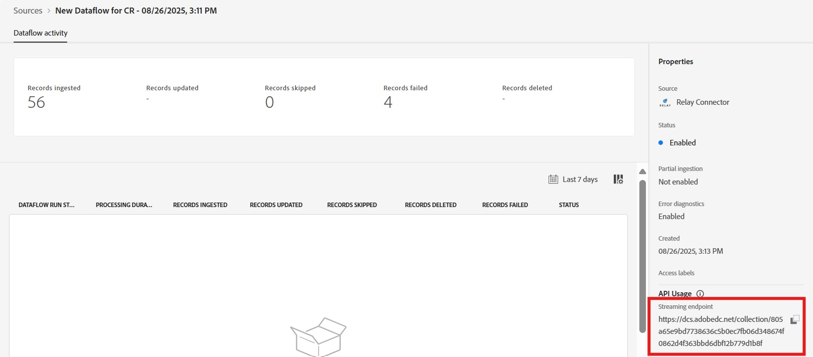

# Connecter le relais à Experience Platform dans l’interface utilisateur

>[!NOTE]
>
>La source [!DNL Relay Connector] est en version Beta. Veuillez lire la [présentation des sources](../../../../home.md#terms-and-conditions) pour plus d’informations sur l’utilisation de sources étiquetées bêta.

Avec [!DNL Relay Connector], vous pouvez offrir des expériences personnalisées à vos clients aux moments les plus significatifs de leur parcours, ce qui vous permet de créer des relations plus solides et une plus grande fidélité et valeur grâce à la création d’une connexion entrante pour diffuser des événements depuis votre intégration [!DNL Relay Network] dans Adobe Experience Platform.

Lisez ce guide pour savoir comment utiliser le [!DNL Relay Connector] dans l’espace de travail des sources de l’interface utilisateur d’Experience Platform.

>[!IMPORTANT]
>
>Cette page de documentation est gérée par l’équipe *[!DNL Relay Network]*. Pour toute demande ou information, contactez-les directement à l&#39;adresse *[[!DNL Relay Network]](https://www.relaynetwork.com/) ou par e-mail [info@relaynetwork.com](mailto:info@relaynetwork.com)*.

## Connecter votre source de [!DNL Relay Connector]

Dans l’interface utilisateur d’Experience Platform, sélectionnez **[!UICONTROL Sources]** dans la barre de navigation de gauche pour accéder à l’espace de travail [!UICONTROL Sources]. L’écran [!UICONTROL Catalogue] affiche diverses sources avec lesquelles vous pouvez créer un compte. Vous pouvez sélectionner la catégorie appropriée dans le catalogue sur le côté gauche de l’écran ou utiliser l’option de recherche pour trouver une source spécifique.

Sous la catégorie *[!UICONTROL Automatisation marketing]*, sélectionnez la carte source [!DNL Relay Connector] et sélectionnez **[!UICONTROL Ajouter des données]**.

>[!TIP]
>
>Les sources du catalogue de sources affichent l’option **[!UICONTROL Configurer]** lorsqu’il n’existe aucun compte authentifié. Une fois qu’un compte est authentifié, cette option devient **[!UICONTROL Ajouter des données]**.

### Sélectionner les données

L&#39;interface **[!UICONTROL Connect Relay Connector source]** s&#39;affiche. Utilisez l’interface *[!UICONTROL Sélectionner des données]* pour parcourir ou spécifier le schéma de données source. Vous pouvez également charger un exemple de fichier JSON pour définir le schéma source.

>[!NOTE]
>
>La taille de fichier acceptable peut aller jusqu’à 1 Go.

Une fois les données chargées, vous pouvez utiliser la section [!UICONTROL Prévisualiser les données d’exemple] pour prévisualiser les données.

### Détails du flux de données

Utilisez ensuite l’interface *[!UICONTROL Détails du flux de données]* pour fournir un **nom** et une **description facultative** pour votre flux de données. En outre, sélectionnez le **[!UICONTROL jeu de données cible]** que vous souhaitez utiliser. Vous pouvez créer un jeu de données ou utiliser un jeu de données existant.

### Mappage

Vous pouvez mapper vos champs source aux champs de schéma XDM à l’aide de la fonctionnalité de mappage automatique, qui mappe les champs en fonction de leur nom, ou créer des mappages personnalisés pour un contrôle plus précis. Si nécessaire, vous pouvez également appliquer des transformations telles que la concaténation, la mise en forme ou le changement de nom pour vous assurer que vos données s’intègrent parfaitement dans le schéma cible. Pour plus d’informations sur le mappage, consultez le [guide de l’interface utilisateur de la préparation des données](../../../../../data-prep/ui/mapping.md).

>[!TIP]
>
>Pour plus d’informations sur les types d’événements et de valeurs de données que Relay enverra à votre source, consultez la documentation [[!DNL Relay Network] Événements push](https://docs.relaynetwork.com/docs/push-events). Ces informations vous aideront à concevoir votre **schéma d’événements d’expérience** de manière appropriée.

### Réviser

Enfin, passez en revue toutes les configurations, y compris votre **source, jeu de données et mappages**. Lorsque vous avez terminé, sélectionnez **Terminer** pour créer le flux de données.

### Récupérer l’URL du point d’entrée de diffusion en continu

Une fois que vous avez créé le flux de données, vous trouverez l’*URL du point d’entrée de diffusion en continu* et d’autres détails connexes dans la section **Propriétés** sur le côté droit de la page du flux de données.

Utilisez ces valeurs pour configurer le webhook dans la **console de relais**. Pour obtenir des instructions détaillées sur la configuration de la notification push, consultez la documentation du relais : [ Configuration de l’API push ](https://docs.relaynetwork.com/docs/configuring-the-push-api).

## Ressources supplémentaires

* [Créer une spécification de connexion à l’aide de l’API Flow Service](https://experienceleague.adobe.com/fr/docs/experience-platform/sources/sdk/streaming-sdk/create)
* [Connexion à votre source à l’aide de l’interface utilisateur](https://experienceleague.adobe.com/fr/docs/experience-platform/sources/sdk/streaming-sdk/submit#test-your-source-using-the-ui)
