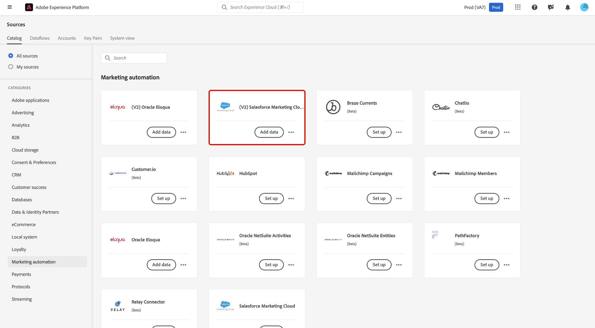
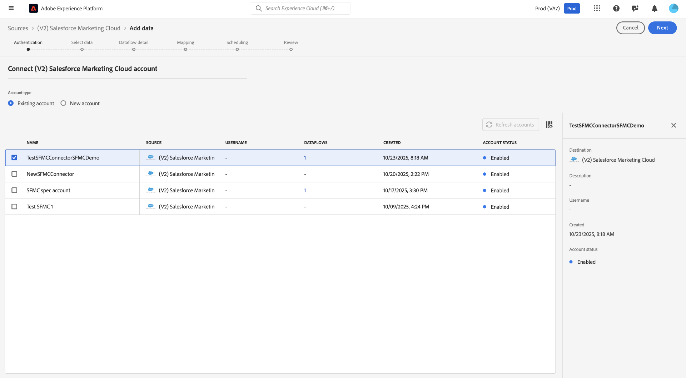
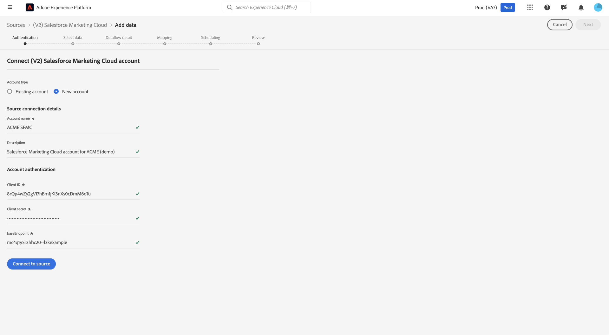
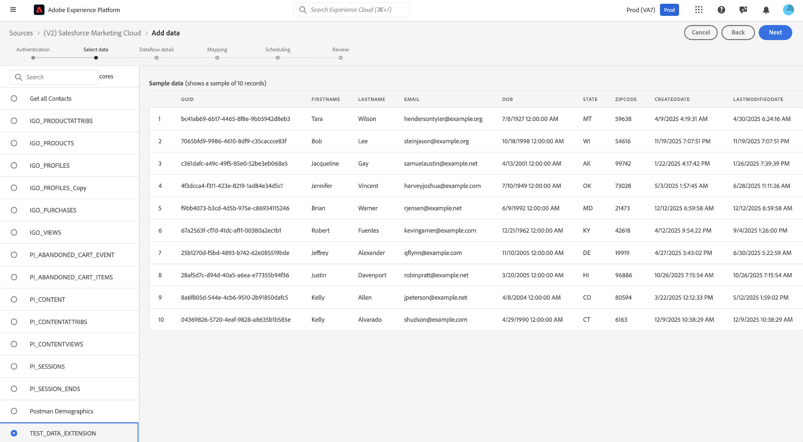
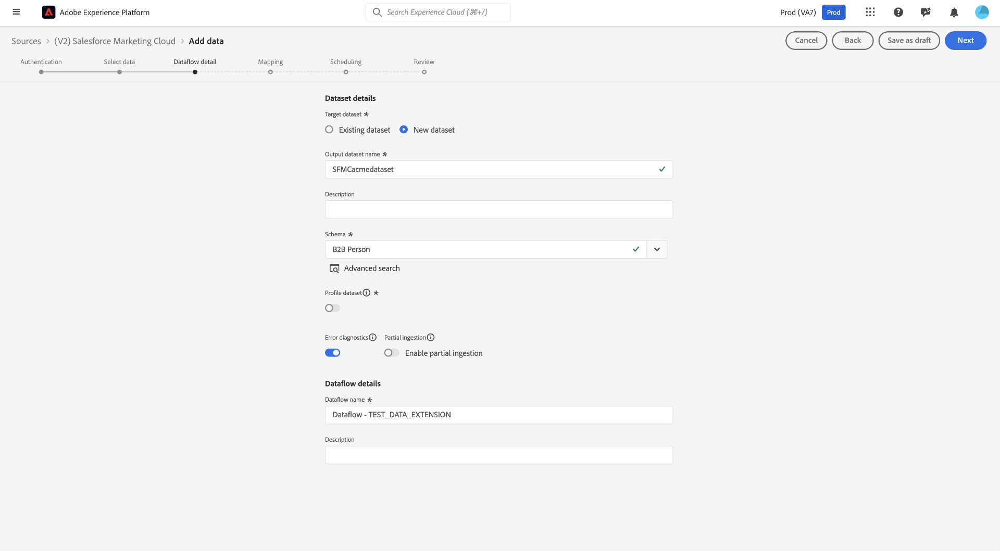
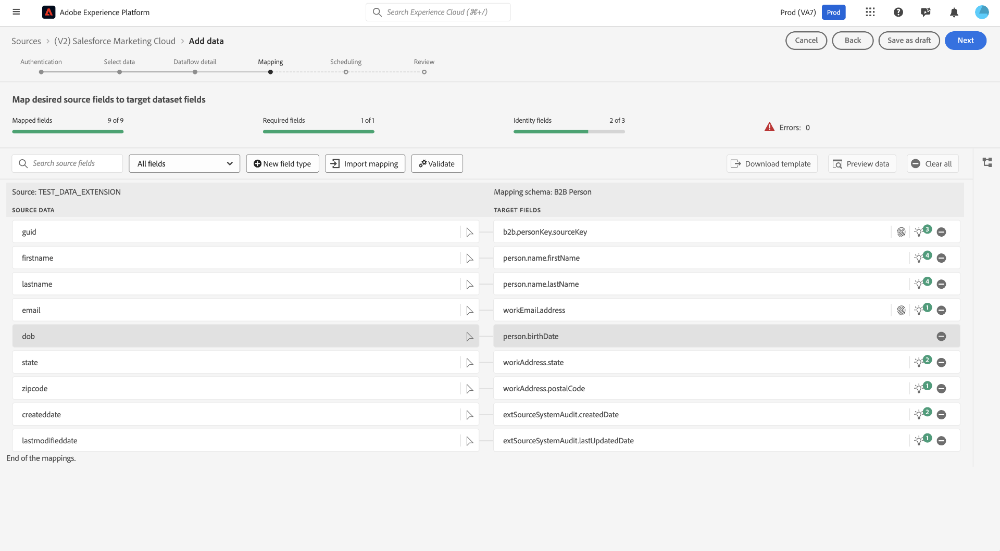
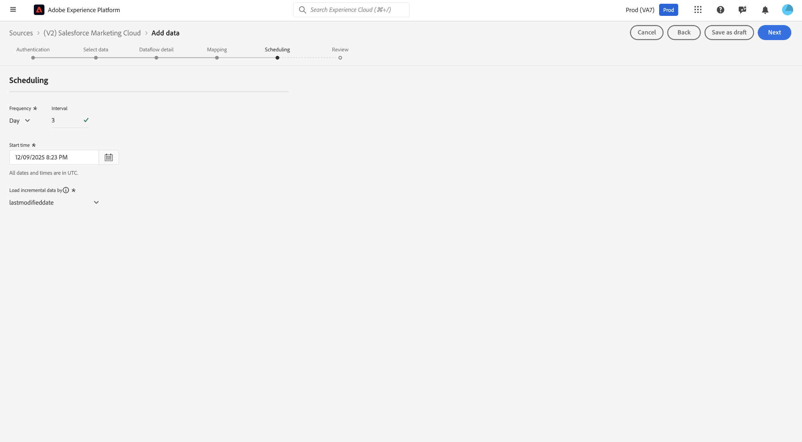
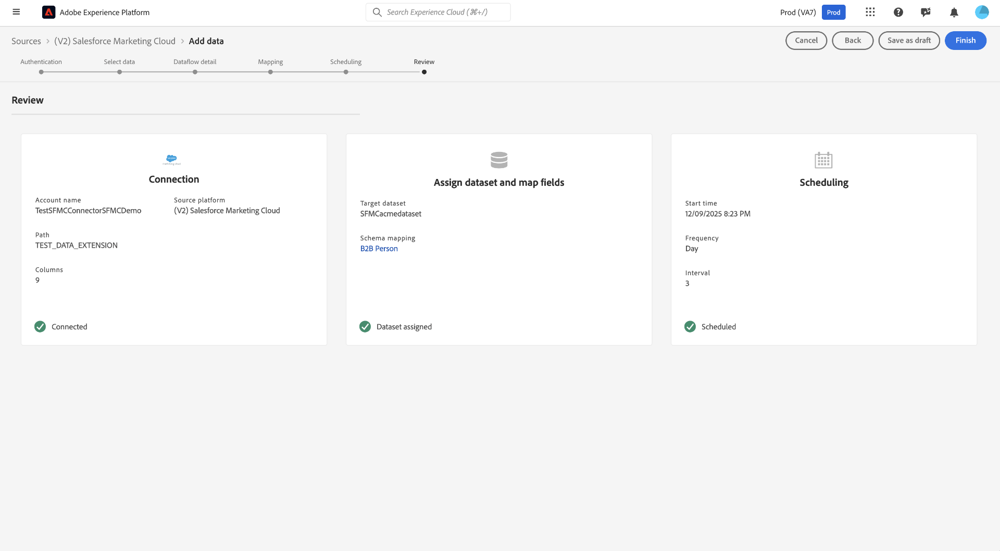

# Connexion de [!DNL Salesforce Marketing Cloud] à Experience Platform

Lisez ce guide pour savoir comment connecter votre compte [!DNL Salesforce Marketing Cloud] à Adobe Experience Platform à l’aide de l’espace de travail des sources dans l’interface utilisateur d’Experience Platform.

## Commencer

Ce tutoriel nécessite une compréhension du fonctionnement des composants suivants d’Adobe Experience Platform :

* [[!DNL Experience Data Model (XDM)] Système](../../../../../xdm/home.md) : le cadre normalisé en fonction duquel [!DNL Experience Platform] organise les données d’expérience client.
   * [Principes de base de la composition des schémas](../../../../../xdm/schema/composition.md) : découvrez les blocs de création de base des schémas XDM, y compris les principes clés et les bonnes pratiques en matière de composition de schémas.
   * [Tutoriel sur l’éditeur de schémas](../../../../../xdm/tutorials/create-schema-ui.md) : découvrez comment créer des schémas personnalisés à l’aide de l’interface utilisateur de l’éditeur de schémas.
* [[!DNL Real-Time Customer Profile]](../../../../../profile/home.md) : fournit un profil de consommateur unifié en temps réel, basé sur des données agrégées provenant de plusieurs sources.

### Collecter les informations d’identification requises

Lisez la [[!DNL Salesforce Marketing Cloud] présentation](../../../../connectors/marketing-automation/sfmc.md#prerequisites) pour plus d’informations sur l’authentification.

## Parcourir le catalogue des sources

Dans l’interface utilisateur d’Experience Platform, sélectionnez **[!UICONTROL Sources]** dans le volet de navigation de gauche pour accéder à l’espace de travail *[!UICONTROL Sources]*. Choisissez une catégorie ou utilisez la barre de recherche pour trouver votre source.

Pour vous connecter à [!DNL Salesforce Marketing Cloud], accédez à la catégorie *[!UICONTROL Automatisation du marketing]*, sélectionnez la carte source **[!UICONTROL (V2) Salesforce Marketing Cloud]**, puis sélectionnez **[!UICONTROL Configurer]**.

>[!TIP]
>
>Les sources du catalogue affichent l’option **[!UICONTROL Configurer]** lorsqu’une source donnée ne dispose pas encore d’un compte authentifié. Une fois un compte authentifié créé, cette option devient **[!UICONTROL Ajouter des données]**.

## Utiliser un compte existant {#existing}

Pour utiliser un compte existant, sélectionnez **[!UICONTROL Compte existant]** puis sélectionnez le compte [!DNL Salesforce Marketing Cloud] à utiliser.

## Créer un nouveau compte {#new}

Pour créer un compte, sélectionnez **[!UICONTROL Nouveau compte]** et indiquez un nom et une description sous les [!UICONTROL détails de connexion Source]. Ensuite, sous [!UICONTROL Authentification du compte], indiquez les valeurs de votre **ID client**, **Secret client** et **Point d’entrée de base**. Vous pouvez lire le [guide d’authentification](../../../../connectors/marketing-automation/sfmc.md#gather-required-credentials) pour plus d’informations sur ces informations d’identification. Lorsque vous avez terminé, sélectionnez **[!UICONTROL Se connecter à la source]** et patientez quelques secondes le temps que votre connexion s’établisse.

## Sélectionner les données

La source de [!DNL Salesforce Marketing Cloud] prend uniquement en charge l’ingestion de données à partir d’extensions de données [!DNL Salesforce Marketing Cloud].

Utilisez l’interface [!UICONTROL Sélectionner des données] pour sélectionner l’extension de données à ingérer à partir de votre instance [!DNL Salesforce Marketing Cloud]. Une fois que vous avez sélectionné l’extension de données, vous pouvez utiliser le panneau d’aperçu pour confirmer que le jeu de données contient les champs attendus avant de continuer.

## Détails du jeu de données et du flux de données

Ensuite, vous devez fournir des informations sur votre jeu de données et votre flux de données. Au cours de cette étape, vous pouvez utiliser un jeu de données existant ou en créer un nouveau. De plus, vous pouvez éventuellement activer votre jeu de données pour l’ingestion dans le profil client en temps réel au cours de cette étape.

## Mappage

Dans [!DNL Salesforce Marketing Cloud], les extensions de données ne sont pas considérées comme des objets standard. Par conséquent, il n’existe aucun champ de mappage prédéfini ou fixe vers un schéma Experience Platform. Bien que la préparation des données dans Experience Platform effectue un alignement optimal entre les champs sources de [!DNL Salesforce Marketing Cloud] et le schéma du modèle de données d’expérience (XDM) cible, il peut encore arriver qu’une révision ou un ajustement manuel soit nécessaire pour résoudre des champs non mappés ou erronés.

## Planifier un flux de données

Une fois le mappage terminé, vous pouvez configurer un planning d’ingestion pour votre flux de données. Définissez votre [!UICONTROL Fréquence] sur `Once` pour configurer une exécution d’ingestion unique. Pour une ingestion incrémentielle, vous pouvez définir votre [!UICONTROL Fréquence] sur `Hour`, `Day` ou `Week`. Lors de l’utilisation de l’ingestion incrémentielle, vous devez également configurer l’[!UICONTROL &#x200B; Intervalle &#x200B;] pour définir le temps écoulé entre les exécutions d’ingestion. Par exemple, une fréquence d’ingestion définie sur `Day` et un intervalle défini sur `15` signifie que votre flux de données est planifié pour ingérer des données tous les 15 jours.

>[!TIP]
>
> La fréquence d’ingestion par minute n’est pas disponible pour la source de [!DNL Salesforce Marketing Cloud]. La planification la plus fréquente que vous pouvez choisir est horaire. Sélectionnez une planification qui correspond à vos besoins en matière de fraîcheur des données. Gardez à l’esprit que le choix d’une planification plus fréquente augmentera les coûts de calcul.

Vous devez sélectionner un champ delta (date/heure) dans votre jeu de données pour activer la synchronisation incrémentielle. Si votre jeu de données ne contient pas de champ delta approprié, vous ne pourrez pas créer le flux de données.

## Réviser

Une fois le planning d’ingestion configuré, utilisez l’interface [!UICONTROL Révision] pour confirmer les détails de votre flux de données. Sélectionnez **[!UICONTROL Terminer]** pour terminer la configuration et patienter quelques instants le temps que votre flux de données se lance.

## Surveiller

Une fois le flux de données sélectionné, il effectue un renvoi unique des données, puis une synchronisation incrémentielle selon le planning spécifié. Vous pouvez surveiller le statut de la synchronisation en accédant au flux de données. Pour plus d’informations, consultez le guide sur la [surveillance des flux de données des sources dans l’interface utilisateur](../../../../../dataflows/ui/monitor-sources.md).

## Étapes suivantes

Ce tutoriel vous a guidé tout au long de la connexion de votre compte [!DNL Salesforce Marketing Cloud] (V2) à Experience Platform à l’aide de l’interface utilisateur. Vous avez appris à sélectionner ou créer un compte source, à fournir les informations d’identification requises, à choisir les extensions de données à ingérer, à spécifier les détails du jeu de données et du flux de données, à mapper vos données, à configurer un planning d’ingestion de données et à surveiller vos flux de données. En suivant ces étapes, vous avez intégré vos données [!DNL Salesforce Marketing Cloud] à Experience Platform pour activation et analyse.

Pour plus d’informations, consultez la documentation suivante :

* [Présentation des sources](../../../../home.md)
* [Real-Time CDP B2B Edition](../../../../../rtcdp/b2b-overview.md)
