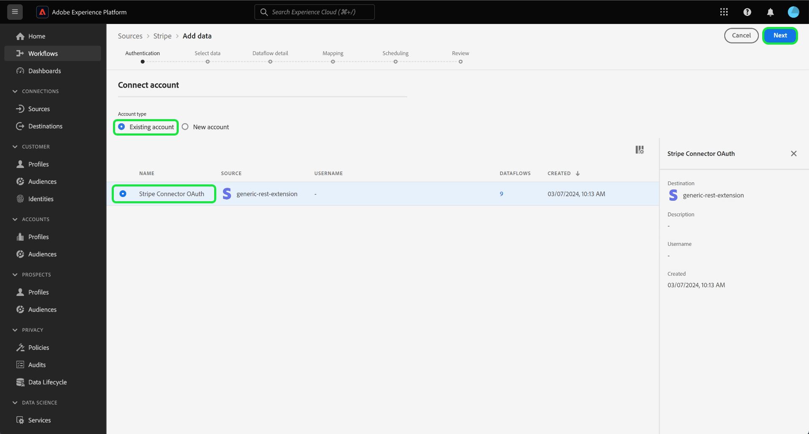
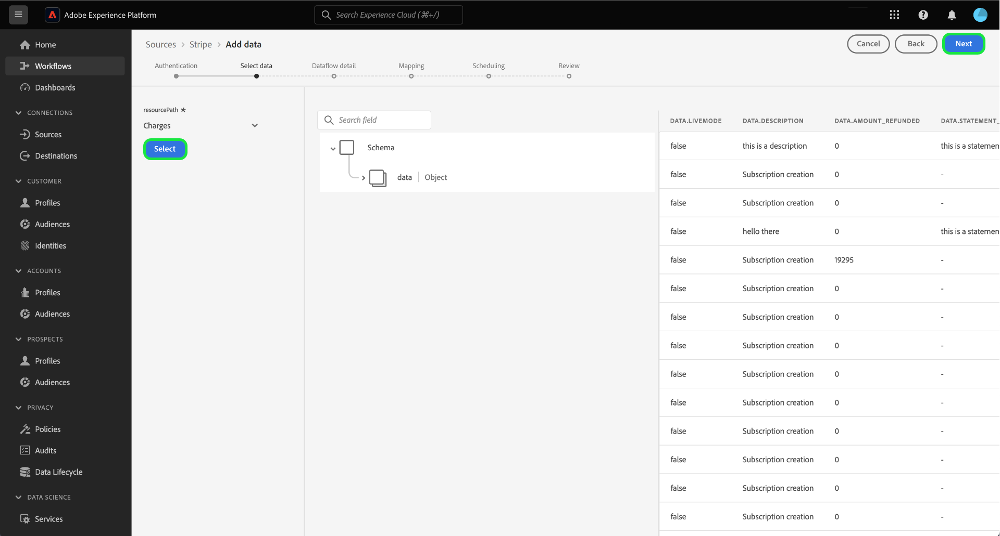

# Ingestion des données de paiement à partir de vos [!DNL Stripe] compte à Experience Platform à l’aide de l’interface utilisateur

>[!NOTE]
>
>La source [!DNL Stripe] est en version Beta. Lisez la section [conditions générales](../../../../home.md#terms-and-conditions) dans la présentation des sources pour plus d’informations sur l’utilisation de sources étiquetées bêta.

Lisez le tutoriel suivant pour savoir comment ingérer des données de paiement à partir de votre [!DNL Stripe] à Adobe Experience Platform à l’aide de l’interface utilisateur.

## Commencer

Ce tutoriel nécessite une compréhension du fonctionnement des composants suivants d’Adobe Experience Platform : 

* [[!DNL Experience Data Model (XDM)] Système](../../../../../xdm/home.md) : le cadre normalisé en fonction duquel [!DNL Experience Platform] organise les données d’expérience client.
   * [Principes de base de la composition des schémas](../../../../../xdm/schema/composition.md) : découvrez les blocs de création de base des schémas XDM, y compris les principes clés et les bonnes pratiques en matière de composition de schémas.
   * [Tutoriel sur l’éditeur de schémas](../../../../../xdm/tutorials/create-schema-ui.md) : découvrez comment créer des schémas personnalisés à l’aide de l’interface utilisateur de l’éditeur de schémas.
* [[!DNL Real-Time Customer Profile]](../../../../../profile/home.md) : fournit un profil de consommateur unifié en temps réel, basé sur des données agrégées provenant de plusieurs sources.

### Authentification

Lisez la section [[!DNL Stripe] aperçu](../../../../connectors/payments/stripe.md) pour plus d’informations sur la manière de récupérer vos informations d’authentification.

## Connecter votre compte [!DNL Stripe] {#connect}

Dans l’interface utilisateur de Platform, sélectionnez **[!UICONTROL Sources]** dans le volet de navigation de gauche pour accéder à l’espace de travail [!UICONTROL Sources]. Vous pouvez sélectionner la catégorie appropriée dans le catalogue sur le côté gauche de votre écran. Vous pouvez également trouver la source spécifique à utiliser à l’aide de l’option de recherche.

Sous , *Paiements* catégorie, sélectionnez **[!DNL Stripe]**, puis sélectionnez **[!UICONTROL Configuration]**.

>[!TIP]
>
>Les sources dans le catalogue des sources affichent la variable **[!UICONTROL Configuration]** lorsqu’une source donnée ne dispose pas encore d’un compte authentifié. Une fois qu’un compte authentifié existe, cette option devient **[!UICONTROL Ajouter des données]**.

La variable **[!UICONTROL Connexion au compte Stripe]** s’affiche. Sur cette page, vous pouvez utiliser des informations d’identification nouvelles ou existantes.

>[!BEGINTABS]

>[!TAB Création d’un compte]

Pour créer un compte, sélectionnez **[!UICONTROL Nouveau compte]** et indiquez un nom, une description facultative et vos informations d’identification.

Lorsque vous avez terminé, sélectionnez **[!UICONTROL Se connecter à la source]** puis attendez que la nouvelle connexion s’établisse.

| Informations d’identification | Description |
| --- | --- |
| Jeton d’accès | Votre [!DNL Stripe] jeton d’accès. Pour plus d’informations sur la récupération de votre jeton d’accès, consultez la section [[!DNL Stripe] guide d&#39;authentification](../../../../connectors/payments/stripe.md). |

>[!TAB Utiliser un compte existant]

Pour utiliser un compte existant, sélectionnez **[!UICONTROL Compte existant]** puis sélectionnez le compte à utiliser dans le catalogue de comptes existant.

Cliquez sur **[!UICONTROL Suivant]** pour continuer.

>[!ENDTABS]

## Sélectionner les données {#select-data}

Maintenant que vous avez accès à votre compte, vous devez identifier le chemin approprié vers la variable [!DNL Stripe] données que vous souhaitez ingérer. Sélectionner **[!UICONTROL Chemin de ressource]** puis sélectionnez le point de terminaison à partir duquel vous souhaitez ingérer des données. La variable [!DNL Stripe] les points de fin sont les suivants :

* Frais
* Abonnements
* Remboursement
* Transactions de solde
* Clients
* Prix

Une fois votre point de terminaison sélectionné, l’interface se met à jour dans un écran de prévisualisation affichant la structure de données de la variable [!DNL Stripe] point de terminaison que vous avez sélectionné. Cliquez sur **[!UICONTROL Suivant]** pour continuer.

## Fournir des détails sur les jeux de données et les flux de données {#provide-dataset-and-dataflow-details}

Ensuite, vous devez fournir des informations sur votre jeu de données et votre flux de données.

### Informations sur le jeu de données {#dataset-details}

Un jeu de données est une structure de stockage et de gestion pour une collection de données, généralement sous la forme d’un tableau, qui contient un schéma (des colonnes) et des champs (des lignes). Les données correctement ingérées dans Experience Platform sont stockées dans le lac de données sous la forme de jeux de données. Au cours de cette étape, vous pouvez créer un nouveau jeu de données ou utiliser un jeu de données existant.

>[!BEGINTABS]

>[!TAB Utiliser un nouveau jeu de données]

Pour utiliser un nouveau jeu de données, sélectionnez **[!UICONTROL Nouveau jeu de données]** puis fournissez un nom et une description facultative de votre jeu de données. Vous devez également sélectionner un schéma de modèle de données d’expérience (XDM) auquel votre jeu de données adhère.

| Détails du nouveau jeu de données | Description |
| --- | --- |
| Nom du jeu de données de sortie | Nom de votre nouveau jeu de données. |
| Description | (Facultatif) Une brève explication du nouveau jeu de données. |
| Schéma | Liste déroulante des schémas qui existent dans votre organisation. Vous pouvez également créer votre propre schéma avant le processus de configuration de la source. Pour plus d’informations, consultez le guide sur [création d’un schéma XDM dans l’interface utilisateur](../../../../../xdm/tutorials/create-schema-ui.md). |

>[!TAB Utiliser un jeu de données existant]

Si vous disposez déjà d’un jeu de données, sélectionnez **[!UICONTROL Jeu de données existant]** puis utilisez la fonction **[!UICONTROL Recherche avancée]** pour afficher une fenêtre de tous les jeux de données de votre organisation, y compris leurs détails respectifs, par exemple s’ils sont activés pour l’ingestion dans Real-time Customer Profile ou non.

>[!ENDTABS]

+++Sélectionnez les étapes à suivre pour activer l’ingestion du profil, les diagnostics d’erreur et l’ingestion partielle.

Si votre jeu de données est activé pour Real-time Customer Profile, vous pouvez basculer au cours de cette étape. **[!UICONTROL Jeu de données de profil]** pour activer vos données pour l’ingestion par profils. Vous pouvez également utiliser cette étape pour activer **[!UICONTROL Diagnostics d’erreur]** et **[!UICONTROL Ingestion partielle]**.

* **[!UICONTROL Diagnostics d’erreur]**: sélectionnez **[!UICONTROL Diagnostics d’erreur]** pour demander à la source de produire des diagnostics d’erreur que vous pourrez ensuite référencer lors de la surveillance de l’activité et de l’état de votre jeu de données.
* **[!UICONTROL Ingestion partielle]**: l’ingestion par lots partielle permet d’ingérer des données contenant des erreurs, jusqu’à un certain seuil configurable. Cette fonctionnalité vous permet d’ingérer toutes vos données précises dans Experience Platform, tandis que toutes vos données incorrectes sont traitées par lots séparément avec des informations sur les raisons de leur non-validité.

+++

### Détails du flux de données {#dataflow-details}

Une fois votre jeu de données configuré, vous devez fournir des détails sur votre flux de données, y compris un nom, une description facultative et des configurations d’alerte.

| Configurations de flux de données | Description |
| --- | --- |
| Nom du flux de données | Nom du flux de données.  Par défaut, le nom du fichier importé sera utilisé. |
| Description | (Facultatif) Une brève description de votre flux de données. |
| Alertes | Experience Platform peut produire des alertes basées sur des événements auxquelles les utilisateurs peuvent s’abonner. Ces options nécessitent toutes un flux de données en cours d’exécution pour les déclencher.  Pour plus d’informations, consultez la section [aperçu des alertes](../../alerts.md) <ul><li>**Démarrage de l’exécution du flux de données sources**: sélectionnez cette alerte pour recevoir une notification au début de l’exécution du flux de données.</li><li>**Réussite de l’exécution du flux de données sources**: sélectionnez cette alerte pour recevoir une notification si votre flux de données se termine sans erreur.</li><li>**Échec de l’exécution des flux de données sources**: sélectionnez cette alerte pour recevoir une notification si l’exécution de votre flux de données se termine en erreur.</li></ul> |

Lorsque vous avez terminé, sélectionnez **[!UICONTROL Suivant]** pour continuer.

## Mappage de champs à un schéma XDM {#mapping}

L’étape **[!UICONTROL Mappage]** apparaît. Utilisez l’interface de mappage pour mapper vos données source aux champs de schéma appropriés avant d’ingérer ces données dans Experience Platform. Pour obtenir un guide complet sur l’utilisation de l’interface de mappage, consultez la rubrique [Guide de l’interface utilisateur de la préparation de données](../../../../../data-prep/ui/mapping.md) pour plus d’informations.

## Configuration du planning d’ingestion {#scheduling}

Utilisez ensuite l’interface de planification pour créer un planning d’ingestion pour votre flux de données.

Sélectionnez la liste déroulante Fréquence pour configurer la fréquence d’ingestion de votre flux de données.

Vous pouvez également sélectionner l’icône du calendrier et utiliser un calendrier contextuel pour configurer l’heure de début de l’ingestion.

| Configuration de la planification | Description |
| --- | --- |
| Fréquence | Configurez la fréquence pour indiquer la fréquence d’exécution du flux de données. Vous pouvez définir votre fréquence sur : <ul><li>**Une fois**: définissez votre fréquence sur `once` pour créer une ingestion unique. Les configurations de l’intervalle et du renvoi ne sont pas disponibles lors de la création d’un flux de données d’ingestion unique. Par défaut, la fréquence de planification est définie sur une seule fois.</li><li>**Minute**: définissez votre fréquence sur `minute` pour planifier votre flux de données afin qu’il ingère des données par minute.</li><li>**Heure**: définissez votre fréquence sur `hour` pour planifier votre flux de données afin d’ingérer des données par heure.</li><li>**Jour**: définissez votre fréquence sur `day` pour planifier votre flux de données afin d’ingérer des données quotidiennement.</li><li>**Semaine**: définissez votre fréquence sur `week` pour planifier votre flux de données afin qu’il ingère des données sur une base hebdomadaire.</li></ul> |
| Intervalle | Une fois que vous avez sélectionné une fréquence, vous pouvez configurer le paramètre d’intervalle afin de définir la période entre chaque ingestion. Par exemple, si vous définissez votre fréquence sur &quot;jour&quot; et configurez l’intervalle sur 15, votre flux de données s’exécute tous les 15 jours. **Remarque**: vous ne pouvez pas définir l’intervalle sur zéro. |
| Heure de début | Horodatage de l’exécution projetée, présenté dans le fuseau horaire UTC. |
| Renvoi | Le renvoi détermine les données ingérées initialement. Si le renvoi est activé, tous les fichiers actuels du chemin spécifié seront ingérés lors de la première ingestion planifiée. Si le renvoi est désactivé, seuls les fichiers chargés entre la première exécution de l’ingestion et l’heure de début seront ingérés. Les fichiers chargés avant l’heure de début ne seront pas ingérés. |

Une fois que vous avez configuré le planning d’ingestion de votre flux de données, sélectionnez **[!UICONTROL Suivant]**.

## Vérifier le flux de données

La dernière étape du processus de création de flux de données consiste à passer en revue votre flux de données avant de l’exécuter. Utilisez la variable **[!UICONTROL Réviser]** pour consulter les détails de votre nouveau flux de données avant son exécution. Les détails sont regroupés dans les catégories suivantes :

* **Connexion**: indique le type de source, le chemin d’accès approprié du fichier source choisi et le nombre de colonnes dans ce fichier source.
* **Attribuer des champs de jeu de données et de mappage** : affiche le jeu de données dans lequel les données sources sont ingérées, y compris le schéma auquel le jeu de données se conforme.
* **Planification**: indique la période, la fréquence et l’intervalle actifs du planning d’ingestion.

Une fois que vous avez vérifié votre flux de données, sélectionnez **[!UICONTROL Terminer]** et patientez quelques instants le temps que le flux de données soit créé.

## Étapes suivantes

En suivant ce tutoriel, vous avez créé un flux de données pour importer les données de paiement de votre [!DNL Stripe] source à Experience Platform. Pour obtenir des ressources supplémentaires, consultez la documentation décrite ci-dessous.

### Surveiller votre flux de données

Une fois votre flux de données créé, vous pouvez surveiller les données qui sont ingérées par celui-ci pour afficher des informations sur les taux d’ingestion, la réussite et les erreurs. Pour plus d’informations sur la surveillance du flux de données, consultez le tutoriel sur [surveillance des comptes et des flux de données dans l’interface utilisateur](../../../../../dataflows/ui/monitor-sources.md).

### Mettre à jour votre flux de données

Pour mettre à jour les configurations de la planification, du mappage et des informations générales de vos flux de données, consultez le tutoriel sur [mise à jour des flux de données de sources dans l’interface utilisateur](../../update-dataflows.md).

### Supprimer le flux de données

Vous pouvez supprimer les flux de données qui ne sont plus nécessaires ou qui ont été créés de manière incorrecte à l’aide de la fonction **[!UICONTROL Supprimer]**, disponible dans l’espace de travail **[!UICONTROL Flux de données]**. Pour plus d’informations sur la suppression des flux de données, consultez le tutoriel sur [suppression de flux de données dans l’interface utilisateur](../../delete.md).
