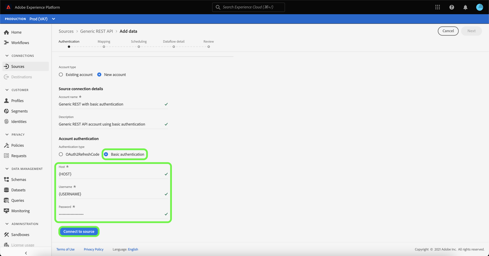

# Créer une connexion source [!DNL Generic REST API] dans l’interface utilisateur

>[!NOTE]
>
> La source [!DNL Generic REST API] est en version Beta. Pour plus d’informations sur l’utilisation de connecteurs bêta, consultez la [Présentation des sources](../../../../home.md#terms-and-conditions) .

Ce tutoriel décrit les étapes de création d’un connecteur source [!DNL Generic REST API] à l’aide de l’interface utilisateur de Adobe Experience Platform.

## Commencer

Ce tutoriel nécessite une compréhension pratique des composants suivants de Platform :

* [Sources](../../../../home.md) : Experience Platform permet d’ingérer des données provenant de diverses sources tout en vous offrant la possibilité de structurer, d’étiqueter et d’améliorer les données entrantes à l’aide des services de Platform.
* [Sandbox](../../../../../sandboxes/home.md) : Experience Platform fournit des sandbox virtuels qui divisent une instance de plateforme unique en environnements virtuels distincts pour favoriser le développement et l’évolution d’applications d’expérience digitale.

### Collecter les informations d’identification requises

Pour accéder à votre compte [!DNL Generic REST API] sur Platform, vous devez fournir des identifiants valides pour le type d’authentification de votre choix. L’API REST générique prend en charge le code d’actualisation OAuth 2 et l’authentification de base. Consultez les tableaux suivants pour plus d’informations sur les informations d’identification des deux types d’authentification pris en charge.

#### Code d’actualisation OAuth 2

| Informations d’identification | Description |
| --- | --- |
| Hôte | URL de l’hôte de la source à laquelle vous effectuez votre demande. Cette valeur est requise et ne peut pas être ignorée à l’aide du remplacement du paramètre de requête. |
| URL du test d’autorisation | (Facultatif) L’URL du test d’autorisation est utilisée pour valider les informations d’identification lors de la création d’une connexion de base. Si elles ne sont pas fournies, les informations d’identification sont automatiquement vérifiées à l’étape de création de la connexion source. |
| Identifiant client | (Facultatif) Identifiant client associé à votre compte utilisateur. |
| Secret client | (Facultatif) Le secret client associé à votre compte utilisateur. |
| Jeton d’accès | Informations d’identification d’authentification principales utilisées pour accéder à votre application. Le jeton d’accès représente l’autorisation de votre application, pour accéder à certains aspects des données d’un utilisateur. Cette valeur est requise et ne peut pas être ignorée à l’aide du remplacement du paramètre de requête. |
| Actualiser le jeton | (Facultatif) Jeton utilisé pour générer un nouveau jeton d’accès, lorsque le jeton d’accès a expiré. |
| URL du jeton d’accès | (Facultatif) Le point de terminaison URL utilisé pour récupérer votre jeton d’accès. |
| Remplacement du paramètre de requête | (Facultatif) Une propriété qui vous permet de spécifier les paramètres d’identification à remplacer. |

#### Authentification de base

| Informations d’identification | Description |
| --- | --- |
| Hôte | URL de l’hôte de la source à laquelle vous effectuez votre demande. |
| Nom d’utilisateur | Nom d’utilisateur correspondant à votre compte d’utilisateur. |
| Mot de passe | Mot de passe correspondant à votre compte utilisateur. |

## Connexion à votre compte API REST générique

Dans l’interface utilisateur de Platform, sélectionnez **[!UICONTROL Sources]** dans le volet de navigation de gauche pour accéder à l’espace de travail [!UICONTROL Sources]. L’écran [!UICONTROL Catalogue] affiche diverses sources avec lesquelles vous pouvez créer un compte.

Vous pouvez sélectionner la catégorie appropriée dans le catalogue sur le côté gauche de votre écran. Vous pouvez également sélectionner la source de votre choix à l’aide de la barre de recherche.

Dans la catégorie [!UICONTROL Protocoles], sélectionnez **[!UICONTROL API REST générique]**, puis sélectionnez **[!UICONTROL Ajouter des données]**.

La page **[!UICONTROL Se connecter à l’API REST générique]** s’affiche. Sur cette page, vous pouvez utiliser de nouvelles informations d’identification ou des informations d’identification existantes.

### Compte existant

Pour connecter un compte existant, sélectionnez le compte API REST générique avec lequel vous souhaitez vous connecter, puis sélectionnez **[!UICONTROL Suivant]** pour continuer.

### Nouveau compte

Si vous créez un compte, sélectionnez **[!UICONTROL Nouveau compte]**, puis fournissez un nom et une description d’option pour votre nouveau compte [!DNL Generic REST API].

#### Authentification à l’aide du code d’actualisation OAuth 2

[!DNL Generic REST API] prend en charge le code d’actualisation OAuth 2 et l’authentification de base. Pour vous authentifier à l’aide d’une authentification OAuth2, sélectionnez **[!UICONTROL OAuth2RefreshCode]**, fournissez vos informations d’identification OAuth 2, puis sélectionnez **[!UICONTROL Se connecter à la source]**.

#### S’authentifier à l’aide de l’authentification de base

Pour utiliser une authentification de base, sélectionnez **[!UICONTROL Authentification de base]**, fournissez votre hôte, votre nom d’utilisateur et votre mot de passe, puis sélectionnez **[!UICONTROL Se connecter à la source]**.

## Étapes suivantes

En suivant ce tutoriel, vous avez établi une connexion à votre compte API REST générique. Vous pouvez maintenant passer au tutoriel suivant et [configurer un flux de données pour importer des données dans Platform](../../dataflow/protocols.md).
