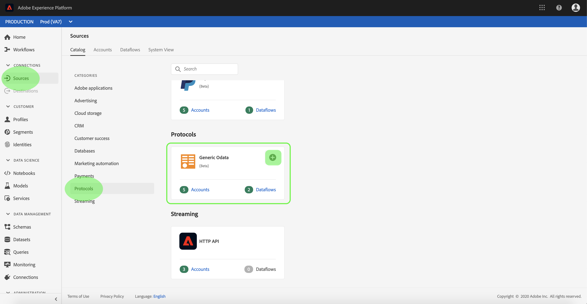
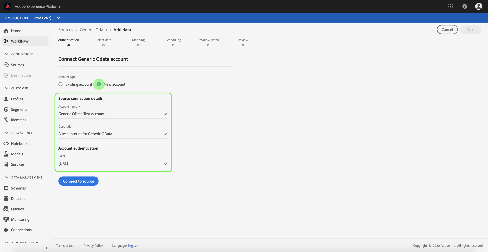
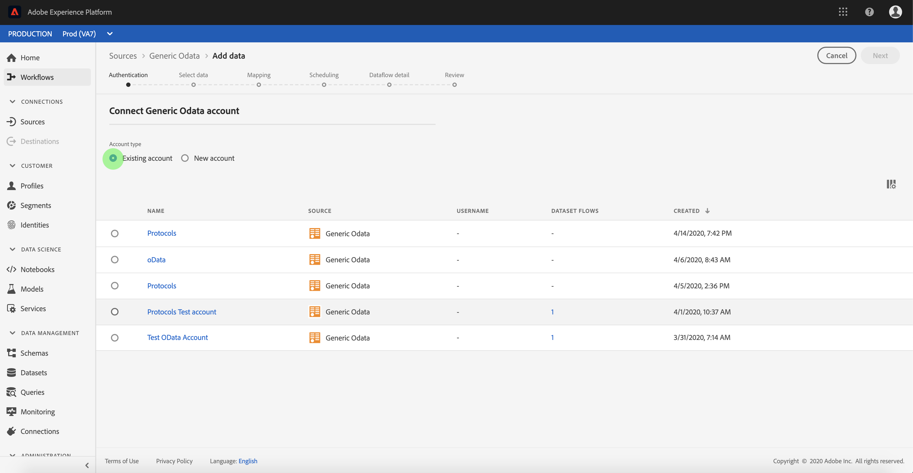

# Créer une connexion source [!DNL Generic OData] dans l’interface utilisateur

Les connecteurs Source de Adobe Experience Platform permettent d’ingérer des données provenant de l’extérieur selon un calendrier précis. Ce tutoriel décrit les étapes à suivre pour créer un connecteur source [!DNL Generic Open Data Protocol] (ci-après dénommé « [!DNL OData] ») à l’aide de l’interface utilisateur [!DNL Experience Platform].

## Prise en main

Ce tutoriel nécessite une compréhension du fonctionnement des composants suivants d’Adobe Experience Platform :

* [[!DNL Experience Data Model (XDM)] Système](../../../../../xdm/home.md) : le cadre normalisé en fonction duquel [!DNL Experience Platform] organise les données d’expérience client.
   * [Principes de base de la composition des schémas](../../../../../xdm/schema/composition.md) : découvrez les blocs de création de base des schémas XDM, y compris les principes clés et les bonnes pratiques en matière de composition de schémas.
   * [Tutoriel sur l’éditeur de schémas](../../../../../xdm/tutorials/create-schema-ui.md) : découvrez comment créer des schémas personnalisés à l’aide de l’interface utilisateur de l’éditeur de schémas.
* [[!DNL Real-Time Customer Profile]](../../../../../profile/home.md) : fournit un profil de consommateur unifié en temps réel, basé sur des données agrégées provenant de plusieurs sources.

Si vous disposez déjà d’une connexion [!DNL OData] valide, vous pouvez ignorer le reste de ce document et passer au tutoriel sur [la configuration d’un flux de données](../../dataflow/protocols.md)

### Collecter les informations d’identification requises

Pour accéder au compte [!DNL OData] dans [!DNL Experience Platform], vous devez fournir les valeurs suivantes :

| Informations d’identification | Description |
| ---------- | ----------- |
| `url` | URL racine du service [!DNL OData]. |

Pour plus d’informations sur la prise en main, consultez [ce [!DNL OData] document](https://www.odata.org/getting-started/basic-tutorial/).

## Connecter votre compte [!DNL OData]

Une fois les informations d’identification requises collectées, vous pouvez suivre les étapes ci-dessous pour lier votre compte [!DNL OData] à [!DNL Experience Platform].

Connectez-vous à [&#128279;](https://platform.adobe.com) puis sélectionnez **[!UICONTROL Sources]** dans la barre de navigation de gauche pour accéder à l’espace de travail **[!UICONTROL Sources]**. L’écran **[!UICONTROL Catalog]** affiche diverses sources pour lesquelles vous pouvez créer un compte.

Vous pouvez sélectionner la catégorie appropriée dans le catalogue sur le côté gauche de votre écran. Vous pouvez également trouver la source spécifique à utiliser à l’aide de l’option de recherche.

Sous la catégorie **[!UICONTROL Protocols]** , sélectionnez **[!UICONTROL Generic OData]**. Si c’est la première fois que vous utilisez ce connecteur, sélectionnez **[!UICONTROL Configure]**. Sinon, sélectionnez **[!UICONTROL Add data]** pour créer un connecteur [!DNL OData].

La page **[!UICONTROL Connect to Generic OData]** s’affiche. Sur cette page, vous pouvez utiliser de nouvelles informations d’identification ou des informations d’identification existantes.

### Nouveau compte

Si vous utilisez de nouvelles informations d’identification, sélectionnez **[!UICONTROL New account]**. Sur le formulaire de saisie qui s’affiche, fournissez un nom, une description facultative et vos informations d’identification [!DNL OData] à la connexion. Lorsque vous avez terminé, sélectionnez **[!UICONTROL Connect]** puis attendez que la nouvelle connexion s’établisse.

### Compte existant

Pour connecter un compte existant, sélectionnez le compte [!DNL OData] auquel vous souhaitez vous connecter, puis sélectionnez **[!UICONTROL Next]** pour continuer.

## Étapes suivantes

En suivant ce tutoriel, vous avez établi une connexion à votre compte [!DNL OData]. Vous pouvez maintenant passer au tutoriel suivant et [configurer un flux de données pour importer des données de protocole dans [!DNL Experience Platform]](../../dataflow/protocols.md).
