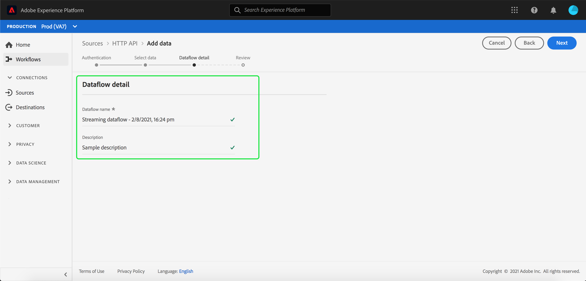

# Créer une connexion en continu [!DNL HTTP API] à l’aide de l’interface utilisateur

Ce tutoriel décrit les étapes à suivre pour créer une connexion source par flux à l’aide de l’espace de travail [!UICONTROL Sources].

## Prise en main

Ce tutoriel nécessite une compréhension du fonctionnement des composants suivants d’Adobe Experience Platform :

- [[!DNL Experience Data Model (XDM)] Système](../../../../../xdm/home.md) : le cadre normalisé en fonction duquel [!DNL Experience Platform] organise les données d’expérience client.
   - [Principes de base de la composition des schémas](../../../../../xdm/schema/composition.md) : découvrez les blocs de création de base des schémas XDM, y compris les principes clés et les bonnes pratiques en matière de composition de schémas.
   - [Tutoriel sur l’éditeur de schémas](../../../../../xdm/tutorials/create-schema-ui.md) : découvrez comment créer des schémas personnalisés à l’aide de l’interface utilisateur de l’éditeur de schémas.
- [[!DNL Real-Time Customer Profile]](../../../../../profile/home.md) : fournit un profil de consommateur unifié en temps réel, basé sur des données agrégées provenant de plusieurs sources.

## Création d’une connexion en continu

Dans l’interface utilisateur d’Experience Platform, sélectionnez **[!UICONTROL Sources]** dans le volet de navigation de gauche pour accéder à l’espace de travail [!UICONTROL Sources]. L’écran [!UICONTROL Catalogue] affiche diverses sources avec lesquelles vous pouvez créer un compte.

Vous pouvez sélectionner la catégorie appropriée dans le catalogue sur le côté gauche de votre écran. Vous pouvez également trouver la source spécifique à utiliser à l’aide de l’option de recherche.

Dans la catégorie **[!UICONTROL Streaming]**, sélectionnez **[!UICONTROL API HTTP]** puis **[!UICONTROL Ajouter des données]**.

La page **[!UICONTROL Connecter le compte d’API HTTP]** s’affiche. Sur cette page, vous pouvez utiliser de nouvelles informations d’identification ou des informations d’identification existantes.

### Compte existant

Pour utiliser un compte existant, sélectionnez le compte d’API HTTP avec lequel vous souhaitez créer un flux de données, puis sélectionnez **[!UICONTROL Suivant]** pour continuer.

### Nouveau compte

Si vous créez un compte, sélectionnez **[!UICONTROL Nouveau compte]**. Dans le formulaire de saisie qui s’affiche, indiquez un nom de compte et une description facultative. Vous aurez également la possibilité de fournir les propriétés de configuration suivantes :

- **[!UICONTROL Authentification] :** cette propriété détermine si la connexion en continu nécessite ou non une authentification. L’authentification garantit que les données sont collectées auprès de sources approuvées. Si vous avez affaire à des informations d’identification personnelle (PII), cette propriété doit être activée. Par défaut, cette propriété est désactivée.
- **[!UICONTROL Compatible avec XDM] :** cette propriété indique si cette connexion en continu enverra des événements compatibles avec les schémas XDM. Par défaut, cette propriété est désactivée.

Lorsque vous avez terminé, sélectionnez **[!UICONTROL Se connecter à la source]** puis sélectionnez **[!UICONTROL Suivant]** pour continuer.

## Sélectionner les données

Une fois la connexion à l’API HTTP créée, l’étape **[!UICONTROL Sélectionner les données]** s’affiche, vous fournissant une interface pour charger et prévisualiser vos données.

Sélectionnez **[!UICONTROL Télécharger des fichiers]** pour télécharger vos données. Vous pouvez également faire glisser vos données dans la section [!UICONTROL Glisser-déposer des fichiers] de l’interface.

Une fois vos données chargées, vous pouvez utiliser le côté droit de l’interface pour prévisualiser votre hiérarchie de fichiers. Cliquez sur **[!UICONTROL Suivant]** pour continuer.

## Mappage des champs de données à un schéma XDM

L’étape [!UICONTROL Mappage] s’affiche, fournissant une interface pour mapper les données sources à un jeu de données Experience Platform.

La source [!DNL HTTP API] prend en charge l’ingestion de fichiers JSON. Les fichiers JSON ne nécessitent pas de configuration manuelle s’ils sont marqués comme conformes à XDM. Si ce n’est pas le cas, vous devez configurer explicitement le mappage.

Sélectionnez un jeu de données dans lequel ingérer les données entrantes. Vous pouvez utiliser un jeu de données existant ou en créer un nouveau.

### Créer un nouveau jeu de données

Pour créer un jeu de données, sélectionnez **[!UICONTROL Nouveau jeu de données]**. Dans le formulaire qui s’affiche, fournissez le nom, une description facultative, ainsi que le schéma cible du jeu de données. Si vous sélectionnez un schéma activé pour [!DNL Profile], vous pouvez choisir si le jeu de données doit également être activé pour [!DNL Profile].

### Utiliser un jeu de données existant

Pour utiliser un jeu de données existant, sélectionnez **[!UICONTROL Jeu de données existant]**. Dans le formulaire qui s’affiche, sélectionnez le jeu de données à utiliser. Une fois que vous avez sélectionné un jeu de données, vous pouvez choisir s’il doit être activé pour le [!DNL Profile].

### Mappage des champs standard

Selon vos besoins, vous pouvez choisir de mapper directement des champs ou d’utiliser des fonctions de préparation de données pour transformer les données sources afin d’obtenir des valeurs informatisées ou calculées. Pour obtenir des instructions complètes sur l’utilisation de l’interface du mappeur et des champs calculés, consultez le [&#x200B; Guide de l’interface utilisateur de la préparation des données &#x200B;](../../../../../data-prep/ui/mapping.md).

Pour ajouter un nouveau champ source, sélectionnez **[!UICONTROL Ajouter un nouveau mappage]**.

Une nouvelle association entre le champ source et le champ cible apparaît. Pour ajouter un nouveau champ source, sélectionnez l’icône de flèche en regard de la barre de saisie [!UICONTROL Sélectionner le champ source].

Le panneau [!UICONTROL Sélectionner des attributs] vous permet d’explorer votre hiérarchie de fichiers et de sélectionner un champ source spécifique à mapper à un champ XDM cible. Une fois que vous avez sélectionné le champ source à mapper, sélectionnez **[!UICONTROL Sélectionner]** pour continuer.

Une fois le champ source sélectionné, vous pouvez désormais identifier le champ XDM cible approprié à mapper. Sélectionnez l’icône de schéma sous la section champ cible .

La fenêtre [!UICONTROL Mapper le champ source au champ cible] s’affiche, vous fournissant une interface pour explorer le schéma de votre jeu de données cible. Sélectionnez le champ cible correspondant à votre champ source, puis sélectionnez **[!UICONTROL Sélectionner]** pour continuer.

Une fois que vos champs source sont tous mappés à leurs champs XDM cibles appropriés, sélectionnez **[!UICONTROL Suivant]**

## Détails du flux de données

L’étape **[!UICONTROL Détails du flux de données]** s’affiche. Sur cette page, vous pouvez fournir des détails sur le flux de données créé en indiquant un nom et une description facultative.

Après avoir fourni des détails sur le flux de données, sélectionnez **[!UICONTROL Suivant]**.

## Révision

L’étape **[!UICONTROL Révision]** s’affiche et vous permet de consulter les détails de votre flux de données avant sa création. Les détails sont regroupés dans les catégories suivantes :

- **[!UICONTROL Connexion]** : affiche le nom du compte, la plateforme source et le nom de la source.
- **[!UICONTROL Attribuer des champs de jeu de données et de mappage]** : affiche le jeu de données cible et le schéma auquel le jeu de données se conforme.

Après avoir confirmé que les détails sont corrects, sélectionnez **[!UICONTROL Terminer]**.

## Obtenir l’URL du point d’entrée de diffusion en continu

Une fois la connexion créée, la page des détails des sources s’affiche. Cette page affiche les détails de la connexion que vous venez de créer, y compris les flux de données précédemment exécutés, l’identifiant et l’URL du point d’entrée de diffusion en continu.

## Étapes suivantes

Ce tutoriel vous a permis de créer une connexion HTTP en flux continu, qui vous permet d’utiliser le point d’entrée en flux continu pour accéder à diverses API [!DNL Data Ingestion]. Pour savoir comment créer une connexion en continu dans l’API, consultez le [tutoriel sur la création d’une connexion en continu](../../../api/create/streaming/http.md).

Pour savoir comment diffuser des données vers Experience Platform, consultez le tutoriel sur la [&#x200B; diffusion en continu de données de série temporelle &#x200B;](../../../../../ingestion/tutorials/streaming-time-series-data.md) ou le tutoriel sur la [&#x200B; diffusion en continu de données d’enregistrement &#x200B;](../../../../../ingestion/tutorials/streaming-record-data.md).
