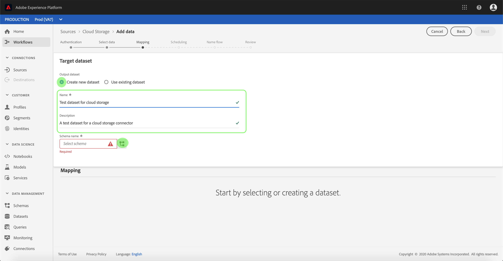

# Configuration d’un flux de données pour un connecteur de lot d’enregistrement cloud dans l’interface utilisateur

Un flux de données est une tâche planifiée qui récupère et ingère des données d’une source dans un [!DNL Platform] jeu de données. Ce didacticiel décrit les étapes à suivre pour configurer un nouveau flux de données à l’aide de votre connecteur de base d’enregistrements de cloud.

## Prise en main

Ce tutoriel nécessite une compréhension du fonctionnement des composants suivants d’Adobe Experience Platform :

* [Système de modèle de données d’expérience (XDM)](../../../../../xdm/home.md)[!DNL Experience Platform] : cadre normalisé selon lequel organise les données d’expérience client.
   * [Principes de base de la composition des schémas](../../../../../xdm/schema/composition.md) : découvrez les blocs de création de base des schémas XDM, y compris les principes clés et les bonnes pratiques en matière de composition de schémas.
   * [Didacticiel](../../../../../xdm/tutorials/create-schema-ui.md)sur l’éditeur de Schéma : Découvrez comment créer des schémas personnalisés à l’aide de l’interface utilisateur de l’éditeur de Schémas.
* [Real-time Customer Profile](../../../../../profile/home.md) : fournit un profil client en temps réel unifié basé sur des données agrégées issues de plusieurs sources.

De plus, ce didacticiel nécessite que vous ayez déjà créé un connecteur d’enregistrement de cloud. Vous trouverez une liste de didacticiels pour la création de différents connecteurs d’enregistrement de cloud dans l’interface utilisateur dans l’aperçu [des connecteurs](../../../../home.md)source.

### Formats de fichiers pris en charge

[!DNL Experience Platform] prend en charge les formats de fichier suivants à ingérer à partir d’enregistrements externes :

* Valeurs séparées par des délimiteurs (DSV) : La prise en charge des fichiers de données au format DSV est actuellement limitée aux valeurs séparées par des virgules. La valeur des en-têtes de champ des fichiers au format DSV ne doit être composée que de caractères alphanumériques et de traits de soulignement. La prise en charge des fichiers DSV généraux sera assurée à l’avenir.
* [!DNL JavaScript Object Notation] (JSON) : Les fichiers de données au format JSON doivent être compatibles XDM.
* [!DNL Apache Parquet]: Les fichiers de données au format Parquet doivent être compatibles XDM.

## Sélectionner des données

Après avoir créé votre connecteur d’enregistrement de cloud, l’étape *[!UICONTROL Sélectionner les données]* s’affiche, ce qui vous permet d’explorer la hiérarchie de votre enregistrement de cloud.

* La moitié gauche de l&#39;interface est un navigateur d&#39;annuaire qui affiche les fichiers et répertoires de votre serveur.
* La moitié droite de l&#39;interface vous permet de prévisualisation jusqu&#39;à 100 lignes de données à partir d&#39;un fichier compatible.

Le fait de cliquer sur un dossier répertorié vous permet de parcourir la hiérarchie de dossiers en dossiers plus profonds. Une fois que vous avez sélectionné un fichier ou un dossier compatible, la liste déroulante **[!UICONTROL Sélectionner le format]** de données s&#39;affiche, dans laquelle vous pouvez choisir un format pour afficher les données dans la fenêtre de prévisualisation.

Une fois la fenêtre de prévisualisation renseignée, vous pouvez cliquer sur **[!UICONTROL Suivant]** pour télécharger tous les fichiers du dossier sélectionné. Si vous souhaitez télécharger un fichier spécifique, sélectionnez-le dans la liste avant de cliquer sur **[!UICONTROL Suivant]**.

>[!NOTE]
>
>Les formats de fichier pris en charge sont CSV, JSON et Parquet. Les fichiers JSON et Parquet doivent être compatibles XDM.

## Mappage des champs de données à un schéma XDM

L’étape *[!UICONTROL Mappage]* s’affiche, fournissant une interface interactive permettant de mapper les données source à un [!DNL Platform] jeu de données. Les fichiers source mis en forme dans JSON ou Parquet doivent être compatibles XDM et ne nécessitent pas de configuration manuelle du mappage. Inversement, les fichiers CSV nécessitent de configurer explicitement le mappage, mais vous permettent de sélectionner les champs de données source à mapper.

Choisissez un jeu de données dans lequel les données entrantes doivent être assimilées. Vous pouvez soit utiliser un jeu de données existant, soit en créer un nouveau.

**Utilisation d’un jeu de données existant**

Pour importer des données dans un jeu de données existant, sélectionnez **[!UICONTROL Utiliser un jeu de données]** existant, puis cliquez sur l’icône Jeu de données.

The _Select dataset_ dialog appears. Recherchez le jeu de données que vous souhaitez utiliser, sélectionnez-le, puis cliquez sur **[!UICONTROL Continuer]**.

**Utiliser un nouveau jeu de données**

Pour importer des données dans un nouveau jeu de données, sélectionnez **[!UICONTROL Créer un jeu de données]** et saisissez un nom et une description pour le jeu de données dans les champs fournis. Cliquez ensuite sur l’icône schéma.

The _Select schema_ dialog appears. Sélectionnez le schéma à appliquer au nouveau jeu de données, puis cliquez sur **[!UICONTROL Terminé]**.

Selon vos besoins, vous pouvez choisir de mapper directement les champs ou utiliser les fonctions de mappage pour transformer les données source afin de dériver des valeurs calculées ou calculées. Pour plus d’informations sur les fonctions de mappage et de mappage de données, consultez le didacticiel sur le [mappage des données CSV aux champs](../../../../../ingestion/tutorials/map-a-csv-file.md)de schéma XDM.

Une fois les données source mises en correspondance, cliquez sur **[!UICONTROL Suivant]**.

## Planifier les exécutions d&#39;assimilation

L&#39;étape *[!UICONTROL Planification]* s&#39;affiche, ce qui vous permet de configurer un programme d&#39;assimilation pour assimiler automatiquement les données source sélectionnées à l&#39;aide des mappages configurés. Le tableau suivant décrit les différents champs configurables pour la planification :

| Champ | Description |
| --- | --- |
| Fréquence | Les fréquences sélectionnées sont les suivantes : Minute, Heure, Jour et Semaine. |
| Intervalle | Entier qui définit l’intervalle pour la fréquence sélectionnée. |
| Début | Horodatage UTC pour lequel la toute première importation aura lieu. |
| Renvoi | Valeur booléenne qui détermine quelles données sont initialement ingérées. Si le *[!UICONTROL renvoi]* est activé, tous les fichiers actuels du chemin d’accès spécifié seront ingérés lors de la première assimilation planifiée. Si le *[!UICONTROL renvoi]* est désactivé, seuls les fichiers chargés entre la première exécution de l’assimilation et le délai *[!UICONTROL de]* Début seront ingérés. Les fichiers chargés avant l&#39;heure *[!UICONTROL de]* Début ne seront pas ingérés. |

Les flux de données sont conçus pour intégrer automatiquement les données sur une base planifiée. Si vous souhaitez effectuer une seule assimilation via ce flux de travail, vous pouvez le faire en configurant la **[!UICONTROL fréquence]** sur &quot;Jour&quot; et en appliquant un nombre très élevé pour l’ **[!UICONTROL intervalle]**, tel que 10000 ou un nombre similaire.

Indiquez les valeurs de la planification et cliquez sur **Suivant**.

## Nommer votre flux de données

L’étape de flux ** Nom s’affiche, vous permettant de nommer et de fournir une brève description de votre nouveau flux de données.

Fournissez des valeurs pour le flux de données et cliquez sur **[!UICONTROL Suivant]**.

### Vérifier votre flux de données

L’étape *[!UICONTROL Révision]* s’affiche, vous permettant de vérifier votre nouveau flux de données avant sa création. Les détails sont regroupés dans les catégories suivantes :

* *[!UICONTROL Détails]* de la source : Indique le type de source, le chemin d’accès approprié du fichier source choisi et le nombre de colonnes qu’il contient.
* *[!UICONTROL Détails]* de la Cible : Affiche le jeu de données dans lequel les données source sont ingérées, y compris le schéma auquel le jeu de données adhère.
* *[!UICONTROL Détails]* de la planification : Affiche la période active, la fréquence et l&#39;intervalle du programme d&#39;assimilation.

Une fois que vous avez passé en revue votre flux de données, cliquez sur **[!UICONTROL Terminer]** et accordez un certain temps à la création du flux de données.

## Surveiller et supprimer votre flux de données

Une fois le flux de données de votre enregistrement cloud créé, vous pouvez surveiller les données qui y sont ingérées. Pour plus d&#39;informations sur la surveillance et la suppression des flux de données, consultez le didacticiel sur la [surveillance des flux de données](../../../../../ingestion/quality/monitor-data-flows.md).

## Étapes suivantes

En suivant ce didacticiel, vous avez réussi à créer un flux de données pour importer des données à partir d’un enregistrement cloud externe et à mieux comprendre la surveillance des jeux de données. Pour en savoir plus sur la création de flux de données, vous pouvez compléter votre apprentissage en regardant la vidéo ci-dessous. En outre, les données entrantes peuvent désormais être utilisées par [!DNL Platform] les services en aval tels que [!DNL Real-time Customer Profile] et [!DNL Data Science Workspace]. Pour plus d’informations, voir les documents suivants :

* [Présentation du profil client en temps réel](../../../../../profile/home.md)
* [Présentation de Data Science Workspace](../../../../../data-science-workspace/home.md)

>[!WARNING]
>
> L’ [!DNL Platform] interface utilisateur affichée dans la vidéo suivante est obsolète. Reportez-vous à la documentation ci-dessus pour obtenir les dernières captures d&#39;écran et fonctionnalités de l&#39;interface utilisateur.

>[!VIDEO](https://video.tv.adobe.com/v/29695?quality=12&learn=on)

## Annexe

Les sections suivantes fournissent des informations supplémentaires sur l’utilisation des connecteurs source.

### Désactivation d’un flux de données

Lorsqu’un flux de données est créé, il devient immédiatement actif et ingère les données selon le planning qu’il a reçu. Vous pouvez désactiver un flux de données actif à tout moment en suivant les instructions ci-dessous.

Dans l’espace de travail *[!UICONTROL Sources]* , cliquez sur l’onglet **[!UICONTROL Parcourir]** . Cliquez ensuite sur le nom du compte associé au flux de données actif que vous souhaitez désactiver.

La page activité ** source s&#39;affiche. Sélectionnez le flux de données actif dans la liste pour ouvrir sa colonne *[!UICONTROL Propriétés]* sur le côté droit de l&#39;écran, qui contient un bouton d&#39;activation **** de la bascule. Cliquez sur la bascule pour désactiver le flux de données. La même bascule peut être utilisée pour réactiver un flux de données après sa désactivation.

### Activer les données entrantes pour [!DNL Profile] la population

Les données entrantes provenant de votre connecteur source peuvent être utilisées pour enrichir et renseigner vos [!DNL Real-time Customer Profile] données. Pour plus d’informations sur le renseignement de vos [!DNL Profile] données client réel, voir le didacticiel sur la population [de](../../profile.md)Profils.
