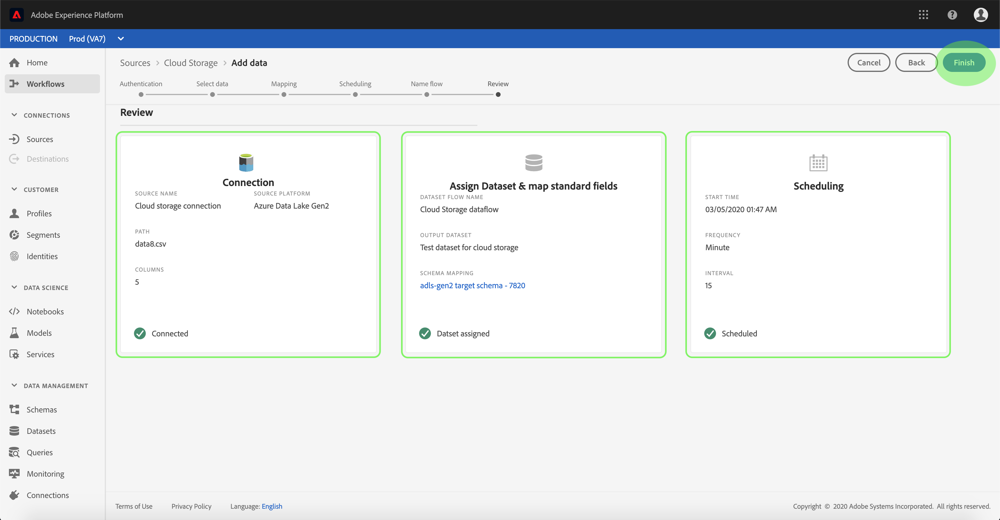

# Configuration d’un flux de données pour une connexion par lots de stockage dans le cloud dans l’interface utilisateur

Un flux de données est une tâche planifiée qui récupère et ingère des données d’une source vers une [!DNL Platform] jeu de données. Ce tutoriel décrit les étapes de configuration d’un nouveau flux de données à l’aide de votre compte de stockage dans le cloud.

## Prise en main

Ce tutoriel nécessite une compréhension du fonctionnement des composants suivants d’Adobe Experience Platform :

* [[!DNL Experience Data Model (XDM)] Système](../../../../../xdm/home.md): Le cadre normalisé selon lequel [!DNL Experience Platform] organise les données d’expérience client.
   * [Principes de base de la composition des schémas](../../../../../xdm/schema/composition.md) : découvrez les blocs de création de base des schémas XDM, y compris les principes clés et les bonnes pratiques en matière de composition de schémas.
   * [Tutoriel de l’éditeur de schémas](../../../../../xdm/tutorials/create-schema-ui.md): Découvrez comment créer des schémas personnalisés à l’aide de l’interface utilisateur de l’éditeur de schémas.
* [[!DNL Real-time Customer Profile]](../../../../../profile/home.md) : fournit un profil client en temps réel unifié basé sur des données agrégées issues de plusieurs sources.

En outre, ce tutoriel nécessite que vous disposiez d’un compte de stockage dans le cloud établi. Vous trouverez une liste des tutoriels relatifs à la création de différents comptes de stockage dans le cloud dans l’interface utilisateur de la section [Présentation des connecteurs source](../../../../home.md).

### Formats de fichiers pris en charge

[!DNL Experience Platform] prend en charge les formats de fichiers suivants à ingérer à partir de stockages externes :

* Valeurs séparées par des délimiteurs (DSV) : N’importe quelle valeur de caractère unique peut être utilisée comme délimiteur pour les fichiers de données au format DSV.
* [!DNL JavaScript Object Notation] (JSON) : Les fichiers de données au format JSON doivent être compatibles avec XDM.
* [!DNL Apache Parquet]: Les fichiers de données au format parquet doivent être compatibles avec XDM.
* Fichiers compressés : Les fichiers JSON et délimités peuvent être compressés comme suit : `bzip2`, `gzip`, `deflate`, `zipDeflate`, `tarGzip`, et `tar`.

## Sélectionner des données

Après avoir créé votre compte de stockage dans le cloud, la variable **[!UICONTROL Sélectionner des données]** s’affiche, fournissant une interface vous permettant d’explorer la hiérarchie des fichiers de stockage dans le cloud.

* La partie gauche de l’interface est un explorateur de répertoires qui affiche vos fichiers et répertoires de stockage dans le cloud.
* La partie droite de l&#39;interface permet de prévisualiser jusqu&#39;à 100 lignes de données à partir d&#39;un fichier compatible.

La sélection d’un dossier répertorié vous permet de parcourir la hiérarchie de dossiers dans des dossiers plus profonds. Vous pouvez sélectionner un seul dossier pour ingérer tous les fichiers du dossier de manière récursive. Lors de l’ingestion d’un dossier entier, vous devez vous assurer que tous les fichiers du dossier partagent le même schéma.

Une fois que vous avez sélectionné un fichier ou un dossier compatible, sélectionnez le format de données correspondant dans le [!UICONTROL Sélectionner le format de données] menu déroulant.

Le tableau suivant affiche le format de données approprié pour les types de fichiers pris en charge :

| Type de fichier | Sur le format des données saisies |
| --- | --- |
| CSV | [!UICONTROL Délimité] |
| JSON | [!UICONTROL JSON] |
| Parquet | [!UICONTROL Parquet XDM] |

Sélectionner **[!UICONTROL JSON]** et attendez quelques secondes que l’interface d’aperçu soit remplie.

>[!NOTE]
>
>Contrairement aux types de fichiers JSON et délimités, les fichiers au format Parquet ne sont pas disponibles pour l’aperçu.

L’interface d’aperçu vous permet d’examiner le contenu et la structure d’un fichier. Par défaut, l’interface d’aperçu affiche le premier fichier du dossier que vous avez sélectionné.

Pour prévisualiser un autre fichier, cliquez sur l’icône d’aperçu située en regard du nom du fichier à inspecter.

Une fois que vous avez vérifié le contenu et la structure des fichiers de votre dossier, sélectionnez **[!UICONTROL Suivant]** pour ingérer tous les fichiers du dossier de manière récursive.

Si vous préférez sélectionner un fichier spécifique, sélectionnez-le, puis choisissez **[!UICONTROL Suivant]**.

### Définition d’un délimiteur personnalisé pour les fichiers délimités

Vous pouvez définir un délimiteur personnalisé lors de l’ingestion de fichiers délimités. Sélectionnez la **[!UICONTROL Délimiteur]** puis sélectionnez un délimiteur dans le menu déroulant. Le menu affiche les options de délimiteurs les plus fréquemment utilisées, y compris une virgule (`,`), un onglet (`\t`) et une barre verticale (`|`). Si vous préférez utiliser un délimiteur personnalisé, sélectionnez **[!UICONTROL Personnalisé]** et saisissez un délimiteur à un caractère unique de votre choix dans la barre de saisie contextuelle.

Une fois que vous avez sélectionné le format de données et défini votre délimiteur, sélectionnez **[!UICONTROL Suivant]**.

### Ingestion de fichiers compressés

Vous pouvez ingérer des fichiers JSON compressés ou délimités en spécifiant leur type de compression.

Dans le [!UICONTROL Sélectionner des données] sélectionnez un fichier compressé à des fins d’ingestion, puis sélectionnez son type de fichier approprié et indiquez s’il est compatible XDM ou non. Ensuite, sélectionnez **[!UICONTROL Type de compression]** puis sélectionnez le type de fichier compressé approprié pour vos données source.

Une fois le type de fichier compressé identifié, sélectionnez **[!UICONTROL Suivant]** pour continuer.

## Mappage des champs de données à un schéma XDM

Le **[!UICONTROL Mappage]** s’affiche, fournissant une interface interactive pour mapper les données source à une [!DNL Platform] jeu de données. Les fichiers source formatés dans Parquet doivent être conformes à XDM et ne nécessitent pas de configurer manuellement le mappage, tandis que les fichiers CSV nécessitent de configurer explicitement le mappage, mais vous permettent de choisir les champs de données source à mapper. Les fichiers JSON, s’ils sont marqués comme une plainte XDM, ne nécessitent pas de configuration manuelle. Cependant, s’il n’est pas marqué comme compatible XDM, il vous faudra configurer explicitement le mappage.

Sélectionnez un jeu de données dans lequel ingérer les données entrantes. Vous pouvez utiliser un jeu de données existant ou en créer un nouveau.

**Utilisation d’un jeu de données existant**

Pour ingérer des données dans un jeu de données existant, sélectionnez **[!UICONTROL Jeu de données existant]**, puis sélectionnez l’icône du jeu de données.

Le **[!UICONTROL Sélectionner un jeu de données]** s’affiche. Recherchez le jeu de données que vous souhaitez utiliser, sélectionnez-le, puis cliquez sur **[!UICONTROL Continuer]**.

**Utilisation d’un nouveau jeu de données**

Pour ingérer des données dans un nouveau jeu de données, sélectionnez **[!UICONTROL Nouveau jeu de données]** et saisissez un nom et une description pour le jeu de données dans les champs fournis. Pour ajouter un schéma, vous pouvez saisir un nom de schéma existant dans le champ **[!UICONTROL Sélectionner un schéma]** de la boîte de dialogue Vous pouvez également sélectionner la variable **[!UICONTROL Recherche avancée dans un schéma]** pour rechercher un schéma approprié.

Au cours de cette étape, vous pouvez activer votre jeu de données pour [!DNL Real-time Customer Profile] et créer une vision globale des attributs et des comportements d’une entité. Les données de tous les jeux de données activés seront incluses dans [!DNL Profile] les modifications et sont appliquées lorsque vous enregistrez votre flux de données.

Activez/désactivez la variable **[!UICONTROL Jeu de données de profil]** pour activer votre jeu de données cible [!DNL Profile].

Le **[!UICONTROL Sélectionner un schéma]** s’affiche. Sélectionnez le schéma que vous souhaitez appliquer au nouveau jeu de données, puis sélectionnez **[!UICONTROL Terminé]**.

Selon vos besoins, vous pouvez choisir de mapper directement des champs ou d’utiliser des fonctions de préparation de données pour transformer les données sources afin d’obtenir des valeurs calculées ou calculées. Pour plus d’informations sur les fonctions du mappeur et les champs calculés, reportez-vous à la section [Guide des fonctions de préparation de données](../../../../../data-prep/functions.md) ou le [guide des champs calculés](../../../../../data-prep/calculated-fields.md).

Pour les fichiers JSON, en plus de mapper directement les champs à d’autres champs, vous pouvez directement mapper des objets à d’autres objets et tableaux à d’autres tableaux. Vous pouvez également prévisualiser et mapper des types de données complexes tels que des tableaux dans des fichiers JSON à l’aide d’un connecteur source de stockage dans le cloud.

Notez que vous ne pouvez pas effectuer de mappage sur différents types. Par exemple, vous ne pouvez pas mapper un objet à un tableau ou un champ à un objet.

>[!TIP]
>
>Platform fournit des recommandations intelligentes pour les champs mappés automatiquement en fonction du schéma ou du jeu de données cible que vous avez sélectionné. Vous pouvez ajuster manuellement les règles de mappage en fonction de vos cas d’utilisation.

Sélectionner **[!UICONTROL Aperçu des données]** pour afficher les résultats de mappage de 100 lignes maximum de données d’exemple du jeu de données sélectionné.

Lors de la prévisualisation, la colonne d’identité est considérée comme le premier champ, car il s’agit des informations clés nécessaires à la validation des résultats du mapping.

Une fois les données source mappées, sélectionnez **[!UICONTROL Fermer]**.

## Planification des exécutions d’ingestion

Le **[!UICONTROL Planification]** s’affiche, ce qui vous permet de configurer un planning d’ingestion pour ingérer automatiquement les données source sélectionnées à l’aide des mappages configurés. Le tableau suivant décrit les différents champs configurables pour la planification :

| Champ | Description |
| --- | --- |
| Fréquence | Les fréquences sélectionnées incluent `Once`, `Minute`, `Hour`, `Day`, et `Week`. |
| Intervalle | Entier qui définit l’intervalle pour la fréquence sélectionnée. |
| Heure de début | Horodatage UTC indiquant quand la toute première ingestion est configurée pour se produire. |
| Renvoi | Valeur boolean qui détermine les données ingérées initialement. If **[!UICONTROL Renvoi]** est activée, tous les fichiers actuels du chemin spécifié seront ingérés lors de la première ingestion planifiée. If **[!UICONTROL Renvoi]** est désactivé, seuls les fichiers chargés entre la première exécution de l’ingestion et l’heure de début seront ingérés. Les fichiers chargés avant l’heure de début ne seront pas ingérés. |

Les flux de données sont conçus pour ingérer automatiquement des données selon un calendrier précis. Sélectionnez tout d’abord la fréquence d’ingestion. Définissez ensuite l’intervalle pour désigner la période entre deux exécutions de flux. La valeur de l’intervalle doit être un entier non nul et doit être définie sur supérieur ou égal à 15.

Pour définir l’heure de début de l’ingestion, ajustez la date et l’heure affichées dans la zone d’heure de début. Vous pouvez également sélectionner l’icône de calendrier pour modifier la valeur de l’heure de début. L’heure de début doit être supérieure ou égale à l’heure actuelle en UTC.

Indiquez les valeurs du planning et sélectionnez **[!UICONTROL Suivant]**.

>[!NOTE]
>
>Pour l’ingestion par lots, chaque flux de données qui s’ensuit sélectionne les fichiers à ingérer à partir de votre source en fonction de leur **last modified** horodatage. Cela signifie que les flux de données par lot sélectionnent des fichiers de la source qui sont nouveaux ou qui ont été modifiés depuis la dernière exécution du flux de données.

### Configuration d’un flux de données d’ingestion unique

Pour configurer l’ingestion unique, sélectionnez la flèche de liste déroulante Fréquence et choisissez **[!UICONTROL Une fois]**. Vous pouvez continuer à apporter des modifications à un jeu de flux de données pour une ingestion par fréquence unique, tant que l’heure de début reste dans le futur. Une fois l’heure de début écoulée, la valeur de la fréquence ponctuelle ne peut plus être modifiée. **[!UICONTROL Intervalle]** et **[!UICONTROL Renvoi]** ne sont pas visibles lors de la configuration d’un flux de données d’ingestion unique.

>[!IMPORTANT]
>
>Il est vivement recommandé de planifier votre flux de données pour une ingestion unique lors de l’utilisation de la variable [Connecteur FTP](../../../../connectors/cloud-storage/ftp.md).

Une fois que vous avez fourni les valeurs appropriées au planning, sélectionnez **[!UICONTROL Suivant]**.

## Fournir des détails sur les flux de données

>[!CONTEXTUALHELP]
>id="platform_sources_alerts_subscribe"
>title="Abonnement aux alertes de sources"
>abstract="Cochez cette option pour vous abonner aux alertes de notification pour les flux de données de vos sources."
>additional-url="https://experienceleague.adobe.com/docs/experience-platform/sources/ui-tutorials/dataflow/cloud-storage.html?lang=en#provide-dataflow-details" text="En savoir plus dans la documentation"

Le **[!UICONTROL Détails du flux de données]** s’affiche, ce qui vous permet de nommer et de décrire brièvement votre nouveau flux de données.

Au cours de ce processus, vous pouvez également activer **[!UICONTROL Ingestion partielle]** et **[!UICONTROL Diagnostics d’erreur]**. Activation **[!UICONTROL Ingestion partielle]** permet d’ingérer des données contenant des erreurs, jusqu’à un certain seuil que vous pouvez définir. Activation **[!UICONTROL Diagnostics d’erreur]** fournit des détails sur toutes les données incorrectes qui sont traitées par lots séparément. Pour plus d’informations, voir [Présentation de l’ingestion par lots partielle](../../../../../ingestion/batch-ingestion/partial.md).

Indiquez des valeurs pour le flux de données et sélectionnez **[!UICONTROL Suivant]**.

## Vérification du flux de données

Le **[!UICONTROL Réviser]** s’affiche, ce qui vous permet de consulter votre nouveau flux de données avant qu’il ne soit créé. Les détails sont regroupés dans les catégories suivantes :

* **[!UICONTROL Connexion]**: Affiche le type de source, le chemin d’accès approprié du fichier source choisi et la quantité de colonnes qu’il contient.
* **[!UICONTROL Attribution de champs de jeu de données et de mappage]**: Affiche le jeu de données dans lequel les données source sont ingérées, y compris le schéma auquel le jeu de données adhère.
* **[!UICONTROL Planification]**: Affiche la période, la fréquence et l’intervalle principaux du planning d’ingestion.

Une fois que vous avez examiné votre flux de données, cliquez sur **[!UICONTROL Terminer]** et accorder un certain temps pour la création du flux de données.

## Surveillance de votre flux de données

Une fois votre flux de données créé, vous pouvez surveiller les données ingérées pour afficher des informations sur les taux d’ingestion, les succès et les erreurs. Pour plus d’informations sur la surveillance du flux de données, consultez le tutoriel sur [surveillance des comptes et des flux de données dans l’interface utilisateur](../../monitor.md).

## Suppression de votre flux de données

Vous pouvez supprimer les flux de données qui ne sont plus nécessaires ou qui ont été créés de manière incorrecte à l’aide de la fonction **[!UICONTROL Supprimer]** de la fonction **[!UICONTROL Flux de données]** workspace. Pour plus d’informations sur la suppression des flux de données, consultez le tutoriel sur [suppression de flux de données dans l’interface utilisateur](../../delete.md).

## Étapes suivantes

En suivant ce tutoriel, vous avez créé un flux de données pour importer des données d’un espace de stockage cloud externe et vous avez obtenu des informations sur la surveillance des jeux de données. Pour en savoir plus sur la création de flux de données, vous pouvez compléter votre apprentissage en regardant la vidéo ci-dessous. En outre, les données entrantes peuvent désormais être utilisées par les utilisateurs en aval. [!DNL Platform] des services tels que [!DNL Real-time Customer Profile] et [!DNL Data Science Workspace]. Pour plus d’informations, consultez les documents suivants :

* [Présentation de [!DNL Real-time Customer Profile]](../../../../../profile/home.md)
* [Présentation de [!DNL Data Science Workspace]](../../../../../data-science-workspace/home.md)

>[!WARNING]
>
> Lʼinterface utilisateur de [!DNL Platform] affichée dans la vidéo suivante est obsolète. Reportez-vous à la documentation ci-dessus pour connaître les dernières captures d’écran et fonctionnalités de l’interface utilisateur.

>[!VIDEO](https://video.tv.adobe.com/v/29695?quality=12&learn=on)

## Annexe

Les sections suivantes apportent des informations supplémentaires sur l’utilisation des connecteurs source.

### Désactivation d’un flux de données

Lorsqu’un flux de données est créé, il devient immédiatement principal et ingère des données selon le planning qu’il a été donné. Vous pouvez désactiver un principal flux de données à tout moment en suivant les instructions ci-dessous.

Dans le **[!UICONTROL Sources]** espace de travail, cliquez sur **[!UICONTROL Parcourir]** . Cliquez ensuite sur le nom du compte associé au principal flux de données que vous souhaitez désactiver.

Le **[!UICONTROL Activité Source]** s’affiche. Sélectionnez le flux de données principal dans la liste pour ouvrir son **[!UICONTROL Propriétés]** sur le côté droit de l’écran, qui contient une **[!UICONTROL Activé]** bouton bascule . Cliquez sur le bouton bascule pour désactiver le flux de données. Le même bouton peut être utilisé pour réactiver un flux de données une fois qu’il a été désactivé.

### Activer les données entrantes pour [!DNL Profile] population

Les données entrantes provenant de votre connecteur source peuvent être utilisées pour enrichir et remplir vos [!DNL Real-time Customer Profile] data. Pour plus d’informations sur le remplissage de votre [!DNL Real-time Customer Profile] data, consultez le tutoriel sur [Population du profil](../../profile.md).
