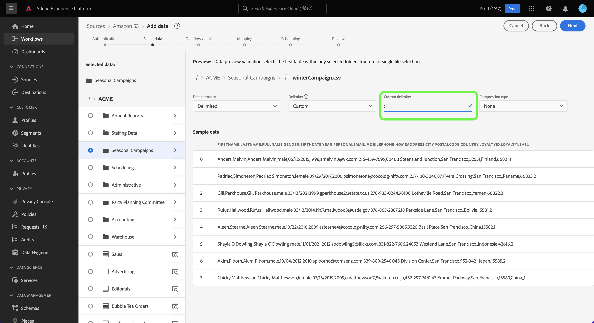

# Configurez un flux de données pour ingérer des données par lot à partir d’une source d’espace de stockage dans l’interface utilisateur

Ce tutoriel décrit les étapes à suivre pour configurer un flux de données afin d’importer des données par lots de votre source d’espace de stockage dans Adobe Experience Platform.

## Commencer

>[!NOTE]
>
>Pour créer un flux de données afin d’importer des données par lots d’un espace de stockage dans le cloud, vous devez déjà avoir accès à une source d’espace de stockage dans le cloud authentifiée. Si vous n’y avez pas accès, accédez à la [présentation des sources](../../../../home.md#cloud-storage) pour obtenir une liste des sources d’espace de stockage dans le cloud avec lesquelles vous pouvez créer un compte.

Ce tutoriel nécessite une compréhension du fonctionnement des composants suivants d’Adobe Experience Platform : 

* [[!DNL Experience Data Model (XDM)] Système](../../../../../xdm/home.md) : Cadre normalisé selon lequel Experience Platform organise les données d’expérience client. 
   * [Principes de base de la composition des schémas](../../../../../xdm/schema/composition.md) : découvrez les blocs de création de base des schémas XDM, y compris les principes clés et les bonnes pratiques en matière de composition de schémas.
   * [Tutoriel sur l’éditeur de schémas](../../../../../xdm/tutorials/create-schema-ui.md) : découvrez comment créer des schémas personnalisés à l’aide de l’interface utilisateur de l’éditeur de schémas.
* [[!DNL Real-Time Customer Profile]](../../../../../profile/home.md) : fournit un profil de consommateur unifié en temps réel, basé sur des données agrégées provenant de plusieurs sources.

### Formats de fichiers pris en charge

Les sources de stockage dans le cloud pour les données par lot prennent en charge les formats de fichiers suivants pour l’ingestion :

* Valeurs séparées par un délimiteur (DSV) : toute valeur à un seul caractère peut être utilisée comme délimiteur pour les fichiers de données au format DSV.
* [!DNL JavaScript Object Notation] (JSON) : les fichiers de données au format JSON doivent être conformes à XDM.
* [!DNL Apache Parquet] : les fichiers de données au format parquet doivent être conformes à XDM.
* Fichiers compressés : les fichiers délimités et JSON peuvent être compressés comme suit : `bzip2`, `gzip`, `deflate`, `zipDeflate`, `tarGzip` et `tar`.

## Ajouter des données

Une fois votre compte d’espace de stockage créé, l’étape **[!UICONTROL Ajouter des données]** s’affiche, vous permettant d’explorer la hiérarchie de vos fichiers d’espace de stockage dans le cloud et de sélectionner le dossier ou le fichier spécifique à importer dans Experience Platform.

* La partie gauche de l’interface est un navigateur de répertoires qui affiche la hiérarchie des fichiers de l’espace de stockage dans le cloud.
* La partie droite de l’interface vous permet de prévisualiser jusqu’à 100 lignes de données à partir d’un dossier ou d’un fichier compatible.

Sélectionnez le dossier racine pour accéder à la hiérarchie des dossiers. À partir de là, vous pouvez sélectionner un seul dossier pour ingérer tous les fichiers du dossier de manière récursive. Lors de l’ingestion d’un dossier entier, vous devez vous assurer que tous les fichiers de ce dossier partagent le même format de données et le même schéma.

Une fois que vous avez sélectionné un dossier, l’interface de droite se met à jour vers un aperçu du contenu et de la structure du premier fichier dans le dossier sélectionné.

Au cours de cette étape, vous pouvez effectuer plusieurs configurations sur vos données, avant de continuer. Sélectionnez tout d’abord **[!UICONTROL Format des données]**, puis sélectionnez le format de données approprié pour votre fichier dans le panneau déroulant qui s’affiche.

Le tableau suivant affiche les formats de données appropriés pour les types de fichiers pris en charge :

| Type de fichier | Format des données |
| --- | --- |
| CSV | [!UICONTROL Délimité] |
| JSON | [!UICONTROL &#x200B; JSON &#x200B;] |
| Parquet | [!UICONTROL Parquet XDM &#x200B;] |

### Sélectionner un délimiteur de colonne

Après avoir configuré le format des données, vous pouvez définir un délimiteur de colonne lors de l’ingestion de fichiers délimités. Sélectionnez l’option **[!UICONTROL Délimiteur]** puis sélectionnez un délimiteur dans le menu déroulant. Le menu affiche les options les plus utilisées pour les délimiteurs, y compris une virgule (`,`), un onglet (`\t`) et une barre verticale (`|`).

Si vous préférez utiliser un délimiteur personnalisé, sélectionnez **[!UICONTROL Personnalisé]** et saisissez un délimiteur à un seul caractère de votre choix dans la barre de saisie contextuelle.

### Ingestion de fichiers compressés

Vous pouvez également ingérer des fichiers délimités ou JSON compressés en spécifiant leur type de compression.

À l’étape [!UICONTROL Sélectionner des données], sélectionnez un fichier compressé à ingérer, puis sélectionnez son type de fichier approprié et s’il est compatible ou non avec XDM. Sélectionnez ensuite **[!UICONTROL Type de compression]** puis sélectionnez le type de fichier compressé approprié pour vos données source.

Pour importer un fichier spécifique dans Experience Platform, sélectionnez un dossier, puis sélectionnez le fichier à ingérer. Au cours de cette étape, vous pouvez également prévisualiser le contenu d’autres fichiers dans un dossier donné à l’aide de l’icône d’aperçu à côté d’un nom de fichier.

Lorsque vous avez terminé, sélectionnez **[!UICONTROL Suivant]**.

## Fournir des détails sur le flux de données

La page [!UICONTROL Détails du flux de données] vous permet de choisir si vous souhaitez utiliser un jeu de données existant ou un nouveau jeu de données. Au cours de ce processus, vous pouvez également configurer vos données à ingérer dans le profil et activer des paramètres tels que [!UICONTROL Diagnostics d’erreur], [!UICONTROL Ingestion partielle] et [!UICONTROL Alertes].

### Utiliser un jeu de données existant

Pour ingérer vos données dans un jeu de données existant, sélectionnez **[!UICONTROL Jeu de données existant]**. Vous pouvez soit récupérer un jeu de données existant à l’aide de l’option de [!UICONTROL Recherche avancée], soit faire défiler la liste des jeux de données existants dans le menu déroulant. Une fois que vous avez sélectionné un jeu de données, indiquez un nom et une description pour votre flux de données.

### Utiliser un nouveau jeu de données

Pour procéder à lʼingestion dans un nouveau jeu de données, sélectionnez **[!UICONTROL Nouveau jeu de données]**, puis saisissez un nom pour le jeu de données de sortie et une description facultative. Sélectionnez ensuite un schéma à mapper à l’aide de l’option [!UICONTROL Recherche avancée] ou en faisant défiler la liste des schémas existants dans le menu déroulant. Une fois que vous avez sélectionné un schéma, saisissez un nom et une description pour votre flux de données.

### Activation des diagnostics de profil et d’erreur

Sélectionnez ensuite le bouton (bascule) **[!UICONTROL Jeu de données de profil]** pour activer votre jeu de données pour le profil. Cela vous permet de créer une vue holistique des attributs et des comportements d’une entité. Les données de tous les jeux de données activés pour Profil seront incluses dans le profil et les modifications sont appliquées lorsque vous enregistrez votre flux de données.

Le [!UICONTROL diagnostic d’erreur] permet de générer un message d’erreur détaillé pour tout enregistrement erroné survenant dans votre flux de données, tandis que l’[!UICONTROL ingestion partielle] vous permet d’ingérer des données contenant des erreurs, jusqu’à un certain seuil que vous définissez manuellement. Pour plus d’informations, consultez la [présentation de l’ingestion par lots partiels](../../../../../ingestion/batch-ingestion/partial.md).

### Activer les alertes

Vous pouvez activer les alertes pour recevoir des notifications sur le statut de votre flux de données. Sélectionnez une alerte dans la liste et abonnez-vous à des notifications concernant le statut de votre flux de données. Pour plus d’informations sur les alertes, consultez le guide sur l’[abonnement aux alertes des sources dans l’interface utilisateur](../../alerts.md).

Lorsque vous avez terminé de renseigner votre flux de données, sélectionnez **[!UICONTROL Suivant]**.

## Mappage des champs de données à un schéma XDM

L’interface de [!UICONTROL mappage] fournit un outil complet pour mapper les champs sources de votre schéma source aux champs XDM cibles correspondants dans le schéma cible.

Experience Platform fournit des recommandations intelligentes pour les champs mappés automatiquement en fonction du schéma ou du jeu de données cible que vous avez sélectionné. Vous pouvez ajuster manuellement les règles de mappage en fonction de vos cas d’utilisation. Selon vos besoins, vous pouvez choisir de mapper directement des champs ou d’utiliser des fonctions de préparation de données pour transformer les données sources afin d’obtenir des valeurs informatisées ou calculées. Pour obtenir des instructions complètes sur l’utilisation de l’interface du mappeur et des champs calculés, consultez le [ Guide de l’interface utilisateur de la préparation des données ](../../../../../data-prep/ui/mapping.md).

Une fois vos données source mappées, sélectionnez **[!UICONTROL Suivant]**.

## Planifier des exécutions d’ingestion

>[!IMPORTANT]
>
>Il est vivement recommandé de planifier votre flux de données pour une ingestion unique lors de l’utilisation de la source [FTP](../../../../connectors/cloud-storage/ftp.md).

L’étape [!UICONTROL Planification] s’affiche et vous permet de configurer un planning d’ingestion pour ingérer automatiquement les données source sélectionnées à l’aide des mappages configurés. Par défaut, la planification est définie sur `Once`. Pour ajuster la fréquence d’ingestion, sélectionnez **[!UICONTROL Fréquence]** puis sélectionnez une option dans le menu déroulant.

>[!TIP]
>
>L’intervalle et le renvoi ne sont pas visibles lors d’une ingestion unique.

Si vous définissez la fréquence d’ingestion sur `Minute`, `Hour`, `Day` ou `Week`, vous devez définir un intervalle pour établir un intervalle défini entre chaque ingestion. Par exemple, une fréquence d’ingestion définie sur `Day` et un intervalle défini sur `15` signifie que votre flux de données est planifié pour ingérer des données tous les 15 jours.

Au cours de cette étape, vous pouvez également activer le **renvoi** et définir une colonne pour l’ingestion incrémentielle des données. Le renvoi est utilisé pour ingérer des données historiques, tandis que la colonne que vous définissez pour l’ingestion incrémentielle permet de différencier les nouvelles données des données existantes.

Pour plus d’informations sur les configurations de planification, consultez le tableau ci-dessous.

| Configuration de la planification | Description |
| --- | --- |
| Fréquence | Configurez la fréquence pour indiquer la fréquence d’exécution du flux de données. Vous pouvez définir la fréquence sur : <ul><li>**Une fois** : définissez votre fréquence sur `once` pour créer une ingestion unique. Les configurations d’intervalle et de renvoi ne sont pas disponibles lors de la création d’un flux de données d’ingestion unique. Par défaut, la fréquence de planification est définie sur une seule fois.</li><li>**Minute** : définissez la fréquence sur `minute` pour planifier le flux de données afin d’ingérer les données par minute.</li><li>**Heure** : définissez la fréquence sur `hour` pour planifier l’ingestion des données par flux et par heure.</li><li>**Jour** : définissez la fréquence sur `day` pour planifier l’ingestion de données par jour dans le flux de données.</li><li>**Semaine** : définissez la fréquence sur `week` pour planifier l’ingestion de données par semaine dans le flux de données.</li></ul> |
| Intervalle | Une fois que vous avez sélectionné une fréquence, vous pouvez configurer le paramètre d’intervalle afin d’établir la période entre chaque ingestion. Par exemple, si vous définissez la fréquence sur jour et configurez l’intervalle sur 15, votre flux de données s’exécutera tous les 15 jours. Vous ne pouvez pas définir l’intervalle sur zéro. La valeur d’intervalle minimale acceptée pour chaque fréquence est la suivante :<ul><li>**Une fois** : s.o.</li><li>**Minute** : 15</li><li>**Heure** : 1</li><li>**Jour** : 1</li><li>**Semaine** : 1</li></ul> |
| Heure de début | Date et heure de l’exécution projetée, présentées dans le fuseau horaire UTC. |
| Renvoyer | Le renvoi détermine les données initialement ingérées. Si le renvoi est activé, tous les fichiers actuels du chemin spécifié seront ingérés lors de la première ingestion planifiée. Si le renvoi est désactivé, seuls les fichiers chargés entre la première exécution de l’ingestion et l’heure de début sont ingérés. Les fichiers chargés avant l’heure de début ne seront pas ingérés. |

>[!NOTE]
>
>Pour l’ingestion par lots, chaque flux de données qui s’ensuit sélectionne les fichiers à ingérer à partir de votre source en fonction de la date et heure de leur **dernière modification**. Cela signifie que les flux de données par lot sélectionnent des fichiers de la source qui sont nouveaux ou qui ont été modifiés depuis la dernière exécution du flux. En outre, vous devez vous assurer qu’il existe un délai suffisant entre le chargement des fichiers et une exécution de flux planifiée, car les fichiers qui ne sont pas entièrement chargés sur votre compte d’espace de stockage cloud avant l’heure d’exécution de flux planifiée peuvent ne pas être sélectionnés pour l’ingestion.

Une fois la configuration du planning d’ingestion terminée, sélectionnez **[!UICONTROL Suivant]**.

## Vérifier le flux de données

L’écran de **[!UICONTROL Révision]** s’affiche, vous permettant dʼexaminer votre nouveau flux de données avant sa création. Les détails sont regroupés dans les catégories suivantes :

* **[!UICONTROL Connexion]** : affiche le type de source, le chemin d’accès correspondant au fichier source choisi et le nombre de colonnes au sein de ce fichier source.
* **[!UICONTROL Attribuer des champs de jeu de données et de mappage]** : affiche le jeu de données dans lequel les données sources sont ingérées, y compris le schéma auquel le jeu de données se conforme.
* **[!UICONTROL Planification]** : affiche la période active, la fréquence et l’intervalle du planning d’ingestion.

Une fois que vous avez révisé votre flux de données, cliquez sur **[!UICONTROL Terminer]** et patientez quelques instants le temps que le flux de données soit créé.

## Étapes suivantes

En suivant ce tutoriel, vous avez réussi à créer un flux de données pour importer des données d’un stockage cloud externe et à acquérir insight sur la surveillance des jeux de données. Pour en savoir plus sur la création de flux de données, vous pouvez compléter votre apprentissage en regardant la vidéo ci-dessous. En outre, les données entrantes peuvent désormais être utilisées par les services de [!DNL Experience Platform] en aval, tels que [!DNL Real-Time Customer Profile] et [!DNL Data Science Workspace]. Consultez les documents suivants pour plus d’informations :

* [Présentation de [!DNL Real-Time Customer Profile]](../../../../../profile/home.md)
* [Présentation de [!DNL Data Science Workspace]](../../../../../data-science-workspace/home.md)

>[!WARNING]
>
> Lʼinterface utilisateur de [!DNL Experience Platform] affichée dans la vidéo suivante est obsolète. Consultez la documentation pour découvrir les dernières captures dʼécran et fonctionnalités de lʼinterface utilisateur.

>[!VIDEO](https://video.tv.adobe.com/v/33156?quality=12&learn=on&captions=fre_fr)

## Annexe

Les sections suivantes apportent des informations supplémentaires sur l’utilisation des connecteurs source.

## Surveiller votre flux de données

Une fois votre flux de données créé, vous pouvez surveiller les données ingérées et afficher les informations relatives au taux d’ingestion, aux succès et aux erreurs. Pour plus d’informations sur la surveillance des flux de données, consultez le tutoriel sur la [surveillance des comptes et des flux de données dans l’interface utilisateur](../../monitor.md).

## Mettre à jour votre flux de données

Pour mettre à jour les configurations pour la planification, le mappage et les informations générales de vos flux de données, consultez le tutoriel sur la [mise à jour des flux de données sources dans l’interface utilisateur](../../update-dataflows.md)

## Supprimer le flux de données

Vous pouvez supprimer les flux de données qui ne sont plus nécessaires ou qui ont été créés de manière incorrecte à l’aide de la fonction **[!UICONTROL Supprimer]**, disponible dans l’espace de travail **[!UICONTROL Flux de données]**. Pour plus d’informations sur la suppression des flux de données, consultez le tutoriel sur la [suppression de flux de données dans l’interface utilisateur](../../delete.md).