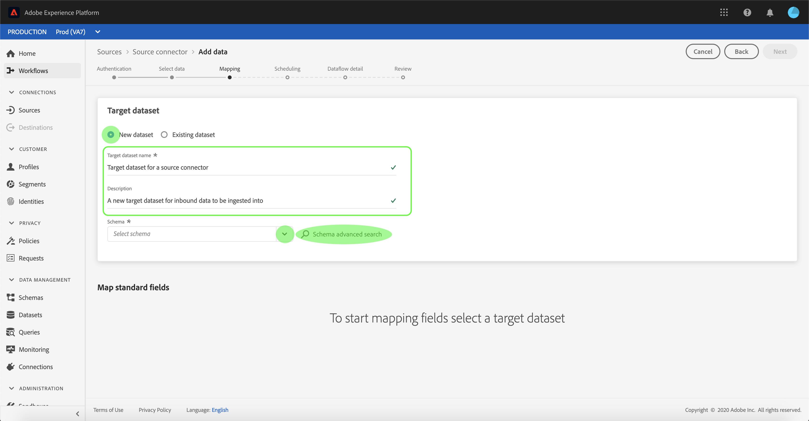

# Configuration d’un flux de données pour un connecteur CRM dans l’interface utilisateur

Un flux de données est une tâche planifiée qui récupère et ingère des données d’une source dans un [!DNL Platform] jeu de données. Ce didacticiel décrit les étapes à suivre pour configurer un nouveau flux de données à l’aide de votre compte CRM.

## Prise en main

Ce tutoriel nécessite une compréhension du fonctionnement des composants suivants d’Adobe Experience Platform :

* [Système de modèle de données d’expérience (XDM)](../../../../xdm/home.md)[!DNL Experience Platform] : cadre normalisé selon lequel organise les données d’expérience client.
   * [Principes de base de la composition des schémas](../../../../xdm/schema/composition.md) : découvrez les blocs de création de base des schémas XDM, y compris les principes clés et les bonnes pratiques en matière de composition de schémas.
   * [Didacticiel](../../../../xdm/tutorials/create-schema-ui.md)sur l’éditeur de schéma : Découvrez comment créer des schémas personnalisés à l’aide de l’interface utilisateur de l’éditeur de Schémas.
* [Real-time Customer Profile](../../../../profile/home.md) : fournit un profil client en temps réel unifié basé sur des données agrégées issues de plusieurs sources.

En outre, ce didacticiel nécessite que vous ayez déjà créé un compte CRM. Vous trouverez une liste de didacticiels pour la création de différents connecteurs CRM dans l’interface utilisateur dans la présentation [des connecteurs](../../../home.md)source.

## Sélectionner des données

Après avoir créé votre compte CRM, l’étape *Sélectionner les données* s’affiche, ce qui vous permet d’explorer la hiérarchie des fichiers dans une interface interactive.

* La moitié gauche de l&#39;interface est un navigateur d&#39;annuaire qui affiche les fichiers et répertoires de votre serveur.
* La moitié droite de l&#39;interface vous permet de prévisualisation jusqu&#39;à 100 lignes de données à partir d&#39;un fichier compatible.

Sélectionnez le répertoire à utiliser, puis cliquez sur **[!UICONTROL Suivant]**.

## Mappage des champs de données à un schéma XDM

L’étape *[!UICONTROL Mappage]* s’affiche, fournissant une interface interactive permettant de mapper les données source à un [!DNL Platform] jeu de données.

Choisissez un jeu de données dans lequel les données entrantes doivent être assimilées. Vous pouvez utiliser un jeu de données existant ou en créer un nouveau.

### Utilisation d’un jeu de données existant

Pour importer des données dans un jeu de données existant, sélectionnez **[!UICONTROL Utiliser un jeu de données]** existant, puis cliquez sur l’icône Jeu de données.

The *[!UICONTROL Select dataset]* dialog appears. Recherchez le jeu de données que vous souhaitez utiliser, sélectionnez-le, puis cliquez sur **[!UICONTROL Continuer]**.

### Utiliser un nouveau jeu de données

Pour importer des données dans un nouveau jeu de données, sélectionnez **[!UICONTROL Créer un jeu de données]** et saisissez un nom et une description pour le jeu de données dans les champs fournis.

Vous pouvez joindre un champ de schéma en entrant un nom de schéma dans la barre de recherche **[!UICONTROL Sélectionner un schéma]** . Vous pouvez également sélectionner l’icône de liste déroulante pour afficher une liste de schémas existants. Vous pouvez également sélectionner Recherche **** avancée pour accéder à l’écran des schémas existants, y compris leurs détails respectifs.

The *[!UICONTROL Select schema]* dialog appears. Sélectionnez le schéma à appliquer au nouveau jeu de données, puis cliquez sur **[!UICONTROL Terminé]**.

Selon vos besoins, vous pouvez choisir de mapper directement les champs ou utiliser les fonctions de mappage pour transformer les données source afin de dériver des valeurs calculées ou calculées. Pour plus d’informations sur les fonctions de mappage et de mappage de données, consultez le didacticiel sur le [mappage des données CSV aux champs](../../../../ingestion/tutorials/map-a-csv-file.md)de schéma XDM.

Une fois les données source mises en correspondance, cliquez sur **[!UICONTROL Suivant]**.

## Planifier les exécutions d&#39;assimilation

L&#39;étape *[!UICONTROL Planification]* s&#39;affiche, ce qui vous permet de configurer un programme d&#39;assimilation pour assimiler automatiquement les données source sélectionnées à l&#39;aide des mappages configurés. Le tableau suivant décrit les différents champs configurables pour la planification :

| Champ | Description |
| --- | --- |
| Fréquence | Les fréquences sélectionnables sont `Once`, `Minute`, `Hour`, `Day`et `Week`. |
| Intervalle | Entier qui définit l’intervalle pour la fréquence sélectionnée. |
| Début | Horodatage UTC indiquant à quel moment la première importation est prévue. |
| Renvoi | Valeur booléenne qui détermine quelles données sont initialement ingérées. Si le *[!UICONTROL renvoi]* est activé, tous les fichiers actuels du chemin d’accès spécifié seront ingérés lors de la première assimilation planifiée. Si le *renvoi* est désactivé, seuls les fichiers chargés entre la première exécution de l’assimilation et le délai *[!UICONTROL de]* Début seront ingérés. Les fichiers chargés avant l&#39;heure *[!UICONTROL de]* Début ne seront pas ingérés. |
| Colonne Delta | Option avec un ensemble filtré de champs de schéma source de type, de date ou d’heure. Ce champ permet de différencier les données nouvelles des données existantes. Les données incrémentielles seront ingérées en fonction de l’horodatage de la colonne sélectionnée. |

Les flux de données sont conçus pour intégrer automatiquement les données sur une base planifiée. Début en sélectionnant la fréquence d&#39;ingestion. Ensuite, définissez l’intervalle pour désigner la période entre deux exécutions de flux. La valeur de l’intervalle doit être un entier non nul et doit être définie sur supérieur ou égal à 15.

Pour définir l’heure de début d’assimilation, ajustez la date et l’heure affichées dans la zone début d’heure. Vous pouvez également sélectionner l’icône de calendrier pour modifier la valeur de début. L&#39;heure de début doit être supérieure ou égale à l&#39;heure UTC actuelle.

Sélectionnez **[!UICONTROL Charger les données incrémentielles par]** pour affecter la colonne delta. Ce champ fait la distinction entre les données nouvelles et existantes.

### Configuration d’un flux de données d’assimilation unique

Pour configurer l’assimilation unique, sélectionnez la flèche de la liste déroulante des fréquences et sélectionnez **[!UICONTROL Une fois]**.

>[!TIP]
>
>**[!UICONTROL L’intervalle]** et la **[!UICONTROL Renvoi]** ne sont pas visibles lors d’une assimilation unique.

Une fois que vous avez fourni les valeurs appropriées à la planification, sélectionnez **[!UICONTROL Suivant]**.

## Fournir des détails sur le flux de données

L’étape de détail ** Flux de données s’affiche, vous permettant de nommer et de décrire brièvement votre nouveau flux de données.

Au cours de ce processus, vous pouvez également activer les tests de diagnostic *[!UICONTROL d&#39;assimilation]* *[!UICONTROL partielle et d&#39;]* erreur. Enabling *[!UICONTROL Partial ingestion]* provides the ability to ingest data containing errors up to a certain threshold. Une fois l&#39;assimilation ** partielle activée, faites glisser le seuil d&#39; *[!UICONTROL erreur %]* pour ajuster le seuil d&#39;erreur du lot. Vous pouvez également ajuster manuellement le seuil en sélectionnant la zone d’entrée. Pour plus d&#39;informations, consultez la présentation [de l&#39;assimilation](../../../../ingestion/batch-ingestion/partial.md)partielle des lots.

Fournissez des valeurs pour le flux de données et sélectionnez **[!UICONTROL Suivant]**.

## Vérifier votre flux de données

L’étape *Révision* s’affiche, vous permettant de vérifier votre nouveau flux de données avant sa création. Les détails sont regroupés dans les catégories suivantes :

* *[!UICONTROL Détails]* de la connexion : Indique le type de source, le chemin d’accès approprié du fichier source choisi et le nombre de colonnes qu’il contient.
* *[!UICONTROL Détails]* du mappage : Affiche le jeu de données dans lequel les données source sont ingérées, y compris le schéma auquel le jeu de données adhère.
* *[!UICONTROL Détails]* de la planification : Indique la principale période, fréquence et intervalle du calendrier d&#39;assimilation.

Une fois que vous avez passé en revue votre flux de données, cliquez sur **[!UICONTROL Terminer]** et accordez un certain temps à la création du flux de données.

## Surveiller votre flux de données

Une fois le flux de données créé, vous pouvez surveiller les données ingérées pour afficher des informations sur les taux d&#39;assimilation, la réussite et les erreurs. Pour plus d’informations sur la surveillance du flux de données, voir le didacticiel sur la [surveillance des comptes et des flux de données dans l’interface utilisateur](../monitor.md).

## Supprimer votre flux de données

Vous pouvez supprimer des flux de données qui ne sont plus nécessaires ou qui ont été créés incorrectement à l’aide de la fonction *[!UICONTROL Supprimer]* disponible dans l’espace de travail *[!UICONTROL Flux de données]* . Pour plus d&#39;informations sur la suppression de flux de données, consultez le didacticiel sur la [suppression de flux de données dans l&#39;interface utilisateur](../delete.md).

## Étapes suivantes

En suivant ce didacticiel, vous avez réussi à créer un flux de données pour importer des données à partir d’un CRM et à mieux comprendre la surveillance des jeux de données. Pour en savoir plus sur la création de flux de données, vous pouvez compléter votre apprentissage en regardant la vidéo ci-dessous. En outre, les données entrantes peuvent désormais être utilisées par [!DNL Platform] les services en aval tels que [!DNL Real-time Customer Profile] et [!DNL Data Science Workspace]. Pour plus d’informations, voir les documents suivants :

* [Présentation du profil client en temps réel](../../../../profile/home.md)
* [Présentation de Data Science Workspace](../../../../data-science-workspace/home.md)

>[!WARNING]
>
> L’ [!DNL Platform] interface utilisateur affichée dans la vidéo suivante est obsolète. Reportez-vous à la documentation ci-dessus pour obtenir les dernières captures d&#39;écran et fonctionnalités de l&#39;interface utilisateur.

>[!VIDEO](https://video.tv.adobe.com/v/29711?quality=12&learn=on)

## Annexe

Les sections suivantes fournissent des informations supplémentaires sur l’utilisation des connecteurs source.

### Désactivation d’un flux de données

Lorsqu’un flux de données est créé, il devient immédiatement principal et ingère les données selon le planning qu’il a reçu. Vous pouvez désactiver un flux de données principal à tout moment en suivant les instructions ci-dessous.

Dans l’écran *[!UICONTROL d’authentification]* , sélectionnez le nom de la connexion de base associée au flux de données que vous souhaitez désactiver.

La page activité __ source s&#39;affiche. Sélectionnez le flux de données principal dans la liste pour ouvrir sa colonne *[!UICONTROL Propriétés]* sur le côté droit de l&#39;écran, qui contient un bouton d&#39;activation **** de la bascule. Cliquez sur la bascule pour désactiver le flux de données. La même bascule peut être utilisée pour réactiver un flux de données après sa désactivation.

### Activer les données entrantes pour [!DNL Profile] la population

Les données entrantes provenant de votre connecteur source peuvent être utilisées pour enrichir et renseigner vos [!DNL Real-time Customer Profile] données. Pour plus d&#39;informations sur le remplissage de vos [!DNL Real-time Customer Profile] données, consultez le didacticiel sur la population Profil.