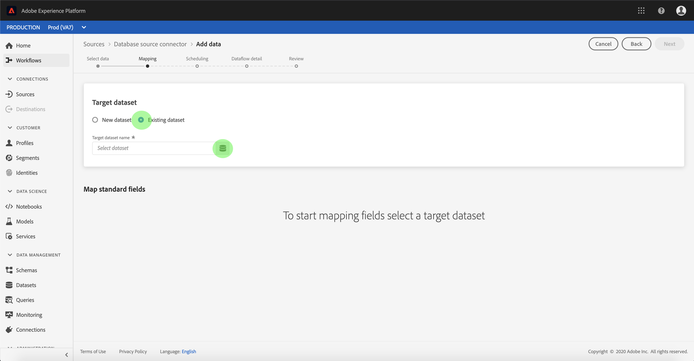

# Configuration d’un flux de données pour une connexion à une base de données dans l’interface utilisateur

Un flux de données est une tâche planifiée qui récupère et ingère des données d&#39;une source dans un jeu de données de la plateforme. Ce didacticiel décrit les étapes à suivre pour configurer un nouveau flux de données à l’aide de votre compte de base de données.

## Prise en main

Ce tutoriel nécessite une compréhension du fonctionnement des composants suivants d’Adobe Experience Platform :

- [[!DNL Experience Data Model (XDM)] Système](../../../../xdm/home.md) : Cadre normalisé selon lequel l’Experience Platform organise les données d’expérience client.
   - [Principes de base de la composition des schémas](../../../../xdm/schema/composition.md) : découvrez les blocs de création de base des schémas XDM, y compris les principes clés et les bonnes pratiques en matière de composition de schémas.
   - [Didacticiel](../../../../xdm/tutorials/create-schema-ui.md) sur l’éditeur de schéma : Découvrez comment créer des schémas personnalisés à l’aide de l’interface utilisateur de l’éditeur de Schémas.
- [[!DNL Real-time Customer Profile]](../../../../profile/home.md) : fournit un profil client en temps réel unifié basé sur des données agrégées issues de plusieurs sources.

De plus, ce didacticiel nécessite que vous ayez déjà créé un compte de base de données. Vous trouverez une liste de didacticiels pour la création de différents connecteurs de base de données dans l&#39;interface utilisateur dans [vue d&#39;ensemble des connecteurs source](../../../home.md).

## Sélectionner des données

Après avoir créé votre compte de base de données, l&#39;étape **[!UICONTROL Sélectionner les données]** s&#39;affiche, vous offrant ainsi une interface interactive pour explorer la hiérarchie de votre base de données.

- La moitié gauche de l&#39;interface est un navigateur, qui affiche la liste des bases de données de votre compte.
- La moitié droite de l’interface vous permet de prévisualisation jusqu’à 100 lignes de données.

Vous pouvez utiliser l&#39;option **[!UICONTROL Rechercher]** en haut de la page pour identifier rapidement les données source que vous prévoyez d&#39;utiliser.

>[!NOTE]
>
>L’option de données de source de recherche est disponible pour tous les connecteurs de source basés sur des tabulations, à l’exception des connecteurs Analytics, Classifications, Événements Hubs et Kinesis.

Une fois que vous avez trouvé les données source, sélectionnez le répertoire, puis cliquez sur **[!UICONTROL Suivant]**.

## Mappage des champs de données à un schéma XDM

L’étape *Mappage* s’affiche, fournissant une interface interactive permettant de mapper les données source à un jeu de données de plateforme.

Choisissez un jeu de données dans lequel les données entrantes doivent être assimilées. Vous pouvez utiliser un jeu de données existant ou en créer un nouveau.

### Utilisation d’un jeu de données existant

Pour importer des données dans un jeu de données existant, sélectionnez **[!UICONTROL Jeu de données existant]**, puis cliquez sur l&#39;icône Jeu de données.

La boîte de dialogue **[!UICONTROL Sélectionner un jeu de données]** s&#39;affiche. Recherchez le jeu de données que vous souhaitez utiliser, sélectionnez-le, puis cliquez sur **[!UICONTROL Continuer]**.

### Utiliser un nouveau jeu de données

Pour importer des données dans un nouveau jeu de données, sélectionnez **[!UICONTROL Nouveau jeu de données]** et saisissez un nom et une description pour le jeu de données dans les champs fournis.

Vous pouvez joindre un champ de schéma en entrant un nom de schéma dans la barre de recherche **[!UICONTROL Sélectionner un schéma]**. Vous pouvez également sélectionner l’icône de liste déroulante pour afficher une liste de schémas existants. Vous pouvez également sélectionner **[!UICONTROL Recherche avancée]** pour accéder à l’écran des schémas existants, y compris leurs détails respectifs.

Au cours de cette étape, vous pouvez activer votre jeu de données pour [!DNL Real-time Customer Profile] et créer une vue holistique des attributs et des comportements d&#39;une entité. Les données de tous les jeux de données activés sont incluses dans [!DNL Profile] et des modifications sont appliquées lorsque vous enregistrez votre flux de données.

Cliquez sur le bouton **[!UICONTROL Profil de données]** pour activer votre jeu de données de cible pour [!DNL Profile].

La boîte de dialogue **[!UICONTROL Sélectionner le schéma]** s&#39;affiche. Sélectionnez le schéma à appliquer au nouveau jeu de données, puis cliquez sur **[!UICONTROL Terminé]**.

Selon vos besoins, vous pouvez choisir de mapper directement les champs ou utiliser les fonctions de mappage pour transformer les données source afin de dériver des valeurs calculées ou calculées. Pour plus d&#39;informations sur les fonctions de mappage et de mappage de données, consultez le didacticiel [mappage des données CSV aux champs de schéma XDM](../../../../ingestion/tutorials/map-a-csv-file.md).

>[!TIP]
>
>[!DNL Platform] fournit des recommandations intelligentes pour les champs à mappage automatique en fonction du schéma de cible ou du jeu de données que vous avez sélectionné. Vous pouvez ajuster manuellement les règles de mappage en fonction de vos cas d’utilisation.

Sélectionnez **[!UICONTROL données de Prévisualisation]** pour afficher les résultats de mappage de 100 lignes de données d’exemple au maximum du jeu de données sélectionné.

Au cours de la prévisualisation, la colonne d&#39;identité est considérée comme le premier champ, car il s&#39;agit des informations clés nécessaires à la validation des résultats de mappage.

Une fois les données source mises en correspondance, sélectionnez **[!UICONTROL Fermer]**.

## Planifier les exécutions d&#39;assimilation

L&#39;étape **[!UICONTROL Planification]** s&#39;affiche, ce qui vous permet de configurer une planification d&#39;assimilation pour assimiler automatiquement les données source sélectionnées à l&#39;aide des mappages configurés. Le tableau suivant décrit les différents champs configurables pour la planification :

| Champ | Description |
| --- | --- |
| Fréquence | Les fréquences sélectionnées sont `Once`, `Minute`, `Hour`, `Day` et `Week`. |
| Intervalle | Entier qui définit l’intervalle pour la fréquence sélectionnée. |
| Début | Horodatage UTC indiquant à quel moment la première importation est prévue. |
| Renvoi | Valeur booléenne qui détermine quelles données sont initialement ingérées. Si **[!UICONTROL Renvoi]** est activé, tous les fichiers en cours dans le chemin spécifié seront ingérés lors de la première assimilation planifiée. Si **[!UICONTROL Renvoi]** est désactivé, seuls les fichiers chargés entre la première exécution de l’assimilation et la durée du début seront ingérés. Les fichiers chargés avant l&#39;heure du début ne seront pas ingérés. |
| Colonne Delta | Option avec un ensemble filtré de champs de schéma source de type, de date ou d’heure. Ce champ permet de différencier les données nouvelles des données existantes. Les données incrémentielles seront ingérées en fonction de l’horodatage de la colonne sélectionnée. |

Les flux de données sont conçus pour intégrer automatiquement les données sur une base planifiée. Début en sélectionnant la fréquence d&#39;ingestion. Ensuite, définissez l’intervalle pour désigner la période entre deux exécutions de flux. La valeur de l’intervalle doit être un entier non nul et doit être définie sur supérieur ou égal à 15.

Pour définir l’heure de début d’assimilation, ajustez la date et l’heure affichées dans la zone début d’heure. Vous pouvez également sélectionner l’icône de calendrier pour modifier la valeur de début. L&#39;heure de début doit être supérieure ou égale à l&#39;heure UTC actuelle.

Sélectionnez **[!UICONTROL Charger les données incrémentielles par]** pour affecter la colonne delta. Ce champ fait la distinction entre les données nouvelles et existantes.

### Configuration d’un flux de données d’assimilation unique

Pour configurer l’assimilation unique, sélectionnez la flèche de la liste déroulante de fréquence et sélectionnez **[!UICONTROL Une fois]**.

>[!TIP]
>
>**** Intervaland  **** Backfillare n&#39;est pas visible lors d&#39;une ingestion unique.

Une fois que vous avez fourni les valeurs appropriées à la planification, sélectionnez **[!UICONTROL Suivant]**.

## Fournir des détails sur le flux de données

L&#39;étape **[!UICONTROL Détails du flux de données]** s&#39;affiche, vous permettant de nommer et de décrire brièvement votre nouveau flux de données.

Au cours de ce processus, vous pouvez également activer les **[!UICONTROL diagnostics d&#39;erreur]** et **[!UICONTROL diagnostic d&#39;erreur]**. L&#39;activation de l&#39;**[!UICONTROL ingestion partielle]** permet d&#39;assimiler les données contenant des erreurs jusqu&#39;à un certain seuil. Une fois que **[!UICONTROL l&#39;assimilation partielle]** est activée, faites glisser le curseur **[!UICONTROL Seuil d&#39;erreur %]** pour ajuster le seuil d&#39;erreur du lot. Vous pouvez également ajuster manuellement le seuil en sélectionnant la zone d’entrée. Pour plus d&#39;informations, consultez l&#39;[aperçu de l&#39;assimilation partielle des lots](../../../../ingestion/batch-ingestion/partial.md).
Fournissez des valeurs pour le flux de données et sélectionnez **[!UICONTROL Next]**.

## Vérifier votre flux de données

L&#39;étape **[!UICONTROL Réviser]** s&#39;affiche, vous permettant de vérifier votre nouveau flux de données avant sa création. Les détails sont regroupés dans les catégories suivantes :

- **[!UICONTROL Connexion]** : Indique le type de source, le chemin d’accès approprié du fichier source choisi et le nombre de colonnes qu’il contient.
- **[!UICONTROL Attribuer des champs]** de jeu de données et de mappage : Affiche le jeu de données dans lequel les données source sont ingérées, y compris le schéma auquel le jeu de données adhère.
- **[!UICONTROL Planification]** : Indique la principale période, fréquence et intervalle du calendrier d&#39;assimilation.

Une fois que vous avez passé en revue votre flux de données, cliquez sur **[!UICONTROL Terminer]** et attendez un certain temps pour que le flux de données soit créé.

## Surveiller votre flux de données

Une fois le flux de données créé, vous pouvez surveiller les données ingérées pour afficher des informations sur les taux d&#39;assimilation, la réussite et les erreurs. Pour plus d&#39;informations sur la façon de surveiller le flux de données, consultez le didacticiel [surveillance des comptes et flux de données dans l&#39;interface utilisateur](../monitor.md).

## Supprimer votre flux de données

Vous pouvez supprimer des flux de données qui ne sont plus nécessaires ou qui ont été créés incorrectement à l’aide de la fonction **[!UICONTROL Supprimer]** disponible dans l’espace de travail **[!UICONTROL Flux de données]**. Pour plus d&#39;informations sur la façon de supprimer des flux de données, consultez le didacticiel sur la [suppression des flux de données dans l&#39;interface utilisateur](../delete.md).

## Étapes suivantes

En suivant ce didacticiel, vous avez réussi à créer un flux de données pour importer des données d&#39;une base de données externe et à mieux comprendre la surveillance des jeux de données. Les données entrantes peuvent désormais être utilisées par les services [!DNL Platform] en aval tels que [!DNL Real-time Customer Profile] et [!DNL Data Science Workspace]. Pour plus d’informations, voir les documents suivants :

- [[!DNL Real-time Customer Profile] aperçu](../../../../profile/home.md)
- [[!DNL Data Science Workspace] aperçu](../../../../data-science-workspace/home.md)

## Annexe

Les sections suivantes fournissent des informations supplémentaires sur l’utilisation des connecteurs source.

### Désactivation d’un flux de données

Lorsqu’un flux de données est créé, il devient immédiatement principal et ingère les données selon le planning qu’il a reçu. Vous pouvez désactiver un flux de données principal à tout moment en suivant les instructions ci-dessous.

Dans l&#39;espace de travail **[!UICONTROL Sources]**, sélectionnez l&#39;onglet **[!UICONTROL Flux de données]**. Sélectionnez ensuite le flux de données que vous souhaitez désactiver.

La colonne **[!UICONTROL Propriétés]** s&#39;affiche sur le côté droit de l&#39;écran, y compris un bouton de bascule **[!UICONTROL Activé]**. Sélectionnez la bascule pour désactiver le flux de données. La même bascule peut être utilisée pour réactiver un flux de données après sa désactivation.

### Activer les données entrantes pour la population [!DNL Profile]

Les données entrantes de votre connecteur source peuvent être utilisées pour enrichir et renseigner vos données [!DNL Real-time Customer Profile]. Pour plus d&#39;informations sur le renseignement de vos données [!DNL Real-time Customer Profile], consultez le tutoriel sur [population de Profils](../profile.md).
