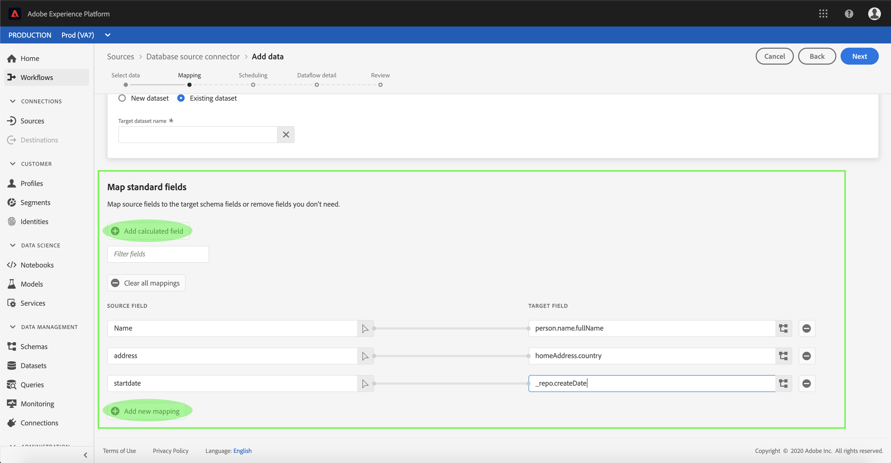

# Configuration d’un flux de données pour un connecteur de base de données dans l’interface utilisateur

Un flux de données est une tâche planifiée qui récupère et ingère des données d’une source dans un jeu de données Platform. Ce didacticiel décrit les étapes à suivre pour configurer un nouveau flux de données à l’aide de votre connecteur de base de données.

## Prise en main

Ce tutoriel nécessite une compréhension du fonctionnement des composants suivants d’Adobe Experience Platform :

- [Système de modèle de données d’expérience (XDM)](../../../../xdm/home.md) : cadre normalisé selon lequel Experience Platform organise les données d’expérience client.
   - [Principes de base de la composition des schémas](../../../../xdm/schema/composition.md) : découvrez les blocs de création de base des schémas XDM, y compris les principes clés et les bonnes pratiques en matière de composition de schémas.
   - [Didacticiel](../../../../xdm/tutorials/create-schema-ui.md)sur l’éditeur de Schéma : Découvrez comment créer des schémas personnalisés à l’aide de l’interface utilisateur de l’éditeur de Schémas.
- [Real-time Customer Profile](../../../../profile/home.md) : fournit un profil client en temps réel unifié basé sur des données agrégées issues de plusieurs sources.

De plus, ce didacticiel nécessite que vous ayez déjà créé un connecteur de base de données. Vous trouverez une liste de didacticiels pour la création de différents connecteurs de base de données dans l’interface utilisateur dans l’aperçu [des connecteurs](../../../home.md)source.

## Sélectionner des données

Après avoir créé votre connecteur de base de données, l’étape *[!UICONTROL Sélectionner les données]* s’affiche, ce qui vous permet d’explorer la hiérarchie de votre base de données dans une interface interactive.

- La moitié gauche de l&#39;interface est un navigateur, qui affiche la liste des bases de données de votre compte.
- La moitié droite de l’interface vous permet de prévisualisation jusqu’à 100 lignes de données.

Sélectionnez la base de données à utiliser, puis cliquez sur **[!UICONTROL Suivant]**.

## Mappage des champs de données à un schéma XDM

L’étape *Mappage* s’affiche, fournissant une interface interactive permettant de mapper les données source à un jeu de données Platform.

Choisissez un jeu de données dans lequel les données entrantes doivent être assimilées. Vous pouvez utiliser un jeu de données existant ou en créer un nouveau.

### Utilisation d’un jeu de données existant

Pour importer des données dans un jeu de données existant, sélectionnez Jeu de données **** existant, puis cliquez sur l’icône Jeu de données.

The *[!UICONTROL Select dataset]* dialog appears. Recherchez le jeu de données que vous souhaitez utiliser, sélectionnez-le, puis cliquez sur **[!UICONTROL Continuer]**.

### Utiliser un nouveau jeu de données

Pour importer des données dans un nouveau jeu de données, sélectionnez **[!UICONTROL Nouveau jeu de données]** et entrez un nom et une description pour le jeu de données dans les champs fournis.

Vous pouvez joindre un champ de schéma en entrant un nom de schéma dans la barre de recherche **[!UICONTROL Sélectionner un schéma]** . Vous pouvez également sélectionner l’icône de liste déroulante pour afficher une liste de schémas existants. Vous pouvez également sélectionner Recherche **** avancée sur un écran de schémas existants, y compris leurs détails respectifs.

The *[!UICONTROL Select schema] dialog appears. Sélectionnez le schéma à appliquer au nouveau jeu de données, puis cliquez sur **[!UICONTROL Terminé]**.

Selon vos besoins, vous pouvez choisir de mapper directement les champs ou utiliser les fonctions de mappage pour transformer les données source afin de dériver des valeurs calculées ou calculées. Pour plus d’informations sur les fonctions de mappage et de mappage de données, consultez le didacticiel sur le [mappage des données CSV aux champs](../../../../ingestion/tutorials/map-a-csv-file.md)de schéma XDM.

Une fois les données source mises en correspondance, cliquez sur **[!UICONTROL Suivant]**.

## Planifier les exécutions d&#39;assimilation

L&#39;étape *[!UICONTROL Planification]* s&#39;affiche, ce qui vous permet de configurer un programme d&#39;assimilation pour assimiler automatiquement les données source sélectionnées à l&#39;aide des mappages configurés. Le tableau suivant décrit les différents champs configurables pour la planification :

| Champ | Description |
| --- | --- |
| Fréquence | Les fréquences sélectionnées sont les suivantes : Minute, Heure, Jour et Semaine. |
| Intervalle | Entier qui définit l’intervalle pour la fréquence sélectionnée. |
| Début | Horodatage UTC pour lequel la toute première importation aura lieu. |
| Renvoi | Valeur booléenne qui détermine quelles données sont initialement ingérées. Si le *renvoi* est activé, tous les fichiers actuels du chemin d’accès spécifié seront ingérés lors de la première assimilation planifiée. Si le *renvoi* est désactivé, seuls les fichiers chargés entre la première exécution de l’assimilation et le délai *de* Début seront ingérés. Les fichiers chargés avant l&#39;heure *de* Début ne seront pas ingérés. |
| Colonne Delta | Option avec un ensemble filtré de champs de schéma source de type, de date ou d’heure. Ce champ permet de différencier les données nouvelles des données existantes. Les données incrémentielles seront ingérées en fonction de l’horodatage de la colonne sélectionnée. |

Les flux de données sont conçus pour intégrer automatiquement les données sur une base planifiée. Si vous souhaitez effectuer une seule assimilation via ce flux de travail, vous pouvez le faire en configurant la **[!UICONTROL fréquence]** sur &quot;Jour&quot; et en appliquant un nombre très élevé pour l’ **[!UICONTROL intervalle]**, tel que 10000 ou un nombre similaire.

Indiquez les valeurs de la planification et sélectionnez **[!UICONTROL Suivant]**.

## Nommer votre flux de données

L’étape de détail *[!UICONTROL du]* flux de données s’affiche, où vous devez fournir un nom et une description facultative du flux de données. Select **[!UICONTROL Next]** when finished.

## Vérifier votre flux de données

L’étape *[!UICONTROL Révision]* s’affiche, vous permettant de vérifier votre nouveau flux de données avant sa création. Les détails sont regroupés dans les catégories suivantes :

- *Connexion*: Indique le type de source, le chemin d’accès approprié du fichier source choisi et le nombre de colonnes qu’il contient.
- *Attribuer des champs* de jeu de données et de mappage : Affiche le jeu de données dans lequel les données source sont ingérées, y compris le schéma auquel le jeu de données adhère.
- *Planification*: Affiche la période active, la fréquence et l&#39;intervalle du programme d&#39;assimilation.

Une fois que vous avez passé en revue votre flux de données, cliquez sur **[!UICONTROL Terminer]** et accordez un certain temps à la création du flux de données.

## Surveiller et supprimer votre flux de données

Une fois que votre flux de données a été créé, vous pouvez surveiller les données qui y sont ingérées. Pour plus d&#39;informations sur la surveillance et la suppression de votre flux de données, consultez le didacticiel sur la [surveillance et la suppression des flux de données](../monitor.md).

## Étapes suivantes

En suivant ce didacticiel, vous avez réussi à créer un flux de données pour importer des données d&#39;une base de données externe et à mieux comprendre la surveillance des jeux de données. Les données entrantes peuvent désormais être utilisées par les services Platform en aval, tels que le Profil client en temps réel et l’espace de travail Data Science. Pour plus d’informations, voir les documents suivants :

- [Présentation du profil client en temps réel](../../../../profile/home.md)
- [Présentation de Data Science Workspace](../../../../data-science-workspace/home.md)

## Annexe

Les sections suivantes fournissent des informations supplémentaires sur l’utilisation des connecteurs source.

### Désactivation d’un flux de données

Lorsqu’un flux de données est créé, il devient immédiatement actif et ingère les données selon le planning qu’il a reçu. Vous pouvez désactiver un flux de données actif à tout moment en suivant les instructions ci-dessous.

Dans l’espace de travail *[!UICONTROL Sources]* , sélectionnez l’onglet **[!UICONTROL Flux de données]** . Sélectionnez ensuite le flux de données que vous souhaitez désactiver.

La colonne *[!UICONTROL Propriétés]* s’affiche sur le côté droit de l’écran, avec notamment un bouton de bascule **[!UICONTROL Activé]** . Sélectionnez la bascule pour désactiver le flux de données. La même bascule peut être utilisée pour réactiver un flux de données après sa désactivation.

### Activer les données entrantes pour [!DNL Profile] la population

Les données entrantes provenant de votre connecteur source peuvent être utilisées pour enrichir et renseigner vos [!DNL Real-time Customer Profile] données. Pour plus d&#39;informations sur le remplissage de vos [!DNL Real-time Customer Profile] données, consultez le didacticiel sur la population Profil.