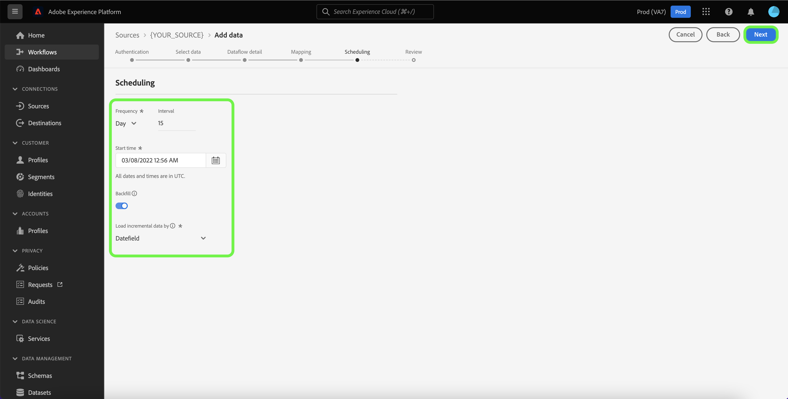

# Créer un flux de données à l’aide d’une source de base de données dans l’interface utilisateur

Un flux de données est une tâche planifiée qui récupère et ingère des données d’une source vers un jeu de données dans Adobe Experience Platform. Ce tutoriel décrit les étapes à suivre pour créer un flux de données pour une source de base de données à l’aide de l’interface utilisateur d’Experience Platform.

>[!NOTE]
>
>* Pour créer un flux de données, vous devez déjà disposer d’un compte authentifié avec une source de base de données. Vous trouverez une liste de tutoriels sur la création de différents comptes de sources de base de données dans l’interface utilisateur dans la [présentation des sources](../../../home.md#database).
>
>* Pour qu’Experience Platform ingère des données, les fuseaux horaires de toutes les sources de lots basées sur un tableau doivent être configurés au format UTC. Le seul horodatage pris en charge pour la [[!DNL Snowflake] source](../../../connectors/databases/snowflake.md) est TIMESTAMP_NTZ avec l’heure UTC.

## Prise en main

Ce tutoriel nécessite une compréhension du fonctionnement des composants suivants d’Adobe Experience Platform : 

* [Sources](../../../home.md) : Experience Platform permet d’ingérer des données provenant de diverses sources tout en vous offrant la possibilité de structurer, d’étiqueter et d’améliorer les données entrantes à l’aide des services [!DNL Experience Platform].
* [[!DNL Experience Data Model (XDM)] Système](../../../../xdm/home.md) : Cadre normalisé selon lequel Experience Platform organise les données d’expérience client. 
   * [Principes de base de la composition des schémas](../../../../xdm/schema/composition.md) : découvrez les blocs de création de base des schémas XDM, y compris les principes clés et les bonnes pratiques en matière de composition de schémas.
   * [Tutoriel sur l’éditeur de schémas](../../../../xdm/tutorials/create-schema-ui.md) : découvrez comment créer des schémas personnalisés à l’aide de l’interface utilisateur de l’éditeur de schémas.
* [[!DNL Real-Time Customer Profile]](../../../../profile/home.md) : fournit un profil de consommateur unifié en temps réel, basé sur des données agrégées provenant de plusieurs sources.
* [[!DNL Data Prep]](../../../../data-prep/home.md) : permet aux ingénieurs de données de mapper, transformer et valider des données vers et à partir du modèle de données d’expérience (XDM).

## Ajouter des données

Une fois votre compte de source de base de données créé, l’étape **[!UICONTROL Add data]** s’affiche, vous permettant d’explorer la hiérarchie des tables de ce compte.

* La moitié gauche de l’interface est un navigateur, qui affiche une liste des tableaux de données contenus dans votre compte. L’interface comprend également une option de recherche qui vous permet d’identifier rapidement les données sources que vous avez l’intention d’utiliser.
* La moitié droite de l’interface est un panneau de prévisualisation, qui vous permet de prévisualiser jusqu’à 100 lignes de données.

>[!NOTE]
>
>L’option Rechercher les données sources est disponible pour toutes les sources basées sur des tableaux, à l’exclusion d’Adobe Analytics, de [!DNL Amazon Kinesis] et de [!DNL Azure Event Hubs].

Une fois que vous avez trouvé les données sources, sélectionnez la table, puis sélectionnez **[!UICONTROL Next]**.

## Fournir des détails sur le flux de données

La page [!UICONTROL Dataflow detail] vous permet de choisir si vous souhaitez utiliser un jeu de données existant ou un nouveau jeu de données. Au cours de ce processus, vous pouvez également configurer des paramètres pour [!UICONTROL Profile dataset], [!UICONTROL Error diagnostics], [!UICONTROL Partial ingestion] et [!UICONTROL Alerts].

### Utiliser un jeu de données existant

Pour ingérer des données dans un jeu de données existant, sélectionnez **[!UICONTROL Existing dataset]**. Vous pouvez soit récupérer un jeu de données existant à l’aide de l’option [!UICONTROL Advanced search] , soit faire défiler la liste des jeux de données existants dans le menu déroulant. Une fois que vous avez sélectionné un jeu de données, indiquez un nom et une description pour votre flux de données.

### Utiliser un nouveau jeu de données

Pour effectuer une ingestion dans un nouveau jeu de données, sélectionnez **[!UICONTROL New dataset]**, puis fournissez un nom de jeu de données de sortie et une description facultative. Sélectionnez ensuite un schéma à mapper à l’aide de l’option [!UICONTROL Advanced search] ou en faisant défiler la liste des schémas existants dans le menu déroulant. Une fois que vous avez sélectionné un schéma, saisissez un nom et une description pour votre flux de données.

### Activer [!DNL Profile] et les diagnostics d’erreur

Sélectionnez ensuite le bouton (bascule) **[!UICONTROL Profile dataset]** pour activer votre jeu de données pour la [!DNL Profile]. Cela vous permet de créer une vue holistique des attributs et des comportements d’une entité. Les données issues de tous les jeux de données activés par le [!DNL Profile] seront incluses dans [!DNL Profile] et les modifications sont appliquées lorsque vous enregistrez votre flux de données.

[!UICONTROL Error diagnostics] permet la génération de messages d’erreur détaillés pour tout enregistrement erroné survenant dans votre flux de données, tandis que [!UICONTROL Partial ingestion] vous permet d’ingérer des données contenant des erreurs, jusqu’à un certain seuil que vous définissez manuellement. Pour plus d’informations, consultez la [présentation de l’ingestion par lots partiels](../../../../ingestion/batch-ingestion/partial.md).

### Activer les alertes

Vous pouvez activer les alertes pour recevoir des notifications sur le statut de votre flux de données. Sélectionnez une alerte dans la liste et abonnez-vous à des notifications concernant le statut de votre flux de données. Pour plus d’informations sur les alertes, consultez le guide sur l’[abonnement aux alertes des sources dans l’interface utilisateur](../alerts.md).

Lorsque vous avez terminé de renseigner votre flux de données, sélectionnez **[!UICONTROL Next]**.

## Mappage des champs de données à un schéma XDM

L’étape [!UICONTROL Mapping] s’affiche, vous fournissant une interface pour mapper les champs source de votre schéma source à leurs champs XDM cibles appropriés dans le schéma cible.

Experience Platform fournit des recommandations intelligentes pour les champs mappés automatiquement en fonction du schéma ou du jeu de données cible que vous avez sélectionné. Vous pouvez ajuster manuellement les règles de mappage en fonction de vos cas d’utilisation. Selon vos besoins, vous pouvez choisir de mapper directement des champs ou d’utiliser des fonctions de préparation de données pour transformer les données sources afin d’obtenir des valeurs informatisées ou calculées. Pour obtenir des instructions complètes sur l’utilisation de l’interface du mappeur et des champs calculés, consultez le [ Guide de l’interface utilisateur de la préparation des données ](../../../../data-prep/ui/mapping.md).

>[!NOTE]
>
>Lors du mappage à des schémas relationnels, assurez-vous que vos données source comprennent les champs requis, tels qu’un identifiant de clé primaire et de version, ou un identifiant d’horodatage pour les schémas de série temporelle, .

Les colonnes de contrôle telles que `_change_request_type`, utilisées pour la capture de données de modification, sont lues lors de l’ingestion, mais ne sont pas stockées dans le schéma cible.

Les schémas relationnels prennent également en charge les relations entre les jeux de données à l’aide de mappages de clés primaires et étrangères.

Pour plus d&#39;informations, consultez la présentation de [Data Mirror](../../../../xdm/data-mirror/overview.md) ainsi que la [référence technique des schémas relationnels](../../../../xdm/schema/relational.md).

Une fois les données sources mappées, sélectionnez **[!UICONTROL Next]**.

## Planifier des exécutions d’ingestion

L’étape [!UICONTROL Scheduling] s’affiche, vous permettant de configurer un planning d’ingestion pour ingérer automatiquement les données source sélectionnées à l’aide des mappages configurés. Par défaut, la planification est définie sur `Once`. Pour ajuster la fréquence d’ingestion, sélectionnez **[!UICONTROL Frequency]** puis une option dans le menu déroulant.

>[!TIP]
>
>L’intervalle et le renvoi ne sont pas visibles lors d’une ingestion unique.

Si vous définissez la fréquence d’ingestion sur `Minute`, `Hour`, `Day` ou `Week`, vous devez définir un intervalle pour établir un intervalle défini entre chaque ingestion. Par exemple, une fréquence d’ingestion définie sur `Day` et un intervalle défini sur `15` signifie que votre flux de données est planifié pour ingérer des données tous les 15 jours.

Au cours de cette étape, vous pouvez également activer le **renvoi** et définir une colonne pour l’ingestion incrémentielle des données. Le renvoi est utilisé pour ingérer des données historiques, tandis que la colonne que vous définissez pour l’ingestion incrémentielle permet de différencier les nouvelles données des données existantes.

Pour plus d’informations sur les configurations de planification, consultez le tableau ci-dessous.

| Configuration de la planification | Description |
| --- | --- |
| Fréquence | Configurez la fréquence pour indiquer la fréquence d’exécution du flux de données. Vous pouvez définir la fréquence sur : <ul><li>**Une fois** : définissez votre fréquence sur `once` pour créer une ingestion unique. Les configurations d’intervalle et de renvoi ne sont pas disponibles lors de la création d’un flux de données d’ingestion unique. Par défaut, la fréquence de planification est définie sur une seule fois.</li><li>**Minute** : définissez la fréquence sur `minute` pour planifier le flux de données afin d’ingérer les données par minute.</li><li>**Heure** : définissez la fréquence sur `hour` pour planifier l’ingestion des données par flux et par heure.</li><li>**Jour** : définissez la fréquence sur `day` pour planifier l’ingestion de données par jour dans le flux de données.</li><li>**Semaine** : définissez la fréquence sur `week` pour planifier l’ingestion de données par semaine dans le flux de données.</li></ul> |
| Intervalle | Une fois que vous avez sélectionné une fréquence, vous pouvez configurer le paramètre d’intervalle afin d’établir la période entre chaque ingestion. Par exemple, si vous définissez la fréquence sur jour et configurez l’intervalle sur 15, votre flux de données s’exécutera tous les 15 jours. Vous ne pouvez pas définir l’intervalle sur zéro. La valeur d’intervalle minimale acceptée pour chaque fréquence est la suivante :<ul><li>**Une fois** : s.o.</li><li>**Minute** : 15</li><li>**Heure** : 1</li><li>**Jour** : 1</li><li>**Semaine** : 1</li></ul> |
| Heure de début | Date et heure de l’exécution projetée, présentées dans le fuseau horaire UTC. |
| Renvoyer | Le renvoi détermine les données initialement ingérées. Si le renvoi est activé, tous les fichiers actuels du chemin spécifié seront ingérés lors de la première ingestion planifiée. Si le renvoi est désactivé, seuls les fichiers chargés entre la première exécution de l’ingestion et l’heure de début sont ingérés. Les fichiers chargés avant l’heure de début ne seront pas ingérés. |
| Charger les données incrémentielles par | Une option avec un ensemble filtré de champs de schéma source de type, date ou heure. Le champ que vous sélectionnez pour **[!UICONTROL Load incremental data by]** doit avoir ses valeurs de date et d’heure dans le fuseau horaire UTC pour charger correctement les données incrémentielles. Toutes les sources de lots basées sur une table prélèvent des données incrémentielles en comparant une valeur d’horodatage de colonne delta à l’heure UTC de la fenêtre d’exécution de flux correspondante, puis en copiant les données de la source, si de nouvelles données sont trouvées dans la fenêtre temporelle UTC. |

## Vérifier le flux de données

L’étape **[!UICONTROL Review]** s’affiche, vous permettant de vérifier votre nouveau flux de données avant sa création. Les détails sont regroupés dans les catégories suivantes :

* **[!UICONTROL Connection]** : affiche le type de source, le chemin d’accès correspondant au fichier source choisi et le nombre de colonnes au sein de ce fichier source.
* **[!UICONTROL Assign dataset & map fields]** : affiche le jeu de données dans lequel les données sources seront ingérées, ainsi que le schéma associé. Si vous utilisez un schéma relationnel, vérifiez que les champs obligatoires, tels que la clé primaire et l’identifiant de version, sont correctement mappés. Assurez-vous également que toutes les colonnes de contrôle de capture de données de modification sont correctement configurées. Les jeux de données utilisant des schémas relationnels prennent en charge plusieurs modèles de données et permettent de [modifier les workflows de capture de données](../../api/change-data-capture.md).
* **[!UICONTROL Scheduling]** : affiche la période active, la fréquence et l’intervalle du planning d’ingestion.

Une fois que vous avez révisé votre flux de données, sélectionnez **[!UICONTROL Finish]** et patientez quelques instants le temps que le flux de données soit créé.

## Surveiller votre flux de données

Une fois votre flux de données créé, vous pouvez surveiller les données ingérées et afficher les informations relatives au taux d’ingestion, aux succès et aux erreurs. Pour plus d’informations sur la surveillance des flux de données, consultez le tutoriel sur la [surveillance des comptes et des flux de données dans l’interface utilisateur](../monitor.md).

## Supprimer le flux de données

Vous pouvez supprimer les flux de données qui ne sont plus nécessaires ou qui ont été créés de manière incorrecte à l’aide de la fonction **[!UICONTROL Delete]** disponible dans l’espace de travail **[!UICONTROL Dataflows]**. Pour plus d’informations sur la suppression des flux de données, consultez le tutoriel sur la [suppression de flux de données dans l’interface utilisateur](../delete.md).

## Étapes suivantes

Ce tutoriel vous a permis de créer un flux de données pour importer des données de la source de votre base de données vers Experience Platform. Les données entrantes peuvent désormais être utilisées par les services [!DNL Experience Platform] en aval tels que [!DNL Real-Time Customer Profile] et [!DNL Data Science Workspace]. Consultez les documents suivants pour plus d’informations :

* [Présentation de [!DNL Real-Time Customer Profile]](../../../../profile/home.md)
* [Présentation de [!DNL Data Science Workspace]](../../../../data-science-workspace/home.md)
