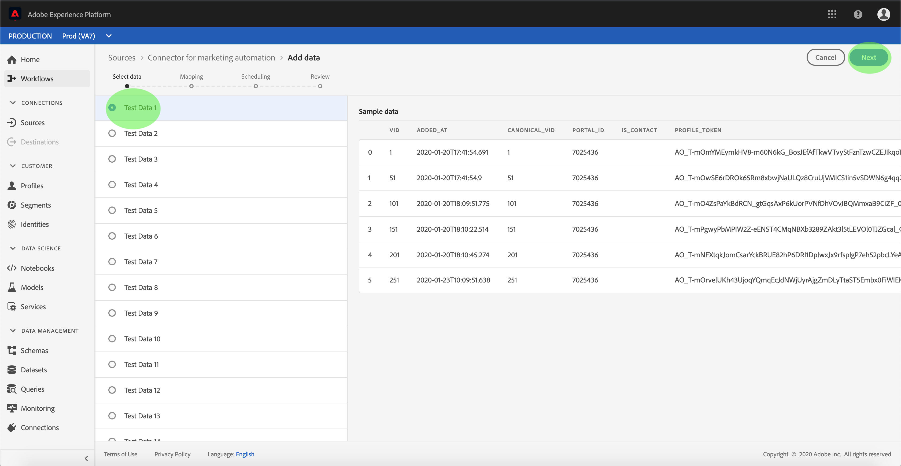
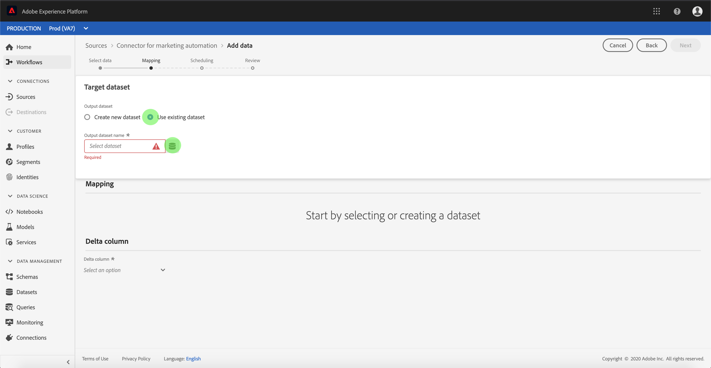
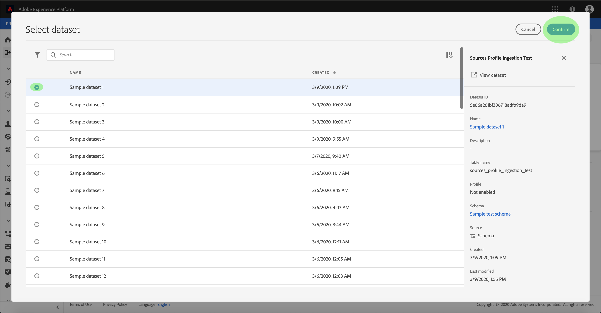

# Configuration d’un flux de données pour un connecteur d’automatisation marketing dans l’interface utilisateur

Un flux de données est un planifié qui récupère et ingère des données d’une source dans un jeu de données de la plateforme. Ce didacticiel décrit les étapes à suivre pour configurer un nouveau flux de données à l’aide de votre compte d’automatisation marketing.

## Prise en main

Ce didacticiel nécessite une compréhension pratique des composants suivants d’Adobe Experience Platform :

- [Système](../../../../xdm/home.md)de modèle de données d’expérience (XDM) : Cadre normalisé selon lequel la plateforme d’expérience organise les données d’expérience client.
   - [Principes de base de la composition](../../../../xdm/schema/composition.md)de  : Découvrez les éléments de base des  XDM, y compris les principes clés et les bonnes pratiques en matière de composition de .
   - [Didacticiel](../../../../xdm/tutorials/create-schema-ui.md)de l’éditeur de  : Découvrez comment créer des  personnalisées à l’aide de l’interface utilisateur de l’éditeur de  de.
- du client en temps réel : Fournit un client en temps réel unifié basé sur des données agrégées provenant de plusieurs sources.

En outre, ce didacticiel nécessite que vous ayez déjà créé un compte d’automatisation marketing. Un de didacticiels pour la création de différents connecteurs d’automatisation marketing dans l’interface utilisateur se trouve dans la présentation [des connecteurs](../../../home.md)source.

## Sélectionner des données

Après avoir créé votre compte d’automatisation marketing, l’étape *Sélectionner les données* s’affiche, ce qui vous permet d’explorer la hiérarchie des fichiers dans une interface interactive.

- La moitié gauche de l&#39;interface est un navigateur de répertoires, qui affiche les fichiers et répertoires de votre serveur.
- La moitié droite de l’interface vous permet de  jusqu’à 100 lignes de données à partir d’un fichier compatible.

Sélectionnez le répertoire à utiliser, puis cliquez sur **Suivant**.

## Mappage des champs de données à un XDM

L’étape *Mappage* s’affiche, fournissant une interface interactive permettant de mapper les données source à un jeu de données de plateforme.

Choisissez un jeu de données dans lequel les données entrantes doivent être assimilées. Vous pouvez utiliser un jeu de données existant ou en créer un nouveau.

### Utiliser un jeu de données existant

Pour importer des données dans un jeu de données existant, sélectionnez **Utiliser un jeu de données** existant, puis cliquez sur l’icône Jeu de données.

La boîte de dialogue _Sélectionner un jeu de données_ s’affiche. Recherchez le jeu de données que vous souhaitez utiliser, sélectionnez-le, puis cliquez sur **Continuer**.

### Utiliser un nouveau jeu de données

Pour importer des données dans un nouveau jeu de données, sélectionnez **Créer un jeu de données** et saisissez un nom et une description pour le jeu de données dans les champs fournis.

Au cours de ce processus, vous pouvez également activer les tests *d’assimilation* partielle et les tests de diagnostic des *erreurs*. L’activation de l’assimilation ** partielle permet d’assimiler des données contenant des erreurs, jusqu’à un certain seuil que vous pouvez définir. L’activation des diagnostics d’erreur fournit des détails sur les données incorrectes qui sont mises en lots séparément. Pour plus d’informations, voir la présentation [de l’assimilation par lots](../../../../ingestion/batch-ingestion/partial.md)partielle.

Lorsque vous avez terminé, cliquez sur l’icône  du.

La boîte de dialogue *Sélectionner* du s’affiche. Sélectionnez le à appliquer au nouveau jeu de données, puis cliquez sur **Terminé**.

Selon vos besoins, vous pouvez choisir de mapper directement les champs ou utiliser les fonctions de mappage pour transformer les données source afin de dériver des valeurs calculées ou calculées. Pour plus d’informations sur les fonctions de mappage et de mappage des données, reportez-vous au didacticiel sur le [mappage des données CSV aux champs](../../../../ingestion/tutorials/map-a-csv-file.md)de  XDM.

Une fois les données source mises en correspondance, cliquez sur **Suivant**.

## Planifier les exécutions d&#39;assimilation

L’étape *Planification* s’affiche, ce qui vous permet de configurer une planification d’assimilation afin d’assimiler automatiquement les données source sélectionnées à l’aide des mappages configurés. Le tableau suivant décrit les différents champs configurables pour la planification :

| Champ | Description |
| --- | --- |
| Fréquence | Les fréquences sélectionnables sont les suivantes : minute, heure, jour et semaine. |
| Intervalle | Entier qui définit l’intervalle pour la fréquence sélectionnée. |
|  de | Horodatage UTC pour lequel la première ingestion aura lieu. |
| Renvoi | Valeur booléenne qui détermine les données qui sont initialement assimilées. Si le *renvoi* est activé, tous les fichiers actuels du chemin spécifié seront assimilés lors de la première assimilation planifiée. Si le *renvoi* est désactivé, seuls les fichiers chargés entre la première exécution de l’assimilation et l’heure *de  du* sont assimilés. Les fichiers chargés avant l’heure *du* ne seront pas assimilés. |

Les flux de données sont conçus pour assimiler automatiquement les données sur une base planifiée. Si vous souhaitez effectuer une seule assimilation via ce flux de travail, vous pouvez le faire en configurant la **fréquence** sur &quot;Jour&quot; et en appliquant un nombre très élevé pour l’ **intervalle**, par exemple 10000 ou un nombre similaire.

Indiquez les valeurs de la planification et cliquez sur **Suivant**.

## Consultez votre flux de données

L’étape *Révision* s’affiche, vous permettant de vérifier votre nouveau flux de données avant sa création. Les détails sont regroupés dans le  suivant :

- *Connexion*: Affiche le type de source, le chemin d’accès approprié du fichier source choisi et le nombre de colonnes contenues dans ce fichier source.
- *Affecter des champs* de jeu de données et de mappage : Indique dans quel jeu de données les données source sont assimilées, y compris le auquel le jeu de données adhère.
- *Planification*: Affiche la période active, la fréquence et l’intervalle du calendrier d’assimilation.

Une fois que vous avez examiné votre flux de données, cliquez sur **Terminer** et accordez un peu de temps pour que le flux de données soit créé.

## Surveiller votre flux de données

Une fois que votre flux de données a été créé, vous pouvez surveiller les données qui y sont assimilées. Suivez les étapes ci-dessous pour accéder au moniteur de jeux de données d’un flux de données.

Dans l’espace de travail *Sources* , sélectionnez la source d’automatisation marketing que vous souhaitez sous le  d’automatisation ** marketing. Sélectionnez *Connect Source* pour lancer l’interface d’authentification. Pour  un flux de données existant, sélectionnez Compte ** existant et sélectionnez le compte auquel vous souhaitez accéder.

L’écran  *Source* s’affiche. A partir de là, cliquez sur le nom d’un jeu de données dont   doit être surveillé.

L’écran  de de *données* s’affiche. Cette page affiche le taux de messages consommés sous forme de graphique.

Pour plus d&#39;informations sur la surveillance des jeux de données et l&#39;assimilation, consultez le didacticiel sur la [surveillance des flux de données](../../../../ingestion/quality/monitor-data-flows.md)en flux continu.

## Étapes suivantes

En suivant ce didacticiel, vous avez créé un flux de données afin d’importer des données d’un système d’automatisation marketing et d’obtenir des informations sur la surveillance des jeux de données. Les données entrantes peuvent désormais être utilisées par les services Plateforme en aval, tels que les  de clients en temps réel et l’espace de travail des sciences de données. Pour plus d’informations, reportez-vous au  suivant :

- [Présentation du profil client en temps réel](../../../../profile/home.md)
- [Présentation de l’espace de travail Data Science](../../../../data-science-workspace/home.md)

## Annexe

Les sections suivantes fournissent des informations supplémentaires sur l’utilisation des connecteurs source.

### Désactivation d’un flux de données

Lorsqu’un flux de données est créé, il devient immédiatement actif et ingère les données selon la planification qui lui a été donnée. Vous pouvez désactiver un flux de données actif à tout moment en suivant les instructions ci-dessous.

Dans l’écran *d’authentification* , sélectionnez le nom de la connexion de base associée au flux de données que vous souhaitez désactiver.

La page  _source_ du s’affiche. Sélectionnez le flux de données actif dans le pour ouvrir sa colonne *Propriétés* sur le côté droit de l’écran, qui contient un bouton d’activation **** de l’option de basculement. Cliquez sur la bascule pour désactiver le flux de données. La même bascule peut être utilisée pour réactiver un flux de données après sa désactivation.

### Activation des données d’entrée pour la population de 

Les données entrantes de votre connecteur source peuvent être utilisées pour enrichir et renseigner vos données de client en temps réel. Pour plus d’informations sur le renseignement de vos données de Real-Customer, consultez le didacticiel sur la population [de ](../profile.md).
