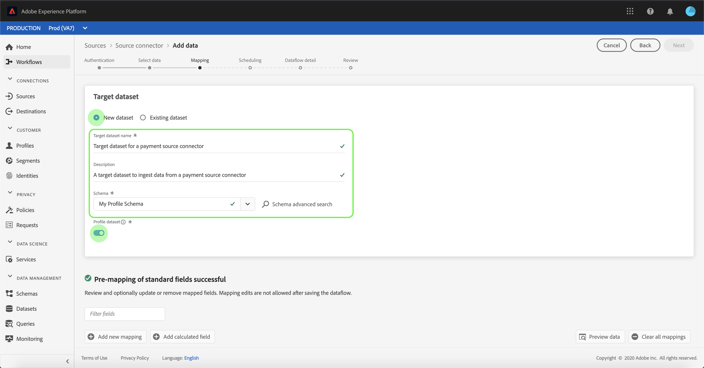

# Configuration d’un flux de données pour un connecteur de paiement dans l’interface utilisateur

Un flux de données est une tâche planifiée qui récupère et ingère des données d’une source dans un jeu de données d’Adobe Experience Platform. Ce didacticiel décrit les étapes à suivre pour configurer un nouveau flux de données à l’aide de votre compte de paiement.

## Prise en main

Ce tutoriel nécessite une compréhension du fonctionnement des composants suivants d’Adobe Experience Platform :

- [Système de modèle de données d’expérience (XDM)](../../../../xdm/home.md)[!DNL Experience Platform] : cadre normalisé selon lequel organise les données d’expérience client.
   - [Principes de base de la composition des schémas](../../../../xdm/schema/composition.md) : découvrez les blocs de création de base des schémas XDM, y compris les principes clés et les bonnes pratiques en matière de composition de schémas.
   - [Didacticiel](../../../../xdm/tutorials/create-schema-ui.md)sur l’éditeur de Schéma : Découvrez comment créer des schémas personnalisés à l’aide de l’interface utilisateur de l’éditeur de Schémas.
- [Real-time Customer Profile](../../../../profile/home.md) : fournit un profil client en temps réel unifié basé sur des données agrégées issues de plusieurs sources.

En outre, ce didacticiel nécessite que vous ayez déjà créé un compte de paiement. Vous trouverez une liste de didacticiels pour la création de différents connecteurs de paiement dans l’interface utilisateur dans l’aperçu [des connecteurs](../../../home.md)source.

## Sélectionner des données

Après avoir créé votre compte de paiement, l&#39;étape *[!UICONTROL Sélectionner les données]* s&#39;affiche, ce qui vous permet d&#39;explorer la hiérarchie des fichiers dans une interface interactive.

- La moitié gauche de l&#39;interface est un navigateur d&#39;annuaire qui affiche les fichiers et répertoires de votre serveur.
- La moitié droite de l&#39;interface vous permet de prévisualisation jusqu&#39;à 100 lignes de données à partir d&#39;un fichier compatible.

Sélectionnez le répertoire que vous souhaitez utiliser, puis sélectionnez **[!UICONTROL Suivant]**.

## Mappage des champs de données à un schéma XDM

L’étape *[!UICONTROL Mappage]* s’affiche, fournissant une interface interactive permettant de mapper les données source à un [!DNL Platform] jeu de données.

Choisissez un jeu de données dans lequel les données entrantes doivent être assimilées. Vous pouvez utiliser un jeu de données existant ou en créer un nouveau.

### Utilisation d’un jeu de données existant

Pour importer des données dans un jeu de données existant, sélectionnez **[!UICONTROL Utiliser un jeu de données]** existant, puis cliquez sur l’icône Jeu de données.

The *[!UICONTROL Select dataset]* dialog appears. Recherchez le jeu de données que vous souhaitez utiliser, sélectionnez-le, puis cliquez sur **[!UICONTROL Continuer]**.

### Utiliser un nouveau jeu de données

Pour importer des données dans un nouveau jeu de données, sélectionnez **[!UICONTROL Créer un jeu de données]** et saisissez un nom et une description pour le jeu de données dans les champs fournis.

Au cours de ce processus, vous pouvez également activer les tests de diagnostic *[!UICONTROL d&#39;assimilation]* *[!UICONTROL partielle et d&#39;]* erreur. L&#39;activation de l&#39;assimilation ** partielle permet d&#39;assimiler des données contenant des erreurs, jusqu&#39;à un certain seuil que vous pouvez définir. L’activation des diagnostics d’erreur fournit des détails sur les données incorrectes qui sont mises en lots séparément. Pour plus d&#39;informations, consultez la présentation [de l&#39;assimilation](../../../../ingestion/batch-ingestion/partial.md)partielle des lots.

Lorsque vous avez terminé, cliquez sur l’icône schéma.

The *[!UICONTROL Select schema]* dialog appears. Sélectionnez le schéma à appliquer au nouveau jeu de données, puis cliquez sur **[!UICONTROL Terminé]**.

Selon vos besoins, vous pouvez choisir de mapper directement les champs ou utiliser les fonctions de mappage pour transformer les données source afin de dériver des valeurs calculées ou calculées. Pour plus d’informations sur les fonctions de mappage et de mappage de données, consultez le didacticiel sur le [mappage des données CSV aux champs](../../../../ingestion/tutorials/map-a-csv-file.md)de schéma XDM.

L’écran *[!UICONTROL Mappage]* vous permet également de définir la colonne ** Delta. Lorsque le flux de jeux de données est créé, vous pouvez définir n’importe quel champ d’horodatage comme base pour déterminer les enregistrements à importer dans les ingérations incrémentielles planifiées.

Une fois les données source mises en correspondance, cliquez sur **[!UICONTROL Suivant]**.

## Planifier les exécutions d&#39;assimilation

L&#39;étape *[!UICONTROL Planification]* s&#39;affiche, ce qui vous permet de configurer un programme d&#39;assimilation pour assimiler automatiquement les données source sélectionnées à l&#39;aide des mappages configurés. Le tableau suivant décrit les différents champs configurables pour la planification :

| Champ | Description |
| --- | --- |
| Fréquence | Les fréquences sélectionnées sont les suivantes : Minute, Heure, Jour et Semaine. |
| Intervalle | Entier qui définit l’intervalle pour la fréquence sélectionnée. |
| Début | Horodatage UTC pour lequel la toute première importation aura lieu. |
| Renvoi | Valeur booléenne qui détermine quelles données sont initialement ingérées. Si le *[!UICONTROL renvoi]* est activé, tous les fichiers actuels du chemin d’accès spécifié seront ingérés lors de la première assimilation planifiée. Si le *[!UICONTROL renvoi]* est désactivé, seuls les fichiers chargés entre la première exécution de l’assimilation et le délai *[!UICONTROL de]* Début seront ingérés. Les fichiers chargés avant l&#39;heure *[!UICONTROL de]* Début ne seront pas ingérés. |

Les flux de données sont conçus pour intégrer automatiquement les données sur une base planifiée. Si vous souhaitez effectuer une seule assimilation via ce flux de travail, vous pouvez le faire en configurant la **[!UICONTROL fréquence]** sur &quot;Jour&quot; et en appliquant un nombre très élevé pour l’ **[!UICONTROL intervalle]**, tel que 10000 ou un nombre similaire.

Indiquez les valeurs de la planification et cliquez sur **[!UICONTROL Suivant]**.

## Nommer votre flux de données

L’étape détaillée *[!UICONTROL du flux de]* jeux de données s’affiche, où vous devez fournir un nom et une description facultative du flux de jeux de données. Select **[!UICONTROL Next]** when finished.

## Vérifier votre flux de données

L’étape *[!UICONTROL Révision]* s’affiche, vous permettant de vérifier votre nouveau flux de données avant sa création. Les détails sont regroupés dans les catégories suivantes :

- *[!UICONTROL Connexion]*: Indique le type de source, le chemin d’accès approprié du fichier source choisi et le nombre de colonnes qu’il contient.
- *[!UICONTROL Affectez des champs]* de jeu de données et de mappage : Affiche le jeu de données dans lequel les données source sont ingérées, y compris le schéma auquel le jeu de données adhère.
- *[!UICONTROL Planification]*: Affiche la période active, la fréquence et l&#39;intervalle du programme d&#39;assimilation.

Une fois que vous avez passé en revue votre flux de données, cliquez sur **[!UICONTROL Terminer]** et accordez un certain temps à la création du flux de données.

## Surveiller et supprimer votre flux de données

Une fois que votre flux de données a été créé, vous pouvez surveiller les données qui y sont ingérées. Pour plus d&#39;informations sur la surveillance et la suppression de votre flux de données, consultez le didacticiel sur la [surveillance et la suppression des flux de données](../monitor.md).

## Étapes suivantes

En suivant ce didacticiel, vous avez réussi à créer un flux de jeux de données afin d’importer des données d’un système d’automatisation du marketing et d’obtenir des informations sur la surveillance des jeux de données. Les données entrantes peuvent désormais être utilisées par [!DNL Platform] les services en aval tels que [!DNL Real-time Customer Profile] et [!DNL Data Science Workspace]. Pour plus d’informations, voir les documents suivants :

- [Présentation du profil client en temps réel](../../../../profile/home.md)
- [Présentation de Data Science Workspace](../../../../data-science-workspace/home.md)

## Annexe

Les sections suivantes fournissent des informations supplémentaires sur l’utilisation des connecteurs source.

### Désactivation d’un flux de jeu de données

Lorsqu&#39;un flux de jeu de données est créé, il devient immédiatement actif et ingère les données selon le calendrier qui lui a été donné. Vous pouvez désactiver un flux de jeux de données actif à tout moment en suivant les instructions ci-dessous.

Dans l&#39;écran Flux *[!UICONTROL de]* jeux de données, sélectionnez le nom du flux de jeux de données que vous souhaitez désactiver.

La colonne *[!UICONTROL Propriétés]* s’affiche à droite de l’écran. Ce panneau contient un bouton **[!UICONTROL Activer]** la bascule. Cliquez sur la bascule pour désactiver le flux de données. La même bascule peut être utilisée pour réactiver un flux de données après sa désactivation.

### Activer les données entrantes pour [!DNL Profile] la population

Les données entrantes provenant de votre connecteur source peuvent être utilisées pour enrichir et renseigner vos [!DNL Real-time Customer Profile] données. Pour plus d&#39;informations sur le remplissage de vos [!DNL Real-time Customer Profile] données, consultez le didacticiel sur la population Profil.
